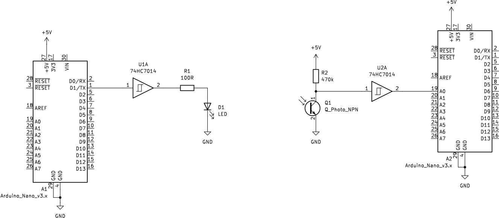
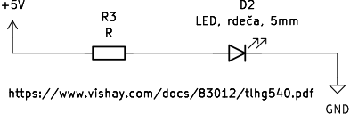
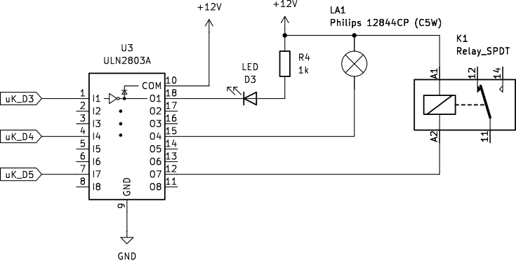
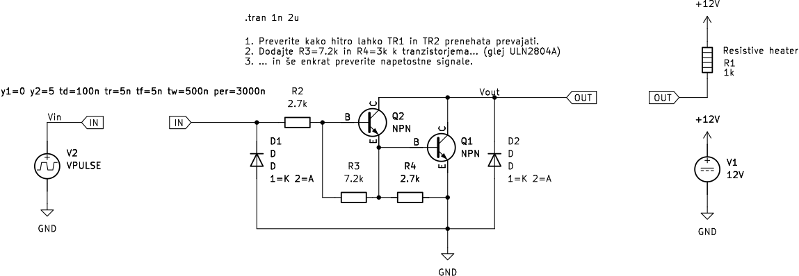

## Optične komunikacije

Optična komunikacija je prenos informacije s svetlobo. Informacijo lahko prenašamo
po prostem prostoru (na primer z infrardečim daljincem), po optičnem vodniku ali
znotraj optičnega tipala. Pri elektronskem projektu je pomembno, da optični sistem
obravnavamo kot celoto:

1. električni signal krmili svetlobni izvor,
2. svetloba potuje do sprejemnika po prostem prostoru ali vodniku,
3. svetlobni sprejemnik ustvari električni signal,
4. obdelovalno vezje signal ojači, filtrira, primerja z mejno vrednostjo in ga po
   potrebi posreduje digitalnemu vhodu.

<!-- KIČAD RISBA: Blokovni diagram celotnega optičnega komunikacijskega sistema:
     oddajnik (krmilnik + upor + LED), optični kanal (prostor ali vlakno),
     sprejemnik (fotodioda/fototranzistor + pretvornik) in izhod (komparator ali
     mikrokrmilnik). Puščice naj kažejo smer prenosa informacije. -->

{#fig:blokovni-diagram-opticne-komunikacije}

### Kje se uporabljajo optične komunikacije?

Primeri so:

- infrardeči daljinski upravljalniki,
- prenos podatkov po optičnih vlaknih,
- svetlobna vrata za zaznavanje prehoda predmeta,
- merjenje razdalje in hitrosti z odbito svetlobo,
- senzor dežja na vetrobranskem steklu,
- bralniki črtnih kod in optični enkoderji,
- merjenje osvetljenosti ter zaznavanje prisotnosti ali položaja predmeta,
- galvansko ločevanje električnih vezij z optičnim spojnikom.

Pri digitalnem prenosu je informacija pogosto predstavljena z dvema stanjema:
svetloba je prisotna ali je ni. Pri analognem prenosu pa količina svetlobe nosi
zvezno spremenljiv signal, na primer podatek o osvetljenosti.

### Prosti prostor in optični vodnik

Pri prenosu po prostem prostoru morata biti oddajnik in sprejemnik pravilno
usmerjena. Sprejemnik poleg koristnega signala zazna tudi svetlobo okolice, zato so
koristne mehanske zaslonke, modulacija oddajne LED in filtriranje na sprejemni
strani. Pri idealiziranem točkastem izvoru se gostota svetlobnega toka z razdaljo
približno zmanjšuje sorazmerno z $1/r^2$; v resničnem sistemu na doseg vplivajo še
sevalni kot, optika, odboji in občutljivost sprejemnika.

Optični vodnik omeji pot svetlobe in zmanjša vpliv okoliške svetlobe. V optičnem
vlaknu se svetloba širi zaradi popolnega notranjega odboja. Za kakovosten prenos
morajo biti oddajnik, vlakno in sprejemnik med seboj optično usklajeni.

<!-- KIČAD RISBA: Prerez optičnega vlakna z jedrom in plaščem. V jedru nariši
     lomljeno žarkovno pot in označi popolni notranji odboj; dodaj vhodni LED,
     vlakno in fotodiodo na izhodu. -->
{#fig:opticno-vlakno}

### Svetleča dioda

Svetleča dioda (LED) je polprevodniška dioda, ki pri prevajanju oddaja svetlobo.
Elektroni in vrzeli se v območju p-n-spoja rekombinirajo; pri tem nastanejo fotoni.
LED je treba priključiti v prevodni smeri in tok skozi njo omejiti. Sama LED ni
omejevalnik toka: že majhno povečanje napetosti lahko povzroči veliko povečanje
toka in poškoduje diodo.

Za zaporedni upor velja:

$$
R_\mathrm{LED}=\frac{U_\mathrm{nap}-U_F}{I_F},
$$

kjer so $U_\mathrm{nap}$ napajalna napetost, $U_F$ napetost na LED in $I_F$
izbrani tok. Pri izbiri upora preverimo še njegovo moč:

$$
P_R=I_F^2R_\mathrm{LED}.
$$

Primer: pri napajanju $5\,\mathrm{V}$, rdeči LED z $U_F=2\,\mathrm{V}$ in toku
$10\,\mathrm{mA}$ dobimo $R_\mathrm{LED}=300\,\Omega$. Izberemo lahko standardno
vrednost $330\,\Omega$; tok bo nekoliko manjši, kar je varnejša izbira.

Barva LED je povezana z valovno dolžino $\lambda$. Zelo poenostavljen približek
za energijo fotona je:

$$
e_0 U_F \approx \frac{hc}{\lambda},
$$

kjer je $e_0=1{,}602\cdot10^{-19}\,\mathrm{C}$ osnovni naboj, $h$ Planckova
konstanta in $c$ hitrost svetlobe v vakuumu. Enačba je le približek: $U_F$ ni
točno določena konstanta, nanjo vplivajo tok, temperatura in tehnologija LED.

Pri optičnem prenosu sta pomembnejša od same barve predvsem spekter oddane
svetlobe in ujemanje s sprejemnikom, sevalna moč in sevalni kot, hitrost vklopa in
izklopa ter dovoljeno območje toka.

Električna vhodna moč LED je $P_\mathrm{el}=U_FI_F$, vendar ta ni enaka svetlobni
moči. Del energije se pretvori v toploto. Svetlost oziroma zaznana svetilnost je
odvisna tudi od valovne dolžine, smeri sevanja in značilnosti človeškega očesa.

V nadaljevanju uporabimo rdečo LED **Vishay TLHR5400**, ki je nameščena v
standardnem 5-mm difuznem ohišju. Pri toku približno $10\,\mathrm{mA}$ je njen
tipični padec napetosti okoli $2\,\mathrm{V}$. Pri napajanju $5\,\mathrm{V}$ zato
izračunamo $R_\mathrm{LED}=300\,\Omega$; v praktičnem vezju izberemo standardni
upor $330\,\Omega$, s katerim bo tok približno $9\,\mathrm{mA}$. Pred uporabo
preverimo še dejanske mejne vrednosti in priključke v [podatkovnem listu LED
TLHR5400 proizvajalca Vishay](https://www.vishay.com/docs/83012/tlhg540.pdf).

<!-- KIČAD RISBA: Osnovno vezje LED z zaporednim uporom. Označi +5 V, upor,
     anodo in katodo LED, smer toka, U_F in I_F. Dodaj merilni točki za merjenje
     napetosti na LED in toka skozi LED. -->

{#fig:led-zaporedni-upor}

### Krmiljenje LED z izhodom krmilnika

Izhod mikrokrmilnika lahko LED krmili neposredno samo takrat, ko tok LED ne presega
dovoljenega toka izhoda. Če potrebujemo večji tok ali želimo izhod mikrokrmilnika
zaščititi pred obremenitvijo, uporabimo tranzistor kot stikalo.

#### NPN-tranzistor kot stikalo

Pri običajni vezavi "tranzistorja kot stikala" je LED z zaporednim uporom priključena med pozitivno napajanje in kolektor NPN-tranzistorja, emitor pa je priključen na ničelni potencial. Majhen tok v bazo tako krmili večji tok skozi kolektor. Tranzistor deluje kot stikalo: pri nizki vhodni napetosti je zaprt, pri dovolj visoki pa ga krmilimo v nasičenje.

Za osnovni izračun baznega upora uporabimo:

$$
R_B=\frac{U_\mathrm{izh}-U_{BE}}{I_B},
\qquad
I_B\geq\frac{I_C}{\beta_\mathrm{min}}.
$$

Pri načrtovanju stikala uporabimo minimalni tokovni ojačevalni faktor, na primer $\beta_\mathrm{min}=10$, in ne največjega $\beta$ iz podatkovnega lista. S tem zagotovimo nasičenje tudi pri različnih pogojih delovanja tranzistorja. Za vhod $5\,\mathrm{V}$, $U_{BE}\approx0{,}7\,\mathrm{V}$ in bazni tok $1\,\mathrm{mA}$ dobimo približno $R_B=4{,}3\,\mathrm{k}\Omega$; uporabimo lahko standardni upor $4{,}7\,\mathrm{k}\Omega$.

Pri tej rešitvi se pojavijo tri praktične težave:

- izhod krmilnika mora zagotavljati bazni tok,
- pri večjem kolektorskem toku mora biti bazni tok sorazmerno večji,
- napetost $U_{CE}$ in moč tranzistorja lahko postaneta pomembna.

<!-- KIČAD RISBA: Nizkostransko stikalo z enim NPN-tranzistorjem. Prikaži
     mikrokrmilnik, bazni upor R_B, tranzistor Q1, LED z uporom R_LED, napajanje
     +5 V in maso. Poleg LED prikaži še različico z relejem in povratno diodo. -->

{#fig:npn-stikalo-led-rele}

Predstavljajmo si breme, ki potrebuje $I_C=200\,\mathrm{mA}$. Če za zanesljivo
nasičenje izberemo minimalni tokovni ojačevalni faktor $\beta_\mathrm{min}=10$,
bi moral bazni tok znašati najmanj $I_B=20\,\mathrm{mA}$. Tak tok je za številne
izhode mikrokrmilnikov že prevelik oziroma bi močno obremenil izhodni priključek.
Če bazni tok zmanjšamo, tranzistor morda ne bo več v nasičenju, padec napetosti
na njem se poveča, s tem pa tudi njegova moč in segrevanje. Z izbiro drugega
posameznega tranzistorja lahko težavo včasih zmanjšamo, vendar smo še vedno
omejeni z razpoložljivim baznim tokom krmilnika. V takem primeru potrebujemo
vezje z večjim skupnim tokovnim ojačanjem.

Še bolj nazoren primer je avtomobilska žarnica **Philips 12844CP (C5W)**, ki se
uporablja tudi za osvetlitev registrske tablice. Nazivni podatki so $12\,\mathrm{V}$
in $5\,\mathrm{W}$, zato je njen nazivni tok približno

$$
I_\mathrm{žarnice}=\frac{P}{U}=\frac{5\,\mathrm{W}}{12\,\mathrm{V}}
\approx0{,}42\,\mathrm{A}.
$$

Če bi za zanesljivo nasičenje tranzistorja uporabili $\beta_\mathrm{min}=10$,
bi potrebovali bazni tok približno $42\,\mathrm{mA}$. To je za izhod
mikrokrmilnika prevelika obremenitev. Poleg tega ima žarnica pri vklopu zaradi
hladne žarilne nitke večji kratkotrajni zagonski tok od nazivnega. Zato potrebujemo
zmogljivejši gonilnik ali več tranzistorjev. Podatki za žarnico so navedeni v
[podatkovnem listu Philips 12844CP](https://www.documents.philips.com/assets/20230213/a000b00145024171b9f7afa80125919e.pdf).

#### Darlingtonov spoj kot izboljšava

Če en tranzistor zahteva prevelik bazni tok, uporabimo Darlingtonov spoj. Sestavljata
ga dva tranzistorja, pri katerih prvi krmili bazo drugega. Skupni tokovni ojačevalni
faktor je približno:

$$
\beta_D\approx\beta_1\beta_2.
$$

Zato lahko enak kolektorski tok krmilimo z bistveno manjšim vhodnim tokom. Slabosti Darlingtonovega spoja je večja napetost na vključnem tranzistorju v vključenem stanju, nekoliko počasnejši izklop in večja toplotna izguba kot pri dobro izbranem posameznem tranzistorju.

V praksi pogosto uporabimo integrirano vezje z več Darlingtonovimi izhodi, na primer [ULN2803A](https://www.farnell.com/datasheets/1690352.pdf) ali ULN2804A. Njegov izhod z odprtim kolektorjem deluje kot stikalo proti ničelnemu potencialu: ko je vključen, breme poveže z ničelnim potencialom; ko je izključen, je kolektorski izhod odprt. Breme mora biti zato priključeno med pozitivno napajanje in izhod gonilnika. Pri LED še vedno uporabimo ustrezen zaporedni upor, razen če ga vsebuje že modul, ki ga uporabljamo.

Pri induktivnem bremenu so zaščitne diode v ULN2803A običajno že vgrajene, vendar
mora biti skupni priključek za te diode pravilno povezan na pozitivno napajanje
bremena.

<!-- KIČAD RISBA: En kanal ULN2803A kot stikalo za LED in drugi kanal kot stikalo
     za rele. Označi vhod iz mikrokrmilnika, skupno maso, napajanje bremena,
     zaporedni upor LED in povratno diodo pri releju. -->

{#fig:uln2803-led-rele}

V simulacijskem vezju `circ/110_Darlingtom_open_collector.kicad_sch` sta predvidena tudi upora med bazo in emitorjem tranzistorjev Q1 in Q2, tako kot predvideva podatkovni list [ULN2803A](https://www.farnell.com/datasheets/1690352.pdf).

{#fig:shema_prikljucka_uln2803A}

Njuna naloga je odvajanje naboja iz baz, zagotavljanje zanesljivega izklopa in skrajšanje časa prehoda v zaporno stanje. Pri vklopu pa odvzemata del baznega toka, zato morata biti izbrana kot kompromis med hitrim izklopom in majhno obremenitvijo krmilnega vira. V pripravljeni simulaciji sta R3 in R4 pripravljena za primerjavo, vendar trenutno nista električno povezana; vpliv njune pravilne vezave lahko preskusite v simulaciji vezja. Preučite razliko v časovnem odzivu za vhodno in izhodno napetost ter tok skozi porabnik.

### Svetlobni sprejemniki

Za sprejem svetlobe uporabljamo fotoupor (LDR), fototranzistor ali fotodiodo.
Izbira je kompromis med občutljivostjo, hitrostjo, linearnostjo, velikostjo toka in
ceno.

| Element        | Prednost                                     | Omejitev                                                | Primer uporabe                        |
|----------------|----------------------------------------------|---------------------------------------------------------|---------------------------------------|
| LDR            | velika sprememba upornosti, preprosta vezava | počasen odziv, slabša ponovljivost                      | merjenje osvetljenosti                |
| Fototranzistor | večji izhodni tok in dobra občutljivost      | počasnejši in manj linearen od fotodiode                | svetlobna vrata, daljinski senzor     |
| Fotodioda      | hiter odziv, primerna za hitre prenose       | majhen fototok, potrebuje tokovno-napetostni pretvornik | optične komunikacije, merilni sistemi |

Table: Element. {#tbl:svetlobni_senzorji}

Pri izbiri ne zadošča primerjava nazivnega toka. Preverimo spektralno občutljivost,
temni tok, dovoljeno zaporno napetost, odzivni čas, kapacitivnost spoja in območje
osvetljenosti v podatkovnem listu.

### Delilnik z LDR

Najpreprostejši svetlobni senzor je napetostni delilnik. Če je izhodna napetost
merjena na referenčnem uporu $R_R$, velja:

$$
U_\mathrm{iz}=U_C\frac{R_R}{R_R+R_\mathrm{LDR}}.
$$

LDR ima pri večji osvetljenosti manjšo upornost, zato se pri tej vezavi
$U_\mathrm{iz}$ povečuje. Če želimo obratno delovanje, zamenjamo položaj LDR in
$R_R$.

Za največjo spremembo izhodne napetosti med dvema skrajnima stanjema LDR, z
upornostma $R_1$ in $R_2$, je dobra začetna izbira:

$$
R_R\approx\sqrt{R_1R_2}.
$$

To je geometrična sredina območja upornosti. V praksi vrednost nato prilagodimo
glede na zahtevano mejno osvetljenost, vhodno upornost naslednjega vezja in šum.
Vhodna upornost merilnika ali krmilnika je vzporedno vezana z $R_R$ in lahko
opazno spremeni rezultat.

Pri neposrednem priklopu na digitalni vhod ne smemo računati samo na nazivno
preklopno napetost. Napetosti v nedoločenem območju med logično 0 in 1 lahko
povzročijo nepredvidljivo stanje ali večkratno preklapljanje. Za zanesljiv sistem
uporabimo komparator s histerezo.

<!-- KIČAD RISBA: Delilnik z LDR in referenčnim uporom. Pripravi dve različici ali
     stikalo za prikaz: LDR zgoraj za naraščanje izhodne napetosti pri svetlobi in
     LDR spodaj za padanje izhodne napetosti. Dodaj izhodno merilno točko. -->
{#fig:ldr-delilnik}

### Fotodioda in fototranzistor

Fotodiodo pri merjenju svetlobe običajno uporabimo v zaporni smeri. Osvetlitev
ustvari fototok, ki je približno sorazmeren osvetljenosti v izbranem območju.
Fotodiodni tok je majhen, zato padec napetosti na navadnem uporu pogosto ni
primeren za neposreden digitalni vhod.

Fototranzistor deluje podobno kot fotodioda, vendar njegov fototok krmili še
tranzistorski tok. Zato dobimo večji signal, vendar praviloma počasnejši odziv in
večjo odvisnost od temperature ter primerka elementa.

## Tokovno-napetostni pretvornik

Fotodiodo je smiselno priključiti v tokovno-napetostni pretvornik z operacijskim
ojačevalnikom. Operacijski ojačevalnik vzdržuje invertirajoči vhod blizu
referenčne napetosti, fototok pa teče skozi povratni upor $R_F$. Za idealizirano
vezje je velikost izhodne napetosti:

$$
U_\mathrm{iz}=U_\mathrm{ref}\pm I_\mathrm{foto}R_F.
$$

Predznak je odvisen od smeri fototoka in orientacije fotodiode. Pri enosmernem
napajanju pogosto uporabimo $U_\mathrm{ref}=U_C/2$, da je izhod lahko pozitiven
in da ostane dovolj prostora za spremembe v obe smeri.

Pri izbiri $R_F$ velja približno $R_F=\Delta U_\mathrm{iz}/\Delta I_\mathrm{foto}$.
Preverimo še največji izhodni signal, območje izhoda operacijskega ojačevalnika,
vhodni tok, šum in kapacitivnost fotodiode. Vzporedni kondenzator $C_F$ lahko
izboljša stabilnost in omeji visokofrekvenčni šum, vendar zmanjša pasovno širino.

<!-- KIČAD RISBA: Transimpedančni ojačevalnik s fotodiodo. Prikaži fotodiodo v
     zaporni smeri, operacijski ojačevalnik, povratni upor R_F in kondenzator C_F
     vzporedno z njim, referenco U_ref=2,5 V ter izhodno merilno točko. -->
{#fig:transimpedancni-ojačevalnik}

## Komparator napetosti

Komparator odgovori na vprašanje, ali je merilna napetost večja ali manjša od
referenčne napetosti. Operacijski ojačevalnik lahko uporabimo kot preprost
komparator, vendar je za hitro in zanesljivo preklapljanje pogosto primernejši
namenski komparator.

Če je merilna napetost priključena na neinvertirajoči vhod in referenca na
invertirajoči vhod, velja idealizirano:

$$
U_\mathrm{iz}\approx
\begin{cases}
U_\mathrm{ZH}, & U_\mathrm{mer}>U_\mathrm{ref},\\
U_\mathrm{SN}, & U_\mathrm{mer}<U_\mathrm{ref}.
\end{cases}
$$

Izhodna napetost ni nujno enaka napajalni napetosti. Pri izbiri vezja preverimo,
ali je vhodno območje ustrezno in kako blizu napajalnim tirnicam lahko pride izhod.
LM358 je uporaben pri enojnem napajanju, vendar ni namenski hitri komparator in
njegov izhod se pri visoki ravni ne obnaša kot idealen izhod logičnega vezja.

<!-- KIČAD RISBA: Komparator z LDR-delilnikom na merilnem vhodu in potenciometrom
     na referenčnem vhodu. Dodaj LED ali logični izhod, napajanje 5 V in merilne
     točke U_mer, U_ref ter U_iz. -->
{#fig:komparator-osvetljenosti}

### Komparator z odprtim kolektorjem

Pri komparatorju z odprtim kolektorjem izhodni tranzistor lahko izhod potegne na
nižji potencial, ne more pa ga sam postaviti na visoko raven. Zato potrebujemo
dvigovalni upor $R_P$ (pull-up):

$$
I_P\approx\frac{U_C-U_\mathrm{iz}}{R_P}.
$$

Prednost takega izhoda je možnost prilagoditve na drugo logično napetost in
združevanje več izhodov v funkcijo »wired-AND«. Pri izbiri $R_P$ upoštevamo
uhajavi tok, vhodni tok naslednjega vezja, zahtevano hitrost in dovoljeni tok
izhodnega tranzistorja. Manjši upor omogoči hitrejši prehod navzgor, vendar
poveča tokovno obremenitev.

## Schmittov sprožilnik in histereza

Če je vhodni svetlobni signal blizu preklopne meje, lahko šum povzroči več
zaporednih preklopov. Schmittov sprožilnik uporablja pozitivno povratno zvezo in
ima dve preklopni meji:

- pri naraščanju vhodne napetosti se izhod preklopi pri zgornji meji,
- pri padanju vhodne napetosti se izhod preklopi pri spodnji meji.

Razlika med mejama je širina histereze. Histereza mora biti večja od pričakovane
šumne spremembe, vendar ne tako velika, da bi onemogočila zaznavo želenega
signala.

Za neinvertirajočo izvedbo z referenčno napetostjo $U_\mathrm{ref}$ in uporoma
$R_1$ (med izhodom in vhodom) ter $R_2$ (med vhodom in referenco) velja, če vhodni
tok zanemarimo:

$$
U_H=\frac{R_2}{R_1+R_2}(U_\mathrm{ZH}-U_\mathrm{SN}),
$$

pri čemer je $U_H$ razlika med zgornjo in spodnjo preklopno mejo. Splošni meji
lahko izračunamo z uteženim povprečjem izhoda in reference:

$$
U_T=\frac{R_2U_\mathrm{iz}+R_1U_\mathrm{ref}}{R_1+R_2}.
$$

Ko je izhod v zgornjem nasičenju, dobimo eno mejo; ko je v spodnjem nasičenju,
dobimo drugo. Dejanske vrednosti moramo zaradi izhodnega nasičenja in vhodnih
tokov preveriti v podatkovnem listu.

Za digitalne signale lahko uporabimo vrata z vgrajeno histerezo, na primer
74HC14. Pri njih ne izračunavamo zunanjega razmerja uporov, temveč preverimo
zagotovljeni spodnji in zgornji prag v podatkovnem listu.

<!-- KIČAD RISBA: Neinvertirajoči Schmittov sprožilnik z operacijskim ojačevalnikom.
     Uporabi dvopolno napajanje ali jasno označeno enojno napajanje, prikaži R1,
     R2, referenco in izhod. Ob shemi pripravi še graf U_iz(U_vh) z označenima
     pragovoma U_T+ in U_T-. -->
{#fig:schmittov-sprozilnik}

## Svetlobna vrata z zaznavo smeri

Za zaznavo smeri gibanja uporabimo dva enaka optična kanala, postavljena drugega
za drugim. Ko predmet prečka prvi kanal pred drugim, se izhodna zaporedja
razlikujejo od zaporedja, ko prečka drugi kanal pred prvim. Mikrokrmilnik lahko
izmeri vrstni red sprememb in določi smer.

Pri izvedbi moramo zagotoviti zadostno razliko med osvetljenim in zatemnjenim
stanjem, histerezo na vsakem kanalu, enako geometrijo in podobno občutljivost
kanalov ter dovolj kratko zakasnitev glede na največjo hitrost predmeta.

<!-- KIČAD RISBA: Dve svetlobni zapori z LED-oddajnikoma in fototranzistorjema
     A in B. Nariši predmet, ki se giblje z leve proti desni, ter časovna poteka
     signalov A in B za obe smeri gibanja. -->
{#fig:svetlobna-vrata-smer}

## Optični spojniki

Optični spojnik (optoizolator) prenaša signal med dvema električnima vezjema s
svetlobo, brez galvanske povezave signalnih mas. Na vhodni strani je LED, na
izhodni pa fototranzistor, fotodioda, fototriak ali drug svetlobno občutljiv
element. Galvanska ločitev je uporabna pri različnih napajalnih napetostih,
motnjah, merilnih sistemih in krmiljenju omrežnih bremen.

Pri načrtovanju preverimo vhodni tok LED in izračun njenega zaporednega upora,
izolacijsko napetost in dovoljene razmike na tiskanem vezju, razmerje CTR (current
transfer ratio), največji kolektorski tok in hitrost preklapljanja ter morebitno
invertiranje izhoda.

Najpreprostejši izhod je fototranzistor z dvigovalnim uporom. Ko vhodna LED sveti,
fototranzistor prevaja in izhod se običajno zniža, zato je logika na izhodu
invertirana. Če potrebujemo ne-invertiran signal, dodamo še en inverter ali
ustrezno spremenimo razporeditev vezja.

<!-- KIČAD RISBA: Optični spojnik PC817 ali podoben element. Na levi strani naj
     bo vhodni digitalni signal, LED z uporom in masa vhodnega vezja; na desni
     fototranzistor, pull-up upor, napajanje izhodnega vezja in izhod. Označi
     izolacijsko pregrado med stranema. -->
{#fig:optoclen}

## Predlogi praktičnih nalog

### Naloga 1: LED-oddajnik

Za napajanje $5\,\mathrm{V}$ izberi upor za rdečo LED pri toku $10\,\mathrm{mA}$.
Izmeri napetost na LED, tok in moč upora. Rezultat primerjaj z izračunom in
pojasni razlike.

### Naloga 2: LDR kot svetlobno stikalo

Sestavi delilnik z LDR in komparatorjem. S potenciometrom nastavi prag tako, da
se izhod preklopi pri izbrani osvetljenosti. Nato dodaj Schmittovo histerezo in
primerjaj obnašanje pri počasnem spreminjanju svetlobe ter pri osvetlitvi z
utripajočim virom.

### Naloga 3: Merjenje fotodiode

Sestavi transimpedančni ojačevalnik z dvema vrednostma $R_F$. Izmeri izhodno
napetost pri več razdaljah od LED in določi območje, v katerem je odziv približno
linearen. Preveri vpliv kondenzatorja $C_F$ na šum in hitrost odziva.

### Naloga 4: Svetlobna vrata

Z dvema fototranzistorjema zaznaj smer gibanja kartončka. Na osciloskopu prikaži
signala A in B, določi fazni vrstni red in napiši algoritem, ki iz njega izračuna
smer.

### Naloga 5: Optični spojnik

Z optičnim spojnikom prenesi digitalni signal med dvema ločenima napajalnima
vezjema. Izmeri zakasnitev, preveri invertirano logiko in preizkusi, kako sprememba
pull-up upora vpliva na čas naraščanja izhodnega signala.

## Povzetek

Optični komunikacijski sistem sestavljajo oddajnik, optični kanal in sprejemnik.
Pri oddajniku je treba omejiti tok LED; pri sprejemniku izberemo element glede na
občutljivost in hitrost. LDR je primeren za počasna merjenja, fototranzistor za
preprosto zaznavanje prisotnosti, fotodioda pa za hitrejše in merilno zahtevnejše
naloge. Delilnik je preprost, vendar je občutljiv na vhodno obremenitev. Za
fotodiodo je primernejši transimpedančni ojačevalnik. Komparator pretvori analogni
signal v logično stanje, Schmittov sprožilnik pa prepreči večkratno preklapljanje
zaradi šuma. Optični spojnik omogoča prenos signala ob galvanski ločitvi dveh
vezij.

## Vprašanja za preverjanje

1. Zakaj mora imeti LED pri napajanju z napetostnim virom zaporedni upor?
2. Zakaj električna moč LED ni enaka svetlobni moči?
3. Kdaj bi izbral LDR, fototranzistor in kdaj fotodiodo?
4. Kaj se zgodi z delilnikom, če ima naslednje vezje majhno vhodno upornost?
5. Zakaj ima komparator z odprtim kolektorjem dvigovalni upor?
6. Kako histereza zmanjša vpliv šuma?
7. Zakaj je izhod optičnega spojnika pogosto invertiran?
