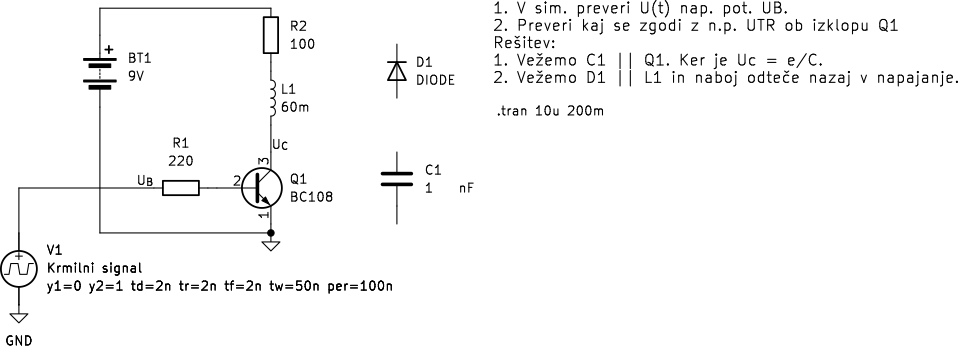

DVOPOLOŽAJNA (NEZVEZNA) REGULACIJA TEMPERATURE VODE 
--------------------------------------------------------------------------------

### Izvedbe s komparatorjem brez histereze 

- Temperaturni senzor
- Komparator
- Tranzitor
- Rele
- Grelec v drugem napetostnem omrežju

#### Rele

- Rele [RT424730](https://www.datasheets.com/search?p=RT424730)
  - 2 polni (dve menjalni stikali)
  - Imax = 8A
  - U = 25V (AC)
  - CoilCode 005 -> 5V(DC),
    - On Voltage = 3,5V
    - Off Voltage = 0,5V
    - Resistance = 62 Ohms
    - Power = 400 mW

#### Izklop induktivnega bremena

Rele vsebuje tuljavo, s katero ustvari magnetono polje. To ga uvršča med
induktivna bremena in je potrebo biti pazljiv pri izklapljanju induktivnih bremen,
saj pri tem prihaja do inducirane napetosti, ki se prišteje napetosti vira. 

{#fig:311_Vklop_induktivnega_bremena}

To lahko povzroči prevelike napetosti, ki bi lahko uničile preklopne elenente kot so 
tranzistorji in mos-feti (glej: ./circ/311_Vklop_induktivnega_bremena.kicad_sch).
Take neželjene učinke laho rešimo z diodo, ki jo vežemo vzporedno s tem induktivnim
bremenom proti napajanju. Omenimo naj, da ta učinek s pridom koristimo pri pretvornikih
za zviševanje napetosti (glej: [9. Druga uporabna vezja](./9.0_DRUGA_UPORABNA_VEZJA)).

### Izvedba z analognim Schmittovim sprožilnikom 

- glej skripto Projekti iz elektronike (Kocijančič 2020)
