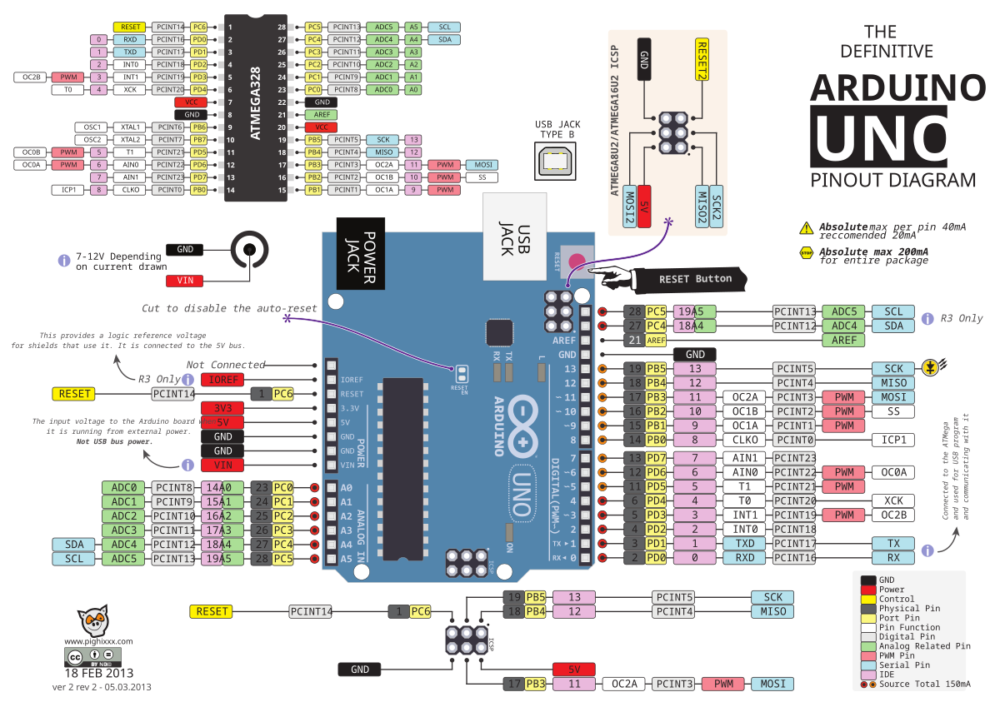
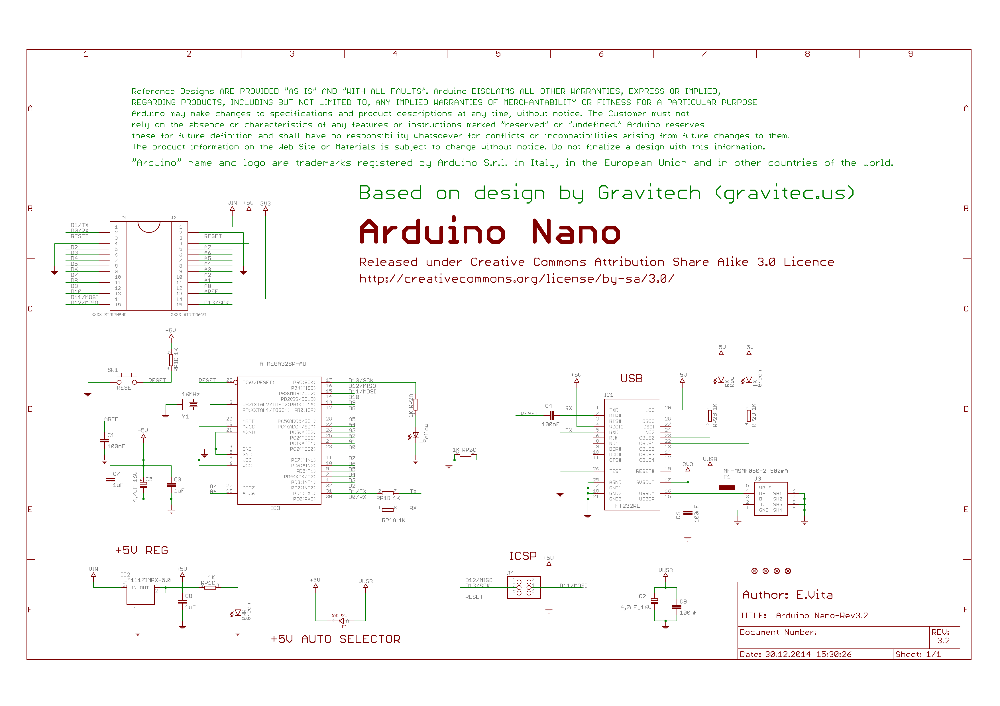

UPORABA MIKROKRMILNIKOV 
================================================================================

Mikrokrmilniki so postali ključni elementi v svetu sodobne elektronike, predvsem zaradi svoje prilagodljivosti in zmogljivosti. Ti majhni, a zmogljivi čipi služijo kot možgani za številne elektronske naprave, od preprostih gospodinjskih pripomočkov do kompleksnih industrijskih sistemov. V osnovi je mikrokrmilnik majhen računalnik na enem čipu, ki vključuje procesor, pomnilnik in vhodno/izhodne komponente.

**Prednosti uporabe mikrokrmilnikov:**  
- *Večnamenskost in Prilagodljivost:* Mikrokrmilniki so izjemno prilagodljivi in jih je mogoče programirati za izvajanje različnih nalog. To pomeni, da lahko en mikrokrmilnik uporabimo v različnih projektih, s čimer zmanjšamo stroške in kompleksnost zasnove.

- *Miniaturizacija:* Zaradi svoje majhnosti mikrokrmilniki omogočajo razvoj kompaktnih in prenosnih elektronskih naprav.

- *Nizka poraba energije:* Mnogi mikrokrmilniki so zasnovani za delovanje z zelo nizko porabo energije, kar je idealno za baterijsko napajane naprave.

- *Vgrajene funkcije:* Mikrokrmilniki pogosto vključujejo vgrajene komunikacijske vmesnike, kot so UART, SPI, I2C, ki omogočajo enostavno povezovanje z drugimi napravami in moduli.

- *Digitalna kontrola:* Omogočajo natančno digitalno kontrolo nad analognimi komponentami, kar je ključnega pomena v mnogih sodobnih aplikacijah.

**Slabosti uporabe mikrokrmilnikov**:  
Zahtevnost programiranja: Za uporabo mikrokrmilnikov je potrebno znanje programiranja, kar lahko predstavlja oviro za nekatere uporabnike.

- *Čas razvoja:* Razvoj programske opreme za mikrokrmilnike lahko traja dlje, še posebej pri kompleksnih projektih.

- *Stroški:* Čeprav so cene mikrokrmilnikov na splošno nizke, lahko stroški razvoja programske opreme in potreba po dodatnih komponentah povečajo skupne stroške projekta.

- *Preobremenjenost z možnostmi:* Zaradi velikega števila funkcij in možnosti, ki jih mikrokrmilniki ponujajo, se lahko uporabniki, še posebej začetniki, hitro izgubijo ali preobremenijo.

- *Občutljivost na motnje:* Mikrokrmilniki so lahko občutljivi na elektromagnetne motnje, kar lahko v nekaterih okoljih predstavlja težavo.

V zaključku, mikrokrmilniki nudijo močno platformo za razvoj elektronskih projektov, ki zahtevajo prilagodljivost, inteligenco in kompaktnost. Kljub nekaterim izzivom, kot so programiranje in občutljivost na motnje, njihove prednosti pogosto pretehtajo nad slabostmi, kar jih naredi nepogrešljive v sodobni elektroniki.

## Mikrokrmilnik ATmega238

Mikrokrmilniki so integrirana vezja, z zelo kompleksno notranjo strukturo. 
Sestavlja jih na milijone tranzistorjev, ki s povezavami in ostalimi osnovnimi
elementi sestavljajo smiselne logične sklope. Povečana slika dejanskega 
integriranega vezja mikrokrmilnika ATmega238 je na [@fig:Atmega328_silicon].

{#fig:Atmega328_silicon height=11cm}

Iz [@fig:Atmega328_silicon] je nemogoče razbrati posamezne dele integriranega 
vezja. Opazimo lahko le večje enake sklope, ki so namenjene spominskim funkcijam.
Še bolj podrobno sliko pa si lahko ogledate na povezavi [ATmega238-SiO2](https://siliconpr0n.org/map/atmel/atmega328/s1_20x/).

Pri tako kompleksnih vezjih je bolj smiselno, da posamezne logične sklope 
predstavimo z blokovno shemo. Tako shemo lahko najdemo v navodilih za uporabo
mikrokrmilnika [ATmega238](https://ww1.microchip.com/downloads/en/DeviceDoc/Atmel-7810-Automotive-Microcontrollers-ATmega328P_Datasheet.pdf)[@ATmega328P_Datasheet:online] in je prikazana na [@fig:ATmega238_block_diagram].

{#fig:ATmega238_block_diagram}

## Krmilnik Arduino UNO

Za projekte, ki vključujejo programabilno elektroniko, pogosto uporabljamo že izdelane
krmilnike iz družine Arduino. Na teh vezjih lahko najdemo mikrokrmilnike proizvajalca Atmel.
Najbolj pogosto uporabljena krmilnika (Arduino Uno in Arduino NANO) temeljita na mikrikrmilniku Atmega328p. Več o krmilniku Arduino UNO si lahko ogledamo na [spletni strani](https://docs.arduino.cc/hardware/uno-rev3/) [@ArduinoUNO_R3_2025]. Shema tega krmilnika je prikazana na [@fig:Pinout_of_ARDUINO_Board_and_ATMega328PU] [@ArduinoUNO_pinout_wikimedia].

{#fig:Pinout_of_ARDUINO_Board_and_ATMega328PU}

Krmilnik Arduino UNO ima javno dostopno tehnično shemo, ki služi kot uporabna referenca za razumevanje povezav V/I enot ter načina komuniciranja z ATmega328P. Shema je dostopna na spodnjem spletnem naslovu in jo je mogoče uporabiti za načrtovanje in učne namene [@ArduinoUNO_Schematic2025].

{#fig:Arduino_Nano-Rev3}

## Sestava mikrokmilnkik

- pregledali smo blokovno shemo mikrokmilnkika (iz datasheeta)
- Primer programske kode - Blink
- pregled registrov, flash, ram, eeprom

> Viri in literatura
