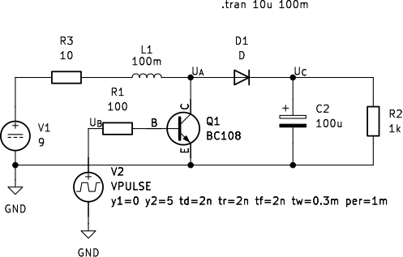
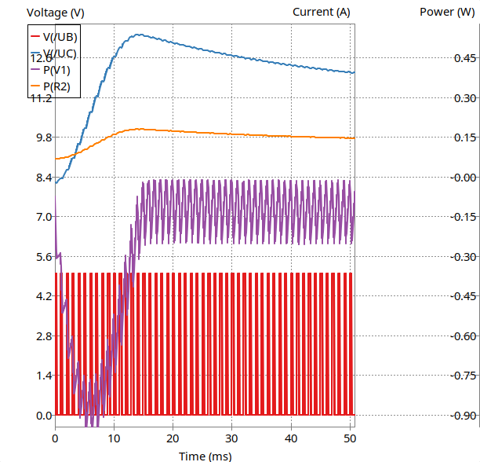

 DRUGA UPORABNA VEZJA
================================================================================

## Napetostni regulatorji

- 7805

### TL431 

- nastavljiva zener dioda
- IC (opamp, referenca, tr)
- [tutorial](https://www.youtube.com/watch?v=ruQYG5ghd58)

### Pretvornik za zviševanje napetosti

Osnovni princip delovanja pretvornika za zvišanje napetosti je, da poveča izhodno napetost z energijo, ki jo predhodno shranimo v tuljavo. Ko tranzistor prevaja, skozi tuljavo teče električni tok, ta povzroči magnetno polje v tuljavi. Ko pa tranzistor ne prevaja več in tok skozi tuljavo ne teče več, začne magnetno polje v tuljavi kolapsirati in se zato inducira napetost na priključkih tuljave. Smer inducirane napetosti je enaka kot polarizacija napetostnega vira na katero je tuljava priključena in zdi, kot da bi bila zaporedno vezana dva napetostna vira. Če ta presežek oddamo preko diode na kondenzator, se napetost na kondenzatorju zviša nad napetost napetostnega vira [@EricksonMaksimovic1999_model].

{#fig:913_boost_converter}

... in še [@fig:913_boost_converter_graph] z nekaj ključnimi napetostmi: krmilnega sinala, izgodne napetosti, moč napetostnega vira in moč na bermenskem uporu $R_2$.

{#fig:913_boost_converter_graph}

## NE555

NE555 je vsestransko integrirano vezje, ki omogoča generiranje impulzov in oscilacij v različnih konfiguracijah (monostable, astable, bistable). Notranja arhitektura vključuje dva operacijska oječevalnika v konfiguraciji komparatorja napetosti (s primerjalnim potencialom 2/3 Vcc in pri 1/3 Vcc), SR-flip-flop, tranzistor z odprtim kolektorjem in izhodno enoto s komplementarnima tranzistorjema [@TexasInstruments1972_timer].

Blokovna shema je prikazana na [@fig:555-Timer-Block-Diagram].

{#fig:555-Timer-Block-Diagram}

Bolj poddobna shema tega vezja pa na [@fig:555-Timer-Internal-Schematics]. 

{#fig:555-Timer-Internal-Schematics}

Več in bolj podrobne informacijo o delovanju tega vezja lahko najdete na HowToMechatronics [@dejan_2018_NE555].

### Generator trikotniške napetosti

Za generiranje trikotniške napetosti lahko izkoristimo lastnost kondenzatorja, da je napetost na kondenzatorju odvisna od: 
$U_C(t) = \frac{q(t)}{C}$. Torej, če se naboj na kondenzatorju spremeni, se bo tudi napetost na kondenzatorju spremenila.
Če lahko naboj enakometno povečujemo: $\frac{\Delta q}{t} = k$, po tem se bo tudi napetost $U_C$ enakomerno povečevala. Ker je
$I=\frac{\Delta q}{t}$, to pomeni, če kondenzator polnimi s konstantnim tokom, bomo na kondenzatorju dobili enakomerno povečevanje
napetosti. Torej kondenzator moramo priključiti na tokovni vir. 

{#fig:922_Triangular_voltage_NE555}

Na zadnje nam ostane še problem, da moramo naboj kondenzatorja
odvesti (izprazniti) in cikel se lahko ponovi. Tako $U_C$ ustreza trikotniški napetosti.

{#fig:922_Triangular_voltage_NE555_waveform}

