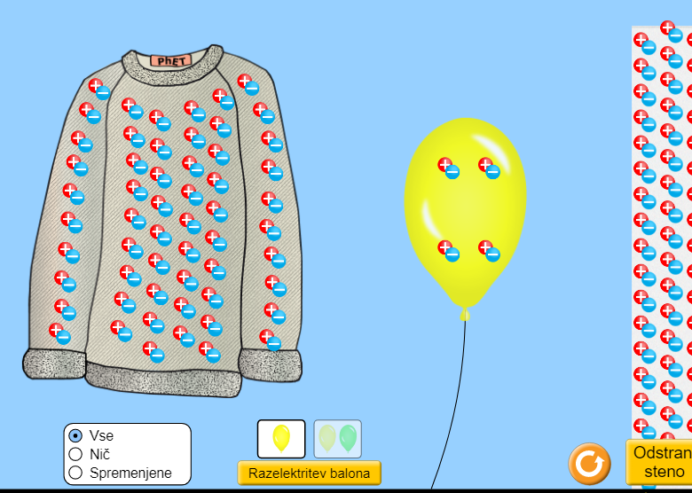
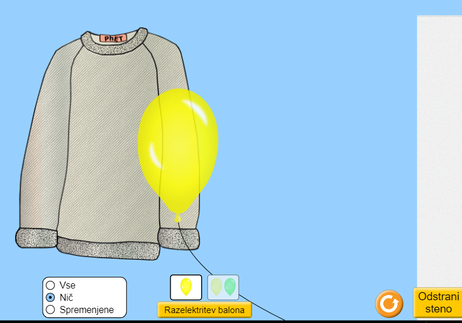
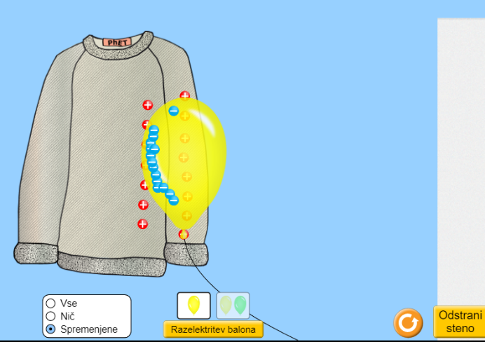
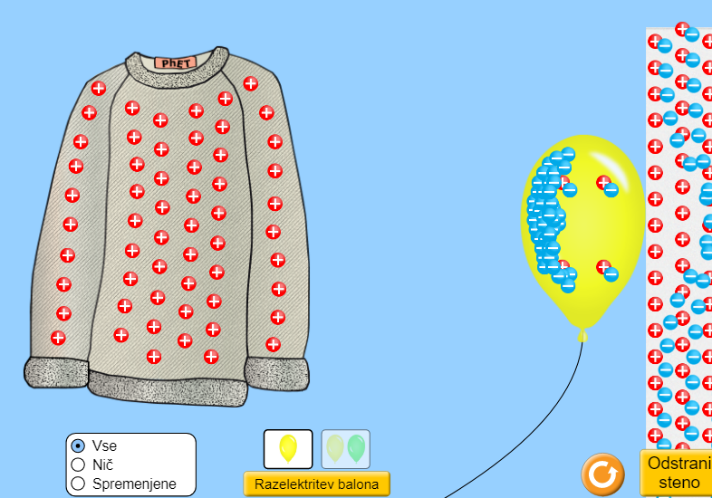

Ime: Mija

Priimek: Lavrič

Vpisna številka: 1014608

Smer študija: MA -- FI

# Simulacijska programska orodja za ponazoritev fizikalnih pojavov

Izbrala sem si vsebinski sklop Električni naboj in električna sila.
Operativni cilji, ki jih morajo učenci usvojiti so zapisani v učnem
načrtu za fizike za deveti razred. Učni cilji so:\
1. razložijo različne načine naelektritve teles,\
2. usvojijo, da električna sila deluje na daljavo in da izvira iz
nabojev,\
3. ugotovijo, da sta dve vrsti nabojev,\
4. ugotovijo, da med naelektrenimi telesi delujejo privlačne ali odbojne
sile,\
5. raziščejo ali so telesa naelektrena ali električno nevtralna,\
6. opišejo elektroskop,\
7. poznajo nevarnosti strele;

Ko se učenci prvič srečajo s pojmom statična elektrika oziroma elektrika
na sploh, je zelo pomembno, da učencem prikažemo neke poskuse na to temo
in se ob njih pogovorimo. Npr. verjetno vse učence je že kdaj streslo,
ko so se dotaknili nakupovalnega vozička. Učenci oziroma učenke imajo
tudi izkušnjo, da se ob dolgotrajnem česanju lasje dvignejo skupaj z
glavnikom. Učenci imajo tudi izkušnjo, da velikokrat pri slačenju
volnenega puloverja zaslišimo prasketanje. Vse to so enostavni poskusi,
ki jih lahko kot učitelji prikažemo v razredu. Zgoraj navedeno bi
izpostavila kot prednost klasičnega poučevanja. Četudi imajo učenci
predznanje iz kemije, da so snovi zgrajene iz atomov in molekul in vedo
kako je sestavljen atom, ne morejo vedeti kaj se zgodi z elektroni,
protoni, ko npr. eno stvar podrgnemo z drugo. Tega tudi ne morejo
videti. Prav to pa je prednost simulacije, saj učenci vidijo kaj se
dogaja z elektroni in posledično sklepajo tudi na to, da se telesa, ki
so naelektrena z istovrstnim nabojem odbijajo, telesa z raznovrstnim
nabojem pa privlačijo. Kot prednost pri programskih orodjih lahko
izpostavim to, da je »poskus« vedno uspešen, kar pri klasičnem
eksperimentiranju ne moremo zagotoviti, saj na primer že sami poskusi iz
elektrostatike ne uspejo v vlažnem ozračju. Kot prednost simulacije
lahko definitivno izpostavim tudi pravičnost poskusa. Na simulaciji je
enako število npr. protonov in elektronov. Prednost simuliranje v
programu je mikroskopska slika (kaj se dogaja z naboji). Slabost
programa pa je ta, da učenci ne podrgnejo npr. balon po laseh ampak samo
simulirajo. Učenci si vse bolje zapomnijo če nekaj izkusijo. Slabost je
tudi ta, da so vsi dejavniki in pogoji pri simuliranju poskusa idealni,
kar pa v resničnem svetu nikoli ni tako. Bolje je izvesti eksperiment,
saj tako učenci nekaj izkusijo. Zdi se mi najbolje, da če sta simulacija
in klasičen eksperiment časovno mogoča prikažemo oboje.

# Opis simulacijskega orodja

Simulacijski program: PhET

Povezava na program:
<https://fizikalne.simulacije.si/2016/08/20/staticna-elektrika/>

PhET je program, ki vsebuje okoli 150 brezplačnih interaktivnih
matematičnih in naravoslovnih simulacij. Simulacije so prevedene v malo
manj kot 100 jezikov, poleg simulacij pa vsebujejo tudi datoteke za
podporo učiteljem.

Kako deluje izbran program:

{width="3.477810586176728in"
height="2.4791666666666665in"}

Slika prikazujejo električno nevtralna telesa. Z miško lahko premikamo
balon po jopi in opazujemo kaj se dogaja z prerazporeditvijo nabojev med
dregnjenem. V simulaciji vidimo presežek negativnih nabojev na balonu in
pozitivnih na jopi.

Lahko imamo drugačno sliko, če pritisnemo nič. Nabojev ne vidimo, vidimo
pa, da se jopa in balon privlačita.

{width="3.53125in"
height="2.472108486439195in"}

Lahko vklopimo tipko Spremenjene. Ko približamo balon jopici, vidimo
kako se prerazporedijo naboji in ni narisanih začetnih nabojev. Med
elektronom in protonom je privlačna sila, zato balon sili na jopico.
Tudi elektroni v balonu silijo bližje jopi. Pri prejšnji sliki z
vklopljeno funkcijo nič z učenci lahko razmislimo in napovemo, kaj se bo
dogajalo z naboji, s funkcijo spremenjene pa tudi vidimo, kaj se dogaja.

{width="3.13325021872266in"
height="2.2083333333333335in"}

Če hočemo priti v začetno stanje, električno nevtralna telesa pritisnemo
tipko za razelektritev telesa. Kot je vidno na spodnji sliki, lahko s
pomočjo stene, ki jo lahko vključimo oziroma izključimo opazujemo,
kakšne sile delujejo med naboji. Na sliki vidimo, kako elektroni na
steni silijo proč od balona. S pritiskom na razelektritev telesa dobimo
električno nevtralno telo (enako število protonov in elektronov). V
programu lahko vključimo tudi funkcijo, ko imamo dva balona in opazujemo
vse kar sem opisala v tem razdelku.

{width="3.2303871391076115in"
height="2.2604166666666665in"}

# Prednosti in slabosti simulacijskega orodja

UN:\
1. razložijo različne načine naelektritve teles,\
2. usvojijo, da električna sila deluje na daljavo in da izvira iz
nabojev,\
3. ugotovijo, da sta dve vrsti nabojev,\
4. ugotovijo, da med naelektrenimi telesi delujejo privlačne ali odbojne
sile,\
5. raziščejo ali so telesa naelektrena ali električno nevtralna,\
~~6. opišejo elektroskop,\
7. poznajo nevarnosti strele;~~

1\. učni cilj učenci lahko simulirajo, tako da balon premikajo po jopi
in s tem simulirajo način naelektritve teles z drgnjenjem. Drugi način
naelektritve (nanos nabojev) v simulaciji ne moremo simulirati, kar se
mi zdi slabost. Program bi dopolnila tako, da bi lahko elektrone z miško
prenesla na balon.

2\. in 4. učni cilj, da električna sila deluje na daljavo lahko opazijo
ko balon približajo steni, a se je ne dotaknejo. Tako vidijo, da
električna sila deluje brez dotika. Tu deluje odbojna sila. Če pa
spustimo negativno nabit balon med steno in jopico, deluje privlačna
sila in balon se nalepi na jopico. Lahko bi program vseboval tudi
funkcijo, ki nariše vektor, ki pokaže velikost in smer sil med naboji. S
tem bi tudi učenci bolje videli, da sila izvira iz nabojev.

3\. učni cilj, da sta dve vrsti nabojev vidimo v simulaciji, tako, da
imamo -- in + naboje, ter uporabljene barve. Če se navežem še na 2. in
4. učni cilj, bi bilo mogoče dobro, da bi lahko zamenjali stvari npr.
namesto jopice steklena in palica iz umetne mase, namesto balona pa
krzno ter blago. V enem primeru bi se na palici nabralo več negativnega
naboja, v drugem pa na krpi in bi imela palica v tem primeru višek
pozitivnega naboja. Več stvari bi učence bolj prepričalo, da sta dve
vrsti naboja.

5\. učni cilj, da učenci raziščejo ali so telesa naelektrena ali
električno nevtralna tudi lahko simulirajo. Na začetku, v simulaciji
vidimo, da je balon električno nevtralen, tako tudi jopica. Če ga samo
prestavimo bližje jopi ali steni, se balon in stena oz. jopa ne
privlačijo. Da se privlačijo pa vidijo tako, da predmeti nimajo enakega
števila protonov in nevtronov. Zato stena, ki je skozi vso simulacijo
električno nevtralna odbija balon, ki je negativno naelektren, jopa pa
ga privlači.

Glede simulacije lahko povem, da je preprosta in uporabna. Prednosti in
slabosti sem izpostavila že pri učnih ciljih. Pri sami simulaciji me
zmotijo ukazi, kot so vse, nič, spremenjene. Besedo spremenjene tudi ne
razumem sak dokler ukazov ne pritisnem in pogledam kakšno funkcijo
imajo, ne vem kaj pomenijo. Moti me tudi to, da s funkcijo ko vključim
dva balona, nikakor ne morem dobiti presežka pozitivnih nabitih delcev,
da bi učenci videli, da se tako dve negativno nabiti stvari med seboj
odbijajo, kot tudi pozitivno nabiti.
