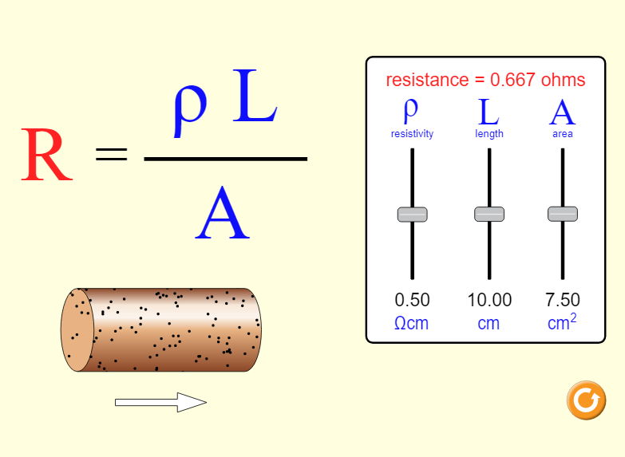
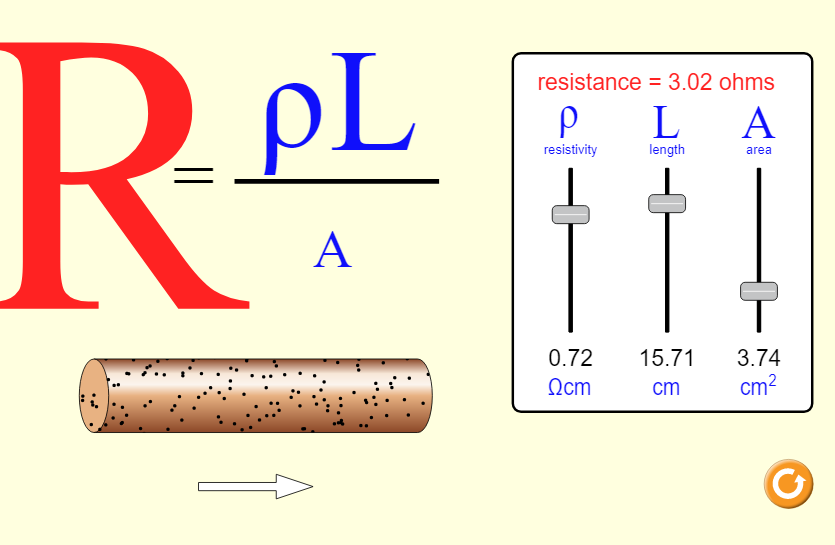

Ime: Ksenija

Priimek: Rozman

Vpisna številka: 01170827

Smer študija: Ma -- Fi

# Simulacijska programska orodja za ponazarjanje fizikalnih pojavov

Simulacija prikazuje odvisnost upora od specifične upornosti, dolžine in
premera žice. Primerna je za doseganje cilja, kjer učenci raziskujejo,
od česa je odvisen upor žice, kar sicer ne spada pod obvezne vsebine.
Učence želimo naučiti, kako lahko iz enačbe razberemo odvisnosti,
preverimo enote in morda ocenimo rezultat.

Če bi enačbo želeli razložiti na klasičen način, bi morali narisati več
slik, ki bi jo prikazovale, ali pa slike sploh ne bi bilo in bi
razložili ustno (v smislu: ker se imenovalec se poveča, se specifična
upornost zmanjša). Prednost pa je, da bi verjetno izvedli poskus, s
katerim bi prikazali enako stvar in bi bilo za učence bolj oprijemljiva,
kot sama enačba.

## Opis simulacijskega orodje

Simulacija je dostopna na strani PhET na povezavi
<https://phet.colorado.edu/en/simulation/resistance-in-a-wire>. Tam
vidimo napisano enačbo za upor, na desni pa imamo napisano številsko
vrednost upora in 3 drsnike: specifična upornost, dolžina in presek, pri
katerih lahko spreminjamo vrednosti, ki so spodaj napisan tudi s
številko in enoto. Pod enačbo je tri razsežna slika žice, ki se
spreminja glede na vrednosti, ki jih nastavimo na drsnikih.

{width="2.689809711286089in"
height="1.968503937007874in"}
{width="3.0160739282589675in"
height="1.968503937007874in"}

## Prednosti simulacijskega orodja

Prednost simulacije je, da s pomočjo slike fizikalno razloži enačbo,
hkrati pa lahko učencem pomaga tudi pri razumevanju ostalih enačb pri
fiziki (ali matematiki). Poleg elementa na sliki se povečuje tudi oznaka
v enačbi, ki celotno zadevo naredi še malo bolj pregledno. Pri
spreminjanju specifične upornosti se povečuje tudi gostota črnih pikic v
žici. Analiziramo lahko tudi ekstremne vrednosti, če npr. maksimalno
zmanjšamo specifično upornost in dolžino ter opazujemo, kako velike so
spremembe upora, če premikamo presek od 0,01 cm^2^ do 0,1 cm^2^ ali če
ga premikamo od 10 cm^2^ do 11 cm^2^ (kar nam povejo po eni strani
rezultat z rdečo, po drugi strani pa velikost črke R).

## Slabosti simulacijskega orodja

Slaba stran simulacije pa je, da ne prikaže neposredno, na kaj se nanaša
(ni prikazanega nobenega eksperimenta, samo enačba in kos žice), zato ni
primerna za začetek obravnave snovi. Poleg tega simulacija ne omogoča
obračanje enačbe in tudi oznake so drugačne, kot smo jih vajeni pri
obravnavi v šoli.
