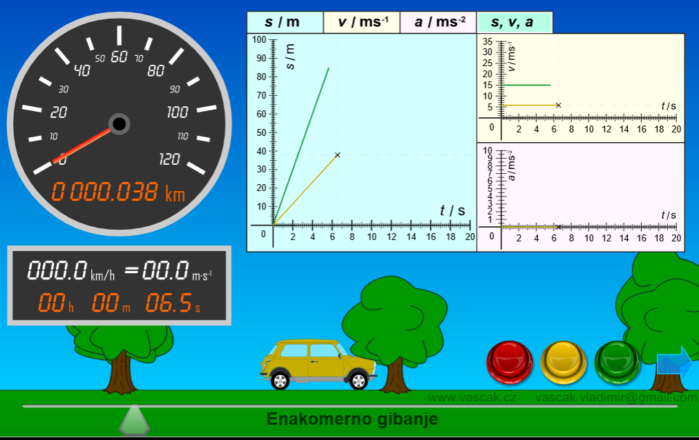

Ime: Patricija

Priimek: Podboj

Vpisna številka: 1017021

Smer študija: FI-MA

# Simulacijska programska orodja za ponazarjanje fizikalnih pojavov

## Opis simulacijskega orodje

{width="6.5in"
height="4.097916666666666in"}

Simulacijsko orodje prikazuje premo enakomerno gibanje avtomobila.
Sproti izrisuje grafe gibanja: graf poti v odvisnosti od časa, hitrosti
v odvisnosti od časa in pospeška v odvisnosti od časa, glede na hitrost
gibanja avtomobila, ki jo nastavimo. Vse tri grafe lahko na zaslonu
opazujemo tudi istočasno.

Premo enakomerno gibanje je vsebina 8. razreda. Učenci spoznajo osnovne
enačbe gibanja ter grafa poti v odvisnosti od časa in hitrosti v
odvisnosti od časa. Iz grafov morajo znati odčitavati podatke in
prepoznati, za graf katerega gibanja gre.

Dostopnost simulacijskega orodja:

<https://www.vascak.cz/data/android/physicsatschool/template.php?s=mech_pohyb&l=si>

## Prednosti simulacijskega orodja

Aplikacija omogoča nastavljanje različnih realnih hitrosti vožnje
avtomobila (s kazalcem na spodnji strani zaslona). S pritiskom na zeleno
tipko (levo) avtomobil začne voziti premo enakomerno, števec izpisuje
hitrost, glede na to, kateri graf smo izbrali, da se izrisuje, pa sproti
opazujemo tudi vrednosti grafov.

S pritiskom na rumeno tipko avtomobil zaustavimo le začasno. Med
mirovanjem lahko spremenimo njegovo hitrost, po ponovnem pritisku na
zeleno tipko pa lahko primerjamo strmino grafov poti v odvisnosti od
časa glede na hitrost vožnje avtomobila. Meritve na grafih so različnih
barv in sovpadajo z barvo avtomobila (glede na njegovo hitrost). Meritve
preprosto ponastavimo s pritiskom na rdeči gumb.

Za lažjo primerjavo (enak časovni interval merjenja ob primerjanju dveh
različnih hitrosti) se pod števcem hitrosti ves čas izpisujeta hitrost
avtomobila in čas od začetka ponovnega merjenja. Hitrost je zapisana v
$\frac{\text{km}}{h}$ in $\frac{m}{s}$.

## Slabosti simulacijskega orodja

Če želimo na zaslonu hkrati prikazovati grafa poti v odvisnosti od časa
in hitrosti v odvisnosti od časa, moramo prikazovati tudi graf pospeška
v odvisnosti od časa, ki za učence na tem mestu ni pomemben in bi jih
lahko celo zmedel.

Če nastavimo hitrost na neko vrednost, se ta vrednost avtomatično poveča
vsakič, ko premica na grafu poti od časa doseže največjo vrednost poti
na osi (koordinatne osi se ne prilagajajo sproti). Moteče je tudi, da
hitrosti ne moremo nastavljati povsem zvezno.

Enota $\frac{\text{km}}{h}$ je zapisana z ulomkom, enota $\frac{m}{s}$
pa s potenco. Učence navajamo na enoten zapis (z ulomkom ali kvečjemu
poševno črto, potenc pa v osnovnošolski fiziki po navadi ne
uporabljamo).
