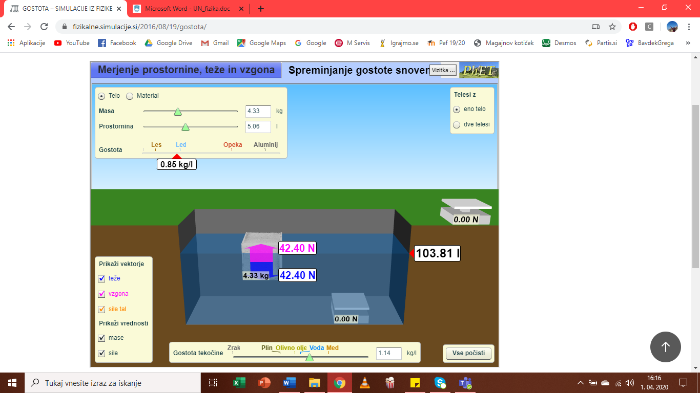

Ime: Ana

Priimek: Bertoncelj

Vpisna številka: 01016303

Smer študija: MA-FI

Simulacija: <https://fizikalne.simulacije.si/2016/08/19/gostota/>

# Simulacijska programska orodja za ponazarjanje fizikalnih pojavov

*Na kratko opišite fizikalni pojav in navežite tematiko na osnovnošolski
učni načrt za 8. ali 9. razred. Izpostavite kaj so prednosti in slabosti
predstavitve tega pojava na klasičen način (fizično v razredu) in nato
še, kaj so prednosti in slabosti, če ta pojav predstavimo s simulacijo.*

Pri simulaciji izbiramo različna telesa in jim merimo težo, prostornino
in vzgon. Iz podatkov lahko ugotovimo/izračunamo tudi gostoto neznanega
telesa. Učenci obravnavajo prostornino, gostoto in vzgon v 8. razredu v
vsebinskem sklopu Gostota, tlak in vzgon.

Simulacija je primerna za uporabo ob obravnavi vzgona oziroma po
obravnavi celotnega vsebinskega skopa. Med obravnavo vzgona je
definitivno primerno pokazati klasičen poskus, saj nobena tehnologija ne
nadomesti nečesa, kar lahko učenci vidijo s prostimi očmi v živo. Za
nadgradnjo poskusa pa bi bila primerna ta simulacija, saj lahko veliko
količin spreminjamo (težo, gostoto, volumen, tekočino, ...). Prav tako
pa lahko veliko količin hitro odčitamo in si s tem prihranimo čas, saj
simulacija takoj izpiše maso telesa, težo telesa, velikost sile in
volumen tekočine.

Prav tako bi bila simulacija uporabna po obravnavi vsebinskega skopa kot
pripomoček pri preverjanju usvojenega znanja. Učenci bi ob uporabi
simulacije reševali temu prilagojen učni list. Z uporabo simulacije bi
lažje preverili razumevanje vsebine, zaradi boljše vizualizacije
problema. Učenci bi hkrati raziskovali odvisnosti količin ena od druge.
V vsebino učnega lista (in simulacijo) bi lahko vključili tudi tlak v
tekočinah.

## Opis simulacijskega orodje

*Opišite simulacijsko orodje. Kje je dostopno in kako predstavitveno
sliko delovanja.*

Simulacija je dostopna na povezavi:
<https://fizikalne.simulacije.si/2016/08/19/gostota/>. Sestavljena je iz
dveh delov.

{width="3.8645833333333335in"
height="2.8958333333333335in"}

Pri prvem delu simulacije lahko v zgornjem desnem kotu izberemo kakšni
telesi želimo. Lahko izbiramo med telesi z enako maso, enako prostornino
ali enako gostoto. To nam omogoči da lahko raziskujemo kaj se zgodi z
različnimi telesi, ko jih vržemo v vodo. V spodnjem levem kotu lahko
izbiramo katere velikosti količin želimo opazovati. Ob bazenčku s
tekočino nam piše količina tekočine. To nam omogoča, da lahko razberemo
volumen izpodrinjene tekočine in s tem podatkom izračunamo gostoto
telesa. Na dnu simulacije pa lahko enake situacije opazujemo v olju.

{width="3.8541666666666665in"
height="2.9375in"}

V drugi simulaciji pa je večji poudarek na gostoti telesa in gostoti
tekočine. Prav tako lahko spodaj levo nastavimo katere velikosti količin
želimo opazovati. Zgoraj levo spreminjamo telo oziroma material (masa,
volumen in posledično gostoto telesa), spodaj levo pa spreminjamo
gostoto tekočine.

Vključimo lahko tudi možnost drugega telesa. To omogoči lažje
primerjanje sil, ki delujejo na dve različni telesi v enaki tekočini.

Učni cilji iz UN:

**6.4.1.** Usvojijo, da je gostota količnik mase in prostornine.\
**6.4.3.** Uporabijo enačbo za računanje gostote. (Pri računanju gostote
telesa)\
**6.4.4.** Vedo, kaj so homogena telesa.\
**6.4.5.** Ločijo homogena telesa od nehomogenih.\
**6.4.6.** Razumejo pojem povprečna gostota. (Ob simulaciji lahko
ponovimo te cilje, ki jih bomo potrebovali tudi pri cilju 6.9.1.)

**6.8.1.** S poskusi raziščejo vzgon. (Simulacija je zelo primerna za
usvojitev tega cilja, saj učenci raziščejo delovanje sile vzgona na
različna telesa v različnih tekočinah.)\
**6.8.2.** V preprostih primerih uporabijo enačbo za računanje vzgona.
(Ob simulaciji jim lahko zastavimo nalogo, kjer računajo vzgon.)

**6.9.1.** S primerjavo gostot oziroma povprečnih gostot razložijo, v
katerih okoliščinah telo plava, lebdi ali potone. (Najlažje z uporabo
drugega dela simulacijskega orodja.)

## Prednosti simulacijskega orodja

*Opišite lastnosti simulacijskega orodja, ki predstavljajo prednosti, ki
bi jih lahko učitelj ali učenci izkoristili.*

-   Prihrani čas pri računanju in odčitavanju količin. Simulacija sproti
    preračuna vse količine, mi pa jih lahko samo opazujemo kako se
    spreminjajo.

-   Delovanje sile vzgona si lahko pogledamo na več primerih, saj lahko
    spreminjamo veliko lastnosti telesa oziroma tekočine. Pri drugem
    delu simulacije si lahko pogledamo delovanje sile vzgona v številnih
    primerih, za katere v šoli mogoče nebi imeli časa ali pripomočkov
    (med, plin, aluminij, ...).

-   Odlično je razvidna razlika velikosti sile podlage v primeru
    aluminija in opeke pri istem volumnu telesa.

-   Zelo smiselno se mi zdi, da je vključen še osnoven primer, kakšna je
    sila vzgona v zraku.

-   Koristno se mi zdi, da lahko poljubno označimo katere velikosti
    količin želimo videti. To nam omogoči, da učencem s simulacijo
    predstavimo nalogo na podlagi katere morajo oni nekaj izračunati,
    potem pa s pomočjo simulacije preverimo rešitev.

-   Ob uporabi simulacije lahko ponovimo vsebine iz preteklih ur
    (gostota, volumen, ...).

-   Simulacija je prikazana zelo resnično, saj telo zaniha, ko ga vržemo
    v vodo. Z opazovanjem velikosti sil lahko opazujemo kako se
    spreminja sila vzgona in kako sila teže ostane ves čas konstantna.
    Ko pa se telo neha gibati na vodi pa postane sila vzgona enako
    velika kot sila teže.

## Slabosti simulacijskega orodja

*Izpostavite slabosti, na katere bi moral biti učitelj ali učenec
pozoren pri uporabi simulacijskega orodja.*

Definitivno se mi zdi najslabši del simulacijskega orodja sile, kako so
narisane in kje je prijemališče. Prijemališče sile podlage in sile
vzgona je v težišču telesa. Prijemališče sile podlage je na stiku med
telesom in podlago. V primeru ko telo plava na površju tekočine je
prijemališče sile vzgona v težišču potopljenega dela telesa. Prav tako
se sili podlage in vzgona prekrivata, ko telo potone do dna tekočine.
