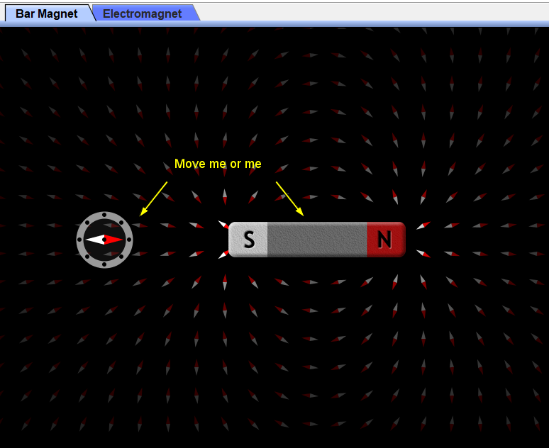
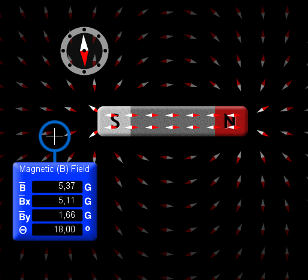

Ime: Ema

Priimek: Sikošek

Vpisna številka: 1016317

Smer študija: MA-FI

# Simulacijska programska orodja za ponazarjanje fizikalnih pojavov

Magnetna sila je ena izmed sil, ki deluje na daljavo. V prostoru kjer je
prisotna deluje magnetno polje. Telo okoli katerega se nahaja magnetno
polje imenujemo magnet. Vsak magnet ima dva polja: severni in južni pol.
Smer magnetnega polja ponazorimo s sklenjenimi krivuljami. Imenujemo jih
magnetne silnice. Izhajajo iz severnega magnetnega polja in ponikajo v
južni magnetni pol. Znotraj magneta se silnice sklenejo.

Magnet z magnetno silo lahko deluje na drugi magnet. Severni magnetni
pol privlači južni magnetni pol in odbija severni magnetni pol. Odbojna
magnetna sila se pojavi tudi med dvema južnima poloma. Kompas deluje kot
magnet (oziroma njegova igla). Če blizu kompasa ni nobenega magneta ali
feromagnetne snovi se severni pol magnetne igle v kompasu vedno obrne
proti južnemu magnetnemu polju našega planeta, ki je blizu severnega
geografskega pola.

Magnet deluje tudi na drugo feromagnetno snov (železo, kobalt, nikelj,
zlitine,..). Magnetne sile delujejo tudi na vodnike, po katerih teče
električni tok.

V razredu je zelo primerno, da vsakemu učencu ali vsaj vsakemu paru
omogočimo uporabo magneta, kako deluje na feromagnetno snov in kako se
odzove pri stiku z drugim magnetom. Če so poli pravilno označeni na vseh
magnetih je primerno, da učenci sami raziščejo kako deluje magnetna sila
enega magneta na drug magnet. Ker magnetna igla v kompasu lepo niha in
se obrača, ko kompas vrtimo okoli magneta je zelo primerna uporaba tudi
kompasa.\
Problem je, da velikokrat nimamo zadostne opreme za vse učence in tisti,
ki ne sodeluje ne bo imel veliko od tega. Tudi vsaka taka uporaba
kompasa nam s časoma pokvari samo magnetno iglo, če je preveč
izpostavljena magnetom.

## Opis simulacijskega orodja

Izbrala sem si simulacijsko orodje Magnets and Electromagnets s spletne
strani Phet, Univerze Colorado. Dostopna je tudi na njihovi spletni
strani, moramo pa omogočiti dostop vtičniku Java.

{width="4.584722222222222in"
height="3.74375in"}

Slika Prva stran aplikacije.

Imamo več različnih možnosti kako uporabiti sam program. Lahko premikamo
kompas, ki nam pove katera dva magnetna pola se privlačita in katera dva
odbijata. Ko ga premikamo okoli magneta se suče kot običajni magnet.
Tudi sam magnet lahko premikamo okoli kompasa. Pri tem se obračajo tudi
˝mini kompasi˝, ki nam označujejo potek silnic okoli magneta. Vsak
posamezen kompas nam pokaže smer magnetnega polja v točki kjer je
fiksiran. Sama bi bila zelo zadovoljna, če bi skozi mini kompase
potekale še magnetne silnice.

{width="4.12in" height="3.73375in"}

Slika Aplikacija nam pokaže tudi jakost magnetnega polja v vseh smereh.

## Prednosti simulacijskega orodja

Ne kvarijo se pripomočki. Lahko povečamo/ pomanjšamo sliko ali velikost
magneta. Nimamo zunanjih dejavnikov, ki bi vplivali na delovanje našega
magneta v simulaciji. Lahko povečujemo/zmanjšujemo tudi moč magneta.
Prikazane so tudi silnice, ki sicer niso vidne, kar učencem bolj nazorno
pokaže kako potekajo, kot sicer, če jih narišemo na tablo po izvedenem
poskusu. Podane imamo točne informacije o jakosti magnetnega polja ( v
vse smeri) in kako se spreminja z oddaljenostjo od magneta.

## Slabosti simulacijskega orodja

Prav tako nimamo idealnih razmer, ki bi omogočal, da vsi učenci
poskusijo uporabo aplikacije, razen če smo v računalniški učilnici/
imamo dostop do šolskih tablic/ damo za izvedbo DN doma.

Ne moramo dodati več kompasov. Lahko imamo le en magnet. Silnice niso
upodobljene s črto ( ne pokažejo kje izvirajo in kje poniknejo). Z
manjšanjem jakosti magnetnega polja ne izginejo označevalci silnic
vendar se vedno bolj temnijo (količina ostaja ista), kar učence lahko
zavede saj se pri fiziki učijo, da je silnic manj če je polje šibkejše.
