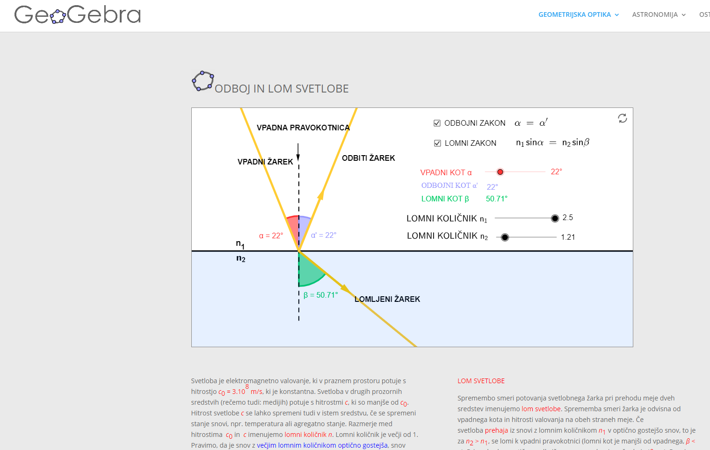

SIMULACIJSKA PROGRAMSKA OPREMA ZA PONAZARJANJE FIZIKALNIH POJAVOV

Ime in priimek: Jure Cankar

Vpisna številka: 01170966

Smer študija: MA-FI

Vsebinski sklop: Odbojni in lomni zakon

Animacija:
<http://www.geogebr.si/geometrijska-optika/odboj-in-lom-svetlobe/>

**Opis animacije:**

Animacija prikazuje lom in odboj svetlobe na meji dveh snovi z
različnima lomnima količnikoma. Animacija je narejena v programu
Geogebra, omogoča pa spreminjanje treh vhodnih spremenljivk. Spreminjaš
lahko namreč lomna količnika obeh snovi ter kot vpadnega žarka. Na
animaciji so tudi z besedami zapisani vsi objekti, s pritiskom na gumb
pa lahko izklopimo bodisi odbojni žarek ali pa lomljene žarek.
{width="6.570931758530183in"
height="4.166666666666667in"}

**Prednosti simulacijskega orodja:**

S to animacijo lahko zelo nazorno prikažemo odboj in lom, animacija pa
je tudi primerno narejena, da učenci ne morejo poljubno spreminjati
spremenljivk, temveč le dane spremenljivke z drsniki. To pomeni, da jim
lahko to animacijo preprosto pokažemo in sami raziščejo lom in odboj
svetlobe, učitelj pa le poenoti ugotovitve v sledeči obravnavi snovi.
Pod animacijo je tudi zelo jasno razložen postopek za lomom in odbojem,
da si lahko učenci preberejo tudi teorijo za pojavoma.

**Slabosti simulacijskega orodja:**

Pri razlagi so uporabljene kotne funkcije, kar učenci v osnovni šoli še
ne razumejo. Učitelj bi jim rabil pred predstavitvijo animacije
povedati, da so določeni deli razlage matematično prezahtevni za njih in
naj jih preprosto spustijo.
