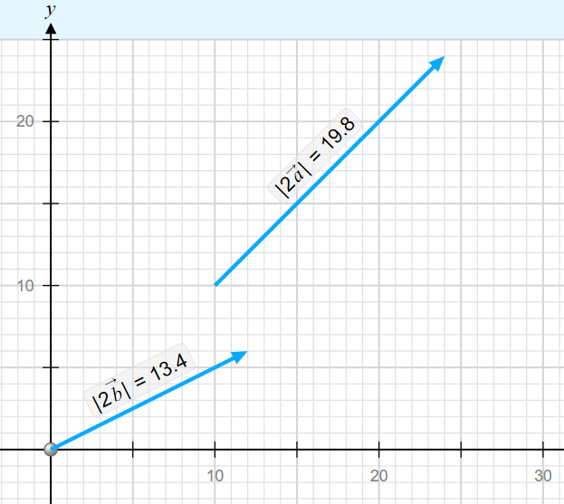
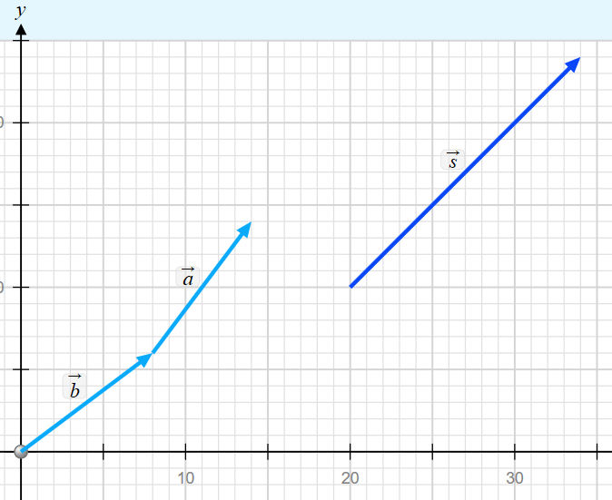
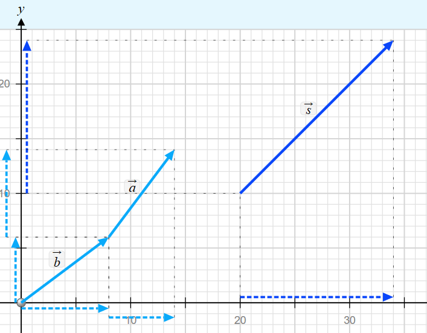
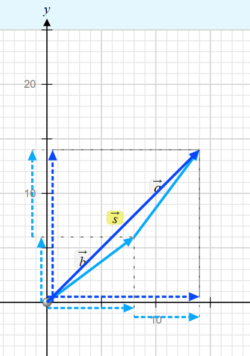
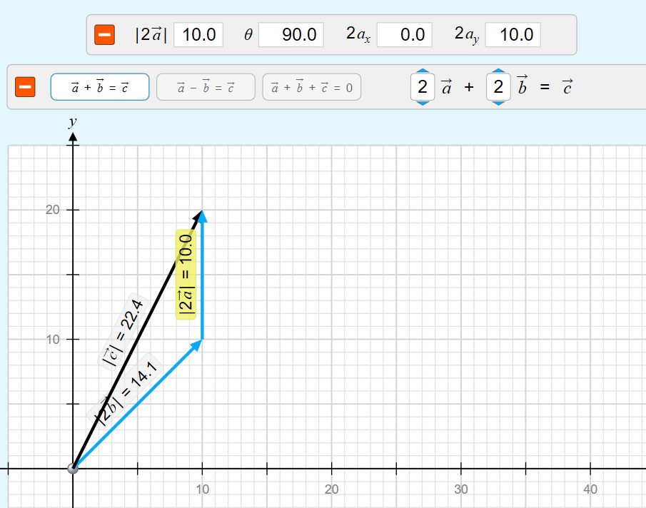

Ime: Lara

Priimek: Podberšič

Vpisna številka: 1016313

Smer študija: FI - MA

# Simulacijska programska orodja za ponazarjanje fizikalnih pojavov

*Na kratko opišite fizikalni pojav in navežite tematiko na osnovnošolski
učni načrt za 8. ali 9. razred. Izpostavite, kaj so prednosti in
slabosti predstavitve tega pojava na klasičen način (fizično v razredu)
in nato še, kaj so prednosti in slabosti, če ta pojav predstavimo s
simulacijo.*

V osnovni šoli, se ukvarjamo s silami in njihovimi predstavitvami. Ena
od tem oziroma vsebinskih sklopov je sestavljanje nevzporednih sil.
Klasično učencem po navadi prikažemo postopek sestavljanja sil na tablo,
a ker smo časovno omejeni in risanje na tablo vzame veliko časa, po
navadi ne naredimo veliko primerov na tablo. Sama, bi zagotovo najprej
za razumevanje samega koncepta sestavljanja sil tematiko predstavila
klasično, torej pred tablo, potem pa bi lahko uporabila kako simulacijo.
Prednosti uporabe simulacije so, da prikažemo učencem veliko več
primerov v krajšem času in morda na kak drugačen način.

## Opis simulacijskega orodja

*Opišite simulacijsko orodje. Kje je dostopno in kako predstavitveno
sliko delovanja.*

Simulacijsko orodje oziroma aplikacija Vector Addition je preprosta
simulacija, ki je prosto dostopna na internetni strani
<https://phet.colorado.edu/sims/html/vector-addition/latest/vector-addition_en.html>
. Je preprosta simulacija, kjer na karo ozadje z koordinatnimi osmi
rišemo poljubne sile. Imamo možnosti spreminjati velikosti sil, kot sil
in te količine prikazati tudi na skici.

{width="3.5520833333333335in"
height="3.1757786526684164in"}

## Prednosti simulacijskega orodja

*Opišite lastnosti simulacijskega orodja, ki predstavljajo prednosti, ki
bi jih lahko učitelj ali učenci izkoristili.*

Aplikacija ne prikazuje le sestavljanje nevzporednih sil, a tudi
sestavljanje vzporednih sil in računanje s silami. Tako, da lahko
učitelj najprej malo ponovi sestavljanje vzporednih sil in šele potem
preide na sestavljanje nevzporednih sil.

Poglejmo si kar po učnih ciljih, kaj so prednosti aplikacije in kaj
lahko z njo izvedemo.

-   V sklopu Sestavljanje nevzporednih sil imamo prvi cilj: »narišejo
    rezultanto nevzporednih sil«. S tem programom lahko učencem
    prikažemo različne postavitve sil in tudi rezultante le teh. Torej
    je ta cilj zajet v aplikaciji.

-   Prav tako je cilj: »ugotovijo, da se velikost in lega rezultante
    spreminjata v odvisnosti od velikosti sil in kota, ki ga sili
    oklepata« možno izvesti. Lahko izberemo zavihek Lab, kjer narišemo
    en primer dveh sil, katerima spreminjamo kot oziroma usmerjenost.
    Učenci pa opazujejo, kaj se dogaja z rezultanto in kaj s posameznima
    silama.

-   S simulacijo lahko prikažemo tudi izračune sil.

-   Poljubno lahko spreminjamo naklon sil in velikosti sil.

-   Učitelj lahko to simulacijo uporabi pri raznih primerih, kjer učenci
    najprej grafično izračunajo v zvezke, potem pa skupaj pokomentirajo
    in preverijo z aplikacijo. Na ta način bi lahko to aplikacijo
    uporabil tudi učenec sam doma za vajo.

## Slabosti simulacijskega orodja

*Izpostavite slabosti, na katere bi moral biti učitelj ali učenec
pozoren pri uporabi simulacijskega orodja.*

Slabost tega programa je v tem, da ne obravnava sestavljanje sil tako
klasično kot moramo mi učitelji učiti, a je v aplikaciji to malo čudno
nakazano. Vsaj pri zavihku Explore 2D, je potrebno, da sami prestavimo
rezultanto sil in menim, da učencem iz take aplikacije ne bi bilo ravno
jasno, kako smo jo dobili. Potrebna je učiteljeva razlaga.

{width="2.581395450568679in"
height="2.1103455818022745in"}
{width="2.650932852143482in"
height="2.0697670603674543in"}

Če prikažemo tako kot je na desni sliki zgoraj, bi še nekako šlo, vendar
je pomembno, da rezultanto prestavimo in je tako zadeva bolj jasna.

{width="1.5465113735783027in"
height="2.2008048993875766in"}
{width="2.7083333333333335in"
height="2.130787401574803in"}

Prikaz izračunov sil ni tako oprijemljiv in lahko učence zmede tak
način. Potrebno je veliko razlage s strani učitelja. Torej učenci iz
aplikacije ne morejo videti, zakaj je npr. dolžina vektorja c ravno 22,4
tako kot je to prikazano na zgornji sliki desno.
