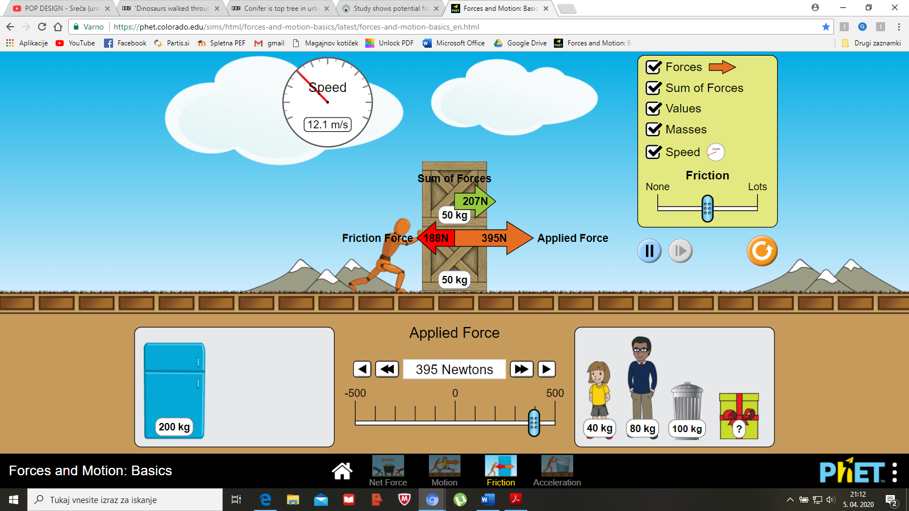

Ime: Manca

Priimek: Pleško

Vpisna številka: 01016312

Smer študija: MA-FI

# Simulacijska programska orodja za ponazarjanje fizikalnih pojavov

8\. razred pri temi Sile obravnava **trenje in upor**. Cilji, ki naj bi
jih dosegli so; da učenci razumejo, da sili trenja in upora zavirata
gibanje, da opišejo silo trenja in upora in da s poskusi raziščejo,
katere količine vplivajo na velikost trenja in upora.

Klasično bi trenje v razredu predstavila z vlečenjem klade s silomerom
po različnih podlagah. Poleg podlage pa bi spreminjala tudi maso klade.
Učenci bi težko opazili, da je vlečenje težjih teles in vlečenje teles
po hrapavi podlagi težje, kot vlečenje lažjih teles ali vlečenje teles
na bolj gladkih podlagah, če ne bodo videli vrednosti vlečne sile na
silomeru. Menim pa, da bi imelo veliko učencev s tem že izkušnje in bi
kljub temu razumeli namen poskusa. Za tiste z manj izkušnjami, ali pa za
tiste, ki slabše opazujejo poskus, pa bi bila simulacija ustrezna, ker
bi lahko s puščicami videli velikost sil na telo.

## 

## Opis simulacijskega orodje

Simulacija je brezplačno dostopna na spletni strani Phet, pod temo
Motion -- Forces and Motion: Basics -- Friction. Simulacija predstavlja
silo trenja. Možiček po podlagi potiska različne predmete: hladilnik,
zaboj, punčko, moškega,... Tako lahko spreminjamo maso telesa in
material iz katerih so. Z drsnikom lahko tudi spreminjamo velikost sile
trenja. Če sila trenja ni prisotna, se tla po katerih možiček potiska
telesa, spremeni v led, z večanjem sile trenja pa na podlagi zraste
vedno več trave. Spreminjamo tudi silo in smer, s katero možiček potiska
telesa. Simulacija nam ponuja možnost prikazovanja smeri in velikosti
sil, ki delujejo na opazovano telo ter rezultanto. Pokaže pa nam lahko
tudi maso posameznega telesa in pa hitrost, s katero se telo giba.

{width="4.752595144356955in"
height="2.7944444444444443in"}

## Prednosti simulacijskega orodja

Simulacija lahko prikaže situacijo, kjer je sila trenja enaka 0, kar v
realnem svetu ni mogoče. Na razpolago imamo tudi telo z neznano maso in
tako lahko na koncu obravnave snovi učitelj z vprašanji preveri učenčevo
razumevanje (ali ima neznano telo večjo/manjšo maso, če potrebujemo
večjo/manjšo silo za potisk po isti podlagi, kot za nek drug predmet).

Učenci s pomočjo simulacije spoznajo, da sila trenja zavira gibanje, saj
se telo po potisku sčasoma ustavi. Ker lahko spreminjamo smer potiskanja
teles, lahko učencem pokažemo, da se s tem spreminja tudi smer sile
trenja. Sila trenja vedno kaže v nasprotni smeri gibanja teles, torej
sila trenja zavira gibanje. Z različnimi prikazi ugotovijo, da je sila
trenja odvisna od mase telesa, od podlage in od materiala teles.

## Slabosti simulacijskega orodja

Simulacija prikazuje silo trenja, tudi če telo miruje. Lahko bi
razlikovali silo lepenja s silo trenja. V tem sklopu bi lahko simulacija
imela še poskuse za silo upora.

S simulacijo ne moremo prikazati kako je s silo trenja na klancu. S tem
se ne morejo naučiti, da na silo trenja vpliva samo pravokotna sila na
podlago in ne celotna sila teže ali masa telesa.
