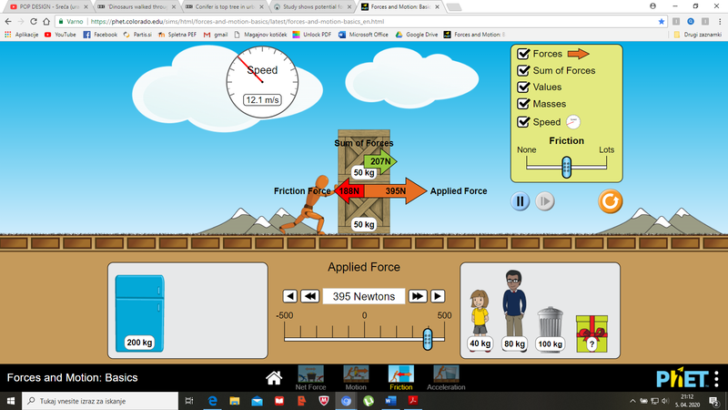

Vpisna številka: 0123456789\
Ime in Priimek: Ime Priimek\
Študijska smer: Fizika - Matematika

# Naslov obravnavane učne vsebine

{width="4.228472222222222in"
height="2.3784722222222223in"}

Na kratko opišite fizikalni pojav in navežite tematiko na osnovnošolski
učni načrt za 8. ali 9. razred. Na kratko opišite uporabo simulacije,
omenite katere fizikalne zakone lahko s simulacijo predstavimo in kako
to storimo. Opredelite tudi ali simulacija omogoča eksperimentiranje,
podatke za izračune in potrjevanje fizikalnih zakonov\...

## Obravnavana učna vsebina

Nakažite kako bi lahko to simulacijo učitelj uporabil v razredu z učenci
(če se vam ne zdi smiselno bodite tudi kritični), katere učne vsebine bi
lahko obravnavali na ta način in katere učne cilje bi usvojili s to
aktivnostjo. Pri učnih ciljih napišite tudi kako bi to lahko storili
(npr.: s spreminjanjem parametra Fg lahko opazimo da se spreminja tudi
Ft).

## Prednosti simulacije

Izpostavite nekaj prednosti (lahko v primerjavi s klasično izvedbo ali
da nudi bolj nazoren prikaz abstraktnih pojavov) -- bodite konkretni.

## Slabosti simulacije

Izpostavite nekaj slabosti simulacije (morda simulacija zanemari preveč
dejavnikov, omogoča napačno sklepanje, je netočna, pomanjkljiva,
nepriročna) -- navedite konkretne primere.

## Vir simulacije

http://www.geogebr.si/geometrijska-optika/odbojni-zakon/
