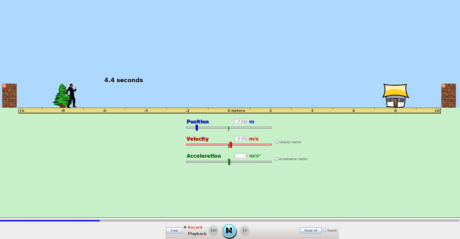

# SIMULACIJE IN ANIMACIJE

Pogosto naletimo na vprašanje o razliki med animacijo in simulacijo. Zato v grobem omenimo nekaj razlik.

## Animacija

+ za ponazoritev gibanja
+ nazornejši prikaz premikanja so-odvisnih elementov (motor z notranjim izgorevanjem)
+ nazornejši prikaz časovno odvisnih elementov (prometne nesreče)
+ prilagojene projekcije za bolj nazoren prikaz

- ne preizkuša ali so premiki fizično možni,
- sama po sebi ne upošteva fizikalnih zakonov (večinoma gre za Newtonove zakone)
- pravilnost animacije povsem odvisna od izdelovalca

<!--
Animacija se pogosto uporablja za samo ponazoritev gibanja. Večkrat jo uporabimo za bolj nazoren prikaz Tako sama po sebi ne 
Animacije običajno uporabljajo tehnike prilegajočega se letenja za vizualno ujemanje gibov vozil. Animacija sama po sebi ne preizkuša, ali so gibi in odzivi fizično možni, kar pomeni, ali spoštujejo Newtonove zakone gibanja ali ne.
-->

### Primeri animacij

## Simulacija

+ Simulacije so matematični modeli, ki upoštevajo fizikalne (mat.) zakonitosti.
+ Lahko so osnova za izdelavo animacije.
+ Omogočajo izkustveno učenje.

- Fizikalni modeli so poenostavljeni, zato pogosto pomanjkljivi.
- Poznati moramo omejitve uporabe simulacije.
- Možna je tudi zloraba animacije (uporaba izven okvirjev).

### Programi in portali z animacijami in simulacijami

- [phet.colorado.edu](https://phet.colorado.edu/)
- [GeoGebra.org](https://www.geogebra.org/)
- [oPhysics](https://ophysics.com/)
- [fizikalne.simulacije.si](https://fizikalne.simulacije.si/)
- [Physics at school](https://www.vascak.cz/)
- [geogebr.si](http://www.geogebr.si/)

- [Stellarium](https://stellarium.org/)
- [Yenka](https://www.yenka.com/)
- [Sketchup + MSPhysics](https://3dwarehouse.sketchup.com/model/u346d8459-c4ca-47fe-841c-fee106f3b3f5/MSPhysics?hl=en)

> ### NALOGA: Kako zaslonka vpliva na osrino slike  
> S programskim orodjem skonstruiraj simulacijo nastanek preslikave z lečo. Simulacija naj nazorno pokaže, kako premer zaslonke vpliva na ostrino slike.

### Primeri simulacij

- [odboj svetlobe - GeoGebr.si ](http://www.geogebr.si/geometrijska-optika/odboj-in-lom-svetlobe/)
- [odboj svetlobe - PhET](https://phet.colorado.edu/sims/html/bending-light/latest/bending-light_en.html)
    - odbiti žarek je enake intenzitete
    - spreminjamo drsnik kota in ne sam izvor žarka
- [zrcalo na Luni](http://www.geogebr.si/geometrijska-optika/odbojni-zakon/)
    - Kako deluje zrcalo na Luni?
    - Kako deluje kresnička?
- [oko in lom svetlobe](https://ophysics.com/l16.html)
    - zelo zanimiva ponazoritev s pravim očesom
    - večji del loma svetlobe se zgori na `roženici`
    - nisem prepričan, da napnemo lečo za izostritev predmetov v daljavi (ali jo z mišicami morda bolj ukrivimo)?

- [statični naboj](https://phet.colorado.edu/sims/html/balloons-and-static-electricity/latest/balloons-and-static-electricity_en.html)
    - zelo dobro ponazori kaj se dogaja z nabojem (konkretno -> abstraktno)
    - elektroni v oblačilu se ne odmaknejo tako kot v zidu

- [Lunine mene](https://www.geogebra.org/m/zzjbrewa)

- [gostota](https://fizikalne.simulacije.si/2016/08/19/gostota/)
- [gostota](https://ophysics.com/fl1.html)

> ### NALOGA: Animacije in Simulacije v poučevanju fizike  
>Poišči po en primer ANIMACIJE ali/in SIMULACIJE, ter ga na kratko ovrednoti:  
>
>- vir simulacije/animacije,
>- vzorčno sliko zaslona (velikost < 200kB),
>- opis tipične uporabe (fizikalni zakoni, podatki, predstavitev podatkov), 
>- naštejte/opišite katero učno snov iz [UN](https://www.gov.si/assets/ministrstva/MIZS/Dokumenti/Osnovna-sola/Ucni-nacrti/obvezni/UN_fizika.pdf) bi lahko obdelali in kako dosegli UC (tema, vsebinski sklop, učni cilji, aktivnost)
>- izpostavi prednosti, 
>- izpostavi slabosti.

# 3D MODELIRANJE IN FEM

## SketchUp in MSPhysics

`SketchUp` je računalniški program za 3D modeliranje s široko paleto risarskih aplikacij, kot so: arhitektura, notranje oblikovanje, krajinska arhitektura, gradbeništvo in strojništvo, oblikovanje filmov in video iger. Na voljo je kot spletna aplikacija [SketchUp Free]( https://my.sketchup.com/) in plačljiva različica z dodatno funkcionalnostjo [SketchUp Pro](https://www.sketchup.com/try-sketchup). Prej je bila na voljo tudi brezplačna različica SketchUp Make, ki omogoča uporabo raznoraznih vtičnikov in uporabnih funkcij. Več o različicah in možnostih tega programa je razloženo na tem [video posnetku](https://www.youtube.com/watch?v=9RKlKXYNqB0).

Potrebno je namestiti:

- ustvarite [Trimble account](https://www.sketchup.com/)
    - kliknite [Sign In](https://login.sketchup.com/login/trimbleid?destination=https://www.sketchup.com/)
    - izpolnite `mail` in `geslo` (**ne uporabite** `Sign In With Google`),
    - aktivirajte account (dobili boste mail)
- namestite [Sketchup Make 2017](https://www.sketchup.com/download/all),
    - presnemite Sketchup Make in zaženite,
- namestite vtičnik `MSPhysics`
    - zaženite program `Sketchup`
    - v menuju izberite `Window` -> `Extension Wearhouse`
    - poiščite `MSPhysics`
    - izberite `MSPhysics` in kliknite `Install`

Uporaba:

- Narišemo površino
- jo združimo kot `Make Group`
- in ji nato določimo `MSPhysics -> Shape -> Static Mesh`

- Narišemo še ostale predmete, ki so lahko so-odvisni...
- določimo jim lahko različne parametre:
    - maso,
    - koeficient trenja,
    - magnetni učinek,
    - material, ...

## FreeCAD in FEM

`FreeCAD` je splošno parametrično 3D CAD programsko orodje za modeliranje, katerega razvoj je popolnoma odprtokoden (licenca LGPL). FreeCAD je usmerjen neposredno v strojništvo in oblikovanje izdelkov, vendar je primeren tudi za širši spekter inženiringa, kot so arhitektura, analiza končnih elementov, 3D tiskanje in druge naloge.

FEM Workbench zagotavlja sodoben potek dela s končnimi elementi (FEA) za FreeCAD. To v glavnem pomeni, da so vsa orodja za analizo združena v en grafični uporabniški vmesnik (GUI).

{#fig:FreeCAD_FEM}

- FreeCAD: FEM (finite element method) konstrukcija nosilca (3D print)

### Klasično reševanje problema

Polico z:

- dimenzijami L=30cm, a=5cm in h=1cm,
- obremenimo z maso 1kg enakomerno po celi ploskvi.

Polico smo izdelali iz materiala PLA z

- modulom elastičnosti

$$ E = 3.64\ MPa $$

- dopustna napetost

$$ \sigma = 14 - 60\ MPa $$

Podatki o različnih materialih so na voljo na [MatWeb](http://www.matweb.com/index.aspx).

Izračun:

- poves:

$$ f = \frac{F L^3}{8EI} $$

- vztrajnostni moment:

$$ I = \frac{a h^3}{12} $$

- odpornostni moment:

$$ W = \frac{a h^2}{6} = \frac{F L}{2 \sigma_b} $$

# KLASIČNO OPAZOVANJE POJAVOV

Oglejmo si video simulacije enakomernega gibanja. Simulacijo smo izbrali zato, da lahko nadzorujemo hitrost, ki jo bomo kasneje lahko primerjali z izmerjeno.

{#fig:walking_man_veloc.png}
Izmerimo vmesne čase oddaljenosti osebe na vsake 2 m in jih uredimo v tabeli.
Za meritev časov lahko uporabite spletno merilno uro [link](https://www.timeanddate.com/stopwatch/).
Ta spletna različica časovnega merilnika omogoča izvoz časov v beležnico in tako enostaven copy-paste v Excel.
Čase lahko pretvorimo v sekunde tako, da celico pomnožimo s 24h*60min*60sec (zaokrožimo na 3 dec)
Poizkus večkrat ponovimo in rezultate vnesemo v tabelo.

## PORAZDELITEV MERITEV

    =MIN(B3:U3)
    =MAX(B3:U3)

Naredimo rang od MIN - MAX in   

    =FREQUENCY(data; rang)

[Normalna porazdelitev podatkov](https://en.wikipedia.org/wiki/Standard_deviation)

## IZRAČUN POVPREČJA

Povprečna vrednost:  
    
    =AVERAGE(B3:U3)

Standardni odklon

    =STDDEV()

## NORMALNA PORAZDELITEV

[Normalna porazdelitev](https://en.wikipedia.org/wiki/Normal_distribution#Standard_deviation_and_coverage)
[Normalna porazdelitev - GEOGEBRA](https://www.geogebra.org/m/AxtegHsz)

Kolikšna je  verjetnost, da se povprečna vrednost nahaja v nekem območju?  

- $±1.00\sigma -> 68.27\%$
- $±1.65\sigma -> 90.11\%$
- $±2.00\sigma -> 95.45\%$

Verjetnost, da se vzorec nahaja v nekem območju X_min -> X_max

## Standardna napaka ocene pov. vrednosti

Standardna napaka aritmetične sredine ($\sigma_M$) je standardni odklon vzorčne porazdelitve aritmetičnih sredin in meri natančnost vzorčne ocene aritmetične sredine. Pove nam v kakšnem razponu se vrednosti aritmetičnih sredin populacije gibljejo, kar lahko trdimo z določenim (običajno 95 %) intervalom zaupanja.

$$ s_E = \frac{s}{\sqrt{n}} $${#eq:mean_standard_error}

Poglejmo simulacijo, kako `$s_E$` vpliva na zapis vrednosti meritve [[link](https://www.geogebra.org/m/caq6wxxj)]

Označimo tudi z oznako SE

    =STDDEV(Range)/SQRT(N)

Da izberemo določen interval, moramo poznati vrednost Z. Le to dobimo s funkcijo:  
<!--
Kako dobimo Z-vrednost v excelu?
-->
    =NORM.SINV(verjetnost)

Kjer "verjetnost" predstavlja verjetnost, da se povprečna vrednost nahaja v intervalu od $-\inf .. z$. To lahko naredimo le ko je naš vzorec tako velik, da ne odstopa preveč od normalne porazdelitve `N < 100`. Pri 
manjših vzorcih pa je razlika lahko že očitna in je potrebno Z-parameter prilagoditi na velikost vzorca [link za izračun Z-parametra](https://www.usablestats.com/calcs/tinv). Ali z enčbo:

    =T.INV.2T(a, df)

kjer je:

- a = verjetnost, da pov. vred. ni v tem območju
- df = N-1

absplutna napaka = z*std.nap.oc.pov.vr.

### Interval zaupanja

    =CONFIDENCE(a,s,N)  

kjer je:

- N = število vzorcev
- s = standardna deviacija
- a = verjetnost, da pov. vred. ni v tem območju.

## Predstavitev podatka

povprečje ± abs.napaka

<!--
Zaokroževanje:
- podatka naj bo zaokrožen na mesto, ki ga podaja abs. napaka:  
    1.23 ± 0.3 nima smisla, saj se spremeni že 2. decimalka  
    pravilno: 1.2 ± 0.3
-->
## Predstavitev razlike med dvema vrednostima

Statistično to predstavljamo z *effect size*. Torej za to vrednost lahko uporabimo statistične veličine kot so:

- $\Phi = \frac{x1 - x2}{\sigma}$
- Cohen's d
- Glass $\Delta$
- t-test

# LINEARIZACIJA 

## NAKLON

    =SLOPE(y, x)

## PROSTI ČLEN

    =INTERCEPT(y, x)

## KORELACIJA

    =COREL()

## Standardna deivacija
je podobna $\sigma$ - kot pri vzorčenju ene vrednosti. Pri linearizaciji pa upoštevamo, da "povprečna" vrednost sledi linearnemu trendu...

    =STEYX(y, x)
Ampak to je std. odklon Y, če bi imeli konstanten X. Na to "razpršenost" lahko vpliva:  
- negotovost X-a
- negotovost k-ja in 
- negotovost n-ja

## STANDARDNA NAPAKA OCENE LINEARNEGA KOEFICIENTA

    =LINEST(y, x, 1, 1)

| k     | n       |
| se_k  | se_n    |
| r²    | st.dev. |
| F     | df      |
| SSdif | SSres   |

## Predstavitev podatka

# ANALIZA VIDEA

## ZAJEM VIDEOPOSNETKA
- Video na bo z enobarvnim ozadjem
- Enako osvetljenost
- Hitrost zaklopa naj bo velika (čas majhen)
- Kamera naj miruje - uporabite stojalo
- Gibanje predmeta naj bo pravokotna na optično os.

## ROČNO VZORČENJE CENTRA MASE

1. Naložimo video (Video -> Import)
    1. Spodaj nastavimo START in STOP ter
    2. nastavimo lastnosti videa:  
        - kliknemo na ikono `Clip Settings` in nastavimo parametre:
        - `Start Frame:` 59
        - `Step size:`5 
        - `End Frame:` 123

3. Nastavimo merilo
    1. kliknemo na ikono `[+-10-+]`: New -> Callibration stick
    2. nato s SHIFT_L_click določimo začetek merila
    3. in SHIFT_L_click določimo konec merila

4. Določimo koordinatni sistem
    1. kliknemo ikono `[ -|-+- ]` in
    2. primemo središče koordinatnega sistema in ga namestimo
    3. koordinatni sistem lahko tudi nagnemo tako da uravnamo x_os (poravnaj z linijo kavča - vodorano)
4. Vrnemo video na "point of interest" z ikono `[<]` spodaj
5. in začnemo vzorčiti tako, da kliknemo:
    1. [ * ] Create -> Point mass
    2. vpišemo maso teniške žogice na 57 g
    2. in klikamo s SHIFT_L_click v center teniške žogice

Tako lahko vzorčimo katerokoli točko na video posnetku...

## ANALIZA MERITEV

Na desni strani se je izrisal graf `x(t)`. To polje nam ponuja nekaj možnosti:

1. `Plot` - koliko grafov želimo hkrati prikazovati
2. `x(m)` - spremenimo fizikalni količino, ki jo želimo prikazovati na y-osi.
3. `t(s)` - spremenimo fiz. kol. na x-osi.
4. `*` - če kliknemo na posamezno točko, se video prilagodi na čas te meritve.
5. `1.45` - desni klik na vrednosti na osi -> `Scale...` - nastavimo območje podatkov
3. če kliknemo na belo polje grafa pa dobimo orodje za analizo:
    1. Analize -> ...
        1. Statistics : x, m, sd, se ...
        2. Curve fits (linearizacija)
        3. furjejeva transf. -> frekvence...
    2. V analizo lahko izberemo poljubne točke (označimo podatke v tabeli ali v grafu)

## AVTOMATIČNO VZORČENJE

1. Ponovi korake 1. - 4. iz ROČNO VZORČENJE
2. Nato kliknemo [*] Create -> Point mass
    1. vendar ne označino predmeta...
    2. klik na [mass A] -> Autotracker...
3. ...beri navodila : to create ... shift-control-click
    1. označimo predmet
        1. template: kaj bo iskal
        2. Match: kaj je našel
        3. išče v pikčaste kvadratu
        4. [o Search]
            1. lahko, da ne najde... glej Autotracker Issue?

### Autotracker
1. Vzorec (krog v katerem se nahajajo primerjalni pixli)
    1. ta krog lahko povečamo (vendar to opočasni obdelavo)
    2. ali premaknemo - bolje je iskati robove predmeta kot same ploskve
    3. vzorec se bo med videom nekoliko spremijal (druga osvetljitev, drugačen kot na kamero) ...  
        te spremembe lahko upoštevamo z EVOLUTION RATE, ki podaja koliko % novega vzorca naj dodamo k prejšnjemu.
2. Iskalno polje (pikčast kvadrat)
    1. autotracker bo preiskal iskalno polje in podal najboljše ujemanje
    2. če se objekt v naslednjem izbranem framu nahaja zunaj tega polja, ne bomo našli...
    3. za vsak frame se izračuna "mach score" in privzame rezultat z največjim tem rezultatom.
        mejo tega rezultata lahko nastavimo v parametru Automark
3. Tarča: naj bo v težišču

### Autotracker issue

Če Autotracker ne najde ustreznega rezultata, imamo nekaj moćnosti:

1. Potrdimo oredlagano rešitev
2. Povečamo iskalno polje
3. SHIFT_L_click in označimo ustrezno mesto
4. SHIFT_CONTROL_L_click in označimo nov vzorec
<!-- 
- za Thinkercad ni pravilnih  linkov do bašega projekta, link naj bo v stilu:
- https://www.tinkercad.com/things/jurjOWP4751-ardlcdp/editel?sharecode=lrPmEVxD_1P7KHpNwPwGfMgYuxhIGeg5EwdVifrFQP0

tisto vmes izbrišite... 
- fizikalne enote
-->

## POŠEVNI MET 

1. nalogžimo videl posevni_met.mp4
2. video omejimo na 60. in 122. frane ; obdelamo 1x frame (vsak)
3. dodaj merilo - calibration stick = 1.0m
4. add coordinate axes (središče v težišču žogice)
5. Create Point mass A
6. Autotrack...(potrebno nastaviti na kavču...)
7. Analiza:
    - m: 58g
    - v_x = -0.007 * t + 1.962 m/s (iz grafa x(t), če ni a=0 poravnaj koordinatni sistem)
    - v_y = A*t+ v0
        - A = -9.807 m/s²
        - A_se = ± 0.032 m/s²
        - Z_59 = 2.001
        - v0 = 4.7 m/s
    - g = 9.81 ± 0.06 m/s²

## OBLIKOVANJE FIZIKALNEGA MODELA (izračun x in y)

### Klasično preračunavanje pozicije x in y

Poševni met razdelimo na dva dela:

1. Enakomerno gibanje v `x smeri` in
2. Pospešeno gibanje v `y smeri`.

Pri analizi poševnega meta teniške žogice smo izmerili naslednje veličine:

- m: 58g
- v_x: 1.962 m/s
- v_y: 4.701 m/s
- g: 9.81 m/s²

Ustvarjanje fizikalnega modela naredimo z naslednjimi koraki:
  
1. [*] Create -> Kinematic model (in vpišemo parametre - konstante)

    PARAMETERS (-> Add):
    - v_x: 1.962 m/s
    - v_y: 4.801 m/s
    - g : 9.84m/s²

2. Opis gibanja z enačbami:

- x = vx0 * t + x0
- $y = \frac{1}{2}\ 9.81\ \frac{m}{s^2} * t^2 + vy0 * t + y0$

### OBLIKOVANJE DINAMIČNEGA FIZIKALNEGA MODELA (izračun sil)

Create -> Dinamic —> Cartezian

- m: 0.058kg
- g: -9.84m/s²

- t: 0 s
- x: 0 m
- y; 0 m
- v_x: 1.925 m/s
- v_y: 4.75 m/s

- Fx = 0
- Fy = m*g

> ### NALOGA: ANALIZA IN OBLIKOVANJE FIZ. MODELA
> Oddajte "tracker" datoteko v kateri boste naredili:
> 1. Analizo poševnega meta teniške žogice.
> 2. Oblikovali fizikalni model težišča za katerega izračunate x in y.
> 3. Oblikovali dinamični fizikalni model za težišče na katerega delujetea Fx in Fy.

# ANALIZA ZVOKA
## Analiza periodičnih signalov
## Ton, Zven, Šum, ...
## Jakost in enota dB
## Sinus in FFT
## Pravokotni signal in FFT

$$ x(t)=\frac{4}{\pi}(\sin(\omega t)+\frac{1}{3}\sin(3\omega t)+\frac{1}{5}\sin(5\omega t)+ ...) $${#eq:pravokotni_signa}

Za vse meritve 

vmesni časi
preglednica
vsi v isto
lin reg

zamujajo  ali prehit

# Statistična obdelava podatkov s tabelaričnimi orodji

# Video analiza

# Semarska 
oddaja 
kaj bi bil cilj
s čim 
kaj bo racalo
- potrdim
- delate

naloga 
trakcem ali telefon

# Avtorska pola:
ávtorska pôla ž, enota osebnega avtorskega dela in podlaga za obračun honorarja, obsega 30.000 znakov (črk, številk, ločil, presledkov) ali približno 16 tipkanih strani. Ena tipkana stran je približno 1875, ena tipkana vrstica pa 62 do 63 znakov. Avtorska pola izhaja iz tiskovne pole, odtisnjene nerazrezane in nepreganjene pole papirja, ki predstavlja 8 listov ali 16 strani v knjigi.

To definicijo priznava tudi Avtorska agencija za Slovenijo, drugače pa je z Društvom znanstvenih in tehniških prevajalcev Slovenije, ki izhaja iz »obračunske strani čistopisa izvirnika«; ta ima samo 1500 znakov, a brez presledkov.

# ANALIZA ZVOKA

## TON

File: Ton 440 Hz
Select -> Analize -> Plot spectrum

## "BARVA" GLASBILA

file : tone_flute 513Hz

- pri osnovni frekvenci se vzbudijjo tudi višji harmoniki...
- ki so večkratniki osnovne frekvence n= 1, 2,3,4,5... 
- frekvence višjih harmonikov sovpadajo s DUR akordom

## PRAVOKOTNI SIGNAL

file: dubstep_sub_bass_line.wav

- kadar opazimo, da frekvenčna analiza podaja le lihe večkratnike 1, 3, 5, 7, 9 osnovne frekvence gre za produciranje pravokotnega sigala...

## UTRIPANJE

- Pogosto pri zvonih
- Težava je ker, tega pojava iz frekvenčne analize ne ugotovimo, ampak vidimo neposredno iz p(t).
- f_utripanja = f_1 - f_2

file: bell.waw

## POK

- pok je kratka impulzivna sprememba tlaka,
- vsebuje "vse" frekvence, zato ga s fgtekvenčno analizo ne moremo zaznati...

- uporabimo: Metronom_92bpm.wav

## V-TWIN

https://www.cyclechaos.com/wiki/V-twin

V 4 taktnem bencinskem motorji se zaporedoma izvajajo 4-je procesi (takti): 1 - vsesavanje goriva, 2- kompresija goriva, 3- vžig in delovni takt,  4 - izpuh. Gred motorja se v tem procesu zavrti za 2 vrtljaja in se nato ta proces prične ponavljati. V vsakem tem procesu se gorivo vžge in s tem povzroči malo eksplozijo, kar je močno slišati pri delovanju motorja. Če ima motor dva valja tako slišimo dve taki eksploziji v enem takem ciklu. Časovni intervali med temi eksplozijami pa določajo "barvo" zvoka, ki ga oddaja posamezni motor. Zato so različno konstruirani motorji slišati različno.

Za naslednje zvočne zapise delovanja motorjev:
- BMW_r18.wav (180)
- Ducati_Panigale.wav (90)
- Harley_Davidson_Dyna.wav (60)
- Triumph_Street_Twin.wav (0, wtf?)

Izmerite:
- čas enega cikla (t0) (t.j. čas ko se delovanje motorja prične ponavljati) delovanja motorja. 
- čas med vžigoma (dt) goriva v istem ciklu delovanja motorja, nato opredelite ali ima motor valje razporejene v isti vrsti ali sta valja razporejena pod nekim kotom.

Za tiste, ki vas to področje bolj zanima:
- Iz t0 izračunajte kako hitro se vrti gred motorja (koliko vrtljajev v min naredi)
- Iz dt in t0 lahko izračunate pod kakšnim kotom sta nameščena valja v motorju.
- Triumph_Street_Twin ima sicer valja v isti vrsti, vendar so se konstruktorji potrudili in zamaknili gred ter vžig goriva.

Kolikšen je kot cilindrov pri:
- 2012 Ducati Panigale (90)
- Harley Davidson Dyna (60)
- BMW_r18 (180)

# Literatura
