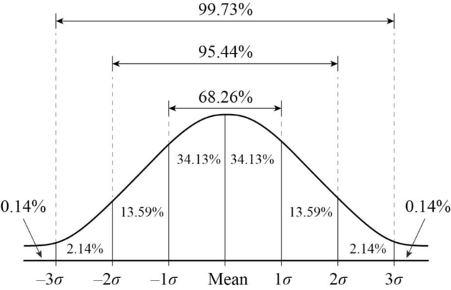

# SEMINARSKA NALOGA

Pripravite izvedite in predstavite seminar iz področja uporabe računalnika v namen izobraževanja fizike v osnovni šoli. Tema seminarja je lahko v sklopu:

- uporabe simulacijskih programskih orodij (predstavitev, uporaba, prednosti, slabosti),
- uporaba "pametnih naprav" za merjenje fizikalnih pojavov,
- uporaba programov za video analiza gibanja,
- uporaba programov za zvočno analizo kot pripomoček v fiziki valovanj,
- drugo (posvetovanje z mentorjem).

## PREDSTAVITEV SEMINARJA

Seminar predstavite s predstavitvenim gradivom (PowerPoint prezentacija ali podobno). Predstavitveno gradivo naj vsebuje:  

1. UVOD  
    kratko, jedrnato, privlačno, opis problema, namen, cilji, metode dela
2. TEORETIČNI DEL  
    fizikalni zakoni, učni načrt
3. PRAKTIČNI DEL  
    opis izvedbe eksperimenta, reševanje problema, merjenje, analiza, rezultati
4. ZAKLJUČEK  
    povzetek rezultatov, pridobljena lastna spoznanja, nerešena vprašanja, smernice za nadaljnje delo
5. VIRI IN LITERATURA  
    zbirka literature

Boljše opredelitev strukture predstavitve semninarske naloge sledi v naslednjih poglavjih.

### UVOD

Uvod mora biti kratek, strnjen in jasen, pa tudi privlačen za bralca. V uvodnem delu seminarske naloge se določi naslednje:

#### OPREDELITEV PODROČJA IN OPIS PROBLEMA

Opišite področje svojega preizkušanja in problem, ki ga nameravate raziskati. Pojasnite dimenzijo problema in pomen njegovega reševanja. Predstavite torej problematiko naloge. Problem mora biti tak, da ga rešite na svoj, izviren način. Problem naj bo tak, da imate na razpolago dovolj literature in naj ne presega vašega znanja.

#### NAMEN, CILJI IN HIPOTEZE NALOGE

**NAMEN:**  
Pri namenu naloge navedete, kaj je namen vaše naloge, katere konkretne cilje želite s z njo doseči. Vsebina in vrsta seminarskega dela je povezana s strokovnimi predmeti.

Odgovorite na vprašanje, zakaj analizirate izbrano temo. Nameni so lahko različni:  

- problema še ni nihče analiziral,
- klasični postopki niso učinkoviti,
- zadnja analiza problema je bila opravljena že pred leti,
- ne strinjate se z ugotovitvami določenih avtorjev ali ustaljeno prakso,
- analiza problema zanima določeno podjetje ali institucijo in podobno.

**CILJI:**  
Cilj proučevanja raziskave je tisto, kar bi radi z njo dosegli. Cilj je neločljivo povezan s problemom proučevanja, ki predstavlja razliko med trenutnim in želenim stanjem. Cilj lahko uvidimo z naslednjim vprašanjem: Kaj imamo od tega, da razrešimo problem?

Ustrezna raziskovalna vprašanja tako sprožijo usmerjeno proučevanje, ki išče odgovore nanje, da bi tako razrešili problem in dosegli želeni cilj. Možne odgovore na raziskovalna vprašanja lahko izrazimo kot nekakšne domneve (hipoteze), ki nas vodijo k proučevanju. Navedite, katere cilje (ugotovitve) želite s svojo raziskavo doseči. Ciljev pisnega dela je lahko več. Osnovni cilj naloge se mora navezovati na raziskovalni problem.

Natančno morate vedeti, kaj boste raziskovali in katere cilje naj bi s tem dosegli. Cilje postavite tako, da boste ob zaključku naloge  s primerjavo doseženega in načrtovanega ocenili svojo uspešnost.

**HIPOTEZE\*:**  
Hipoteze ali trditve so vnaprej postavljene teze, ki jih skušate dokazati/pokazati v svoji nalogi. Hipoteze izhajajo iz ciljev. Hipoteze niso obvezni del seminarske naloge. Koliko hipotez boste zastavili v seminarskem delu, je odvisno od raziskovalnega problema. Hipoteza je lahko ena, lahko pa jih je več. Več jih je predvsem takrat, če je raziskovalni problem, ki ste si ga zastavili, kompleksen. Zastavljene hipoteze naj ustrezajo naslednjim kriterijem:

- vsaka hipoteza naj bo logična,
- vsaka hipoteza se naj nanaša na problem, ki ga raziskujete,
- vsaka hipoteza naj bo opredeljena tako, da se da preveriti,
- vsaka hipoteza naj bo usklajena z drugimi hipotezami, ki jih  preverjate.

#### PREDVIDENE METODE

Predvidene metode dela opišite strukturirano in naj si kronološko sledijo. Poslušalec naj v tem delu seminarske naloge dobi dober vpogled v celoten proces dela. Pri opisovanju procesa ne pozabite na uporabljena orodja in pripomočke vendar še ne podajate rezultatov.

### TEORETIČNI DEL

V njem predstavite najpomembnejša teoretična izhodišča. Dokazujete poznavanje strokovne literature na izbranem področju in jo tudi citirajte (Kocijancic, 2018). Predstaviti morate vse informacije, za katere predvidevate, da so potrebne za razumevanje naloge. Po potrebi znane zakonitosti predstavite z enačbo:

$$ F = m a $$

Predstavite tudi kako je to teoretično področje vključeno v učni načrt za osnovnošolsko raven in zakaj je to znanje pomembno.

Teoretični del ne sme biti obširnejši od praktičnega dela. Samostojno morate presoditi objektivnost tujih mnenj in stališč. Teoretični in praktični del morata biti povezana. Teorijo je potrebno aplikativno uporabiti, predstaviti v praksi.

#### PREGLED OBSTOJEČEGA STANJA*

To podpoglavje je le primer kako razčleniti sam teoretični del na več manjših zaključenih sklopov. Lahko pa bi ga tudi razčlenili po posameznik ciljih ali hipotezah in v vsakem podpoglavju opisali teoretične temelje vsakega cilja.

### PRAKTIČNI\*/EMPIRIČNI\*/ANALITIČNI\* DEL

Praktični/empirični/analitični del naloge je najpomembnejši del dela. V njem predstavite in obdelate temo. Postopno rešujete problem in sledite zastavljenim ciljem. Proces dela razdelite v podpoglavja in sledite opisu metode dela.

#### PODAJANJE MERITEV IN REZULTATOV*

Če meritev ni preveč, jih lahko podate v tabeli v sami predstavitvi seminarske naloge. Če pa je le teh preveč, te meritve vsekakor uredite v tabelo in jo dodajte med priloge.

| N | t [s] | x [m] |
|:-:|:-----:|-------|
| 1 |  0,0  | 0,0   |
| 2 |  0,1  | 1,2   |
| 3 |  0,2  | 2,3   |

Table: Meritve prostega gibanja.

Rezultate podajajte nazorno. Namesto številčnih vrednosti raje podajte rezultate v grafični obliki, kot je to prikazano na naslednji sliki.

### DISKUSIJA*

V diskusiji:  

- ugotovite, ali so doseženi zastavljeni cilji,
- potrdite ali ovržete zastavljene hipoteze,
- povzamete ključne predloge oziroma ključne ugotovitve raziskave.

Razlika med diskusijo in zaključkom je v tem, da v zaključku podamo strnjene ugotovitve v diskusiji.

### ZAKLJUČEK

Zaključek ali sklep je obvezen del seminarskega dela. Zaključek je povzetek ali sinteza teoretičnega in praktičnega dela naloge ter diskusije. Vsebuje novo pridobljena lastna spoznanja in sklepne misli. Opozorite na nerešena vprašanja in nakažete smeri nadaljnjega reševanja problema.

Predlagate rešitve, ukrepe in aktivnosti za uporabo v praksi, torej podate svojo vizijo razvoja. V zaključku ne ponavljate vsebine iz teoretičnega  dela naloge in  ne navajate novih podatkov in dokazov. Sklep ali zaključek je AVTORSKI.

### VIRI IN LITERATURA 

Literatura so knjige, članki in ostali javno objavljeni pisni sestavki, ki jih je študent dejansko uporabil pri svojem delu. Literaturo navajate po prvem APA-6 standardum to je po abecednem vrstnem redu avtorjev. Pri navajanju spletnih strani vedno podajte naslov spletne strani, njen URL. V literaturi je navajate le tisto literaturo, na katero se sklicujete v oklepajih.

### PRILOGE*

To poglavje vključite po potrebi, če menite, da bi bralca utegnilo zanimati tudi bolj podroben ogled grafov, podatkov ali slik. Na vse te elemente se morate sklicevati v glavnem besedilu dela.

# KRITERIJI ZA SEMINARSKO NALOGO

Kriteriji (najmanjši enota je 5 točk):

- - - - - - -

- Struktura predstavitve [10] :
- Problem, namen, cilji  [10] :
- Točen opis metode dela [20] :
- Teorija in učni načrt  [20] :
- Izvedba eksperimenta   [20] :
- Meritve in rezultati   [10] :
- Odgovori na vprašanja  [10] :

- - - - - - - -

Ocena:  
Komentar:

- - - - - - - -
