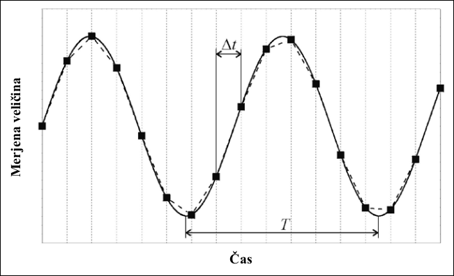

# Teoretične osnove

## Frekvenca vzorčenja

Pri vzorčenju signalov je zelo pomembna frekvenca vzorčenja $f_{vz}$. Upoštevati moramo Nyqistovo načela vzorčenja, ki pravi, da je potrebno periodične signale vzorčiti vsaj z 2x večjo frekvenco vzorčenja kot je frekvenca signala $f_{sig}$ [@Nyquist_1928], kot to predstavlja slika [@fig:vzorcenje_sin_sig.png].
$$f_{vz} = 2 f_{sig}$${#eq:nyquist}
V nasprotnem primeru laho dobimo nepravilno reprodukcijo merjenega signala (črtkana krivulja), kot to prikazuje slika [@fig:podvzorcenje.png].

{#fig:vzorcenje_sin_sig.png width=10cm}

{#fig:podvzorcenje.png width=10cm}


## Digitalizacija

Merilni sistemi so opremljeni s t.i. analogno-digitalnimi pretvorniki (ang.: Analog-to-digital converter - ADC), ki pretvarjajo merjeno napetost v neko številsko vrednost. Zelo pogost primer je, ko zvezno napetostno območje od $0,0 V - 5,0 V$ pretvorimo v številske vrednosti od 0 - 1024. Pri tej pretvorbi ključno vlogo prevzame ADC in njegova **resolucija**. Grafični prikaz take transformacije je prikazan na sliki [@fig:ADC_voltage_resolution.svg].

![Prenosna funkcija ADC pretvorbe [@ADCwiki_2019].](./slike/ADC_voltage_resolution.svg){#fig:ADC_voltage_resolution.svg width=10cm}

## Resolucija in ločljivost

Resolucija AD pretvornikov je določena s številom vseh možnih stanj pretvorbe $N$. Ker so AD pretvorniki napreave prirejene digitalnim tehnologijam, se njihovi podatki izražajo v dvojiški obliki (binarno). Tako naprimer AD pretvornik z 10-bitno pretvorbo lahko prikaže:

$$N=2^B$${#eq:binarna_pretvorba}

možnih stanj.

**Ločljivost** pa je najmanjša razlika med sosednjima digitaliziranima vrednostima merjene količine. Ta vrednost je odvisna tako od števila možnih stanj $N$, kakor tudi od območja, ki ga pretvarjamo. Zato bi lahko enačbo [@eq:locljivost] zapisali:

$$Locljivost = \frac{Obmocje}{N}$${#eq:locljivost}

> ### NALOGA: Izračun frekvence, resolucije in ločljivosti AD pretvorbe  
> Glede na prejšnje podatke o mikrokrmilniku Atmega328 poiščite podatek o najvišji frekvenci vzorčenja $f_{vz}$ analognih signalov in izračunajte najmanjši čas $\Delta t$ med dvema vzorčenjema.
> \
> \
> \
> \
> \
> Izračunajte s kolikšno resolucijo lahko odčitavamo analogne signale z mikrokrmilnikom Atmega328.
>\
>\
>\
>\

> Izračunajte kolikšna je ločljivost mikrokrmilnika Atmega328 pri odčitavanju analognih signalov.
>\
>\
>\
>\

## Točnost in natančnost

**Točnost** (v različnih virih je poimenovana različno, ang.: validity) je lastnost merilnega sistema, ki predstavlja ustreznost prestavljene meritve glede na njeno realno merjeno vrednost. Navadno jo izražamo kot relativno napako $\epsilon$ v procentualni obliki ([@eq:relativna_napaka]):

$$\epsilon = \frac{( \mu - \bar{x})}{\mu}$$ {#eq:relativna_napaka} 

Kjer je $\mu$ realna merjena vrednost (to je parameter) in $\bar{x}$ povprečna izmerjena vrednost.

Lahko pa točnost izrazimo tudi v absolutni obliki ([@eq:abs_napaka]):

$$ e = \mu - \bar{x} $${#eq:abs_napaka}

kjer je $\bar{x}$ povprečna vrednost meritev in je tako statistično izmerjena količina (ni parameter).

**Natančnost** oz. Preciznost (zopet v različnih literaturah poimenovana različno, ang.: reliability) je sposobnost merilnega sistema reprodukcije iste merjene (referenčne) vrednosti z enakimi izmerjenimi vrednostmi. V mnogih primerih se izkaže, da gre v tem primeru za naključno napako merjenja in to vrednost lahko ponazarjamo s standardnim odklonom merilnega postopka ([@eq:sample_std_dev]). V nekaterih primerih to vrednost podajamo tudi z intervalom zaupanja, pri katerem podamo tudi verjetnost meritve ([@eq:std_err]).

V splošnem bi lahko točnost in natančnost predstavili z grafom na sliki [@fig:Accuracy_and_precision_sl.svg][@Tocnost_wiki_2019].

{#fig:Accuracy_and_precision_sl.svg width=10cm}

## Normalna porazdelitev

Kadar imamo v merilnem sistemu opravka z naključnimi napakami, meritve lahko predstavimo s krivuljo normalne porazdelitve - v splošenm imenovnane Gaussova porazdelitev. Zapišemo jo v obliki [@eq:gauss].

$$f(x)=\frac{1}{\sqrt{2 \pi \sigma ^2}}e^{-\frac{(x-\bar{x})^2}{2\sigma ^2}}$${#eq:gauss}

Kjer je $\mu$ povprečna vrednost populacije in $\sigma$ standardni odklon populacije. Nekaj različnih krivulj lahko vidimo na sliki [@fig:Normal_Distribution_PDF.svg] [@Normal_distribution_wiki_2019].

{#fig:Normal_Distribution_PDF.svg width=10cm}

Koeficienta o sploščenosti in premaknjenosti normalne porazdelitve lahko izračunamo tudi z različnimi računalniškimi programi za obdelavo razpredelnic, kot sta na primer Microsoft Excel ali LibreOffice Calc.

**Sploščenost**

Pričakovan koeficient sploščenosti je okoli $0$. Če je vrednost izven območja $-2<k<+2$ privzamemo, da porazdelitev ni normalno sploščena.

```
=KURT(Range)
```
**Premaknjenost**

Pričakovana vrednost premaknjenosti je okoli $0$. Če je vrednost $>0.5$ govorimo o pozitivni premaknjenosti in je porazdelitev vzorca nagnjena v levo (in obratno).

```
=SKEW(Range)
```

**Povprečna vrednost populacije ([@eq:population_avg]) in vzorca ([@eq:sample_avg]) **

$$\mu = \frac{\sum^N_{i=1} x_i}{N}$${#eq:population_avg}

$$\bar{x} = \frac{\sum^N_{i=1} x_i}{n}$${#eq:sample_avg}

```
=AVERAGE(Range)
```

**Standardni odklon populacije ([@eq:population_std_dev]) in vzorca ([@eq:sample_std_dev]) **

$$\sigma = \sqrt{\frac{\sum^{N}_{i=1}(x_i-\bar{x})^2}{N-1}}$${#eq:population_std_dev}

$$ s = \sqrt{\frac{\sum^{n}_{i=1}(x_i-\bar{x})^2}{n-1}}$${#eq:sample_std_dev}

```
=STDEV(Range)
```

** .**

## Ocenjevanje nepoznanega parametra $\mu$

Iz grafa normalne porazdelitve, ki je prikazan na [@fig:Standard_deviation_diagram_micro], so razvidni deleži vsebovanih meritev v določenih območjih standardnih odkonov ($1\sigma, 2\sigma$ in $3\sigma$) za celotno populacijo.

{#fig:Standard_deviation_diagram_micro}

Na primer izkaže se, da je v območju $\mu \pm 1\sigma$ kar 68% vseh meritev, v območju $\mu \pm 2\sigma$ jih je 95% in v območju $\mu \pm 3\sigma$ celo 99,7%.

Zato te iste verjetnosti veljajo tudi pri vzorčenju manjših vzorcev. Tako s **standardno napako ocene povprečne vrednosti ($s_{\bar{x}}$)** naših meritev lahko ocenimo interval ($\bar{x}\pm \alpha s_{\bar{x}}$) v katerem se dejanski parameter $\mu$ nahaja z neko verjetnostjo. Standardno napako ocene povprečne vrednosti lahko izračunamo po [@eq:std_err]:

$$ s_{\bar{x}} = \frac{\sigma}{\sqrt{n}} \sqrt{\frac{N-n}{N-1}}, $${#eq:std_err}

```
STDEV(A2:A6)/SQRT(COUNT(A2:A6))
```

kjer je sicer $\sigma$ standardni odklon celotne populacije, ki ga pogosto ne poznamo in ga zato nadomestimo s standardnim odklonom vzorca $s$ ([@eq:sample_std_dev]). Korekturni faktor $\sqrt{\frac{N-n}{N-1}}$ uporabljamo le, če poznamo $N$ celotne populacije in pri izredno velikih vzorcih ($n > \frac{N}{100}$).

Tako območje $\bar{x}\pm \alpha s_{\bar{x}}$ imenujemo območje zaupanja. Najpogosteje se v praksi uporablja območje zaupanja s koef. $\alpha = 1,96$, s katerim pričakujemo 95,00% gotovost, da naša izmerjena povprečna vrednost $\bar{x}$ ustreza dejanskemu parametru $\mu$.

```
=CONFIDENCE(Signif., Std.Dev., Sample Size)
```
