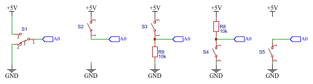

# Uporaba digitalnih vhodov

Za digitalne spremembe kot so naprimer: pritisk na tipko, prehod predmeta mimo svetlobnih vrat... najpogosteje uporabljamo digitalne vhodne priključke krmilnika. Le-te lahko najdemo na priključkih **D0..D13** in tudi na **A0..A7**. Primer enostavne vezave tipke na krmilnik prikazuje slika [@fig:SW_uK6.png].

## Različne možnosti vezave tipke

{#fig:SW_uK6.png height=7cm}


```cpp
const int TIPKA = A0;
const int LED = 13;

const int tipka_je_pritisnjena = 1; // vrednost ob pritisku

void loop(){
    bool stanje_tipke = digitalRead(TIPKA);
    if (stanje_tipke == tipka_je_pritisnjena)
        digitalWrite(LED, HIGH);
    else
        digitalWrite(LED, LOW);
}
void setup(){
    pinMode(TIPKA, INPUT);
    pinMode(LED, OUTPUT);
}
```
: Preverjanje stanja tipke (digitalnega vhoda). {#lst:digital_read}

> ### NALOGA: Zaznavanje digitalnih vrednosti
>
> 1. Preskusite delovaje vseh vezav tipke, ki so prikazani na shemi in komentirajte (ne-)delovanje.
> 2. Napišite program s katerim boste lahko zaznali spremembo digitalnega vhoda (pomagajte si s funkcijo, ki jo prikazuje [@lst:dig_chg]).

```cpp
void waitForInputChange(int INPUT_PIN){
    bool zacetno_stanje = digitalRead(INPUT_PIN);
    bool trenutno_stanje = zacetno_stanje;
    while (trenutno_stanje == zacetno_stanje)
        trenutno_stanje = digitalRead(INPUT_PIN);
}
```
: Primer funkcije za zaznavanja spremembe na digitalnem vhodu. {#lst:dig_chg}
