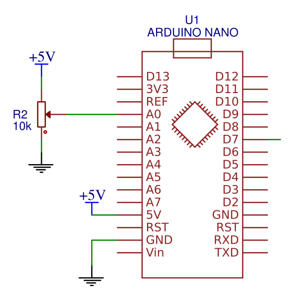

# Merjenje napetostnih potencialov

Krmilnik Atmega328 ima vgrajen AD pretvornik, s katerim lahko odčitavamo analogne napetostne potenciale v območju $U_{ADC} = [0..5]V$.

## Priključki za analogno odčitavanje napetostnih potencialov

Analogne napetostne potenciale lahko odčitavamo na priključkih krmilnika, ki so označeni z **A0..A7**. Zato moramo senzorje priključiti tako kot prikazuje slika [@fig:POT_uK.png].

{#fig:POT_uK.png height=7cm}

> ### NALOGA: Merjenje napetostnega potenciala  
> Zvežite vezje po shemi na sliki [@fig:POT_uK.png] in sprogramirajte krmilnik tako, da boste na ekran računalnika izpisovali izmerjene vrednosti.\
> Napišite v kakšnem intervalu so bile izmerjene vrednosti:\
> ADC = [_____,_____]_.

## Analogno-digitalni pretvornik

```cpp
const int POTENCIOMETER = 0;
void setup() {
    Serial.begin(9600);
}

void loop() {
    int adc_value = analogRead(POTENCIOMETER);
    Serial.println(adc_value);
    delay(100);
}
```
: Odčitavanje napetostnih potencialov z analogno-digitalnim pretvornikom. {#lst:adc_function}

## Izračun napetosti

> ### NALOGA: Preračun ADC vrednosti v napetost  
> Napišite program za merjenje napetosti z ADC vmesnikom. V spodnji prostor pa vpišite le programske vrstice, ki ste jih uporabili za izračun napetosti.
>\
>\
>\

## Normalna porazdelitev meritev

> ### NALOGA: Koeficienti normalne porazdelitve  
> Z Arduino krmilnikom izmerite 100 meritev neke poljubne napetosti. Nato te meritve preverite še z volt-metrom, kar naj predstavlja vašo referenčno vrednost. Meritve vnesite v program za delo s tabelami in z ustreznimi funkcijami izračunajte, rezultat pa vpišite na črte:
>
> - izmerjena referenčna vrednost: ______________________________________________,
> - povprečno vrednost meritev : ________________________________________________,
> - točnost predstavite z absolutno napako  :_____________________________________,
> - preciznost meritev pa podajte s standardno napako  
>   ocene povprečne vrednosti za 95% verjetnost :__________________________.

```cpp
const int POTENCIOMETER = 0;
void get_100_Samples();

void setup() {
  Serial.begin(9600);
  get_100_Samples();
}

void loop() {
}

void get_100_Samples(){
  for (int i = 0; i < 100; i++){
    int adc_value = analogRead(POTENCIOMETER);
    float voltage = (float)adc_value * 5 / 1023;
    Serial.println(voltage, 4);
    delay(10);
  }
}
```
: Izračun napetosti. {#lst:voltage_calc}
