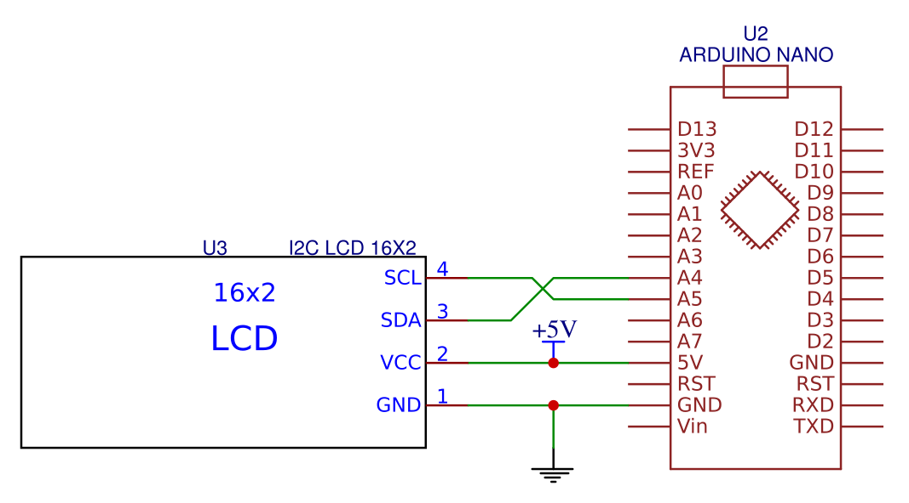

# Izpis podatkov

Prikazovanje podatkov je ena od ključnih nalog vseh merilnih sistemov. To pahko naredimo na različne načine:

1. v obliki tabele na zaslon računalnika,
2. v grafični obliki,
3. na zaslon samostojne merilne naprave ...

## Serijski izpis

Spodnji primer programske kode prikazuje kako lahko z Arduino krmilniki izpisujemo osnovne podatke neke meritve. Izpisovali bomo dva podatka v ločena stolpca. Stolpca bosta ločena s tabulatorjem, kar predstavlja označba **\\t**. V prvem stolpcu bomo izpisovali trenutni čas ( **millis();** ), v drugega pa vrednost analogne pretvorbe (**analogRead(0);**).

```cpp
void setup() {
  Serial.begin(9600);
  Serial.println("t[ms]\tADC");
}

void loop() {
  Serial.print(millis());
  Serial.print("\t");
  Serial.println(analogRead(0));
  delay(100);
}
```
: Serijski izpis podatkov. {#lst:serial_out}

## Grafični izris
Zelo nazorno je spremljati izris podatkov v grafičnem načinu. Do neke mere nam to funkcijo ponuja programsko okolje Arduino IDE, vendar v zelo okenjeni obliki. Preskusite naslednji program:

```cpp
void setup() {
  Serial.begin(9600);
}
void loop() {
  Serial.print("0,1023,");
  Serial.println(analogRead(A0));
  delay(10);
}
```
: Izrisovanje vrednosti s serijskim grafikonom. {#lst:serial_out}

Kot lahko opazimo računalniku pošiljamo 3 različne števila: 0, 1023 in ADC vrednost. Prvi dve nam slušita kot območje, saj bi v nasprotnem primeru program sam prilagajal skalo na y osi (ang.: autofit).

## Izpis na LCD
Če želimo narediti merilno napravo, ki bo delovala samostojno, bomo verjetno potrebovali dodaten ekran za prikaz izmerjenih vrednosti. Zato ga moramo priključiti na krmilnik Arduino, kot kaže slika [@fig:LCD_vezava.png].

{#fig:LCD_vezava.png height=7cm}

Ena naj enostavnejših rešitev je, da krmilniku Arduino UNO dodamo LCD ekranček z I²C vodilom. Ker je I²C vodilo zasnovano tako, da nanj lahko priključimo več naprav, moramo za vsako napravo poznati njen naslov. Le tega lahko pridobimo od proizvajalca naprave, ga nastavimo sami ali pa z ustreznim programom pregledamo vse naslove priključenih naprav ([programska koda](https://playground.arduino.cc/Main/I2cScanner/)[@ArduinoI2Cscanner]).
Za uporabo LCDja na podatkovnem vodilu I²C bomo potrebovali knjižnico **LiquidCrystal_I2C**, ki si jo lahko presnamete s spletne strani [Francisco Malpartida](https://bitbucket.org/fmalpartida/new-liquidcrystal/downloads/NewliquidCrystal_1.3.4.zip).

```cpp
#include <Wire.h>
#include <LiquidCrystal_I2C.h>
LiquidCrystal_I2C DaqLcd(0x27, 2, 1, 0, 4, 5, 6, 7, 3, POSITIVE); 

void setup() {
  DaqLcd.begin(8, 2);
}

void loop() {
  int i = 0;
  long ch = 0;
  for (i=0;i<64;i++){
    ch += analogRead(7); 
  }
 
  float val = ch/64.0;
  DaqLcd.clear();
  DaqLcd.print(val);
}
```
: Izpis podatkov na LCD prikazovalnik. {#lst:serial_out}

> ### NALOGA: Izpis podatkov  
> Prikažite podatke na različne načine:\
> 1. v obliki tabele,\
> 2. v grafični obliki in\
> 3. na LCD zaslon merilne naprave.
