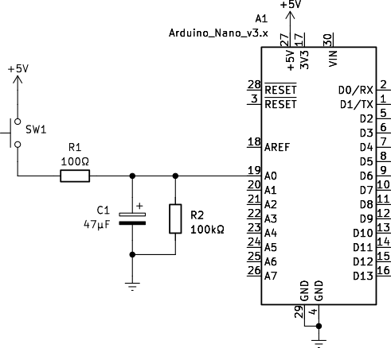

# Linearizacija meritev (praznenje kondenzatorja)

Linearizacija je postopek, ki se uporablja za preoblikovanje ne-linearnega sistema v linearno obliko. To je uporabno za merjenje in analizo signalov, saj je lažje zaznati in napovedati linearne modele kot ne-linearne. Linearizacija omogoča uporabnikom, da preprosto in natančno določijo vrednosti signalov in njihovih karakterističnih konastank, ki jih vključujejo. 

## Vezje in zajem podatkov

Izvedli bomo poskus, pri katerem bomo lahko meritve odvisne spremenljivke (napetost) opravili pri različnih vrednostih neodvisne spremenljivke (čas). Iz rezultatov bomo skušali izluščiti kapaciteto kondenzatorja (kot iskano konstatnto sistema). Ker je fizikalni pojav nelinearen, ga bomo najprej linearizirali, in šele nato izračunali iskano konstanto (kapaciteto kondenzatorja). Tako lahko v izračun enostavno vključimo vse meritve...

Vezje sestavimo po sliki [@fig:linearizicija_praznenje_kondenzatorja]:

{#fig:linearizicija_praznenje_kondenzatorja}

## Linearizacija

Naloga linearizacijskega postopka je, da enačbo, ki opisuje dogajanje v sistemu (npr: [@eq:praznenje_kondenzatorja]) preoblikujemo v lineatrno obliko z [@eq:linearna].

$$ f(x) = k x + n $${#eq:linearna}

$$ U_C(t) = U_0 e^{-\frac{t}{R C}} $${#eq:praznenje_kondenzatorja}

$$ ln U_0 = -\frac{1}{R C} t + ln U_C $${#eq:praznenje_lin}

ali ...

$$ ln(\frac{U_C}{U_0}) = - \frac{1}{R C} t $${#eq:praznenje_log}

> ### NALOGA: Linearizacija meritev (praznjenje kondenzatorja)  
> Izvedite poizkus praznjenja kondenzatorja in izmerite $U_C(t)$. Podatke linearizirajte tako, da jim boste lahko dodelili regresijsko premico.\
> Izračunajte:\
> - regresijski koeficient: $R²$:_________,\
> - enačba smernega koeficienta lienaricacije:\
> - vrednost smernega koeficienta:\
> - vrednost kapacitete kondenzatorja:

## Koeficienti regresijske premice

**Smerni koeficient premice**
```
=SLOPE(y-Range,x-Range)
```

**Začetna vresnost**  
```
=INTERCEPT(y-Range,x-Range)
```

**Pearsonov korelacijski koeficient**  
Predstavlja velikost linearne povezanosti spremenljivk $x$ in $y$, merjenih na istem predmetu preučevanja.
```
=PEARSON(y-Range,x-Range) //ali
=CORREL(y-Range,x-Range)
```

**Determinacijski koeficient**  
Predstavlja delež pojasnjene variance spremenljivke za primer linearne regresije ($r^2$)
```
=RSQ(y-Range,x-Range)
```

**Standardna napaka predvidenih vrednosti**  
Vrne standardno napako predvidenih vrednosti y za vsak x v regresiji. Standardna napaka je mera za obseg napake v napovedi y-a za posamezni x.
```
STEYX(y-Range,x-Range)
```
