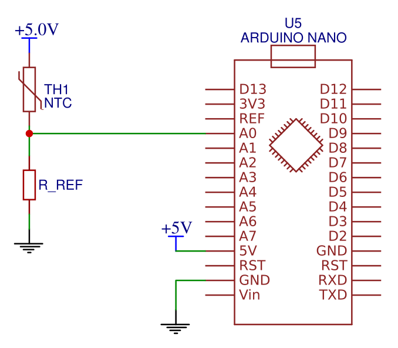

# Senzorji {#sec:delilnik}

- toleranca uporov
<!--
to-do
- SVETLOBNI SENZORJI
    - LDR velik odziv - počasen
    - FotoTR - srednji odziv, linearnost Ic(Is) - srednje hiter
    - FotoDI - zelo majhen a hiter odziv
- NTC termistor in faktor b
    - [teorija](https://www.digikey.sk/en/maker/projects/how-to-measure-temperature-with-an-ntc-thermistor/4a4b326095f144029df7f2eca589ca54?utm_adgroup=Tools&utm_source=google&utm_medium=cpc&utm_campaign=Dynamic%20Search_EN_Slovenia_Product&utm_term=&utm_content=Tools)
    - 1/T = 1/T0 + (1/B) ln(R/R0)
    - [umerjanje B](https://www.ametherm.com/thermistor/ntc-thermistor-beta)
-->

## Občutljivost

Ob predpostavki, da je določena meritev linearna na celotnem merilnem področju merilnega instrumenta, lahko izrazimo občutljivost instrumenta kot kvocient med spremembo izmerjene in spremembo merjene spremenljivke.
Občutljivost analognega instrumenta določa razmerje med linearnim pomikom indikatorja lege in spremembo merjene spremenljivke, ki omenjeni pomik povzroči.

## Delilniki napetosti s spremenljivim uporom

Pri takih vrstah senzorjev je izrednega pomena, da izberemo primeren refernčni upor $R_{Ref}$, saj le-ta vpliva na občutljivost senzorja. Izhodno napetost za temperaturni senzro s termistorjem in referenčnim uporom lahko izračunamo po enačbi [@eq:u_izh].

$$ U_{izh} = \frac{U_0 R_{Ref}}{R_{Ref} + R_{NTC}} $${#eq:u_izh}

Če bomo ta temperaturni senzor uporabljali v temperaturnem intervalu $T \in [ T_{min}, T_{max} ]$, se bo njegova upornost spreminjala v intervalu $R_{NTC}\in[ R_{NTC_{max}}, R_{NTC_{min}} ]$. Ker želimo, da bi senzor imel v tem območju kar največjo občutljivost lahko sestavimo enačbo [@eq:delta_u_izh], za spremembo izhodne napetosti pri intervalu $T$.

$$ \Delta U_{izh} = U_{izh}(T_{max}) - U_{izh}(T_{min})$${#eq:delta_u_izh}

Če poiščemo maksimum funkcije enačbe [@eq:delta_u_izh] za $R_{Ref}$ se izkaže, da je največja občutljivost senzorja pri refernčnem uporu, ki ga podaja enačba [@eq:r_ref_max]:

$$ R_{Ref} = \sqrt{R_{NTC_{min}}R_{NTC_{max}}} $${#eq:r_ref_max}

**Delilnik napetosti z notranjim uporom**

Delilnik napetosti lahko Naredimo tudi z uporom, ki ga mikrokrmilnik že vsebuje. Ker je ta upor vezan proti napajanju ga imenujemo **pull-up resistor**. V našem primeru ima ta upor upornost $R_{PULL-UP} \approx 10k\Omega$. Ker njegova vrednost ni točna je manj primeren za uporabo pri analognih senzorjih, vendar za izdelavo digitalnih lahko nadomesti nepotrebne vezave.

## Načrtovanje temperaturnega senzorja

- glej poglavje o delilnikih
- naredite temp. senzor, katerega odziv bo največji za temperaturno območje $T_{NTC} = [15,95]°C$.

> ### NALOGA: Načrtovanje temp. senzorja  
> Podrobno si poglejte [@sec:delilnik] in dimenzionirajte temperaturn sentor z NTC termistorjem za območje $T = [15,95]°C$. Izračunajte ali izmerite ključne vrednosti za dimenzioniranje senzorja:\
> $R_{NTC, T=15°C}=$___________,\
> $R_{NTC, T=95°C}=$___________,\
> $R_{REF}=$______________.

{#fig:NTC_uK.png height=7cm}
