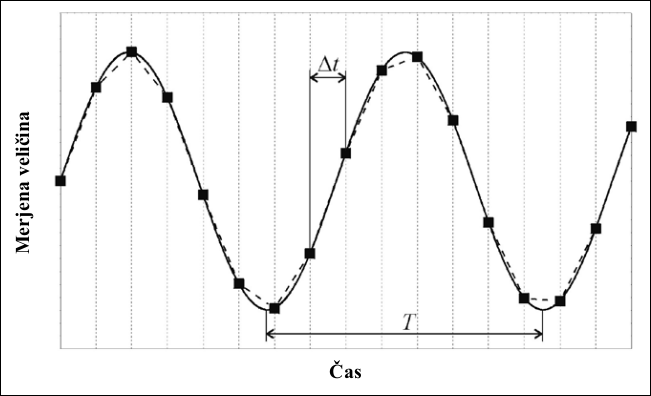
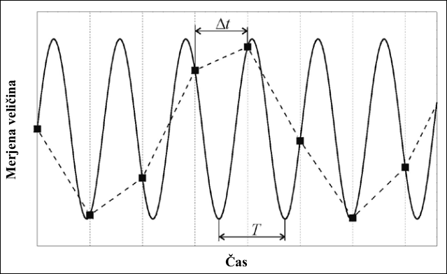

# TEORETIČNE OSNOVE

## Frekvenca vzorčenja

Pri vzorčenju signalov je zelo pomembna frekvenca vzorčenja $f_{vz}$. Upoštevati moramo Nyqistovo načela vzorčenja, ki pravi, da je potrebno periodične signale vzorčiti vsaj z 2x večjo frekvenco vzorčenja kot je frekvenca signala $f_{sig}$ [@Nyquist_1928], kot to predstavlja slika [@fig:vzorcenje_sin_sig.png].
$$f_{vz} = 2 f_{sig}$${#eq:nyquist}
V nasprotnem primeru laho dobimo nepravilno reprodukcijo merjenega signala (črtkana krivulja), kot to prikazuje slika [@fig:podvzorcenje.png].

{#fig:vzorcenje_sin_sig.png width=10cm}

{#fig:podvzorcenje.png width=10cm}

> ### NALOGA: Frekvenca vzorčenja  
> Glede na prejšnje podatke o mikrokrmilniku Atmega328 poiščite podatek o najvišji frekvenci vzorčenja $f_{vz}$ analognih signalov in izračunajte najmanjši čas $\Delta t$ med dvema vzorčenjema.
> \
> \
> \
> \
> \
>

## Digitalizacija
Merilni sistemi so opremljeni s t.i. analogno-digitalnimi pretvorniki (ang.: Analog-to-digital converter - ADC), ki pretvarjajo merjeno napetost v neko številsko vrednost. Zelo pogost primer je, ko zvezno napetostno območje od $0,0 V - 5,0 V$ pretvorimo v številske vrednosti od 0 - 1024. Pri tej pretvorbi ključno vlogo prevzame ADC in njegova **resolucija**. Grafični prikaz take transformacije je prikazan na sliki [@fig:ADC_voltage_resolution.svg].

![Prenosna funkcija ADC pretvorbe [@ADCwiki_2019].](./slike/ADC_voltage_resolution.svg){#fig:ADC_voltage_resolution.svg width=10cm}

## Resolucija in ločljivost

Resolucija AD pretvornikov je določena s številom vseh možnih stanj pretvorbe $N$. Ker so AD pretvorniki napreave prirejene digitalnim tehnologijam, se njihovi podatki izražajo v dvojiški obliki (binarno). Tako naprimer AD pretvornik z 10-bitno pretvorbo lahko prikaže:

$$N=2^B$${#eq:binarna_pretvorba}

možnih stanj.

> ### NALOGA: Resolucija AD pretvornika.
> Izračunajte s kolikšno resolucijo lahko odčitavamo analogne signale z mikrokrmilnikom Atmega328.
>\
>\
>\
>\

**Ločljivost** pa je najmanjša razlika med sosednjima digitaliziranima vrednostima merjene količine. Ta vrednost je odvisna tako od števila možnih stanj $N$, kakor tudi od območja, ki ga pretvarjamo. Zato bi lahko enačbo [@eq:locljivost] zapisali:

$$Locljivost = \frac{Obmocje}{N}$${#eq:locljivost}

> ### NALOGA: Ločljivost AD pretvornika.
> Izračunajte kolikšna je ločljivost mikrokrmilnika Atmega328 pri odčitavanju analognih signalov.
>\
>\
>\
>\

## Točnost in preciznosti (natančnost)

**Točnost** (v različnih virih je poimenovana različno, ang.: validity) je lastnost merilnega sistema, ki predstavlja ustreznost prestavljene meritve glede na njeno realno merjeno vrednost. Navadno jo izražamo kot relativno napako $\epsilon$ v procentualni obliki (enačba [@eq:relativna_napaka]):

$$\epsilon = \frac{(X-x_n)}{X}$$ {#eq:relativna_napaka} 

Kjer je $X$ realna merjena vrednost in $x_n$ izmerjena vrednost.

**Preciznost** oz. natančnost (zopet v različnih literaturah poimenovana različno, ang.: reliability) je sposobnost merilnega sistema reprodukcije iste merjene (refernčne) vrednosti z enakimi izmerjenimi vrednostmi. V mnogih primerh se izkaže, da gre v tem primeru za naključno napako merjenja in to vrednost lahko ponazarjamo s standardnim odklonom merilnega postopka (enačba [@eq:std_dev]). 

V splošnem bi lahko točnost in natančnost predstavili z grafom na sliki [@Tocnost_wiki_2019] [@fig:Accuracy_and_precision_sl.svg].

{#fig:Accuracy_and_precision_sl.svg width=10cm}

## Normalna porazdelitev

Kadar imamo v merilnem sistemu opravka z naključnimi napakami, meritve lahko predstavimo s krivuljo normalne porazdelitve - v splošenm imenovnane Gaussova porazdelitev. Zapišemo jo v obliki enačbe [@eq:gauss].

$$f(x)=\frac{1}{\sqrt{2 \pi \sigma ^2}}e^{-\frac{(x-\mu)^2}{2\sigma ^2}}$${#eq:gauss}

Kjer je $\mu$ povprečna vrednost in $\sigma^2$ varianca. Nekaj različnih krivulj lahko vidimo na sliki [@fig:Normal_Distribution_PDF.svg] [@Normal_distribution_wiki_2019].

{#fig:Normal_Distribution_PDF.svg width=10cm}

## Povprečna vrednost

$$\bar{x} = \frac{\sum x_n}{n}$${#eq:average}

## Standardni odklon

$$\sigma = \sqrt{\frac{\sum^{N}_{n=1}(x_n-\bar{x})^2}{n-1}}$${#eq:std_dev}

## Območje zaupanja

Z intervalom zaupanja predstavlja območje meritev, v katerem se naključna meritev pojavi z neko verjetnostjo. Pri normali porazdelitvi se izkaže, da je v območju $\bar x\pm1\sigma$ kar 68% vseh meritev, pri $\bar x \pm 2\sigma$ jih je 95% in pri $\bar x \pm 3\sigma$ celo 99,7%. Tako območje $\pm a\sigma$ imenujemo območje zaupanja. Najpogosteje se v praksi uporablja območje zaupanja s koef. $a=1,96$, v katerem bomo zanesljivo našli 95,00% meritev.

