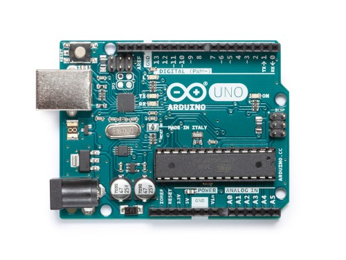

# ARDUINO UNO

Arduino Uno je:

> The UNO is the best board to get started with electronics and coding. If this is your first experience tinkering with the platform, the UNO is the most robust board you can start playing with. The UNO is the most used and documented board of the whole Arduino family.
@ArduinoU75:online




## Arduino UNO/NANO pinout

![Razporeditev priključkov na krmilniku Arduino UNO [@ArduinoUNOpinout:online].](./slike/Arduino-UNO-pinout.jpeg){#fig:Arduino-UNO-pinout.jpeg}

![Razporeditev priključkov na krmilniku Arduino NANO [@ArduinoUNOpinout:online].](./slike/nano.png){#fig:nano.png}

Kot lahko opazimo, so funkcije priključkov na sliki [@fig:Arduino-UNO-pinout.jpeg] in sliki [@fig:nano.png] enaki. To ni nenavadno, saj sta krmilnika po električni zgradbi enaka, razlikujeta se le v fizični izvedbi.

## Osnove programiranja krmilnika

> ### NALOGA: Preskus strojne in programske opreme.
> Pravilno priključite krminlnik Arduino na računalnik in nastavite programsko okolje Aruino IDE ter sprogramirajte krmilnik s testnim programom **BLINK.INO**. Iz nastavitev programskega okolja prepišite vaše nastavitve za:\
> 1. krmilnik:______________,\
> 2. komunikacijska vrata: _________,\
> 3. mikrokrmilnik: _____________.

\newpage
**Testni program BLINK.INO**

Nastavite in delovanje krmilnika lahko preverimo s testnim programom **blink.ino**. Na krmilniku Arduino UNO je na priključek **13** priključena svetleča dioda prav za ta namen.

```cpp
void setup() {
  pinMode(LED_BUILTIN, OUTPUT);
}

void loop() {
  digitalWrite(LED_BUILTIN, HIGH);
  delay(1000);
  digitalWrite(LED_BUILTIN, LOW);
  delay(1000);
}
```
