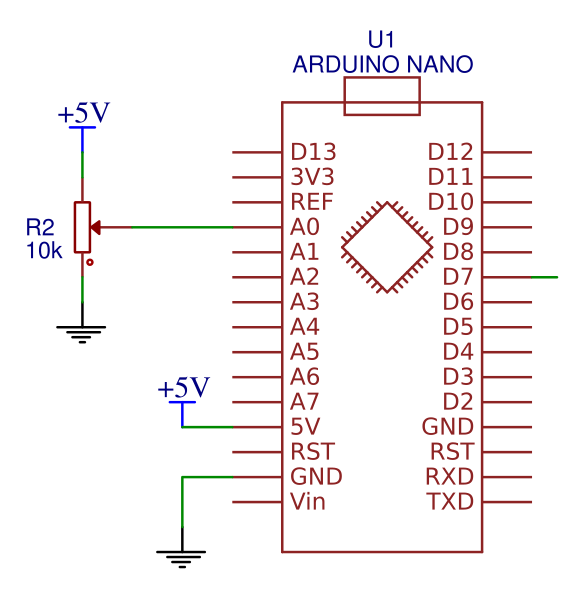
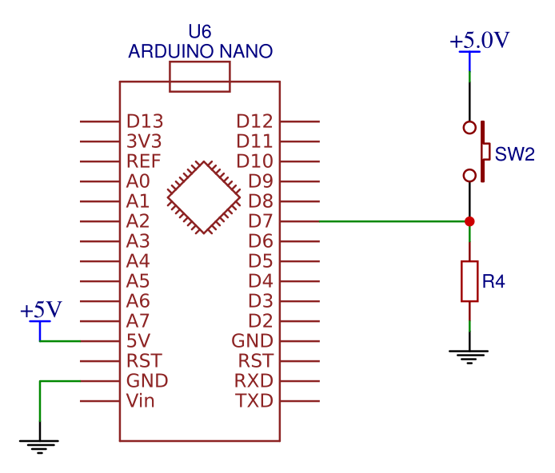

# MERJENJE S KRMILNIKOM ARDUINO UNO
Krmilnik Atmega328 ima vgrajen ADC pretvornik, s katerim lahko odčitavamo analogne napetosti v območju $U_{ADC} = [0..5]V$.Te napetosti lahko odčitavamo na priključkih krmilnika, ki so označeni z **A0..A7**. Zato moramo senzorje priključiti tako kot prikazuje slika [@fig:POT_uK.png].

{#fig:POT_uK.png height=7cm}

> ### NALOGA: Merjenje napetosti.
> Zvežite vezje po shemi na sliki [@fig:POT_uK.png] in sprogramirajte krmilnik tako, da boste na ekran računalnika izpisovali izmerjene vrednosti.\
> Napišite v kakšnem intervalu so bile izmerjene vrednosti:\
> ADC = [_____,_____]_.

## Merjenje napetosti

```cpp
int adc_value;
void setup() {
    Serial.begin(9600);
}

void loop() {
    adc_value = analogRead(0);
    Serial.println(adc_value);
    delay(100);
}
```

## Izračun napetosti

> ### NALOGA: Izračun napetosti.
> Napišite program za merjenje napetosti z ADC vmesnikom. V spodnji prostor pa vpišite le programske vrstice, ki ste jih uporabili za izračun napetosti.
>\
>\
>\
>\

## Normalna porazdelitev meritev

> ### NALOGA: Normalna porazdelitev meritev in njeni parametri.
> Z Arduino krmilnikom izmerite 100 meritev neke poljubne napetosti. Nato te meritve preverite še z volt-metrom, kar naj predstavlja vašo referenčno vrednost. Meritve vnesite v program za delo s tabelami in z ustreznimi funkcijami izračunajte, rezultat pa vpišite na črte:
>
>> - izmerjena referenčna vrednost: ______________________________________________,
>> - povprečno vrednost meritev : ________________________________________________,
>> - točnost predstavite z relativno napako  :_____________________________________,
>> - preciznost meritev pa podajte s standardnim odklon :__________________________.

```cpp
void setup() {
  Serial.begin(9600);
  int i = 0;
  int adc_value = 0;
  for (i=0;i<100;i++){
    adc_value = analogRead(0);
    float voltage = (float)adc_value * 5 / 1024;
    Serial.println(voltage, 4);
    delay(10);
  }
}
void loop() {
}
```

<!--
podatke uredite v histogram normalnih porazdelitev.
x -> range -> =COUNTIF(range, criteria)
-->

## Koeficienti normalne porazdelitve

<!--
Predstavite:
- število meritev
- obliko norm. porazdelitve ()
-->

**Sploščenost**
```
=KURT(Range)
```
**Premaknjenost**
```
=SKEW(Range)
```
**Povprečna vrednost**
```
=AVERAGE(Range)
```

**Standardna napaka**
```
=STEYX(y-Range,x-Range)
```

**Interval zaupanja**
```
=CONFIDENCE(Signif., Std.Dev., Sample Size)
```

## Časovne meritve

```cpp
unsigned long time;

void setup() {
  Serial.begin(9600);
}
void loop() {
  Serial.print("Time: ");
  time = millis();

  Serial.println(time); //prints time since program started
  delay(1000);          // wait a second so as not to send massive amounts of data
}
```

Preverite tudi:
```cpp
time = micros();
```
## Uporaba digitalnih vhodov
V povezavi s časovnimi meritvami pogosto uporabljamo digitalne vhode. Le-te lahko najdemo na priključkih **D0..D13** in tudi na **A0..A7**. Primer enostavne vezave tipke na krmilnik prikazuje slika [@fig:SW_uK.png].

{#fig:SW_uK.png height=7cm}

> ### NALOGA: Časovni odziv človeške reakcije.
> Napišite program za merjenje hitrosti človeškega odziva in zvežite vezje, ki ga prikazuje slika [@fig:SW_uK.png]. Po naključnem času naj zasveti lučka na krmilniku ArduinoUNO. Nato pa naj program nemudoma shrani trenutni čas v $start\_time$ in ko uporabnik pritisne tipko naj si program ponovno shrani čas v $stop\_time$. Program naj izračuna razliko časov in ga prikaže v na računalniku.\
> Napredno: Če znate program popravite tako, da ne bo omogočal goljufanja.

```cpp
void setup() {
  pinMode(13,OUTPUT);
  pinMode(7,INPUT);
  Serial.begin(9600);
  Serial.println("Start...");
  randomSeed(analogRead(0)); 
}

void loop() {
  digitalWrite(13,LOW);
  delay(random(5000,10000));
  digitalWrite(13,HIGH);

  unsigned long start_time = micros();
  unsigned long stop_time = 0;

  while (digitalRead(7)==0){
    stop_time = micros();
  }

  unsigned long time_div = stop_time - start_time;
  Serial.println(time_div);
  
  while (digitalRead(7)==1){
    delay(200);
    Serial.println("spusti tipko...");
  }
}
```

## Hitrost

> ### NALOGA: Merjenje hitrosti s svetlobnimi vrati.
> Uporabite ali sestavite dvojna svetlobna vrata. Nato napišite program, ki bo izmeril razliko v času ko se svetlobni snop na enih in drugih svetlobnih vratih prekine. Izmerite razdaljo med vratoma in izračunajte hitrost.\
> Napredno: Če zante program popravite tako, da bo občutljiv na "spremembo" vhodnega signala.

```cpp
void setup() {
  pinMode(7,INPUT);
  pinMode(8,INPUT);
  Serial.begin(9600);
  Serial.println("Start...");
}

void loop() {
  unsigned long start_time = 0;
  unsigned long stop_time = 0;

  while (digitalRead(7)==0){
    start_time = micros();
  }

  while (digitalRead(8)==0){
    stop_time = micros();
  }

  unsigned long time_div = stop_time - start_time;
  Serial.println(time_div);

  Serial.println("Nova maritev...");
}
```

## Pospešek

