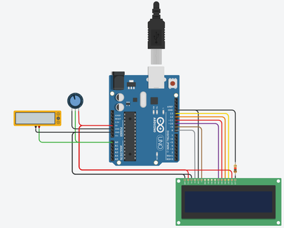

# IZPIS NA LCD

Program za izpis na LCD:

```cpp
#include <LiquidCrystal.h>
//            lcd(RS, EN, D4,D5,D6,D7);
LiquidCrystal lcd(8,  9,  10,11,12,13);

void setup() {
  lcd.begin(16, 2);
  lcd.print("Voltage:");
}

void loop() {
  lcd.setCursor(0, 1);
  lcd.print(analogRead(A0));
}
```

Vezje povežemo po shemi na [@fig:VezavaLCD_4_bit_data].

{#fig:VezavaLCD_4_bit_data}

