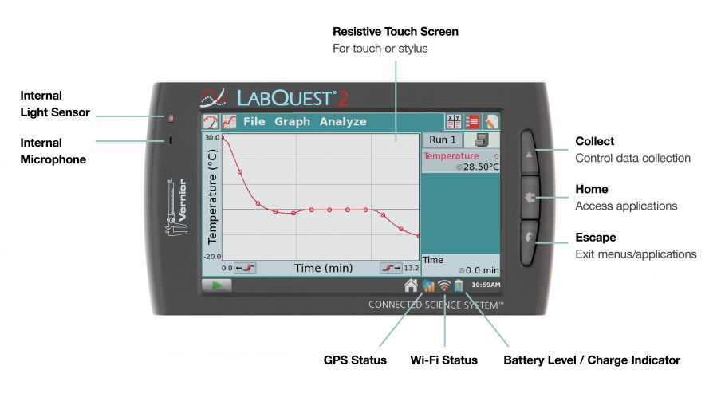
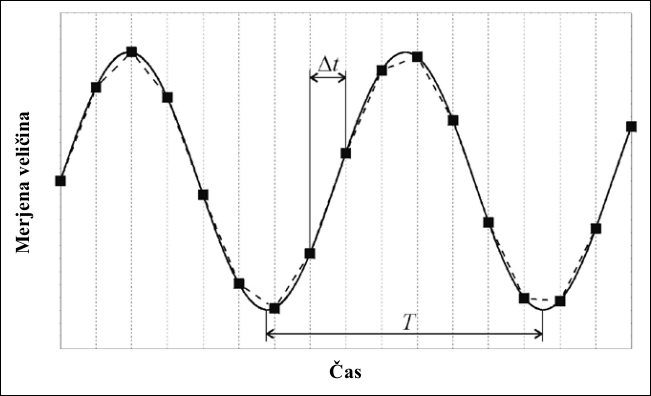
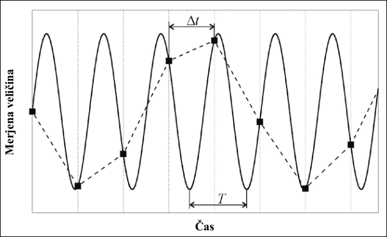
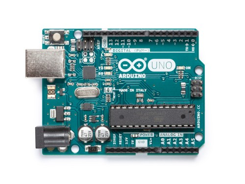
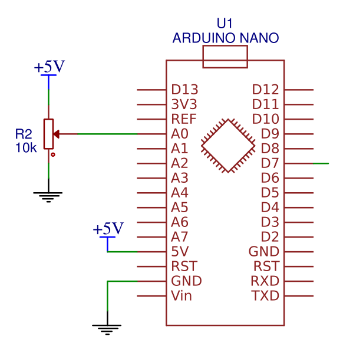
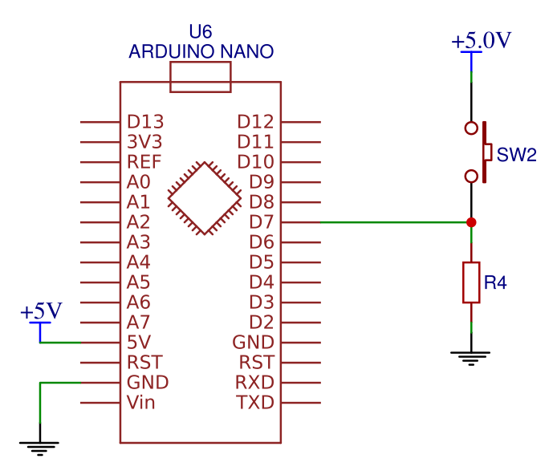
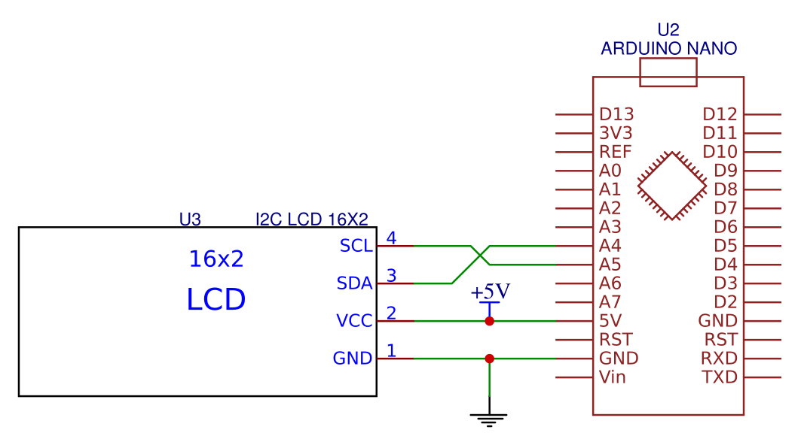
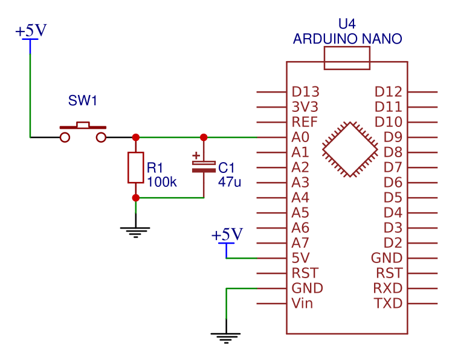
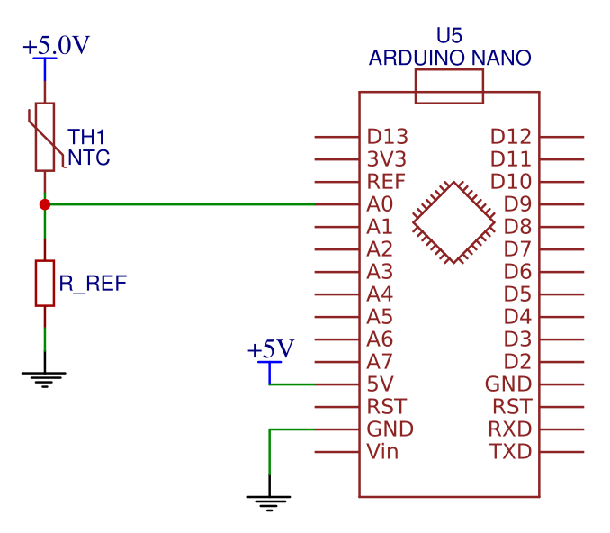

\newpage
\tableofcontents
\newpage

# Merilni sistemi

Data acquisition is the process of sampling signals that measure real world physical conditions and converting the resulting samples into digital numeric values that can be manipulated by a computer [[Wikipedia]]. Data acquisition systems, abbreviated by the acronyms DAS or DAQ, typically convert analog waveforms into digital values for processing. The components of data acquisition systems include:
- Sensors, to convert physical parameters to electrical signals.
- Signal conditioning circuitry, to convert sensor signals into a form that can be converted to digital values.
- Analog-to-digital converters, to convert conditioned sensor signals to digital values.

Data acquisition applications are usually controlled by software programs developed using various general purpose programming languages such as Assembly, BASIC, C, C++, C#, Fortran, Java, LabVIEW, Lisp, Pascal, etc. Stand-alone data acquisition systems are often called data loggers[[Wikipedia]].

There are also open-source software packages providing all the necessary tools to acquire data from different hardware equipment. These tools come from the scientific community where complex experiment requires fast, flexible and adaptable software. Those packages are usually custom fit but more general DAQ package like the Maximum Integrated Data Acquisition System can be easily tailored and is used in several physics experiments worldwide[[Wikipedia]].

## Importance of real-life experiments for students

- where theory finds its place
- greater motivation for learning
- more (learning) input --> beater understanding
    
    ---
- instant data processing
- explicit presentation of interdependent variables
- visualization of physical quantities that are detected by human nature

## Parts of a DAQ System [[NationalInstruments]]

<!-- [Parts of DAQ](http://www.ni.com/images/features/us/111201_fg_daq_info_graphic.jpg){#fig:slika} -->

## What Is a Sensor?

The measurement of a physical phenomenon, such as the temperature of a room, the intensity of a light source, or the force applied to an object, begins with a sensor. A sensor, also called a transducer, converts a physical phenomenon into a measurable electrical signal. Depending on the type of sensor, its electrical output can be a voltage, current, resistance, or another electrical attribute that varies over time. Some sensors may require additional components and circuitry to properly produce a signal that can accurately and safely be read by a  DAQ device [[NationalInstruments]]. Kot v enačbi [@eq:Ohmov]  in na sliki [@fig:ArduinoUNO.jpg].

[@WhatIsDa17:online]

## What Is a DAQ Device?

DAQ hardware acts as the interface between a computer and signals from the outside world. It primarily functions as a device that digitizes incoming analog signals so that a computer can interpret them. The three key components of a DAQ device used for measuring a signal are the signal conditioning circuitry, analog-to-digital converter (ADC), and computer bus. Many DAQ devices include other functions for automating measurement systems and processes. For example, digital-to-analog converters (DACs) output analog signals, digital I/O lines input and output digital signals, and counter/timers count and generate digital pulses[NationalInstruments].

## What Is a Computer’s Role in a DAQ System?

A computer with programmable software controls the operation of the DAQ device and is used for processing, visualizing, and storing measurement data. Different types of computers are used in different types of applications. A desktop may be used in a lab for its processing power, a laptop may be used in the field for its portability, or an industrial computer may be used in a manufacturing plant for its ruggedness [@WhatIsDa17:online].

\newpage
# Merilne naprave

Pri fizikalnih eksperimentih pogosto uporabljamo merilne naprave, s katerimi želimo potrditi teoretične principe in fizikalne pojave. V šolskem prostoru najpogosteje uporabljamo Vernier-jevo merilno napravo LabQuest Hardware @LabQuest30:online , ki nam omogoča raznovrstne meritve.

## Vernier's DAQs



Poglejmo si nekaj podatkov o napravi:

- **Display**
  + 11.2 cm x 6.7 cm (13.1 cm diagonal) screen
  + 00 x 480 pixel color display at 188 dpi
  + ED backlight
  + ortrait or landscape screen orientation
  + igh-contrast mode for outdoor visibility
- **Processor**
  + 800 MHz Application Processor
- **Connectivity**
  + Wi-Fi 802.11 b/g/n @ 2.4GHz
  + Bluetooth Smart for WDSS and Go Wireless Sensors
- **User Interface**
  + Resistive touch screen
  + Touch and stylus navigation for efficiency and precision
- **Data Acquisition**
  + 100,000 samples per second
  + 12-bit resolution
  + Built-in GPS, 3-axis accelerometer, ambient temperature, light, and microphone
- **Environmental Durability**
  + Operating Temperature: 0  + 45°C
  + Storage Temperature: -30  + 60°C
  + Splash resistant
  + Rugged enclosure designed to withstand a fall from lab bench
- **Size and Weight**
  + Size: 8.8 cm x 15.4 cm x 2.5 cm
  + Weight: 350 g
- **Ports**
  + 5 sensor channels
  + USB port for sensors, flash drives, and peripherals
  + USB mini port
  + DC power jack
  + MicroSD/MMC slot
  + Audio in and out
- **Storage**
  + 200 MB
  + Expandable with MicroSD and USB flash drive
- **Power**
  + Rechargeable, high-capacity battery
  + DC charging/powering through external adapter (included)
- **cena:**
  + $455

Seveda pa morate dokupiti še senzorje, ki tudi niso cenovno ugodni, saj se njihova cena giblje od $30 ... naprej.

## Arduino Data Acquisition System

On the market we can find different DAQ systems which are hi-end products and often expencive (from 100 € .. n k€). Buy we can use Arduino (Uno, nano, ...) as low-cost data acqusition system if we do not need scientific accurate data (for pedagogical purposes).

<-- [Parts of DAQ](http://www.ni.com/images/features/us/111201_fg_daq_info_graphic.jpg)[[NationalInstruments]] -->

Na plošči vsebuje mikrokrmilnik **Atmega328**, ki lahko opravi podobne naloge, kot smo jih opisali v poglavju __Merilne naprave__.

Poglejmo si nekaj karakteristik tega mikrokrmilnika [@ATmega328P_Datasheet:online]: 

- **Advanced RISC Architecture**
  + 131 Powerful Instructions
  + Most Single Clock Cycle Execution
  + 32 x 8 General Purpose Working Registers
  + Fully Static Operation
  + Up to 20 MIPS Throughput at 20MHz
  + On-chip 2-cycle Multiplier
- **High Endurance Non-volatile Memory Segments**
  + 32KBytes of In-System Self-Programmable Flash program
Memory
  + 1KBytes EEPROM
  + 2KBytes Internal SRAM
  + Write/Erase Cycles: 10,000 Flash/100,000 EEPROM
  + Data Retention: 20 years at 85°C/100 years at 25°C(1)
  + Optional Boot Code Section with Independent Lock Bits
    - In-System Programming by On-chip Boot Program
    - True Read-While-Write Operation
  + Programming Lock for Software Security
- **Atmel® QTouch® Library Support**
  + Capacitive Touch Buttons, Sliders and Wheels
  + QTouch and QMatrix® Acquisition
  + Up to 64 sense channels
- **Peripheral Features**
  + Two 8-bit Timer/Counters with Separate Prescaler and Compare Mode
  + One 16-bit Timer/Counter with Separate Prescaler, Compare Mode, and Capture Mode
  + Real Time Counter with Separate Oscillator
  + Six PWM Channels
  + ADC
    * 8-channel 10-bit ADC in TQFP and QFN/MLF package
    * Temperature Measurement
    * 6-channel 10-bit ADC in PDIP Package
    * 10-bit Resolution
    * 0.5 LSB Integral Non-Linearity
    * ±2 LSB Absolute Accuracy
    * 13 - 260μs Conversion Time
    * Up to 76.9kSPS (Up to 15kSPS at Maximum Resolution)
    * Six Multiplexed Single Ended Input Channels
    * Two Additional Multiplexed Single Ended Input Channels (TQFP and VFQFN Package only)
    * Temperature Sensor Input Channel
    * Optional Left Adjustment for ADC Result Readout
    * 0 - VCC ADC Input Voltage Range
    * Selectable 1.1V ADC Reference Voltage
    * Free Running or Single Conversion Mode
    * Interrupt on ADC Conversion Complete
    * Sleep Mode Noise Canceler
  + Two Master/Slave SPI Serial Interface
  + One Programmable Serial USART
  + One Byte-oriented 2-wire Serial Interface (Philips I2C compatible)
  + Programmable Watchdog Timer with Separate On-chip Oscillator
  + One On-chip Analog Comparator
  + Interrupt and Wake-up on Pin Change
- **Special Microcontroller Features**
  + Power-on Reset and Programmable Brown-out Detection
  + Internal Calibrated Oscillator
  + External and Internal Interrupt Sources
  + Six Sleep Modes: Idle, ADC Noise Reduction, Power-save, Power-down, Standby, and
Extended Standby
- **I/O and Packages**
  + 23 Programmable I/O Lines
  + 28-pin PDIP, 32-lead TQFP, 28-pad QFN/MLF and 32-pad QFN/MLF
- **Operating Voltage:**
  + 1.8 - 5.5V
- **Temperature Range:**
  + -40°C to 105°C
- **Speed Grade:**
  + 0 - 4MHz @ 1.8 - 5.5V
  + 0 - 10MHz @ 2.7 - 5.5V
  + 0 - 20MHz @ 4.5 - 5.5V
- **Power Consumption at 1MHz, 1.8V, 25°C**
  + Active Mode: 0.2mA
  + Power-down Mode: 0.1μA
  + Power-save Mode: 0.75μA (Including 32kHz RTC)

## Requirements

(Checked is required, unchecked is optional)

**Hardware**:

- [x] Computer
- [x] Arduino board ([Arduino UNO](https://store.arduino.cc/arduino-uno-rev3), [Arduino LEONARDO](https://store.arduino.cc/arduino-leonardo-with-headers), [Arduino NANO](https://store.arduino.cc/arduino-nano), [clone products](https://www.aliexpress.com/item/Nano-CH340-ATmega328P-MicroUSB-Compatible-for-Arduino-Nano-V3/32572612009.html?spm=2114.search0104.3.1.34b52b20RGIwod&ws_ab_test=searchweb0_0,searchweb201602_4_10152_10151_10065_10344_10068_10342_10343_10340_10341_10084_10083_10618_10304_10307_10301_5711212_10313_10059_10534_100031_10103_10627_10626_10624_10623_10622_10621_10620_5722413_5711313,searchweb201603_25,ppcSwitch_5&algo_expid=d5f1485f-be15-4f3e-93b6-b3120c7b8ac3-0&algo_pvid=d5f1485f-be15-4f3e-93b6-b3120c7b8ac3&transAbTest=ae803_3&priceBeautifyAB=0) )
- [x] basic electronics components for sensors
- [ ] arduino set starter [for example use this kit](https://www.aliexpress.com/item/The-Best-RFID-Starter-Kits-For-Arduino-Uno-R3-With-Tutorial-Power-Supply-Learning-Kit-US/32623921742.html?spm=2114.10010108.1000013.3.1f3929415iOC4y&traffic_analysisId=recommend_2088_2_90158_iswistore&scm=1007.13339.90158.0&pvid=256e4e8d-3f20-47e9-b3d3-56af5fadcd51&tpp=1)
- [ ] arduino sensors set [for example use this kit](https://www.aliexpress.com/item/37-In-1-Sensor-Kits-For-Arduino-Raspberry-Pi-Beginner-Learning-Sensor-Module-Suit-Ultimate-Top/32851582028.html?spm=2114.search0104.3.29.66a36682D8jqIb&ws_ab_test=searchweb0_0,searchweb201602_4_10152_10151_10065_10344_10068_10342_10343_10340_10341_10084_10083_10618_10304_10307_10301_5711211_10313_10059_10534_100031_10103_10627_10626_10624_10623_10622_5722411_5711315_10621_10620,searchweb201603_25,ppcSwitch_5&algo_expid=4674573e-7df9-4805-bd73-64edd1408ad6-4&algo_pvid=4674573e-7df9-4805-bd73-64edd1408ad6&transAbTest=ae803_3&priceBeautifyAB=0)

**Software**:

- [x] Arduino IDE [download here](https://www.arduino.cc/en/Main/Software)
- [ ] Python (>=3.0)
- [ ] pyserial
- [ ] Ms Excel

\newpage
## Pros & Cons
| **Pros**                             | **Cons**                  |
|--------------------------------------|---------------------------|
| + Price (Arduino ~3€, sensors ~2-5€) | - work in progress        |
| + Accessibility                      | - no plug&play solutions  |
| + Versatility                        | - DIY project             |
| + Easy importing data into MS Excel  | - low sampling rate ~6kHz |
| + točne časovne meritve              | - 10-bi resolutuin        |

More about DAQ you can read in further reading... 


> Kaj ko bi si lahko naredili svojo merilno napravo?

V ta namen smo ustvarili nekaj vsebin na portalu [GitHub](https://github.com/davidrihtarsic/Arduino-Data-Acquisition-Device)...

\newpage
# Teoretične osnove

## Frekvenca vzorčenja

Pri vzorčenju signalov je zelo pomembna frekvenca vzorčenja $f_{vz}$. Upoštevati moramo Nyqistovo načela vzorčenja, ki pravi, da je potrebno periodične signale vzorčiti vsaj z 2x večjo frekvenco vzorčenja kot je frekvenca signala $f_{sig}$ [@Nyquist_1928], kot to predstavlja slika [@fig:vzorcenje_sin_sig.png].
$$f_{vz} = 2 f_{sig}$${#eq:nyquist}
V nasprotnem primeru laho dobimo nepravilno reprodukcijo merjenega signala (črtkana krivulja), kot to prikazuje slika [@fig:podvzorcenje.png].

{#fig:vzorcenje_sin_sig.png width=10cm}

{#fig:podvzorcenje.png width=10cm}

Listing: Frekvenca vzorčenja.
```{#lst:f_vz_uK .naloga}
```
> Glede na prejšnje podatke o mikrokrmilniku Atmega328 poiščite podatek o najvišji frekvenci vzorčenja $f_{vz}$ analognih signalov in izračunajte najmanjši čas $\Delta t$ med dvema vzorčenjema.
> \
> \
> \
> \
> \

## Digitalizacija
Merilni sistemi so opremljeni s t.i. analogno-digitalnimi pretvorniki (ang.: Analog-to-digital converter - ADC), ki pretvarjajo merjeno napetost v neko številsko vrednost. Zelo pogost primer je, ko zvezno napetostno območje od $0,0 V - 5,0 V$ pretvorimo v številske vrednosti od 0 - 1023. Pri tej pretvorbi ključno vlogo prevzame ADC in njegova **resolucija**. Grafični prikaz take transformacije je prikazan na sliki [@fig:ADC_voltage_resolution.svg].

![Prenosna funkcija ADC pretvorbe [@ADCwiki_2019].](./slike/ADC_voltage_resolution.svg){#fig:ADC_voltage_resolution.svg width=10cm}

## Resolucija in ločljivost

Resolucija AD pretvornikov je določena s številom vseh možnih stanj pretvorbe $N$. Ker so AD pretvorniki napreave prirejene digitalnim tehnologijam, se njihovi podatki izražajo v dvojiški obliki (binarno). Tako naprimer AD pretvornik z 10-bitno pretvorbo lahko prikaže:

$$N=2^B$${#eq:binarna_pretvorba}

možnih stanj.

Listing: Resolucija AD pretvornika.
```{#lst:res_ADC .naloga}
```
> Izračunajte s kolikšno resolucijo lahko odčitavamo analogne signale z mikrokrmilnikom Atmega328.
>\
>\
>\
>\

**Ločljivost** pa je najmanjša razlika med sosednjima digitaliziranima vrednostima merjene količine. Ta vrednost je odvisna tako od števila možnih stanj $N$, kakor tudi od območja, ki ga pretvarjamo. Zato bi lahko enačbo [@eq:locljivost] zapisali:

$$Locljivost = \frac{Obmocje}{N}$${#eq:locljivost}

Listing: Ločljivost AD pretvornika.
```{#lst:locljivost_ADC .naloga}
```
> Izračunajte kolikšna je ločljivost mikrokrmilnika Atmega328 pri odčitavanju analognih signalov.
>\
>\
>\
>\

## Točnost in preciznosti (natančnost)

**Točnost** (v različnih virih je poimenovana različno, ang.: validity) je lastnost merilnega sistema, ki predstavlja ustreznost prestavljene meritve glede na njeno realno merjeno vrednost. Navadno jo izražamo kot relativno napako $\epsilon$ v procentualni obliki (enačba [@eq:relativna_napaka]):

$$\epsilon = \frac{(X-x_n)}{X}$$ {#eq:relativna_napaka} 

Kjer je $X$ realna merjena vrednost in $x_n$ izmerjena vrednost.

**Preciznost** oz. natančnost (zopet v različnih literaturah poimenovana različno, ang.: reliability) je sposobnost merilnega sistema reprodukcije iste merjene (refernčne) vrednosti z enakimi izmerjenimi vrednostmi. V mnogih primerh se izkaže, da gre v tem primeru za naključno napako merjenja in to vrednost lahko ponazarjamo s standardnim odklonom merilnega postopka (enačba [@eq:std_dev]). 

V splošnem bi lahko točnost in natančnost predstavili z grafom na sliki [@fig:Accuracy_and_precision_sl.svg][@Tocnost_wiki_2019].

{#fig:Accuracy_and_precision_sl.svg width=10cm}

## Normalna porazdelitev

Kadar imamo v merilnem sistemu opravka z naključnimi napakami, meritve lahko predstavimo s krivuljo normalne porazdelitve - v splošenm imenovnane Gaussova porazdelitev. Zapišemo jo v obliki enačbe [@eq:gauss].

$$f(x)=\frac{1}{\sqrt{2 \pi \sigma ^2}}e^{-\frac{(x-\mu)^2}{2\sigma ^2}}$${#eq:gauss}

Kjer je $\mu$ povprečna vrednost in $\sigma^2$ varianca. Nekaj različnih krivulj lahko vidimo na sliki [@fig:Normal_Distribution_PDF.svg] [@Normal_distribution_wiki_2019].

{#fig:Normal_Distribution_PDF.svg width=10cm}

## Povprečna vrednost

$$\bar{x} = \frac{\sum x_n}{n}$${#eq:average}

## Standardni odklon

$$\sigma = \sqrt{\frac{\sum^{N}_{n=1}(x_n-\bar{x})^2}{n-1}}$${#eq:std_dev}

## Območje zaupanja

Z intervalom zaupanja predstavlja območje meritev, v katerem se naključna meritev pojavi z neko verjetnostjo. Pri normali porazdelitvi se izkaže, da je v območju $\bar x\pm1\sigma$ kar 68% vseh meritev, pri $\bar x \pm 2\sigma$ jih je 95% in pri $\bar x \pm 3\sigma$ celo 99,7%. Tako območje $\pm a\sigma$ imenujemo območje zaupanja. Najpogosteje se v praksi uporablja območje zaupanja s koef. $a=1,96$, v katerem bomo zanesljivo našli 95,00% meritev.

\newpage
# Arduino UNO

Arduino Uno je:

> The UNO is the best board to get started with electronics and coding. If this is your first experience tinkering with the platform, the UNO is the most robust board you can start playing with. The UNO is the most used and documented board of the whole Arduino family.
@ArduinoU75:online




## Arduino UNO/NANO pinout

![Razporeditev priključkov na krmilniku Arduino UNO [@ArduinoUNOpinout:online].](./slike/Arduino-UNO-pinout.jpeg){#fig:Arduino-UNO-pinout.jpeg}

![Razporeditev priključkov na krmilniku Arduino NANO [@ArduinoUNOpinout:online].](./slike/nano.png){#fig:nano.png}

Kot lahko opazimo, so funkcije priključkov na sliki [@fig:Arduino-UNO-pinout.jpeg] in sliki [@fig:nano.png] enaki. To ni nenavadno, saj sta krmilnika po električni zgradbi enaka, razlikujeta se le v fizični izvedbi.

## Osnove programiranja krmilnika

Listing: Preskus strojne in programske opreme.
```{#lst:ide_hv_test .naloga}
```
> Pravilno priključite krminlnik Arduino na računalnik in nastavite programsko okolje Aruino IDE ter sprogramirajte krmilnik s testnim programom **BLINK.INO**. Iz nastavitev programskega okolja prepišite vaše nastavitve za:\
> 1. krmilnik:______________,\
> 2. komunikacijska vrata: _________,\
> 3. mikrokrmilnik: _____________.

\newpage
**Testni program BLINK.INO**

Nastavite in delovanje krmilnika lahko preverimo s testnim programom **blink.ino**. Na krmilniku Arduino UNO je na priključek **13** priključena svetleča dioda prav za ta namen.

```cpp
void setup() {
  pinMode(LED_BUILTIN, OUTPUT);
}

void loop() {
  digitalWrite(LED_BUILTIN, HIGH);
  delay(1000);
  digitalWrite(LED_BUILTIN, LOW);
  delay(1000);
}
```
\newpage
# Merjenje s krmilnikom Arduino UNO
Krmilnik Atmega328 ima vgrajen ADC pretvornik, s katerim lahko odčitavamo analogne napetosti v območju $U_{ADC} = [0..5]V$.Te napetosti lahko odčitavamo na priključkih krmilnika, ki so označeni z **A0..A7**. Zato moramo senzorje priključiti tako kot prikazuje slika [@fig:POT_uK.png].

{#fig:POT_uK.png height=7cm}

Listing: Merjenje napetosti.
```{#lst:U_sampling .naloga}
```
> Zvežite vezje po shemi na sliki [@fig:POT_uK.png] in sprogramirajte krmilnik tako, da boste na ekran računalnika izpisovali izmerjene vrednosti.\
> Napišite v kakšnem intervalu so bile izmerjene vrednosti:\
> ADC = [_____,_____]_.

\newpage
## Merjenje napetosti

```cpp
int adc_value;
void setup() {
    Serial.begin(9600);
}

void loop() {
    adc_value = analogRead(0);
    Serial.println(adc_value);
    delay(100);
}
```
## Izračun napetosti

Listing: Izračun napetosti.
```{#lst:calc_voltage .naloga}
```
> Napišite program za merjenje napetosti z ADC vmesnikom. V spodnji prostor pa vpišite le programske vrstice, ki ste jih uporabili za izračun napetosti.
>\
>\
>\
>\

## Normalna porazdelitev meritev

Listing: Normalna porazdelitev meritev in njeni parametri.
```{#lst:normal_distro .naloga}
```
> Z Arduino krmilnikom izmerite 100 meritev neke poljubne napetosti. Nato te meritve preverite še z volt-metrom, kar naj predstavlja vašo referenčno vrednost. Meritve vnesite v program za delo s tabelami in z ustreznimi funkcijami izračunajte, rezultat pa vpišite na črte:
>
>> - izmerjena referenčna vrednost: ______________________________________________,
>> - povprečno vrednost meritev : ________________________________________________,
>> - točnost predstavite z relativno napako  :_____________________________________,
>> - preciznost meritev pa podajte s standardnim odklon :__________________________.

```cpp
void setup() {
  Serial.begin(9600);
  int i = 0;
  int adc_value = 0;
  for (i=0;i<100;i++){
    adc_value = analogRead(0);
    float voltage = (float)adc_value * 5 / 1023;
    Serial.println(voltage, 4);
    delay(10);
  }
}
void loop() {
}
```

## Koeficienti normalne porazdelitve
**Sploščenost**
```
=KURT(Range)
```
**Premaknjenost**
```
=SKEW(Range)
```
**Povprečna vrednost**
```
=AVERAGE(Range)
```

**Standardna napaka**
```
=STEYX(y-Range,x-Range)
```

**Interval zaupanja**
```
=CONFIDENCE(Signif., Std.Dev., Sample Size)
```

## Časovne meritve

```cpp
unsigned long time;

void setup() {
  Serial.begin(9600);
}
void loop() {
  Serial.print("Time: ");
  time = millis();

  Serial.println(time); //prints time since program started
  delay(1000);          // wait a second so as not to send massive amounts of data
}
```

Preverite tudi:
```cpp
time = micros();
```
## Uporaba digitalnih vhodov
V povezavi s časovnimi meritvami pogosto uporabljamo digitalne vhode. Le-te lahko najdemo na priključkih **D0..D13** in tudi na **A0..A7**. Primer enostavne vezave tipke na krmilnik prikazuje slika [@fig:SW_uK.png].

{#fig:SW_uK.png height=7cm}

Listing: Časovni odziv človeške reakcije.
```{#lst:human_time .naloga}
```
> Napišite program za merjenje hitrosti človeškega odziva in zvežite vezje, ki ga prikazuje slika [@fig:SW_uK.png]. Po naključnem času naj zasveti lučka na krmilniku ArduinoUNO. Nato pa naj program nemudoma shrani trenutni čas v $start\_time$ in ko uporabnik pritisne tipko naj si program ponovno shrani čas v $stop\_time$. Program naj izračuna razliko časov in ga prikaže v na računalniku.\
> Napredno: Če znate program popravite tako, da ne bo omogočal goljufanja.

```cpp
void setup() {
  pinMode(13,OUTPUT);
  pinMode(7,INPUT);
  Serial.begin(9600);
  Serial.println("Start...");
  randomSeed(analogRead(0)); 
}

void loop() {
  digitalWrite(13,LOW);
  delay(random(5000,10000));
  digitalWrite(13,HIGH);

  unsigned long start_time = micros();
  unsigned long stop_time = 0;

  while (digitalRead(7)==0){
    stop_time = micros();
  }

  unsigned long time_div = stop_time - start_time;
  Serial.println(time_div);
  
  while (digitalRead(7)==1){
    delay(200);
    Serial.println("spusti tipko...");
  }
}
```

\newpage
## Hitrost

Listing: Merjenje hitrosti s svetlobnimi vrati.
```{#lst:speed_measure .naloga}
```
> Uporabite ali sestavite dvojna svetlobna vrata. Nato napišite program, ki bo izmeril razliko v času ko se svetlobni snop na enih in drugih svetlobnih vratih prekine. Izmerite razdaljo med vratoma in izračunajte hitrost.\
> Napredno: Če zante program popravite tako, da bo občutljiv na "spremembo" vhodnega signala.

```cpp
void setup() {
  pinMode(7,INPUT);
  pinMode(8,INPUT);
  Serial.begin(9600);
  Serial.println("Start...");
}

void loop() {
  unsigned long start_time = 0;
  unsigned long stop_time = 0;

  while (digitalRead(7)==0){
    start_time = micros();
  }

  while (digitalRead(8)==0){
    stop_time = micros();
  }

  unsigned long time_div = stop_time - start_time;
  Serial.println(time_div);

  Serial.println("Nova maritev...");
}
```

## Pospešek

\newpage
# Prikazovanje podatkov

Prikazovanje podatkov je ena od ključnih nalog vseh merilnih sistemov. To pahko naredimo na različne načine:

1. v obliki tabele na zaslon računalnika,
2. v grafični obliki,
3. na zaslon samostojne merilne naprave ...

Listing: Izpis podatkov.
```{#lst:show_data .naloga}
```
> Prikažite podatke na različne načine:\
> 1. v obliki tabele,\
> 2. v grafični obliki in\
> 3. na LCD zaslon merilne naprave.

## Serijski izpis

Spodnji primer programske kode prikazuje kako lahko z Arduino krmilniki izpisujemo osnovne podatke neke meritve. Izpisovali bomo dva podatka v ločena stolpca. Stolpca bosta ločena s tabulatorjem, kar predstavlja označba **\\t**. V prvem stolpcu bomo izpisovali trenutni čas ( **millis();** ), v drugega pa vrednost analogne pretvorbe (**analogRead(0);**).

```cpp
void setup() {
  Serial.begin(9600);
  Serial.println("t[ms]\tADC");
}

void loop() {
  Serial.print(millis());
  Serial.print("\t");
  Serial.println(analogRead(0));
  delay(100);
}
```

## Grafični izris
Zelo nazorno je spremljati izris podatkov v grafičnem načinu. Do neke mere nam to funkcijo ponuja programsko okolje Arduino IDE, vendar v zelo okenjeni obliki. Preskusite naslednji program:

```cpp
void setup() {
  Serial.begin(9600);
}
void loop() {
  Serial.print("0,1023,");
  Serial.println(analogRead(A0));
  delay(10);
}
```

Kot lahko opazimo računalniku pošiljamo 3 različne števila: 0, 1023 in ADC vrednost. Prvi dve nam slušita kot območje, saj bi v nasprotnem primeru program sam prilagajal skalo na y osi (ang.: autofit).

## Izpis na LCD
Če želimo narediti merilno napravo, ki bo delovala samostojno, bomo verjetno potrebovali dodaten ekran za prikaz izmerjenih vrednosti. Zato ga moramo priključiti na krmilnik Arduino, kot kaže slika [@fig:LCD_vezava.png].

{#fig:LCD_vezava.png height=7cm}

Ena naj enostavnejših rešitev je, da krmilniku Arduino UNO dodamo LCD ekranček z I²C vodilom. Ker je I²C vodilo zasnovano tako, da nanj lahko priključimo več naprav, moramo za vsako napravo poznati njen naslov. Le tega lahko pridobimo od proizvajalca naprave, ga nastavimo sami ali pa z ustreznim programom pregledamo vse naslove priključenih naprav ([programska koda](https://playground.arduino.cc/Main/I2cScanner/)[@ArduinoI2Cscanner]).
Za uporabo LCDja na podatkovnem vodilu I²C bomo potrebovali knjižnico **LiquidCrystal_I2C**, ki si jo lahko presnamete s spletne strani [Francisco Malpartida](https://bitbucket.org/fmalpartida/new-liquidcrystal/downloads/NewliquidCrystal_1.3.4.zip).

```cpp
#include <Wire.h>
#include <LiquidCrystal_I2C.h>
LiquidCrystal_I2C DaqLcd(0x27, 2, 1, 0, 4, 5, 6, 7, 3, POSITIVE); 

void setup() {
  DaqLcd.begin(8, 2);
}

void loop() {
  int i = 0;
  long ch = 0;
  for (i=0;i<64;i++){
    ch += analogRead(7); 
  }
 
  float val = ch/64.0;
  DaqLcd.clear();
  DaqLcd.print(val);
}
```

\newpage
# Linearizacija meritvenih vrednosti (praznenje kondenzatorja)

Izvedli bomo poskus, pri katerem bomo lahko meritve odvisne spremenljivke (napetost) opravili pri različnih vrednostih neodvisne spremenljivke (čas). Iz rezultatov bomo skušali izluščiti kapaciteto kondenzatorja (kot iskano konstatnto sistema). Ker je fizikalni pojav nelinearen, ga bomo najprej linearizirali, in šele nato izračunali iskano konstanto (kapaciteto kondenzatorja). Tako lahko v izračun enostavno vključimo vse meritve...

Listing: Izračun vrednosti s pomočjo regresijske premice.
```{#lst:linearization .naloga}
```
> Izvedite poizkus praznjenja kondenzatorja in izmerite $U_C(t)$. Podatke linearizirajte tako, da jim boste lahko dodelili regresijsko premico.\
> Izračunajte:\
> - resresijski koeficient: $R²$:_________,\
> - enačba smernega koeficienta lienaricacije:\
> - vrednost smernega koeficienta:\
> - vrednost kapacitete kondenzatorja:

## Vezje in zajem podatkov

Vezje sestavimo po sliki [@fig:Cap_uK.png]:

{#fig:Cap_uK.png height=7cm}

## Linearizacija

$$ f(x) = k x + n $${#eq:linearna}

$$ U_C(t) = U_0 e^{-\frac{t}{R C}} $${#eq:praznenje_kondenzatorja}

$$ ln U_0 = -\frac{1}{R C} t + ln U_C $${#eq:praznenje_lin}

ali ...

$$ ln(\frac{U_C}{U_0}) = - \frac{1}{R C} t $${#eq:praznenje_log}

## Koeficienti regresijske premice

```
=SLOPE(y-Range,x-Range)
```

```
=INTERCEPT(y-Range,x-Range)
```

```
Korelacija med x in y.
=CORREL(y-Range,x-Range)
```

```
Korelacija med y_0 in y.
=RSQ(y-Range,x-Range)
```

\newpage
# Senzorji {#sec:delilnik}

- toleranca uporov

## Občutljivost

Ob predpostavki, da je določena meritev linearna na celotnem merilnem področju merilnega instrumenta, lahko izrazimo občutljivost instrumenta kot kvocient med spremembo izmerjene in spremembo merjene spremenljivke.
Občutljivost analognega instrumenta določa razmerje med linearnim pomikom indikatorja lege in spremembo merjene spremenljivke, ki omenjeni pomik povzroči.

## Delilniki napetosti s spremenljivim uporom

Pri takih vrstah senzorjev je izrednega pomena, da izberemo primeren refernčni upor $R_{Ref}$, saj le-ta vpliva na občutljivost senzorja. Izhodno napetost za temperaturni senzro s termistorjem in referenčnim uporom lahko izračunamo po enačbi [@eq:u_izh].

$$ U_{izh} = \frac{U_0 R_{Ref}}{R_{Ref} + R_{NTC}} $${#eq:u_izh}

Če bomo ta temperaturni senzor uporabljali v temperaturnem intervalu $T \in [ T_{min}, T_{max} ]$, se bo njegova upornost spreminjala v intervalu $R_{NTC}\in[ R_{NTC_{max}}, R_{NTC_{min}} ]$. Ker želimo, da bi senzor imel v tem območju kar največjo občutljivost lahko sestavimo enačbo [@eq:delta_u_izh], za spremembo izhodne napetosti pri intervalu $T$.

$$ \Delta U_{izh} = U_{izh}(T_{max}) - U_{izh}(T_{min})$${#eq:delta_u_izh}

Če poiščemo maksimum funkcije enačbe [@eq:delta_u_izh] za $R_{Ref}$ se izkaže, da je največja občutljivost senzorja pri refernčnem uporu, ki ga podaja enačba [@eq:r_ref_max]:

$$ R_{Ref} = \sqrt{R_{NTC_{min}}R_{NTC_{max}}} $${#eq:r_ref_max}

**Delilnik napetosti z notranjim uporom**

Delilnik napetosti lahko Naredimo tudi z uporom, ki ga mikrokrmilnik že vsebuje. Ker je ta upor vezan proti napajanju ga imenujemo **pull-up resistor**. V našem primeru ima ta upor upornost $R_{PULL-UP} \approx 10k\Omega$. Ker njegova vrednost ni točna je manj primeren za uporabo pri analognih senzorjih, vendar za izdelavo digitalnih lahko nadomesti nepotrebne vezave.

\newpage
# Umerjanje (temperaturnega) senzorja

- glej poglavje o delilnikih
- naredite temp. senzor, katerega odziv bo največji za temperaturno območje $T_{NTC} = [15,95]°C$.

Listing: Dimenzioniranje senzorja
```{#lst:sensor_design .naloga}
```
> Podrobno si poglejte [@sec:delilnik] in dimenzionirajte temperaturn sentor z NTC termistorjem za območje $T = [15,95]°C$. Izračunajte ali izmerite ključne vrednosti za dimenzioniranje senzorja:\
> $R_{NTC, T=15°C}=$___________,\
> $R_{NTC, T=95°C}=$___________,\
> $R_{REF}=$______________.


{#fig:NTC_uK.png height=7cm}

\newpage
## Umeritveni postopek

Listing: Umerjanje temperaturnega senzorja.
```{#lst:callibration .naloga}
```
> Naredite umeritveni postopek in predstavite tabelo s podatki.\
> \
>  **T[°C]**   |     **U[V]**\
> \
> \
> \
> \
> \
> \
> \
> \

```cpp
String inputString = "";         // a String to hold incoming data
boolean stringComplete = false;  // whether the string is complete

void setup() {
  Serial.begin(9600);
  Serial.println("###########################################");
  Serial.println("# INSTRUCTIONS:                           #");
  Serial.println("#   1. Insert temperature (example: 22.4) #");
  Serial.println("#   2. then press ENTER                   #");
  Serial.println("#   3. repeat steps 1. and 2. ...         #");
  Serial.println("# When you are done with calibration:     #");
  Serial.println("#   4. Copy data to spreadsheet.          #");
  Serial.println("#   5. Add some polynome to the points.   #");
  Serial.println("#   6. Insert coeficients into file:      #");
  Serial.println("#       'temperature.ino'                 #");
  Serial.println("###########################################");
  Serial.println("T[°C] Value");
  inputString.reserve(20);
}

void loop() {
  if (stringComplete) {
    Serial.print(inputString);
    Serial.print(" ");
    inputString = "";
    stringComplete = false;

    long CH1 = 0;

    int i;
    for (i = 0; i < 128; i++) {
      CH1 += analogRead(A7);
      delay(1);
    }
    float Vol_CH1 = float(CH1/128.0);          // calibration in ADC values...
    //float Vol_CH1 = CH1*5.0/1023; // calibration in Voltage...
    Serial.println(Vol_CH1);
  }
}

void serialEvent() {
  while (Serial.available()) {
    char inChar = (char)Serial.read();  // get the new byte:
    if (inChar == '\n') {
      stringComplete = true;
    } else {
      inputString += inChar;              // add it to the inputString:
    }
  }
}
```

## Interpolacija

Listing: Interpolacija
```{#lst:interpolation .naloga}
```
> Dobljene podatke vnesite v programsko orodje za delo s tabelami in podatke izrišite v grafični obliki. Nato dodajte ustrezen trend in izpišite enačbo prenosne funkcije.
> \
> Prenosna funkcija:
> \
> \
> \

## Izpis temperature (stand-alone DAQ)

Listing: Izpis temperature
```{#lst:data_lcd .naloga}
```
> V programskem orodju za tabele (Microsoft Excel ali LibreOffice Calc) podatkom priredimo ustrezno krivuljo in odčitamo koeficiente... Nato napišemo program:

```cpp
//            k0        k1        k2        k3        k4      k5
float k[6] = { -74.91, 530.963E-3, -1.685E-3, 3.253E-6, -3.128E-9, 1.227E-12};

void setup() {
  pinMode(15, OUTPUT);
  digitalWrite(15, HIGH);
  pinMode(16, OUTPUT);
  digitalWrite(16, LOW);
  pinMode(14, INPUT); //A0
  // initialize the serial communication:
  Serial.begin(9600);
}

void loop() {
  // send the value of analog input 0:
  int i;
  float CH1 = 0;
  for (i = 0; i < 64; i++) {
    CH1 += analogRead(A7);
    delay(3);
  }
  float Vol_CH1 = float(CH1 / 64.0);

  float Temp_CH1 = 0;
  for (int i = 0; i <= 5; i++) {
    Temp_CH1 += k[i] * pow(Vol_CH1, i);
  }
  Serial.println(Temp_CH1);
  //delay(1000);
}
```

\newpage

# Projektna naloga

Listing: Samostojna postavitev fiz. eksp. s predstavitvijo rezultatov.
```{#lst:project .naloga}
```
> Sestavite poljuben fizikalni eksperiment, ga opremite s primernimi senzorji in podatke zajemite s krmilnikom Arduino. V primernim programskem okolju podatke obdelajte in jih številsko in grafično prikažite.\
> Dokumentirajte:\
> 1. kratek opis eksperimenta,\
> 2. vezje,\
> 3. postavitev eksperimenta,\
> 4. programsko kodo,\
> 5. meritve,\
> 6. obdelavo podatkov in\
> 7. predstavitev rezultatov.\

\newpage
# Primeri

## Merjenje srčnega utripa

```cpp
#include <Wire.h>
#include <LiquidCrystal_I2C.h>
LiquidCrystal_I2C DaqLcd(0x27, 2, 1, 0, 4, 5, 6, 7, 3, POSITIVE); 

int sensorPin = 7;
double alpha = 0.75;
int period =100;
double change =0.0;
double minval = 0.0;

void setup() {
  DaqLcd.begin(8, 2);
  Serial.begin(9600);
}

void loop() {
  int i = 0;
  long ch = 0;
  for (i=0;i<64;i++){
    ch += analogRead(7); 
  }
 
  float val = ch/64.0;
  Serial.println(val);
}
```

\newpage
\listoflistings
## Točkovanje
Vse naloge od 1 .. 15 se točkujejo s $t_{1..15} = [0, 1, 2]$ točke.\
Naloga 16 pa se točkuje s $t_{16} = [0, 5, 10]$ točkami za vsako od postavk:

Naloga: **16.1** (kratek opis eksperimenta)     =\
Naloga: **16.2** (vezje)                        =\
Naloga: **16.3** (postavitev eksperimenta)      =\
Naloga: **16.4** (programsko kodo)              =\
Naloga: **16.5** (meritve)                      =\
Naloga: **16.6** (obdelavo podatkov in)         =\
Naloga: **16.7** (predstavitev rezultatov       =

## Točke:\
$t_{1..15}=_{............}/30$\
$t_{16} =_{................}/70$\
**Skupaj:**\
$t_{RPF}=_{.............}/100$\

\newpage
# Viri in literatura
