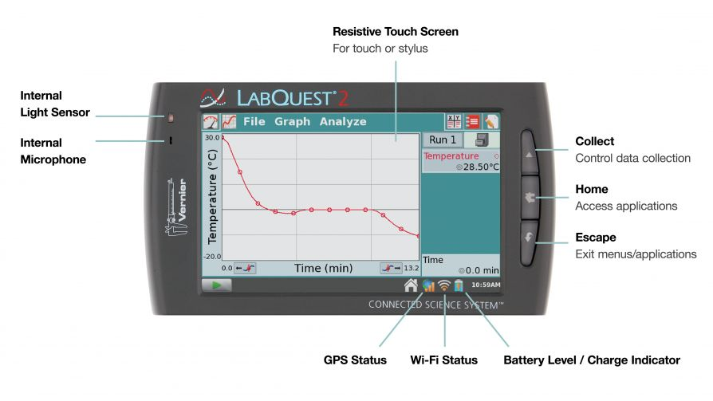

\newpage
\tableofcontents
\newpage

# Merilni sistemi

Data acquisition is the process of sampling signals that measure real world physical conditions and converting the resulting samples into digital numeric values that can be manipulated by a computer [[Wikipedia]]. Data acquisition systems, abbreviated by the acronyms DAS or DAQ, typically convert analog waveforms into digital values for processing. The components of data acquisition systems include:
- Sensors, to convert physical parameters to electrical signals.
- Signal conditioning circuitry, to convert sensor signals into a form that can be converted to digital values.
- Analog-to-digital converters, to convert conditioned sensor signals to digital values.

Data acquisition applications are usually controlled by software programs developed using various general purpose programming languages such as Assembly, BASIC, C, C++, C#, Fortran, Java, LabVIEW, Lisp, Pascal, etc. Stand-alone data acquisition systems are often called data loggers[[Wikipedia]].

There are also open-source software packages providing all the necessary tools to acquire data from different hardware equipment. These tools come from the scientific community where complex experiment requires fast, flexible and adaptable software. Those packages are usually custom fit but more general DAQ package like the Maximum Integrated Data Acquisition System can be easily tailored and is used in several physics experiments worldwide[[Wikipedia]].

## Importance of real-life experiments for students

- where theory finds its place
- greater motivation for learning
- more (learning) input --> beater understanding
    
    ---

- instant data processing
- explicit presentation of interdependent variables
- visualization of physical quantities that are detected by human nature

## Parts of a DAQ System [[NationalInstruments]]

{#fig:slika}

### What Is a Sensor?

The measurement of a physical phenomenon, such as the temperature of a room, the intensity of a light source, or the force applied to an object, begins with a sensor. A sensor, also called a transducer, converts a physical phenomenon into a measurable electrical signal. Depending on the type of sensor, its electrical output can be a voltage, current, resistance, or another electrical attribute that varies over time. Some sensors may require additional components and circuitry to properly produce a signal that can accurately and safely be read by a  DAQ device [[NationalInstruments]]. Kot v enačbi [@eq:Ohmov]  in na sliki [@fig:ArduinoUNO.jpg].

[@WhatIsDa17:online]

### What Is a DAQ Device?

DAQ hardware acts as the interface between a computer and signals from the outside world. It primarily functions as a device that digitizes incoming analog signals so that a computer can interpret them. The three key components of a DAQ device used for measuring a signal are the signal conditioning circuitry, analog-to-digital converter (ADC), and computer bus. Many DAQ devices include other functions for automating measurement systems and processes. For example, digital-to-analog converters (DACs) output analog signals, digital I/O lines input and output digital signals, and counter/timers count and generate digital pulses[NationalInstruments].

### What Is a Computer’s Role in a DAQ System?

A computer with programmable software controls the operation of the DAQ device and is used for processing, visualizing, and storing measurement data. Different types of computers are used in different types of applications. A desktop may be used in a lab for its processing power, a laptop may be used in the field for its portability, or an industrial computer may be used in a manufacturing plant for its ruggedness [[NationalInstruments]].

## Teoretične osnove

### Digitalizacija

### Frek. vzorčenja

### Resolucija vs ločljivost

### Natančnost vs točnost

### Napake (naključna, sistemska)

# Merilne naprave

Pri fizikalnih eksperimentih pogosto uporabljamo merilne naprave, s katerimi želimo potrditi teoretične principe in fizikalne pojave. V šolskem prostoru najpogosteje uporabljamo Vernier-jevo merilno napravo LabQuest Hardware @LabQuest30:online , ki nam omogoča raznovrstne meritve.

## Vernier's DAQs



Poglejmo si nekaj podatkov o napravi:

- **Display**
  + 11.2 cm x 6.7 cm (13.1 cm diagonal) screen
  + 00 x 480 pixel color display at 188 dpi
  + ED backlight
  + ortrait or landscape screen orientation
  + igh-contrast mode for outdoor visibility
- **Processor**
  + 800 MHz Application Processor
- **Connectivity**
  + Wi-Fi 802.11 b/g/n @ 2.4GHz
  + Bluetooth Smart for WDSS and Go Wireless Sensors
- **User Interface**
  + Resistive touch screen
  + Touch and stylus navigation for efficiency and precision
- **Data Acquisition**
  + 100,000 samples per second
  + 12-bit resolution
  + Built-in GPS, 3-axis accelerometer, ambient temperature, light, and microphone
- **Environmental Durability**
  + Operating Temperature: 0  + 45°C
  + Storage Temperature: -30  + 60°C
  + Splash resistant
  + Rugged enclosure designed to withstand a fall from lab bench
- **Size and Weight**
  + Size: 8.8 cm x 15.4 cm x 2.5 cm
  + Weight: 350 g
- **Ports**
  + 5 sensor channels
  + USB port for sensors, flash drives, and peripherals
  + USB mini port
  + DC power jack
  + MicroSD/MMC slot
  + Audio in and out
- **Storage**
  + 200 MB
  + Expandable with MicroSD and USB flash drive
- **Power**
  + Rechargeable, high-capacity battery
  + DC charging/powering through external adapter (included)
- **cena:**
  + $455

Seveda pa morate dokupiti še senzorje, ki tudi niso cenovno ugodni, saj se njihova cena giblje od $30 ... naprej.

## Arduino Data Acquisition System

On the market we can find different DAQ systems which are hi-end products and often expencive (from 100 € .. n k€). Buy we can use Arduino (Uno, nano, ...) as low-cost data acqusition system if we do not need scientific accurate data (for pedagogical purposes).

[[NationalInstruments]]

### Requirements

(Checked is required, unchecked is optional)

**Hardware**:

- [x] Computer
- [x] Arduino board ([Arduino UNO](https://store.arduino.cc/arduino-uno-rev3), [Arduino LEONARDO](https://store.arduino.cc/arduino-leonardo-with-headers), [Arduino NANO](https://store.arduino.cc/arduino-nano), [clone products](https://www.aliexpress.com/item/Nano-CH340-ATmega328P-MicroUSB-Compatible-for-Arduino-Nano-V3/32572612009.html?spm=2114.search0104.3.1.34b52b20RGIwod&ws_ab_test=searchweb0_0,searchweb201602_4_10152_10151_10065_10344_10068_10342_10343_10340_10341_10084_10083_10618_10304_10307_10301_5711212_10313_10059_10534_100031_10103_10627_10626_10624_10623_10622_10621_10620_5722413_5711313,searchweb201603_25,ppcSwitch_5&algo_expid=d5f1485f-be15-4f3e-93b6-b3120c7b8ac3-0&algo_pvid=d5f1485f-be15-4f3e-93b6-b3120c7b8ac3&transAbTest=ae803_3&priceBeautifyAB=0) )
- [x] basic electronics components for sensors
- [ ] arduino set starter [for example use this kit](https://www.aliexpress.com/item/The-Best-RFID-Starter-Kits-For-Arduino-Uno-R3-With-Tutorial-Power-Supply-Learning-Kit-US/32623921742.html?spm=2114.10010108.1000013.3.1f3929415iOC4y&traffic_analysisId=recommend_2088_2_90158_iswistore&scm=1007.13339.90158.0&pvid=256e4e8d-3f20-47e9-b3d3-56af5fadcd51&tpp=1)
- [ ] arduino sensors set [for example use this kit](https://www.aliexpress.com/item/37-In-1-Sensor-Kits-For-Arduino-Raspberry-Pi-Beginner-Learning-Sensor-Module-Suit-Ultimate-Top/32851582028.html?spm=2114.search0104.3.29.66a36682D8jqIb&ws_ab_test=searchweb0_0,searchweb201602_4_10152_10151_10065_10344_10068_10342_10343_10340_10341_10084_10083_10618_10304_10307_10301_5711211_10313_10059_10534_100031_10103_10627_10626_10624_10623_10622_5722411_5711315_10621_10620,searchweb201603_25,ppcSwitch_5&algo_expid=4674573e-7df9-4805-bd73-64edd1408ad6-4&algo_pvid=4674573e-7df9-4805-bd73-64edd1408ad6&transAbTest=ae803_3&priceBeautifyAB=0)

**Software**:

- [x] Arduino IDE [download here](https://www.arduino.cc/en/Main/Software)
- [ ] Python (>=3.0)
- [ ] pyserial
- [ ] Ms Excel

### Pros & Cons
| **Pros**                              | **Cons**                  |
|---------------------------------------|---------------------------|
| + Price (Arduino ~3€, sensors ~2-5€)  | - work in progress        |
| + Accessibility                       | - no plug&play solutions  |
| + Versatility                         | - DIY project             |
| + Easy importing data into MS Excel   | - low sampling rate ~6kHz |
| + točne časovne meritve               | - 10-bi resolutuin        |

More about DAQ you can read in further reading... 


> Kaj ko bi si lahko naredili svojo merilno napravo?

V ta namen smo ustvarili nekaj vsebin na portalu [GitHub](https://github.com/davidrihtarsic/Arduino-Data-Acquisition-Device)...

# Arduino UNO

Arduino Uno je:

> The UNO is the best board to get started with electronics and coding. If this is your first experience tinkering with the platform, the UNO is the most robust board you can start playing with. The UNO is the most used and documented board of the whole Arduino family.
@ArduinoU75:online


Na plošči vsebuje mikrokrmilnik **Atmega328**, ki lahko "opravi" podobne naloge, kot smo jih opisali v poglavju "Merilne naprave".

Poglejmo si nekaj karakteristik tega mikrokrmilnika [@ATmega328P_Datasheet:online]: 

- **Advanced RISC Architecture**
  + 131 Powerful Instructions
  + Most Single Clock Cycle Execution
  + 32 x 8 General Purpose Working Registers
  + Fully Static Operation
  + Up to 20 MIPS Throughput at 20MHz
  + On-chip 2-cycle Multiplier
- **High Endurance Non-volatile Memory Segments**
  + 32KBytes of In-System Self-Programmable Flash program
Memory
  + 1KBytes EEPROM
  + 2KBytes Internal SRAM
  + Write/Erase Cycles: 10,000 Flash/100,000 EEPROM
  + Data Retention: 20 years at 85°C/100 years at 25°C(1)
  + Optional Boot Code Section with Independent Lock Bits
    - In-System Programming by On-chip Boot Program
    - True Read-While-Write Operation
  + Programming Lock for Software Security
- **Atmel® QTouch® Library Support**
  + Capacitive Touch Buttons, Sliders and Wheels
  + QTouch and QMatrix® Acquisition
  + Up to 64 sense channels
- **Peripheral Features**
  + Two 8-bit Timer/Counters with Separate Prescaler and Compare Mode
  + One 16-bit Timer/Counter with Separate Prescaler, Compare Mode, and Capture Mode
  + Real Time Counter with Separate Oscillator
  + Six PWM Channels
  + ADC
    * 8-channel 10-bit ADC in TQFP and QFN/MLF package
    * Temperature Measurement
    * 6-channel 10-bit ADC in PDIP Package
    * 10-bit Resolution
    * 0.5 LSB Integral Non-Linearity
    * ±2 LSB Absolute Accuracy
    * 13 - 260μs Conversion Time
    * Up to 76.9kSPS (Up to 15kSPS at Maximum Resolution)
    * Six Multiplexed Single Ended Input Channels
    * Two Additional Multiplexed Single Ended Input Channels (TQFP and VFQFN Package only)
    * Temperature Sensor Input Channel
    * Optional Left Adjustment for ADC Result Readout
    * 0 - VCC ADC Input Voltage Range
    * Selectable 1.1V ADC Reference Voltage
    * Free Running or Single Conversion Mode
    * Interrupt on ADC Conversion Complete
    * Sleep Mode Noise Canceler
  + Two Master/Slave SPI Serial Interface
  + One Programmable Serial USART
  + One Byte-oriented 2-wire Serial Interface (Philips I2C compatible)
  + Programmable Watchdog Timer with Separate On-chip Oscillator
  + One On-chip Analog Comparator
  + Interrupt and Wake-up on Pin Change
- **Special Microcontroller Features**
  + Power-on Reset and Programmable Brown-out Detection
  + Internal Calibrated Oscillator
  + External and Internal Interrupt Sources
  + Six Sleep Modes: Idle, ADC Noise Reduction, Power-save, Power-down, Standby, and
Extended Standby
- **I/O and Packages**
  + 23 Programmable I/O Lines
  + 28-pin PDIP, 32-lead TQFP, 28-pad QFN/MLF and 32-pad QFN/MLF
- **Operating Voltage:**
  + 1.8 - 5.5V
- **Temperature Range:**
  + -40°C to 105°C
- **Speed Grade:**
  + 0 - 4MHz @ 1.8 - 5.5V
  + 0 - 10MHz @ 2.7 - 5.5V
  + 0 - 20MHz @ 4.5 - 5.5V
- **Power Consumption at 1MHz, 1.8V, 25°C**
  + Active Mode: 0.2mA
  + Power-down Mode: 0.1μA
  + Power-save Mode: 0.75μA (Including 32kHz RTC)

## Arduino UNO/NANO pinout

![Razporeditev priključkov na krmilniku Arduino UNO [@ArduinoUNOpinout:online].](./slike/Arduino-UNO-pinout.jpeg){#fig:Arduino-UNO-pinout.jpeg}

![Razporeditev priključkov na krmilniku Arduino NANO [@ArduinoUNOpinout:online].](./slike/nano.png){#fig:nano.png}

Kot lahko opazimo, so funkcije priključkov na sliki [@fig:Arduino-UNO-pinout.jpeg] in sliki [@fig:nano.png] enaki. To ni nenavadno, saj sta krmilnika po električni zgradbi enaka, razlikujeta se le v fizični izvedbi.

## Osnove programiranja krmilnika
- Arduino --> Blink

# Merjenje s krmilnikom Arduino UNO

## Časovne meritve

### Hitrost

### Pospešek

## Merjenje napetosti

### Izračun napetosti

> Vaja: Študentje napišejo program za merjenje napetosti z ADC vmesnikom.

```cpp
void setup() {
  pinMode(15, OUTPUT);
  digitalWrite(15,LOW);
  pinMode(14, INPUT_PULLUP); //A0
  // initialize the serial communication:
  Serial.begin(9600);
}

void loop() {
  // send the value of analog input 0:
  int CH1 = analogRead(A0);
  
  Serial.print("0,1023,");
  Serial.println(CH1);

  // wait a bit for the analog-to-digital converter to stabilize after the last
  // reading:
  delay(10);
}
```
## Prikazovanje podatkov
### Serijski izpis
### Grafični izris
### Izpis na LCD

# Statistična obdelava meritev (praznenje kondenzatorja)
## Vezje in zajem podatkov
## Linearizacija
## Povprečna vr.
## Smerni koef.
## Standardna napaka

# Umerjanje (temperaturnega) senzorja

## Umerjanje
> Vaja: Naredimo umeritven postopek.

```cpp
String inputString = "";         // a String to hold incoming data
boolean stringComplete = false;  // whether the string is complete

void setup() {
  int pin_gnd=16;
  int pin_vcc=15;
  pinMode(pin_gnd, OUTPUT);
  pinMode(pin_vcc, OUTPUT);
  digitalWrite(pin_gnd, LOW);
  digitalWrite(pin_vcc, HIGH);
  // initialize the serial communication:
  Serial.begin(9600);
  Serial.println("###########################################");
  Serial.println("# INSTRUCTIONS:                           #");
  Serial.println("#   1. Insert temperature (example: 22.4) #");
  Serial.println("#   2. then press ENTER                   #");
  Serial.println("#   3. repeat steps 1. and 2. ...         #");
  Serial.println("# When you are done with calibration:     #");
  Serial.println("#   4. Copy data to spreadsheet.          #");
  Serial.println("#   5. Add some polynome to the points.   #");
  Serial.println("#   6. Insert coeficients into file:      #");
  Serial.println("#       'temperature.ino'                 #");
  Serial.println("###########################################");
  Serial.println("T[°C] Value");
  inputString.reserve(20);
}

void loop() {

  if (stringComplete) {
    Serial.print(inputString);
    Serial.print(" ");
    inputString = "";
    stringComplete = false;

    // send the value of analog input 0:
    long CH1 = 0;

    int i;
    for (i = 0; i < 128; i++) {
      CH1 += analogRead(A7);
      delay(1);
    }
    float Vol_CH1 = float(CH1/128.0);          // calibration in ADC values...
    //float Vol_CH1 = CH1*5.0/1023; // calibration in Voltage...
    Serial.println(Vol_CH1);
  }
}

void serialEvent() {
  while (Serial.available()) {
    char inChar = (char)Serial.read();  // get the new byte:
    if (inChar == '\n') {
      stringComplete = true;
    } else {
      inputString += inChar;              // add it to the inputString:
    }
  }
}
```

## Interpolacija

in bi tako takoj naslednji študijski teden (10.5.) lahko vi že pričeli z izvedbo enega od fizikalnih eksperimentov...

## Izpis temperature (stand-alone DAQ)

> Vaja: V programskem orodju za tabele (Microsoft Excel ali LibreOffice Calc) podatkom priredimo ustrezno krivuljo in odčitamo koeficiente... Nato napišemo program:

```cpp
//            k0        k1        k2        k3        k4      k5
float k[6] = { -74.91, 530.963E-3, -1.685E-3, 3.253E-6, -3.128E-9, 1.227E-12};

void setup() {
  pinMode(15, OUTPUT);
  digitalWrite(15, HIGH);
  pinMode(16, OUTPUT);
  digitalWrite(16, LOW);
  pinMode(14, INPUT); //A0
  // initialize the serial communication:
  Serial.begin(9600);
}

void loop() {
  // send the value of analog input 0:
  int i;
  float CH1 = 0;
  for (i = 0; i < 64; i++) {
    CH1 += analogRead(A7);
    delay(3);
  }
  float Vol_CH1 = float(CH1 / 64.0);

  float Temp_CH1 = 0;
  for (int i = 0; i <= 5; i++) {
    Temp_CH1 += k[i] * pow(Vol_CH1, i);
  }
  Serial.println(Temp_CH1);
  //delay(1000);
}
```

# Senzorji
- delilnik
- toleranca uporov

# Primeri
## Merjenje srčnega utripa

> Vaja: S študenti na pišemo program za merjenje srčnega utripa s pomočjo IR senzorja.

```cpp
#include <Wire.h>¸                                              
#include <LiquidCrystal_I2C.h>                               
LiquidCrystal_I2C DaqLcd(0x27, 2, 1, 0, 4, 5, 6, 7, 3, POSITIVE); 

int sensorPin = 7;
double alpha = 0.75;
int period =100;
double change =0.0;
double minval = 0.0;

void setup() {
  DaqLcd.begin(8, 2);
  Serial.begin(9600);
}

void loop() {
  int i = 0;
  long ch = 0;
  for (i=0;i<64;i++){
    ch += analogRead(7); 
  }
 
  float val = ch/64.0;
  Serial.println(val);
}
```

\newpage
# Viri in literatura
