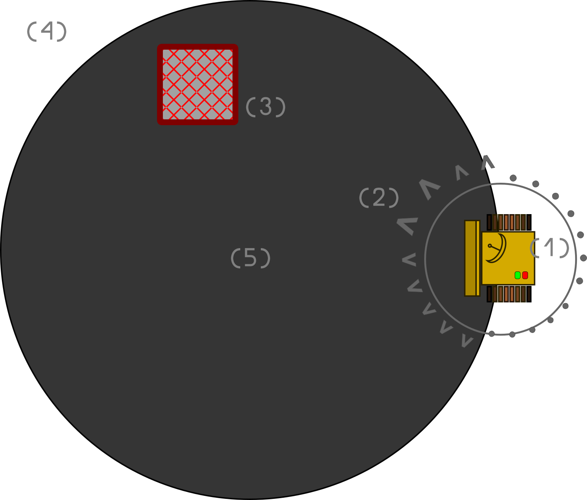

# ROBOT SUMO-BOREC

1. Robot naj se pripelje do ringa.
2. V območju ringa naj preišče prostor in najde najbližji predmet.
3. Predmetu ja se nežno približa in se ga dotakne.
4. Predmet naj porine izven ringa.
5. Robot naj se vrne na sredino ringa.

## Uporaba tipke
- za zaznavanje dotika s predmetom

## Uporaba svetlobnega tipala
- za zaznavanje ringa

## Uporaba senzorja razdalje
- iskanje najbližjega predmeta

## Uporaba PWM krmiljenja
- robot naj se nežno dotakne predmeta

## Zanimiva programska rešitev
- kako najti najbližji predmet

## Priloga

{#fig:poligon}
