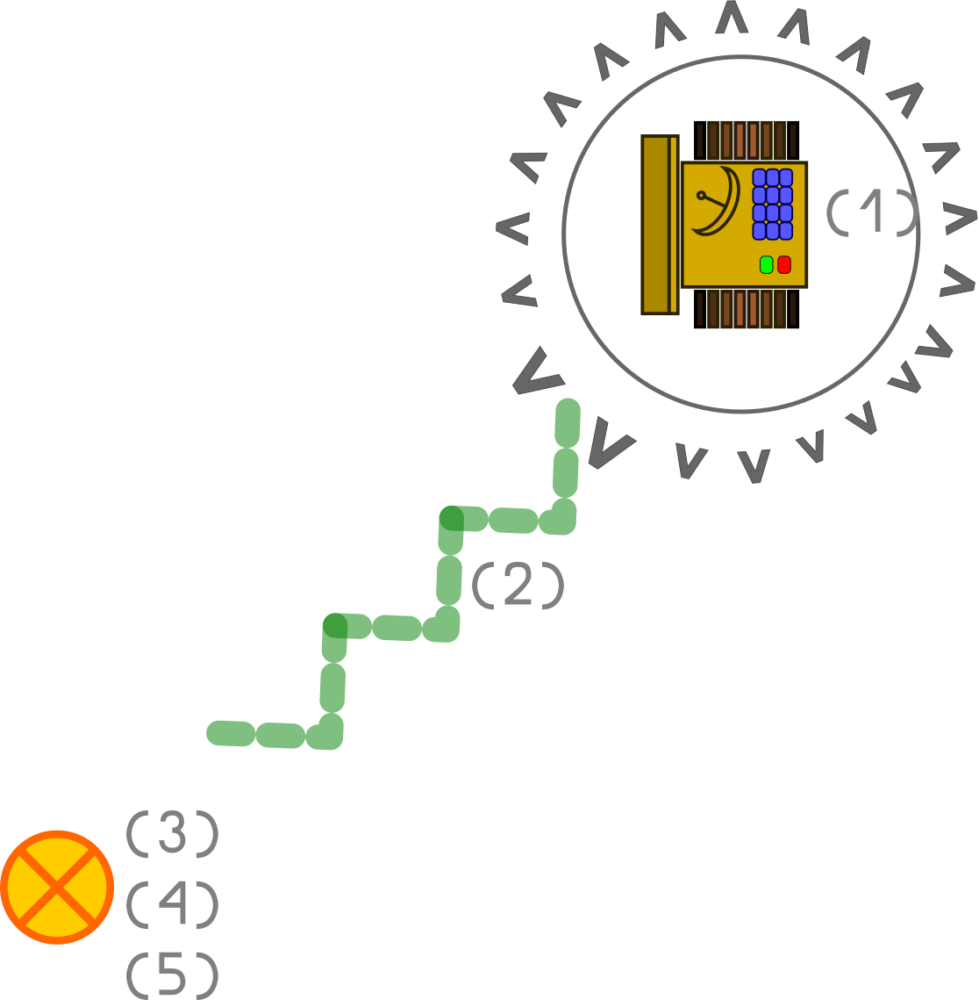

# Primitivni organizem

1. Robot naj preišče prostor okoli sebe in najde najsvetlejši predmet v okolici.
2. Pot naj nadaljuje proti predmetu.
3. V bližini predmeta naj se pelje počasneje in ko se predmeta dotakne naj se ustavi.
4. S signalno lučko naj oddaja nek periodični signal, da je našel luč.
5. Ko luč ugasne, naj ponovno prične iskati novo luč.

## Uporaba tipke
- dotik s svetilko

## Uporaba svetlobnega tipala
- iskanje najsvetlejšega predmeta

## Uporaba senzorja razdalje
- zaznavanje mize, da ne pade čez rob mize

## Uporaba PWM krmiljenja
- bolj ko je svetlo - počasneje naj se pelje

## Zanimiva programska rešitev
- iskanje najsvetlejšega predmeta v okolici

## Priloge

{#fig:poligon}
