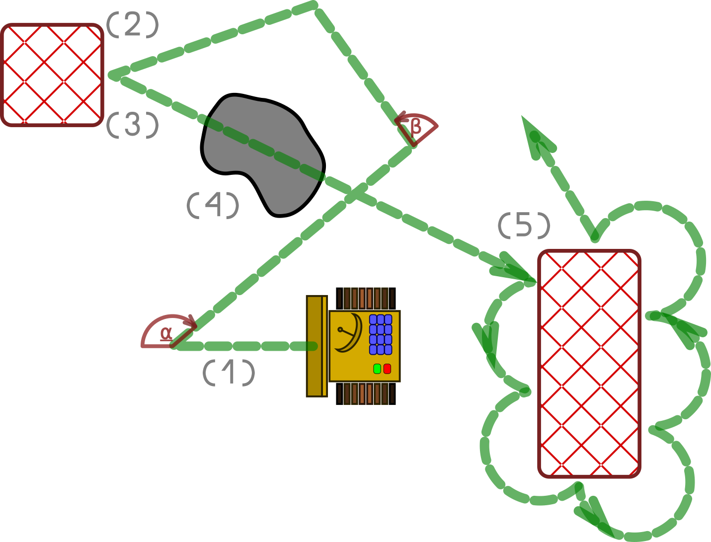

# ROBOT SESALEC

1. Robot naj naključno vozi po prostoru (različne razdalje, različni koti spremembe smeri).
2. Robot naj se med vožnjo se odmika oviram.
3. Ko je robot tik pred predmetom, naj vožnjo upočasni, da ne poškoduje predmeta.
4. Robot naj hitrost vožnje prilagaja tudi glede umazanost tal.
5. Če robot zadane oviro naj gre z nekaj krožnimi loki ob njenem robu.

## Uporaba tipke
- robotek se mora ovire dotakniti

## Uporaba svetlobnega tipala
- merjenje umazanosti tal

## Uporaba senzorja razdalje
- za merjenje razdalje do predmeta in s tem
prilagajanje hitrosti vožnje (da s polno hitrostjo
ne zadajemo ovire)

## Uporaba PWM krmiljenja
- prilagajanje hitrosti vožnje glede na:
    - umazanost tal in
    - bližino ovire

## Zanimiva programska rešitev
- naključno gibanje robota

## Poligon

{#fig:poligon}
