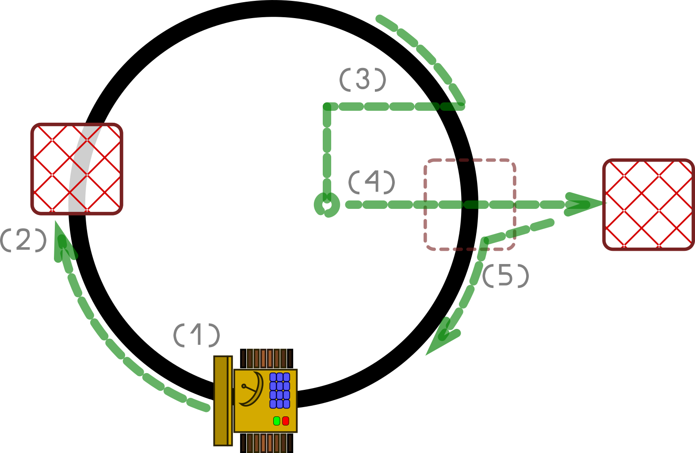

# CESTNI ČISTILEC

1. Robot naj se vozi po črti.
2. Če na poti naleti na oviro naj se pred njo ustavi.
3. Oviro naj tudi odstrani, tako da se postavi na notranjo stran ovire in
4. se počasi približa oviri ter jo potisne preko črte.
5. Nato se vrne na črto, poravna nanjo in nadaljuje vožnjo po njej.

## Uporaba tipke
- za detekcijo dotika z oviro

## Uporaba svetlobnega tipala
- za sledenje črti

## Uporaba senzorja razdalje
- za meritev razdalje do predmeta

## Uporaba PWM krmiljenja
- dotik s predmetom naj bo nežen in ne pri polni hitrosti

## Zanimiva programska rešitev
- poravnanje robota s črto

## Priloge

{#fig:poligon}
