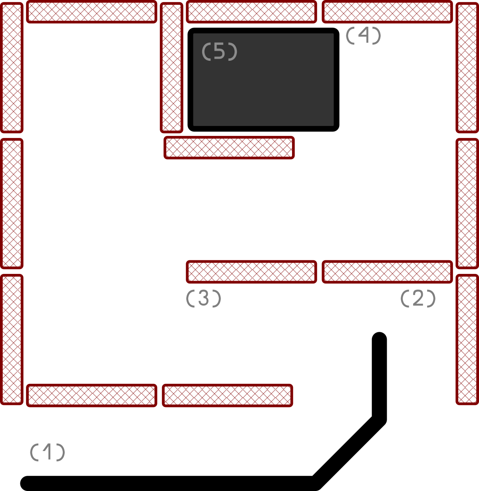

# ISKANJE MINOTAURA

1. Robot naj prične z vožnjo na črti.
2. Ko se zaleti v steno, naj vožnjo nadaljuje v labirintu.
3. Sledi naj enemu robu stene ...
4. ko pripelje do črnega kvadrata (kjer spi Minotaura), naj zmanjša hitrost vožnje.
5. Pot naj nadaljuje do roba (ozunačno s "(5)").

## Uporaba tipke
- detekcija zidu labirinta

## Uporaba svetlobnega tipala
- sledenje črti

## Uporaba senzorja razdalje
- sledenje zidu

## Uporaba PWM krmiljenja
- zmanjšana hitrost vožnje v območju kvadrata

## Zanimiva programska rešitev
- bližina zidu vs rob sobe

## Priloge

{#fig:poligon}
