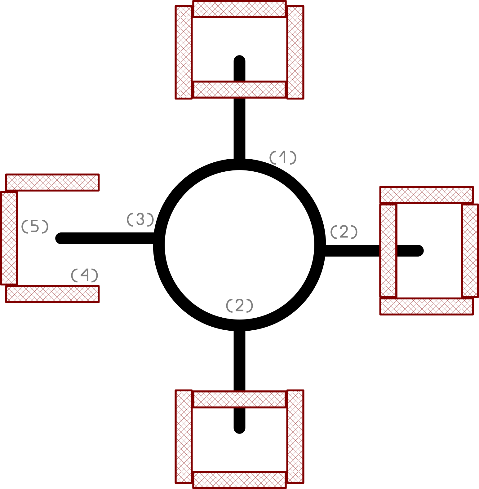

# ROBOT NAJ POIŠČE PRAZNO PARKIRIŠČE

1. Robot naj začne vožnjo na krožni črti.
2. S stranskim tipalom razdalje naj loči zaprto/zasedeno parkirišče...
3. od praznega. Tedaj naj zavije na levo in sledi črti v parkirišče.
4. Ko robot zapelje v garažo, naj zmanjša hitrost vožnje.
5. Ko se zaleti v zadnjo steno garaže, naj se ustavi.

## Uporaba tipke
- zaznavanje zadnje stene garaže.

## Uporaba svetlobnega tipala
- sledenje črti

## Uporaba senzorja razdalje
- ločevanje ne-/zasedene garaže

## Uporaba PWM krmiljenja
- hitrost vožnje v garaži

## Zanimiva programska rešitev
- zaznavanje vrste garaže

## Priloge

{#fig:poligon}
