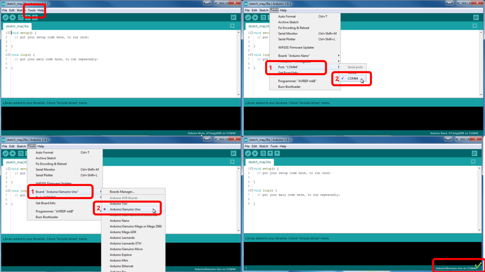

# Testiranje opreme

Vsakršno opremo je potrebno pred samo uporabo preveriti, če deluje pravilno. Zato bomo to storili z naslednjimi preizkusi.

## Arduino UNO

1. Priključite Arduino UNO v USB vodilo in zaženite program Arduino IDE.
2. Programsko okolje nastavite tako kot prikazuje [@fig:nastavitveIDE]

{#fig:nastavitveIDE}

3. Nato odprite testni program blink tako, da kliknete na:  
`Files >> Examples >> 01. Basics >> Blink.ino`

4. Nato program naložite na krmilnik s klikom na ikono:  
`UPLOAD`

## RobDuino module

1. Na krmilnik Arduino Uno priključite modul `RobDuino` in naložite naslednji program:

```cpp
void setup() {
  for (int i = 0; i < 8; i++){
    pinMode(i, OUTPUT);
  }
  pinMode(A4, INPUT_PULLUP);
  pinMode(A5, INPUT_PULLUP);
  PORTD=1;
}

int l=1;
void loop() {
  char tipka_a4_is_pressed = !digitalRead(A4); 
  char tipka_a5_is_pressed = !digitalRead(A5); 
  if (tipka_a4_is_pressed) l = l << 1;
  if (tipka_a5_is_pressed) l = l >> 1;
  if (l < 1) l = 128;
  if (l > 255) l = 1;
  PORTD = l;
  delay(100);
}
```

2. Nato preverite delovanje obeh tipk (A4 in A5) na modulu in vrednosti izhodnih priključkov D0 .. D7.

## Stikalo

1. Priključite stikalo po shemi na [@fig:tipka_test].

{#fig:tipka_test}

2. Nato naložite naslednji program.

```cpp
void setup() {
    pinMode(A0, INPUT);
    pinMode(7, OUTPUT);
}

void loop() {
    char key_a0_is_pressed = digitalRead(A0);
    if (key_a0_is_pressed){
        digitalWrite(7, HIGH);
    } else{
        digitalWrite(7, LOW);
    }
    delay(100);
}
```

## Svetlobni senzor

1. Priključite foto-tranzistor v delilnik napetosti z uporom, kot prikazuje [@fig:foto_senzor_test].

{#fig:foto_senzor_test}

2. Nato naložite naslednji program in preverite odziv svetlobnega senzorja.

```cpp
 void setup() {
  pinMode(A1, INPUT);
  Serial.begin(9600);
}

void loop() {
  int light_senzor_value = analogRead(A1);
  Serial.println(light_senzor_value);
  delay(100);
}
```

3. Odziv senzorja spremljajte v oknu serijske komunikacije.

## IR senzor razdalje

1. IR senzor razdalje priključite na tri-pinski priključek kot je prikazano na [@fig:test_IR].

{#fig:test_IR}

2. Delovanje senzorja preskusite z naslednjim programom, njegov odziv pa spremljajte v oknu za serijsko komunikacijo.

```cpp
void setup() {
  pinMode(A0, INPUT);
  Serial.begin(9600);
}

void loop() {
  int distance_senzor_value = analogRead(A0);
  Serial.println(distance_senzor_value);
  delay(100);
}
```

## LCD (I2C)

1. Priključite LCD na I2C vodilo kot prikazuje 

{#fig:test_I2C_LCD}

2. Priskrbite si knjižnico `LiquidCristal-I2C` iz naslova:  
https://www.arduino.cc/reference/en/libraries/liquidcrystal-i2c/ 
3. Knjižnico dodajte v Arduino IDE okolje tako, da dodate `ZIP` datoteko v :  
`Sketch >> Include Library >> Add .ZIP Library`
3. V VSC in PlatformIO vtičniku si lahko knjižnico naložite tako, da v terminalno okno vpišete ukaz  
`pio lib install "marcoschwartz/LiquidCrystal_I2C@^1.1.4"`

4. Nato preskusite naslednji program:

```cpp
#include <Wire.h> 
#include <LiquidCrystal_I2C.h>
LiquidCrystal_I2C Lcd(0x27, 16, 2);

void setup() {   
    Lcd.init();
    
    Lcd.clear();
    Lcd.backlight();
    
    Lcd.setCursor(3,0);
    Lcd.print("Hello");
    Lcd.setCursor(6,1);
    Lcd.print("World");   
}

void loop() {
}
```

Če niste prepričani kateri i2c naslov uporablja naprava na LCD-ju le tega lahko preverite s programom `I2C scanner` (https://playground.arduino.cc/Main/I2cScanner/). Običajno I2C LCD-ji, ki jih naredijo kitajski proizvajalci uporabljajo I2C naslov `0x27` , `0x3F` ali manj pogosto `0x38`.

