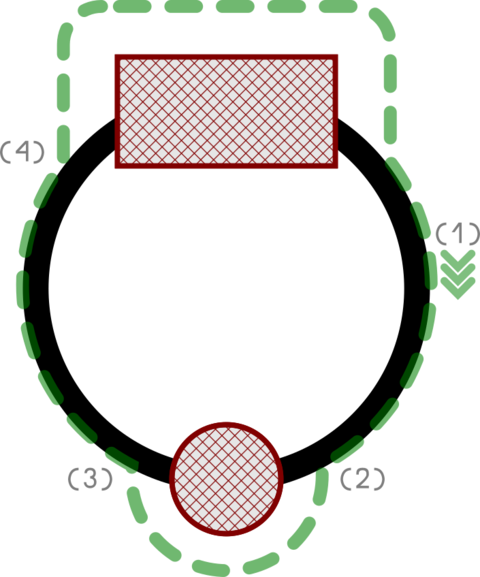

# Vožnja po črti z oviro

1. Robotek naj vozi po črti (po robu črte - glej [@fig:poligon] ).
2. Ko zazna oviro naj pot nadaljuje okoli nje (lahko tudi krmiljeno le s časovnimi zakasnitvami).
3. Na drugi strani naj zopet najde črto in se na njo poravna
4. Vožnja okoli ovire naj bo sprogramirana tako, da je predmet lahko različnih dimenzij.

## Priloga

{#fig:poligon}
