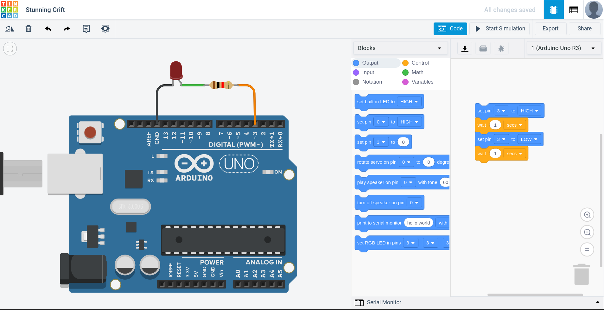

# Simulating physical robot

We can use several simulating programs to simulate robots. There are awesome platforms that allow simulations like: 3Dvisualizer or Webots ... But since our robot will be based on the Arduino Uno controller probably the best option is:

- [Thinkercad](https://www.tinkercad.com/dashboard)

You can sign in with your google account.

Try to do some basic project (e.g. Blink) to turn on and off an LED like is shown on the [@fig:blink_tc].

{#fig:blink_tc}

