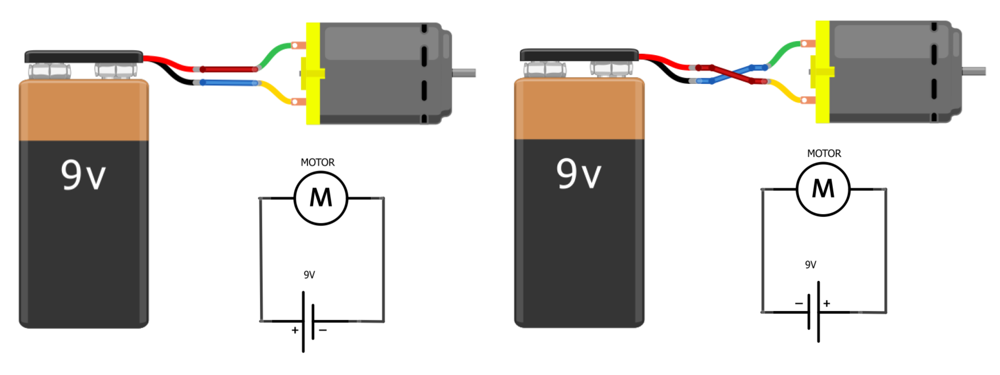
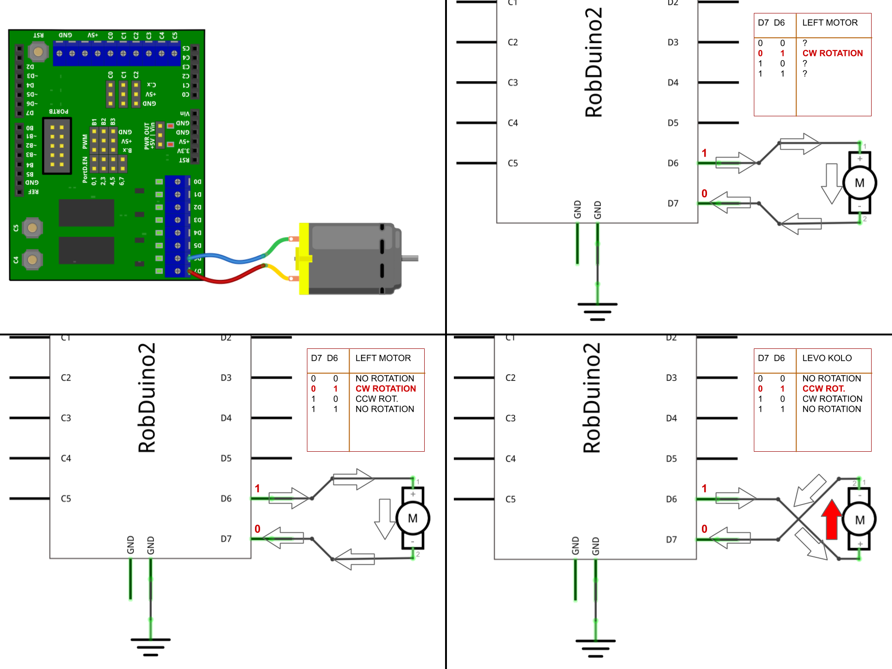

# HOW THE DC MOTOR WORKS

## Task:

1. Connect the DC motor to the battery and make it run.
2. You can try different combinations to connect the terminals of the motor like:
    - + and -
    - - and +
    - - and -
    - + and +.

{#fig:DC_motor}

## Questions:

1.  In which direction the motor\'s shaft spins in different situations?
2.  In which direction the electric current flow?
3.  Why does motor is not spinning when both connectors are connected to +
    terminal of the battery?

> ## Summary
> The rotation of the DC motor depends on the direction of electric
> current.
> 
> ## Issues
> ### *When I connect the DC motor to + and - terminals of the battery the motor\'s shaft does not spin.*
> 
> Check the voltage of the battery... battery may be discharged.  
> Check the connectors of the motor... may be bad.  

# CONTROLLING THE DC MOTOR WITH DIGITAL OUTPUTS

## Task:

1. Connect the DC motor to Digital Output D7 and D6.
2. Write the program and check all the combinations of digital outputs;
    00, 01, 10 and 11.

| D7 | D6 | Motor is spinning |
|:--:|:--:|-------------------|
|  0 |  0 |                   |
|  0 |  1 |                   |
|  1 |  0 |                   |
|  1 |  1 |                   |
Table: All combinations of the states of motor's connectors. {#tbl:motor_combo}

## Questions:

1.  For each combination of digital outputs mark the state of the motor (fulfill the [@tbl:motor_combo ]).
2.  Try to stop the shaft of the DC motor for a short time and try to
    remember how difficult it is?

{#fig:connect_motor}

> ## Summary
> 
> The motor\'s shaft is spinning according to the direction of the
> electric current trough the motor.  
> The torque is weak.
> 
> ## Issues
>
