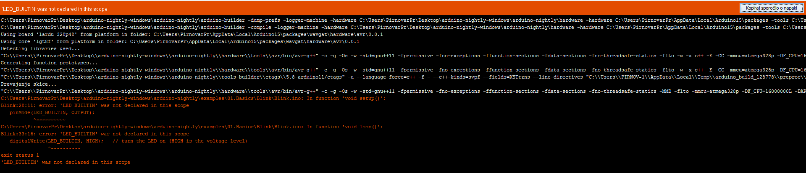
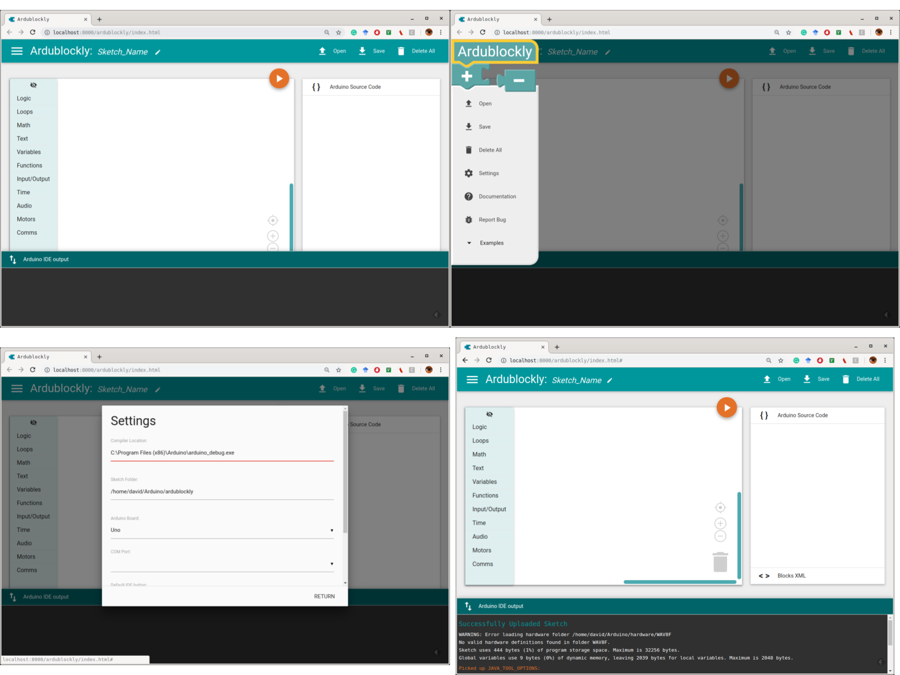
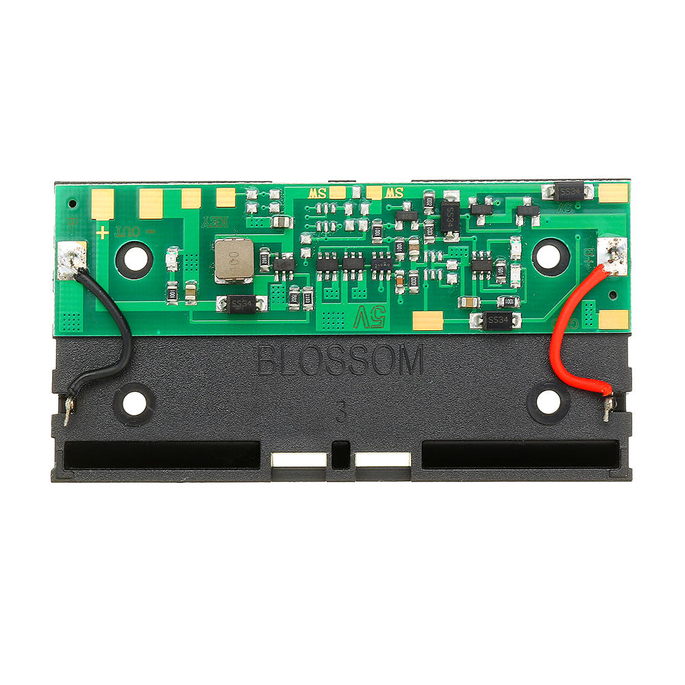

# EQUIPMENT TESTING

## Basic testing in Arduino IDE

1. Connect the Arduino Uno to PC with proper USB cable.  
    `[Arduino Uno]` 
2. Open Arduino IDE program and open program with:  
    `Files -  Examples - 01. Basics - Blink.ino`
3. Make shure that you will set the proper settings (see [@fig:Arduino_basic_setup_IDE]). From the menu choose:  
    `Tools`-
    1.  `Board:` Arduino/Genuino Uno
    2.  `Port:` COM3

{#fig:Arduino_basic_setup_IDE}

-   To upload the code you can click the icon `Upload`.  
    If the uploading was successful you will be prompted with the text
    like:  

> ```
> Done uploading.  
> Sketch uses 970 bytes (3%) of program storage space. Maximum
> is 32256 bytes. Global variables use 9 bytes (0%) of dynamic
> memory, leaving 2039 bytes for local variables. Maximum is
> 2048 bytes.
> ```

> ## Issues
>
> ### LED_BUILTIN was not declared in this scope
>
> {#fig:VAR_was_not_declared_IDE}
>
> Compiler ne ve kaj naj bi bilo "LED_BUILTIN" ... na tem mesu naj bi bila številka priključka, ki ga želimo krmiliti. V tem primeru je to številka 13. Rešitvi sta lahko 2:  
> 1. vse LED_BUILTIN zamenjaš s 13 ali  
> 2. v vrstico pred "void setup()" dodaj `const int LED_BUILTIN = 13;`
>
> Zadnja (druga) rešitev je boljša, ker pripomore k berljivosti programa... Spremenljivka LED_BUILTIN se imenuje "razlagalna spremenljivka" ker pomaga razlagati program. Tako postane tisti komentar "// turn the LED on (HIGH is the voltage level)" nepotreben, saj sama koda pove točno enako.

## Basic testing in Ardublockly

1. Connect the Arduino Uno to PC with proper USB cable.  
    `[Arduino Uno]` 
2. Run Ardublockly program. Which will be running as localhost and you will be using internet browser as IDE. The addres will be:  
    `http://localhost:8000/ardublockly/index.html`
3. In the left corner of the program you can find `[=] menu icon`. From where you can choose (Slide 2 and 3)  
    `[] Settings`:
    1.  `Compiler Location:` C:\\Program Files (x86)\\Arduino\\arduino\_debug.exe
    2.  `Arduino Board:` Uno
    3.  `Com port:` COM3
    4.  And press:`[ RETURN ]`
4. Finaly you can press button `PLAY` And if uploading was successful you will be prompted with the text (Slide 4):  


{#fig:Ardublockly_basic_setup}

> ```
> Successfully Uploaded Sketch
> WARNING: Error loading hardware folder /home/david/Arduino/hardware/WAV8F.
> No valid hardware definitions found in folder WAV8F.
> Sketch uses 444 bytes (1%) of program storage space. Maximum is
> 32256 bytes. Global variables use 9 bytes (0%) of dynamic memory,
> leaving 2039 bytes for local variables. Maximum is 2048 bytes.
> ```

> ## Summary
> Before uploading the programming code always check that the right board and serial port are set.
>
> ## Issues
> **Ardublockly returns the Error id 55: Serial port Serial Port unavailable.**  
> Try to re-connect the Arduino board. Wait a moment, check the settings and choose the COM port again then try again.


## RobDuino module

1. Na krmilnik Arduino Uno priključite modul `RobDuino` in naložite naslednji program:

```cpp
void setup() {
  for (int i = 0; i < 8; i++){
    pinMode(i, OUTPUT);
  }
  pinMode(A4, INPUT_PULLUP);
  pinMode(A5, INPUT_PULLUP);
  PORTD=1;
}

int l=1;
void loop() {
  char tipka_a4_is_pressed = !digitalRead(A4); 
  char tipka_a5_is_pressed = !digitalRead(A5); 
  if (tipka_a4_is_pressed) l = l << 1;
  if (tipka_a5_is_pressed) l = l >> 1;
  if (l < 1) l = 128;
  if (l > 255) l = 1;
  PORTD = l;
  delay(100);
}
```

2. Nato preverite delovanje obeh tipk (A4 in A5) na modulu in vrednosti izhodnih priključkov D0 .. D7.

## Napajalni modul

Napajalni modul uporablja 2x Li-ion akumulatorja tipa 18650. Spodnje tiskano vezje je prikazano [@fig:napajalni_modul].

{#fig:napajalni_modul width=8cm}

Dodatno smo ga opremili z:

1. 2.5mm jack priključkom za napajanje,
2. 3-pinskim priključkom za napajanje,
3. preklopnim stikalom za izbiranje načina delovanja:
    1. ON - izhod za 9V je kaktiviran
    2. OFF - izključen izhod 9V napajanja in omogočeno je polnenje akumulatorjev preko 3-pinskega priključka (5V).

>Pomembno: Pred prvo uporabo moramo ročno aktivirati napajalni modul tako, da povežemo GND na 3-pinskem priključku in NEGATIVNI terminal akumulatorjev.

## Tipka

1. Priključite stikalo po shemi na [@fig:tipka_test].

{#fig:tipka_test}

2. Nato naložite naslednji program.

```cpp
void setup() {
    pinMode(A0, INPUT);
    pinMode(7, OUTPUT);
}

void loop() {
    char key_a0_is_pressed = digitalRead(A0);
    if (key_a0_is_pressed){
        digitalWrite(7, HIGH);
    } else{
        digitalWrite(7, LOW);
    }
    delay(100);
}
```

## Svetlobni senzor

1. Priključite foto-tranzistor v delilnik napetosti z uporom, kot prikazuje [@fig:foto_senzor_test].

{#fig:foto_senzor_test}

2. Nato naložite naslednji program in preverite odziv svetlobnega senzorja.

```cpp
 void setup() {
  pinMode(A1, INPUT);
  Serial.begin(9600);
}

void loop() {
  int light_senzor_value = analogRead(A1);
  Serial.println(light_senzor_value);
  delay(100);
}
```

3. Odziv senzorja spremljajte v oknu serijske komunikacije.

## IR senzor razdalje

1. IR senzor razdalje priključite na tri-pinski priključek kot je prikazano na [@fig:test_IR].

{#fig:test_IR}

2. Delovanje senzorja preskusite z naslednjim programom, njegov odziv pa spremljajte v oknu za serijsko komunikacijo.

```cpp
void setup() {
  pinMode(A0, INPUT);
  Serial.begin(9600);
}

void loop() {
  int distance_senzor_value = analogRead(A0);
  Serial.println(distance_senzor_value);
  delay(100);
}
```

## LCD (I2C)

1. Priključite LCD na I2C vodilo kot prikazuje 

{#fig:test_I2C_LCD_2}

2. Priskrbite si knjižnico `LiquidCristal-I2C` iz naslova:  
https://www.arduino.cc/reference/en/libraries/liquidcrystal-i2c/ 
3. Knjižnico dodajte v Arduino IDE okolje tako, da dodate `ZIP` datoteko v :  
`Sketch >> Include Library >> Add .ZIP Library`
3. V VSC in PlatformIO vtičniku si lahko knjižnico naložite tako, da v terminalno okno vpišete ukaz  
`pio lib install "marcoschwartz/LiquidCrystal_I2C@^1.1.4"`

4. Nato preskusite naslednji program:

```cpp
#include <Wire.h> 
#include <LiquidCrystal_I2C.h>
LiquidCrystal_I2C Lcd(0x27, 16, 2);

void setup() {   
    Lcd.init();
    
    Lcd.clear();
    Lcd.backlight();
    
    Lcd.setCursor(3,0);
    Lcd.print("Hello");
    Lcd.setCursor(6,1);
    Lcd.print("World");   
}

void loop() {
}
```

Če niste prepričani kateri i2c naslov uporablja naprava na LCD-ju le tega lahko preverite s programom `I2C scanner` (https://playground.arduino.cc/Main/I2cScanner/). Običajno I2C LCD-ji, ki jih naredijo kitajski proizvajalci uporabljajo I2C naslov `0x27` , `0x3F` ali manj pogosto `0x38`.


