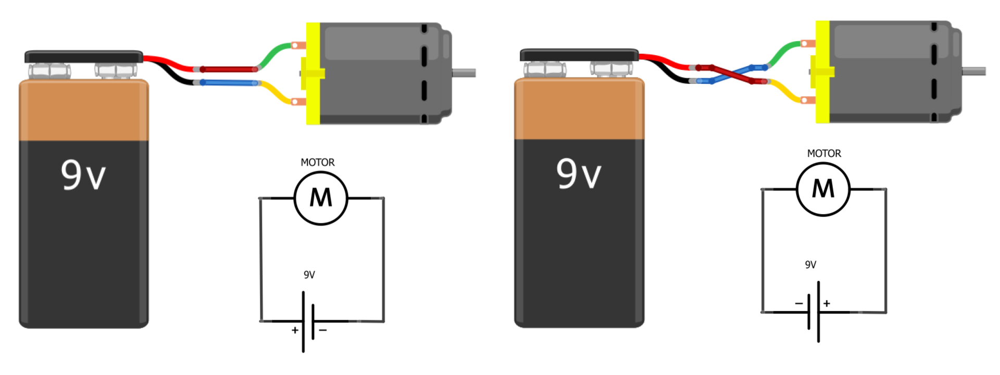

# HOW THE DC MOTOR WORKS

## Task: MAKE DC MORTOT RUN

1. Connect the DC motor to the battery and make it run.
2. You can try different combinations to connect the terminals of the motor like:
    - \+ and -
    - \- and +
    - \- and -
    - \+ and +.

## Questions:

1.  In which direction the motor\'s shaft spins in different situations?
2.  In which direction the electric current flow?
3.  Why does motor is not spinning when both connectors are connected to +
    terminal of the battery?

> ## Summary
> The rotation of the DC motor depends on the direction of electric
> current.
> 
> ## Issues
> ### *When I connect the DC motor to + and - terminals of the battery the motor\'s shaft does not spin.*
> 
> Check the voltage of the battery... battery may be discharged.  
> Check the connectors of the motor... may be bad.  

