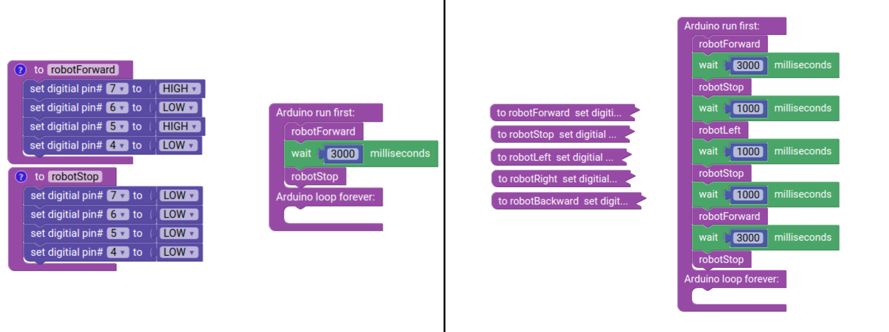

# PROGRAMMING FUNCTIONS

## Task: WRITE A FUNCTION

1. Write a programming functions which includes the certain programming steps in order to move the robot in specific direction. Some examples are presented in [@fig:functions_ardublockly].

{#fig:functions_ardublockly}

2. Write also other functions like:
    -   `robotForward()`
    -   `robotStop()`
    -   `robotLeft()`
    -   `robotRight()`
    -   `robotBackward()`
3. Write longer program to move the robot allover the classroom.

## Questions:

1.  What would happened if several robots would have the same program?
2.  Can you change the program in a way that robot would repeat the program?
3.  What happens if the mobile robot run into an obstacle?

> ## Summary:
> 
> ### <++>
> 
> ### Issues:
> 
> ### *<++>*

