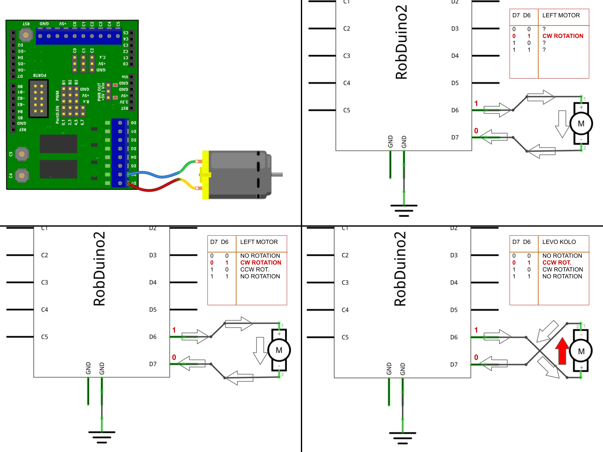

# DC MOTOR CONTROL WITH DIGITAL OUTPUTS

## Task:

1. Connect the DC motor to Digital Output D7 and D6.
2. Write the program and check all the combinations of digital outputs;
    00, 01, 10 and 11. First combination is shown in [@lst:190_DC_Motor_Control_with_Digital_Outputs]

```cpp
void setup()
{
  pinMode(7, OUTPUT);
  pinMode(6, OUTPUT);
  // D7=0, D6=0
  digitalWrite(7, LOW);
  digitalWrite(0, LOW);
  delay(3000);
  // Write other combinations here...

}
void loop()
{

}
```
: DC Motor Control with Digital Outputs. {#lst:190_DC_Motor_Control_with_Digital_Outputs}

3.  For each combination of digital outputs mark the state of the motor (fulfill the [@tbl:motor_combo ]).

| D7 | D6 | Motor rotation |
|:--:|:--:|----------------|
|  0 |  0 |                |
|  0 |  1 |                |
|  1 |  0 |                |
|  1 |  1 |                |
Table: All combinations of the states of motor's connectors. {#tbl:motor_combo}

## Questions:

2.  Try to stop the shaft of the DC motor for a short time and try to remember how difficult it is?
3.  Why does motors' shaft not spinning if the digital output state are  `1` and `1`.



> ## Summary
> 
> The motor\'s shaft is spinning according to the direction of the
> electric current trough the motor.  
> The torque is weak.
> 
> ## Issues  

