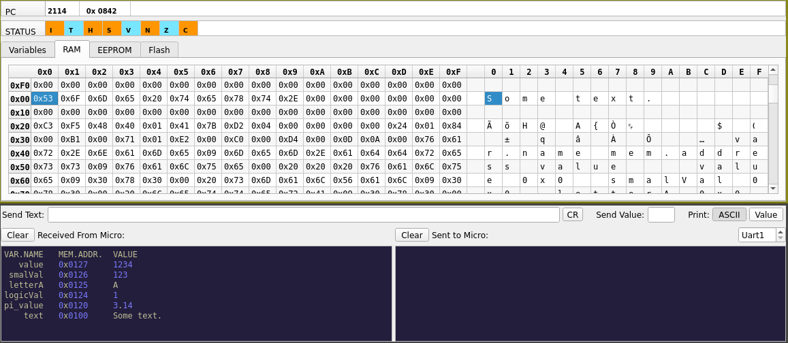

# VARIABLES AND DATA TYPES

In earlier examples we have stored some values into `variables` (e.g counting `for-nex loop` repetition). Variables are the containers for storing data values usually located in RAM (also in EPROM, FLASH ...). In order to store different data (e.g. numbers, words ...) we have to use different type of variables. The declaration of the variable ( =creation ) has next syntax:

```cpp
type varialble_name = value;
```

With next example we will solve the problem how to make light blinking while the robot is driving in reverse.

## Task: USING VARIABLES

1. Start with this example of driving the robot for 3s forward and then for 3s backward. Test program example in [@lst:250_Variables_and_Data_Types]. Then try to add some code to blink the light while the robot is driving backward.

```cpp
#include "RobotMovingFunctions.h"
void setup()
{
  setIOpins();

  moveForward();
  delay(3000);
  moveBack();
  deay(3000);
  stopTheRobot();
}
void loop()
{
}
```
: Variables and Data Types. {#lst:250_Variables_and_Data_Types}

2. As you probably find out you have to divide the duration of 3000 ms into smaller durations and meanwhile controlling the light output. This can be done with`for-next` loop which repeats 10 times.

    Change the $9^{th}$ line `delay(3000)` in previous example into `for-next` loop with 10 repetition, but with the same overall duration of 3000 ms.

```cpp
...
moveBack();
for (int i = 0; i < 10; i++)
{
  delay(150);
  delay(150);
}
stopTheRobot();
...
```

3. Add some code for blinking the LED in the `for-next loop` during the robot is driving backward.

    > Don't forget to set the REVERSE_LIGHT_PIN value and its `pinMode(...)`.

```cpp
...
moveBack();
for (int i = 0; i < 10; i++)
{
  digitalWrite(REVERSE_LIGHT_PIN, HIGH);
  delay(150);
  digitalWrite(REVERSE_LIGHT_PIN, LOW);
  delay(150);
}
stopTheRobot();
...
```

4. More advanced way to do a time conditioned loop is shown in next example:

```cpp
...
robotBack();
unsigned long start_time = millis();
int time_diff = 0;
while (time_diff < 3000)
{
  digitalWrite(REVERSE_LIGHT_PIN,HIGH);
  delay(150);
  digitalWrite(REVERSE_LIGHT_PIN,LOW);
  delay(150);
  unsigned long now = millis();
  time_diff = now - start_time;
}
stopTheRobot();
```

## Questions:

1. Show some examples of programming assignment statement!
2. What is the operator for assign the value to the variable?

> ## Summary:
> 
> ### What is variable?
> 
> A variable in a program is a specific piece of memory that consists of one or more contiguous bytes, typically 1, 2, 4, 8, or 16 bytes. Every variable in a program has a name, which will correspond to the memory address for the variable. You use the variable name to store a data value in memory or retrieve the data that the memory contains.
>
> Variables are used in C++ where you will need to store any type of values within a program and whose value can be changed during the program execution. These variables can be declared in various ways each having different memory requirements and storing capability. Variables are the name of memory locations that are allocated by compilers, and the allocation is done based on the data type used for declaring the variable.
> 
> ### Variable definition and initialization in C++
> 
> A variable definition means that the programmer writes some instructions to tell the compiler to create the storage in a memory location. The syntax for defining variables is:

```cpp
data_type variable_name;
```

> Here `data_type` means the valid C++ data type which includes int, float, double, char, wchar\_t, bool and variable list is the lists of variable names to be declared which is separated by commas.  Variables are declared in the above example, but none of them has been assigned any value. Variables can be initialized, and the initial value can be assigned along with their declaration.

```cpp
data_type variable_name = value;
```

> Examples:

```cpp
int value = 1234;       // whole numbers from -32768 .. 32767
char smalVal = 123;     // whole numbers from 0 .. 255
char letterA = 'A';     // character value like !"#0123..ABC..xyz
bool logicVal = true;   // 0 and 1 or false and true
float pi_value = 3.14;  // from -3.4E+38 .. +3.4E+38
char text[32] = "Some text.";
```

<!--
void setup() {
  Serial.begin(9600);
}

void loop() {
  Serial.println("VAR.NAME\tMEM.ADDR.\tVALUE");
  Serial.print("   value\t0x0");Serial.print((int)&value,HEX);Serial.print("\t");Serial.println(value);
  Serial.print(" smalVal\t0x0");Serial.print((int)&smalVal,HEX);Serial.print("\t");Serial.println(smalVal,DEC);
  Serial.print(" letterA\t0x0");Serial.print((int)&letterA,HEX);Serial.print("\t");Serial.println(letterA);
  Serial.print("logicVal\t0x0");Serial.print((int)&logicVal,HEX);Serial.print("\t");Serial.println(logicVal);
  Serial.print("pi_value\t0x0");Serial.print((int)&pi_value,HEX);Serial.print("\t");Serial.println(pi_value);
  Serial.print("    text\t0x0");Serial.print((int)&text,HEX);Serial.print("\t");Serial.println(text);
  delay(3000);
}
-->

> In next [@fig:mem_addr] we can find previous variables stored in controllers' RAM memory (upper window of [@fig:mem_addr]). In the lover left corner of the [@fig:mem_addr] we can find printed memory addresses of these variables. In the memory table we can first notice `text` variable from the address `0x0100` within next 32 bytes (2 rows of the memory table). Next 4 bytes are occupied by `pi_value` variable, at the memory address `0x0124` `logicVal` is stored (1 byte), following with character letter A stored in variable named `letterA` at the address `0x0125` with the HEX value of `0x41`. At the memory address `0x0126` we can find `smalVal` variable which storing the value 123 (DEC) or `0x7B` in HEX. The last 2 bytes are occupied by the integer variable named `value` where the nuber 1234 is stored or in HEX 0x04 0xD2.
>

{#fig:mem_addr}

> ### Measuring Time with programming loops
> The easiest way to measure time is to simply count the number of loop\'s
> executions. And if we know how long is one execution of the loop - we
> can easily determine the time lapsed for the whole process.
>
> Example:

```cpp
int t = 0;
while (t<10){
  t++;
  delay(100);
}
```

> In the previous example the `while` loop is executed 10 times (t = \[0
> .. 9\]), since each execution of the loop last 100 ms (determined by
> `delay(100);`) the whole `while` loop last 1 s.
> 
> ### Time measuring with Timers
> 
> More proper way of measuring the time is by using the timer\'s values.
> More on that can be read
> [here](https://www.arduino.cc/reference/en/language/functions/time/millis/).  
>   
> Example:  
> 

```cpp
unsigned long start_time;
unsigned long stop_time;
start_time = millis();
// time measured process goes here
// ...
stop_time = millis();
unsigned long duration = stop_time - start_time;
```

> Where the `duration` is time measured in milliseconds.
> 
> ## Issues:
> 
> ### *<++>*
> 
> <++\>

