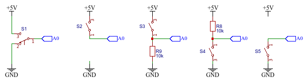

# DIGITAL INPUT

Digital inputs can only measure 2 different values. As such they are binary inputs and it's values are represented as logical `0` and `1` or in other words `false` and `true` or `LOW` and `HIGH`. However from electrical point of view those values are basically different voltage potencials. Usually potencial `0 V` is presented as logical `0` and potencial `+5 V` is indicated as logical `1`. Digital inputs are often used for detecting state of switches, board keys and push buttons...

Lets go back to fundamentals of digital inputs and explore some options we have to connect a push-button-switch.

{#fig:PBSw_All}

## Tasks:

1. Connect the push-button-switch according to first diagram on [@fig:PBSw_All] and test the program [@lst:280_Digital_Input]

```cpp
const int BUMPER_PIN = A0;
void setup()
{
  pinMode(BUMPER_PIN, INPUT);
}

void loop()
{
  bool bumperIsPressed = digitalRead(BUMPER_PIN);
  if ( bumperIsPressed ) digitalWrite(3, HIGH);else digitalWrite(3, LOW);
}
```
: Digital Input. {#lst:280_Digital_Input}

2. Try to connect the bush-button-switch according to second diagran on [@fig:PBSw_All]

| PBSW con. | RobDuino connectors |
|:---------:|:-------------------:|
|   No. 1   |          A0         |
|   No. 2   |    not connected    |
|   No. 3   |         +5V         |

Table: Connection of push-button-switch with only 2 terminals. {#tbl:sw_two_pins}

Try to understand why this setup is not working. And test all other options in [@fig:PBSw_All]

3. Solve the problem by constructing a `voltage divider` with `pull-down` resistor (third diagran on [@fig:PBSw_All]).
4. Try to understand how the voltage potencial is spread among the components in electrical loop and how we can calculate this by using 2nd Kirchhoff's Rule.
5. Change the setup of PBSW and resistor to a `pull-up` setup (fourth diagran on [@fig:PBSw_All]). What is changed?
6. Enable internal `pull-up` resistor (and remove external one - fifth diagran on [@fig:PBSw_All]).

## Questions:

1. Measure the voltage potencial on pin A0 where the bumper is in ether position.
2. Why the setup is not working properly if we connect the PBSW only to +5V voltage potencial?
3. Draw a schematic circuit of the bush-button-switch connected to controller.
4. What is determined by 2nd Kirshhoff's Rule?
5. How can we wnable `pull-up` resistor?

> ## Summary:
> ### 2nd Kirshhoff's Rule
> Kirchhoffs Voltage Rule states that `in any closed loop network, the total voltage around the loop is equal to the sum of all the voltage drops within the same loop` which is also equal to zero. In other words the algebraic sum of all voltages within the loop must be equal to zero. This idea by Kirchhoff is known as the Conservation of Energy.
>
> ## Issues:
> ### *<++>*
> <++>

