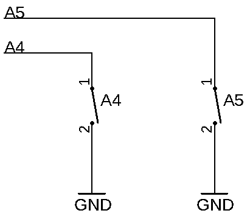

# PULL-UP RESISTORS ON DIGITAL INPUT

On the module RobDuino we can find two "on-board push button switches". Wiring of this switches
is presented in [@fig:RobDuino_OnBoardPwshButtonSwitch_s1], where can be noticed that both switches are connected to ground potential.

{#fig:RobDuino_OnBoardPwshButtonSwitch_s1}

To properly use this push-button switches we must enable the `pull-up` resistors of A4 and A5 input of microcontroller.

## Tasks:

1. Configure pins `A4` and `A5` as inputs with `pull-up` resistor.
2. At the end of the `setup()` function add the `while-loop` which will delay the execution of the program until we press the `A4` key.
3. Use the `A5` key for stop the robot and terminate the execution of the program.

```cpp
void setIOpins();
void robotStop();
void robotForward();
void robotBackward();
void robotLeft();
void robotRight();

void setup(){
  setIOpins();
}

void loop() {
    robotForward();
    //to-do: the key reading
    bool stopTheRobotKey = 0;
    if (stopTheRobotKey == 1)
    {
        robotStop();
        exit(0);        //terminate the program
    }
}
void setIOpins(){
  pinMode(LEFT_MOTOR_PIN_A, OUTPUT);
  pinMode(LEFT_MOTOR_PIN_B, OUTPUT);
  pinMode(RIGHT_MOTOR_PIN_A, OUTPUT);
  pinMode(RIGHT_MOTOR_PIN_B, OUTPUT);
  pinMode(BUMPER_PIN, INPUT);
  //to-do: config the A4 and A5 pins

  //to-do: while-loop waiting for A4 is pressed

}
...
```
: Pullup resistor on digital input. {#lst:pull_up}

## Questions:

1. What is the programming instruction of reading the value form digital input?
2. Which values can be assigned to `bool` type variable?
3. Explain the programming instruction `exit(0)`.

> ## Summary:
> 
> ### <++>
> 
> <++>
> 
> ## Issues:
> 
> ### *<++>*
> 
> <++>


