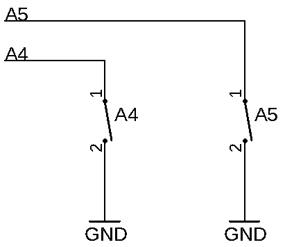

# PULL-UP RESISTORS ON DIGITAL INPUT

On the module RobDuino we can find two "on-board push button switches". Wiring of this switches is presented in [@fig:RobDuino_OnBoardPwshButtonSwitch_s1], where can we noticed that both switches are connected to ground voltage potential.

{#fig:RobDuino_OnBoardPwshButtonSwitch_s1}

To properly use this on-board push-button switches we must enable the `pull-up` resistors of A4 and A5 input of microcontroller.

## Tasks:

1. Configure pins `A4` and `A5` as inputs with `pull-up` resistor.
2. At the end of the `setup()` function add the `while-loop` which will delay the execution of the program until we press the `A4` key - acting as a "START BUTTON".
3. Use the `A5` key to stop the robot and terminate the execution of the program.

```cpp
#include "RobotMovingFunctions.h"
const int KEY_A4 = A4;
const int KEY_A5 = A5;

void setup()
{
  setIOpins();
  pinMode(KEY_A4, INPUT_PULLUP);
  // KEY_A5 setup here...
}

void loop()
{
  moveForward();
  //to-do: the key reading
  bool stopTheRobotKey = 0;
  if (stopTheRobotKey == 1)
  {
    stopTheRobot();
    exit(0);        //terminate the program
  }
}
```
: Pull Up Resistors on Digital Input. {#lst:290_Pull_Up_Resistors_on_Digital_Input}

## Questions:

1. What is the programming instruction of reading the value form digital input?
2. Which values can be assigned to `bool` type variable?
3. Explain the programming instruction `exit(0)`.

> ## Summary:
> 
> ### <++>
> 
> <++>
> 
> ## Issues:
> 
> ### *<++>*
> 
> <++>


