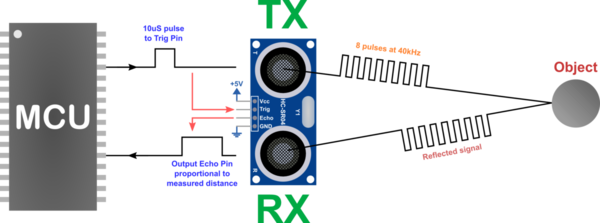

# PULSE WIDTH AS DIGITAL INPUT

Digital input can also be used to transferee other data. One way is to modulate the data into pulse duration e.g. longer the duration of the pulse, bigger the value. This modulation of data is called **Pulse-width modulatio** or **PWM**. Such an example is ultrasonic distance sensor. Where the distance is hidden in the time duration that sound needed of travel the distance from source to object and back as presented in [@fig:UltraSound_sen_50].

{#fig:UltraSound_sen_50}

Since the speed of sound in air is constant ($v_s = 340 m/s$) we can easily calculate the distance according to [@eq:calc_dist].

$$ distance = \frac{1}{2} v_s t_{duration} $${#eq:calc_dist}

<!--
datasheet on ultrasonic sensor HC-SR04
https://cdn.sparkfun.com/datasheets/Sensors/Proximity/HCSR04.pdf
-->

## Tasks:

1. Connect the ultrasonic distance sensor to module Robduino according to [@tbl:con_ultrason]

| HC-SR04 pins | RobDuino pins |
|:------------:|:-------------:|
|      +5V     |      +5V      |
|    Trigg.    |       A0      |
|     Echo     |       A1      |
|      GND     |      GND      |

Table: Connestion of ultrasonic distance sensor. {#tbl:con_ultrason}

2. Test next program if you get reasonable data of time duration in `Serial` window.

```cpp
const char TRIGGER_PIN  = A0;
const char ECHO_PIN     = A1;

void setup()
{
  pinMode(TRIGGER_PIN, OUTPUT);
  pinMode(ECHO_PIN, INPUT);
  Serial.begin(9600);
}

int getPulseWidth_us()
{
  digitalWrite(TRIGGER_PIN,HIGH);
  delayMicroseconds(10); 
  digitalWrite(TRIGGER_PIN,LOW);
  return pulseIn(ECHO_PIN, HIGH);
}

float getDistance_cm()
{
  // do distance calculation here...
  return 0
}
void loop()
{
  float distance_cm = getDistance_cm();
  int duration_us = getPulseWidth_us();
  Serial.println(duration_us);
  delay(2000);
}
```
: PWM as Digital Input. {#lst:300_PWM_as_Digital_Input}

3. Add needed code in function `getDistance_cm()` to calculate the distance in cm. Also change the `Serial.println(duration_us)` program line to output `distance_cm` value.

## Questions:

1. What is PWM?
2. How are PWM data presented in digital signal?
3. What voltage is used to transmit PWM values?

> ## Summary:
> ### <++>
>
> ## Issues:
> ### <++>
>

