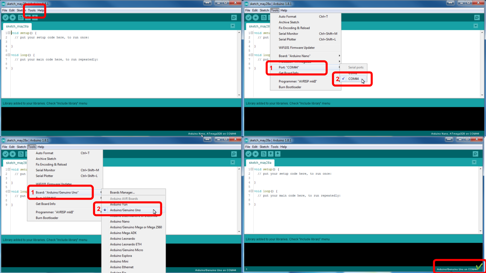
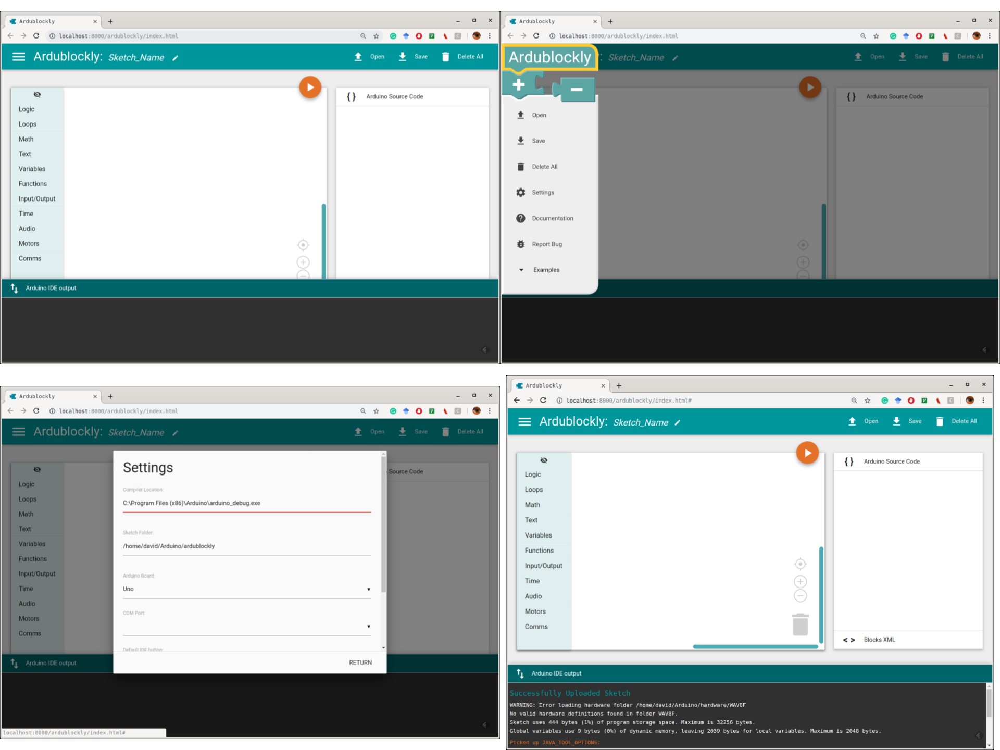
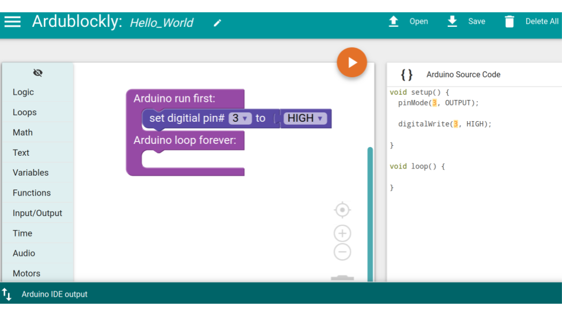
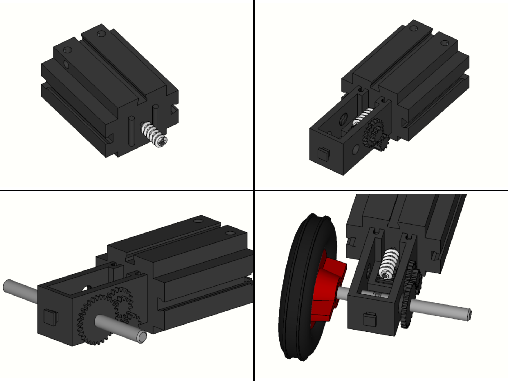
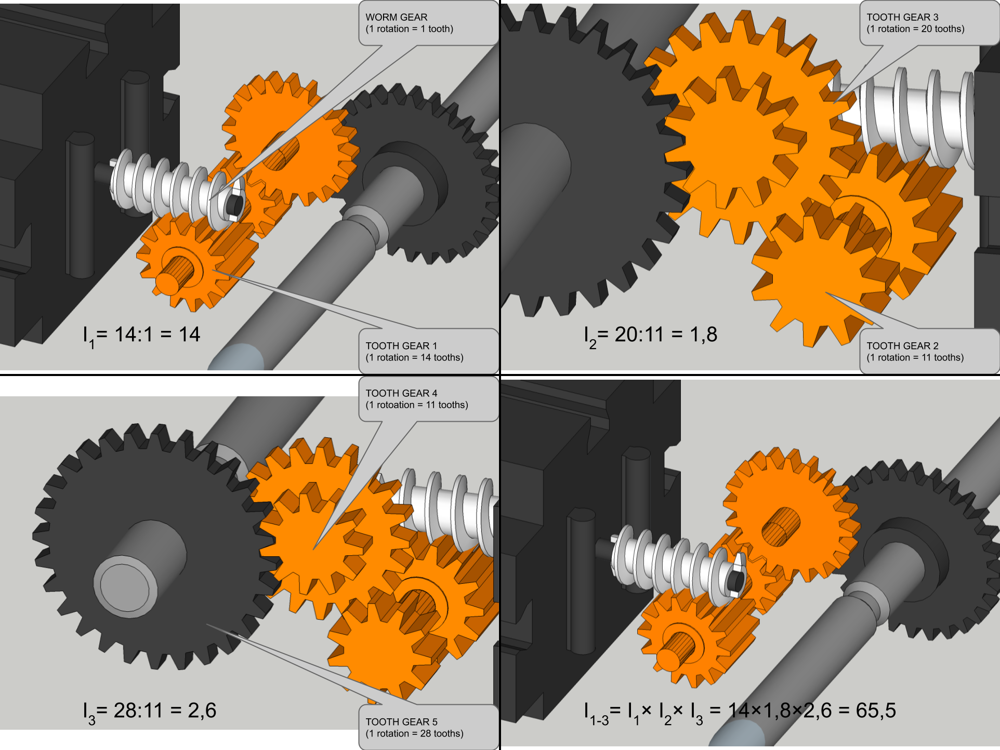
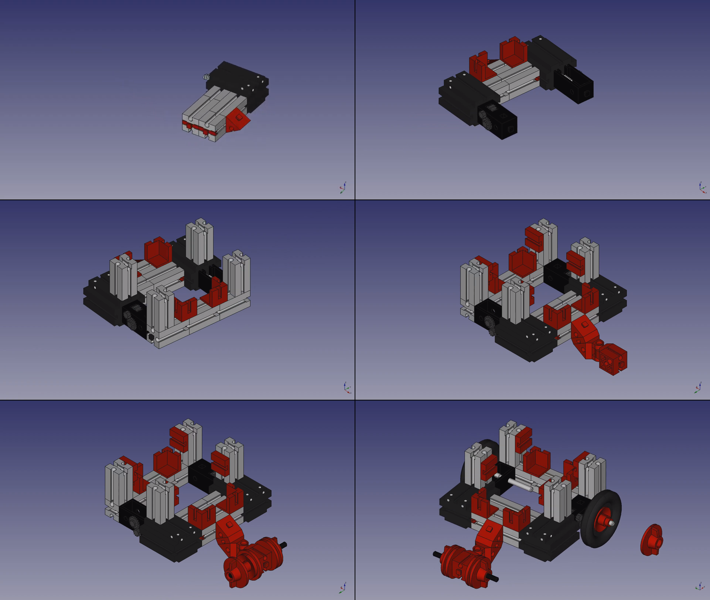
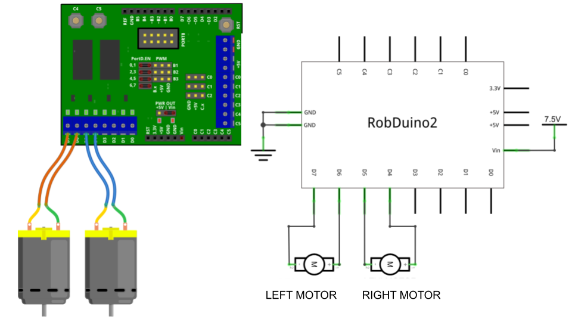
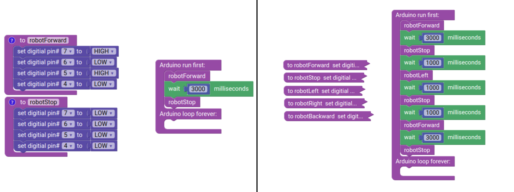
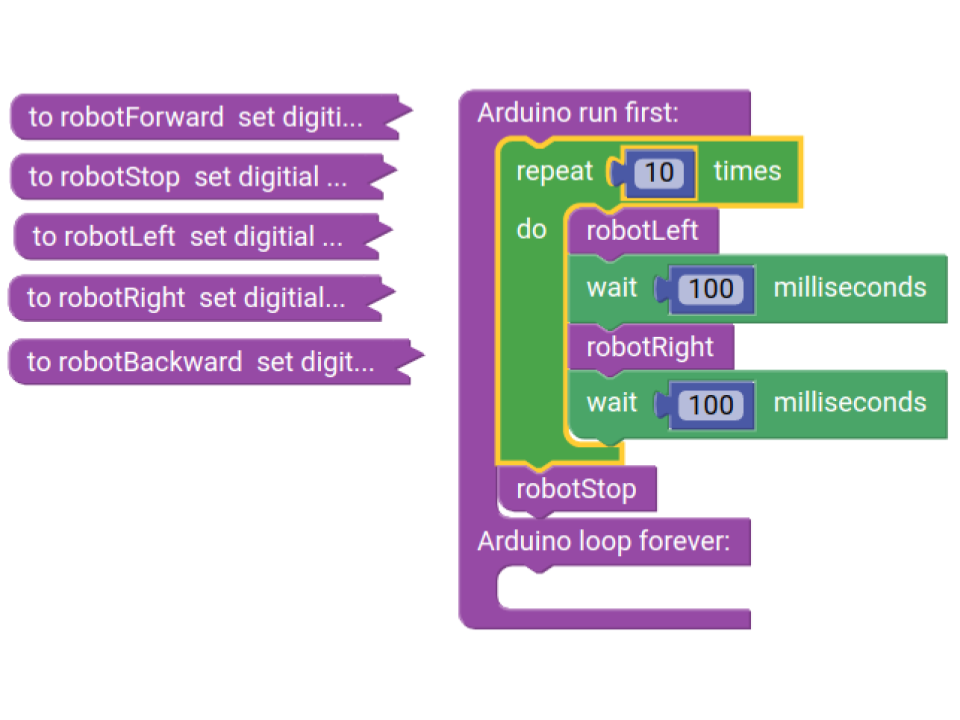
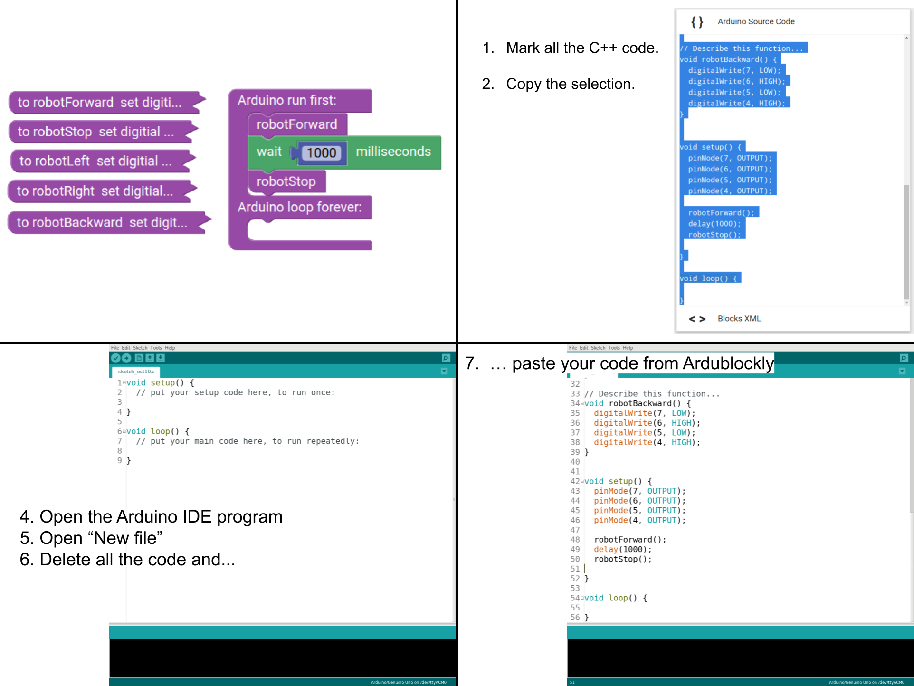

# TESTING THE EQUIPMENT

## Basic testing in Arduino IDE

1. Connect the Arduino Uno to PC with proper USB cable.  
    `[Arduino Uno]` 
2. Open Arduino IDE program and open program with:  
    `Files -  Examples - 01. Basics - Blink.ino`
3. Make shure that you will set the proper settings (see [@fig:Arduino_basic_setup]). From the menu choose:  
    `Tools`-
    1.  `Board:` Arduino/Genuino Uno
    2.  `Port:` COM3

{#fig:Arduino_basic_setup}

-   To upload the code you can click the icon `Upload`.  
    If the uploading was successful you will be prompted with the text
    like:  

> ```
> Done uploading.  
> Sketch uses 970 bytes (3%) of program storage space. Maximum
> is 32256 bytes. Global variables use 9 bytes (0%) of dynamic
> memory, leaving 2039 bytes for local variables. Maximum is
> 2048 bytes.
> ```

## Basic testing in Ardublockly

1. Connect the Arduino Uno to PC with proper USB cable.  
    `[Arduino Uno]` 
2. Run Ardublockly program. Which will be running as localhost and you will be using internet browser as IDE. The addres will be:  
    `http://localhost:8000/ardublockly/index.html`
3. In the left corner of the program you can find `[=] menu icon`. From where you can choose (Slide 2 and 3)  
    `[] Settings`:
    1.  `Compiler Location:` C:\\Program Files (x86)\\Arduino\\arduino\_debug.exe
    2.  `Arduino Board:` Uno
    3.  `Com port:` COM3
    4.  And press:`[ RETURN ]`
4. Finaly you can press button `PLAY` And if uploading was successful you will be prompted with the text (Slide 4):  

{#fig:Ardublockly_basic_setup}

> ```
> Successfully Uploaded Sketch
> WARNING: Error loading hardware folder /home/david/Arduino/hardware/WAV8F.
> No valid hardware definitions found in folder WAV8F.
> Sketch uses 444 bytes (1%) of program storage space. Maximum is
> 32256 bytes. Global variables use 9 bytes (0%) of dynamic memory,
> leaving 2039 bytes for local variables. Maximum is 2048 bytes.
> ```

> ## Summary
> Before uploading the programming code always check that the right board and serial port are set.
>
> ## Issues
> **Ardublockly returns the Error id 55: Serial port Serial Port unavailable.**  
> Try to re-connect the Arduino board. Wait a moment, check the settings and choose the COM port again then try again.

# HELLO WORLD IN ARDUBLOCKLY

## Task:

1. Make a very simple program like setting the digital output bit D3 to logical state 1 or **HIGH**.
2. Send the program to Arduino controller.

{#fig:ardublockly_first}

## Questions:

1.  What is the voltage of the digital output pin D3?
2.  Try to compare and understand the C++ programming code in aside
    window.

> ## Summary
> Programming with programming blocks is a good starting point for beginners since humans are not good in handling to many informations at the same time.
>
> Having programming blocks aside with C code is nice and soft introduction of the code programming.
>
> ## Issues
> ...to do...

# HOW DC MOTOR WORKS

## Task:

1. Connect the DC motor to the battery and make it run.
2. You can try different combinations to connect the terminals of the motor like:
    - + and -
    - - and +
    - - and -
    - + and +.

{#fig:DC_motor}

## Questions:

1.  In which direction the motor\'s shaft spins in different situations?
2.  In which direction the electric current flow?
3.  Why does motor is not spinning when both connectors are connected to +
    terminal of the battery?

> ## Summary
> The rotation of the DC motor depends on the direction of electric
> current.
> 
> ## Issues
> ### *When I connect the DC motor to + and - terminals of the battery the motor\'s shaft does not spin.*
> 
> Check the voltage of the battery... battery may be discharged.  
> Check the connectors of the motor... may be bad.  

# CONTROLLING THE DC MOTOR WITH DIGITAL OUTPUTS

## Task:

1. Connect the DC motor to Digital Output D7 and D6.
2. Write the program and check all the combinations of digital outputs;
    00, 01, 10 and 11.

| D7 | D6 | Motor is spinning |
|:--:|:--:|-------------------|
|  0 |  0 |                   |
|  0 |  1 |                   |
|  1 |  0 |                   |
|  1 |  1 |                   |
Table: All combinations of the states of motor's connectors. {#tbl:motor_combo}

## Questions:

1.  For each combination of digital outputs mark the state of the motor (fulfill the [@tbl:motor_combo ]).
2.  Try to stop the shaft of the DC motor for a short time and try to
    remember how hard is it?

{#fig:connect_motor}

> ## Summary
> 
> The motor\'s shaft is spinning according to the direction of the
> electric current trough the motor.  
> The torque is weak.
> 
> ## Issues
>

# GEARED REDUCTOR

## Task:

1. Add geared reductor to DC motor.
2. Try to stop the shaft of the geared reductor and compare your fillings with the stopping the motor shaft.

{#fig:reductor}

## Questions:

1.  How hard is to stop the shaft of the reductor in comparison to shaft
    of the motor.
2.  How fast the shaft of the reductor is spinning in comparison to the
    shaft of the motor?
3.  Are you able to freely rotate the shaft of the reductor by hand?
4.  What happened with the produced mechanical power?
5.  Try to calculate the geared ratio of the reductor.


{#fig:gear_ratio}

> ## Summary
> 
> ### Gear ratio
> 
> The gear ratio describing the ratio between the angular velocity of
> input gear G1 and angular velocity of output gear G2.  
> $$ { i=\frac{\omega_1}{\omega_2} } $$  
> Because each gear moves tooth per tooth and if two touching gears have different numbers of teeths their\'s angular velocity will be different.
> In fact the anguar velocity will be inversely proportional.  
> $$ {\frac{\omega_1}{\omega_2}=\frac{N_2}{N_1}=i} $$
> 
> ## Issues
> 
> ### *The reductor\'s shaft is not spinning although the DC motor is working properly.*
> 
> Check if the reductor is attached all the way to the motor. Check if
> the worm gear of the motor is in contact with first gear of the
> roductor.  

# CONSTRUCTING THE MOBILE ROBOT

## Tasks:

1. Construct the mobile robot according to this sequences on the [@fig:construction].

{#fig:construction}

2. Add the battery between the red cornered bricks. The connector shuld
    be pointing to the back of the robot.
3. Add also the RobDuino controller. Clip the controller between the grey upstanding bricks.

## Questions:

1.  Where do you think is th front side of the robot?
2.  Are you able to rotate the wheels freely by hand?

<!--
slika iz YouTuba
<iframe width="410" height="230" frameborder="0" src="https://www.youtube.com/embed/bybqvos4xYk"></iframe>
{#fig:fff}
-->

> ## Summary:
> <++>
> 
> ## Issues:
> 
> <++>

# CONTROLLING THE ROBOT

## Tasks:

1. Connect LEFT MOTOR to digital outputs:
    -   D7 and D6
2. Connect RIGHT MOTOR to digital outputs:
    -   D5 and D4

{#fig:DC_motor_connect}

3. Now you can write the program to control both motors in order to move the robot FORWARD for 3 second and STOP.
4. Next you can write the program which will move the robot in several different directions:
    - forward
    - backward
    - turn left
    - turn right

## Questions:

1.  How many digital outputs you have to set in order to control the
    robot for specific move?
2.  How many different moves your robot can make?


> ## Summary:
> 
> ### Controlling the robot in two degrees of freedom
> 
> To controlling the robot in two degrees of freedom we need to control
> two motors. Since we have to set two digital outputs for each motor we
> have to set four digital outputs for each individual move.
> 
> ## Issues:
> 
> ### *When I change the direction of the robot the robot does not move as expected.*
> 
> Probably you did not set all of the outputs correctly. Remember that
> some outputs may have remained set in previous output state from taken
> action in previous task.  

# PROGRAMMING FUNCTIONS

## Tasks:

1. Write a programming functions which includes the certain programming steps in order to move the robot in specific direction. Some examples are presented in [@fig:functions_ardublockly].

{#fig:functions_ardublockly}

2. Write also other functions like:
    -   `robotForward()`
    -   `robotStop()`
    -   `robotLeft()`
    -   `robotRight()`
    -   `robotBackward()`
3. Write longer program to move the robot allover the classroom.

## Questions:

1.  What would happened if several robots would have the same program?
2.  Can you change the program in a way that robot would repeat the program?
3.  What happens if the mobile robot run into an obstacle?

> ## Summary:
> 
> ### <++>
> 
> ### Issues:
> 
> ### *<++>*

# PROGRAMMING LOOPs: FOR-NEXT & WHILE

## Tasks:

1. If we want to repeat some programming instructions for several times we can use For Loop.
2. For example the next program repeats functions `robotLeft()` and `robotRight()` for `10 times` and robot will do a funny \"dancing\" move.

{#fig:for_next_loop}

3. Experiment a bit more with such programming techniques.

## Questions:

1.  <++>
2.  <++>

> ## Summary:
> 
> ### Using Functions
> Using functions may not seem to be very convenient. But it is a huge deal, and helps to make a clean code. It is advised to use functions ether if the code is used only once.
>
> Where the code is repeated several times in different occasions in the program the use of the functions is trivial.
> 
> ## Issues:
> 
> ### *<++>*
> 
> <++>  


# WRITING PROGRAM IN C++

## Tasks:

1. Make a really basic program with easy task like it is shown on [@fig:Ardublockly_to_Arduino_IDE].

{#fig:Ardublockly_to_Arduino_IDE}

2. Open the Arduino IDE program.
3. Copy-Paste all the c++ code from Ardublockly into Arduino IDE.
4. Experiment with the c++ code.

## Questions:

1.  <++>
2.  <++>

> ## Summary:
> 
> ### \<++\>
> 
> \<++\>
> 
> ## Issues:
> 
> ### *\<++\>*


# DIGITAL SENSORS

## Tasks:

-   In sake to detect the obstacles we have to equip robot with the
    \"touch sensor\". This sensor is basically a switch or key, which
    toggles it\'s output between GND and +5 V voltage potentials.
-   Follow video instructions to construct bumper in front of the robot.

## Questions:

1.  Do you hear \"clicking\" sound when you push the bumper?
2.  Name the mechanical mechanism where smaller force on one end can
    cause greater force on the other end of the mechanism.

<iframe width="410" height="337" frameborder="0" src="https://www.youtube.com/embed/eWldNxh-q2c"></iframe>

## Tasks:

The key has three connecting terminals. Each of one is marked with the
number 1, 2 or 3. Connect them in right order. Connect the key terminals
in order that are specified in presentation and listed as:

1. connect to RobDuino C0 terminal.
2. connect to RobDuino voltage terminal GND.
3. connect to RobDuino voltage terminal +5V.

## Questions:

1. What is the output voltage of the sensor when the robot is (or is NOT) touching the obstacle?
2. How many different states are presented at the output of the sensor?
3. Name several more examples where digital sensor can take place.

<iframe src="https://docs.google.com/presentation/d/1Sw-3ovX36DYt9zcj6z9gESie3ZJwWLExb9KPddrw9JM/embed?authuser=0&hl=en&size=s" width="410" height="337" title="Connecting the key" frameborder="0" allowfullscreen="true" mozallowfullscreen="true" webkitallowfullscreen="true"></iframe>

<!--

-->
> ## Summary:
> 
> ### Digital sensors
> 
> The output of a digital sensor can be just in two states:
> 
> -   logical \"0\" - presented in voltage as 0 V.
> -   logical \"1\" - presented in voltage as +5V.
> 
> ## Issues:
> 
> ### *Robot has no power since I connected the key as a sensor.*
> 
> Probably the key or switch is connected wrong and there is short connection between the GND and +5V voltage terminals. Unconnect the key or switch and verify if the power is back.

# READING DIGITAL INPUT

## Tasks:

1. Write the program shown in the presentation to test the readings of the digital sensor.
1. Then ... complete the program to turn OFF the LED when the bumper is not touching anything.
1. Next ... Change IF statements into single one IF-THEN-ELSE statement.
1. Advanced ... Solve the problem without IF statement.

## Questions:

1.  Check if the LED on the output terminal D3 is turend ON when the
    bummper is pressed.

<iframe src="https://docs.google.com/presentation/d/1NVtol-a0tmlgl00VwCACQIcAOOty3KYEMSgUFkf8-Aw/embed?authuser=0&hl=en&size=s" width="410" height="337" title="Testing Digital Input" frameborder="0" allowfullscreen="true" mozallowfullscreen="true" webkitallowfullscreen="true"></iframe>

> ## Summary:
> 
> ### <++>
> 
> <++>
> 
> ## Issues:
> 
> ### *<++>*
> 
> <++>  


# S-R-A LOOP

## Tasks:

1. Write the program to drive the robot around the class and avoid the
    obstacles.
1. Using the S-R-A loop technique you should write the program in
    particular order:
    1.  Check the sensor. IF the bummper  ...
    2.   ... is pressed the robot has to stop/go back/turn.
    3.   ... is not pressed the robot can drive forward.

## Questions:

1.  Would this routine also work in Arduino run first function (check
    the program in Slide 2)?
2.  <++>

<iframe src="https://docs.google.com/presentation/d/13B5ynixnR7ZRl4__jpnLk7gP8_S3yF2U2zaUpZtax1o/embed?authuser=0&hl=en&size=s" width="410" height="337" title="S-R-A Loop" frameborder="0" allowfullscreen="true" mozallowfullscreen="true" webkitallowfullscreen="true"></iframe>

> ## Summary:
> 
> ### Senzoning-Reasoning-Acting Loop
> 
> S-R-A loop is the most important thing in robotics.
> 
> ## Issues:
> 
> ### *It seems that the program is not working right \... like it would be ignoring the value of the sensor.*
> 
> Probably the S-R-A loop is not actually a loop. Check the program if the input is read just onces or is read continuously.  


# HELLO WORLD IN ARDUINO IDE

## Tasks:

1. Make a very simple program like setting the digital output bit D3 to logical state 1 or **HIGH**.
```cpp
    void setup() {
      // put your setup code here, to run once:
      pinMode(3, OUTPUT);
      digitalWrite(3, HIGH);
    }

    void loop() {
      // put your main code here, to run repeatedly:

    }
```
2. Send the program to Arduino controller.

## Questions:

1.  Explain what is the purpose of next programming characters in presented example:
    1. `;`
    2. `{  }`
    3.  `pinMode(3, OUTPUT);`
    4.  `digitalWrite(3, HIGH);`
    3.  `// put your ...`
    5.  `void setup()`
    6.  `void loop()`

> ## Summary:
> 
> ### Using curly braces - {}
> 
> Using curly braces in C++ is important part of writing the programming code. Imagine that you want to merge several members of programing code to a single pile. As we would separate pencils into one pile and markers to another - to be more organized. In real life we would do by elastic bundle or rope. If you have to choose single character from the keyboard to indicate that several members are combined to the same pile - which character would you choose? Probably curly braces {} are the best choice.
> 
> ### Function Declaration
```cpp
   void loop() {

   }
```
> ### Function Call
```cpp
    digitalWrite(3, HIGH);
```
> ### Function Name
> 
> Function name should be stacked together from 2 - 5 short words that uniquely describing the functionality of the function. The first word should start with lower case and all the others words following should start with upper case. Some examples should be:
```cpp
   badname(); 
   goodFunctionName(); 
```
> ## Issues:
> 
> ### *Error: expected ';' before 'something'*
> 
> Probably you forgot to put ; (semicolon) at the end of the command. Find the row starting with \"**something**\" and look the row above\...  probably missing \"**;**\".  

# CONTROLLING THE ROBOT

## Tasks:

1. Set the directions of used pins for controlling the motors.
2. Write a simple program that follows next sequence:
    1. move the robot forward,
    2. do it for 3000 ms,
    3. and stop the robot.

## Questions:
You probably ended up with this solution ... Right?
```cpp
    void setup() {
      //setting I/O pins
      pinMode(4, OUTPUT);
      pinMode(5, OUTPUT);
      pinMode(6, OUTPUT);
      pinMode(7, OUTPUT);
      //move forward...
      digitalWrite(7, HIGH);
      digitalWrite(6, LOW);
      digitalWrite(5, HIGH);
      digitalWrite(4, LOW);
      //wait for 3000ms
      delay(3000);
      //stop the robot
      digitalWrite(7, LOW);
      digitalWrite(6, LOW);
      digitalWrite(5, LOW);
      digitalWrite(4, LOW);
    }

    void loop() {
    }
```
1. Is your code "easy readable" and
2. why is this important?

> ## Summary:
> 
> ### <++>
> 
> <++>
> 
> ## Issues:
> 
> ### *<++>*
> 
> <++>  

# CLEAN CODE

In order to make your code readable you have to clean your code regularly. This step is very important to not to be slow in future programming.
You will probably spent the same amount of time cleaning the code that you needed for writing a working version.
In general you can follow some rules that are specified in Tasks:

## Tasks:

1. Concatenate programming code into meaningful functions, like:
```cpp
void robotForward(){
  digitalWrite(...
  ...
}
```
Smaller code is more understandable than large one, se next example:
```cpp
void setup(){
  setIOpins();
  robotForeward();
  delay(3000);
  robotStop();
}
```

2. Use explanatory variables and constants, like:

```cpp
const char LEFT_MOTOR_PIN_1 = 7;
const char LEFT_MOTOR_PIN_2 = 6;
```
Now you can easily see why the pins are set as OUTPUT:
```cpp
void setIOpins(){
  pinMode(LEFT_MOTOR_PIN_1, OUTPUT);
  pinMode(LEFT_MOTOR_PIN_2, OUTPUT);
}
```

3. Don't use comment where the code is self-explanatory, for example:
```cpp
      //wait for 3000ms
      delay(3000);
```

## Questions:

> ## Summary
> ### <++>
> ## Questions
> ### <++>


# PROGRAMMING LOOPs: FOR-NEXT & WHILE

## Tasks:

1. If we want to repeat some programming instructions for several times we can use For Loop.
1. For example the next program repeats the functions **robotLeft()** and **robotRight()** for **10 times** and robot will do a funny \"dancing\" move.
1. Experiment a bit more with such programming techniques.

## Questions:

1.  <++>
2.  <++>

```cpp
void setup() {
  setIOpins();

  // Funny dancing move.
  int i = 0;
  for (i = 0; i < 10; i++) {
    robotLeft();
    delay(100);
    robotRight();
    delay(100);
  }
  robotStop();
}

[+]void loop() {
[+]void setIOpins(){
[+]void robotForward() {
[+]void robotStop() {
[+]void robotLeft() {
[+]void robotRight() {
[+]void robotBackward() {
```

> ## Summary:
> 
> ### <++>
> 
> <++>
> 
> ## Issues:
> 
> ### *<++>*
> 
> <++>  


# READING DIGITAL INPUT

## Tasks:

1. Write next program and test it... 
```cpp
const char bumperPin = A0;
void setup() {
  pinMode(bumperPin, INPUT);
}

void loop() {
  bool bumperIsPressed = digitalRead(bumperPin);
  if ( bumperIsPressed ){
    digitalWrite(3, HIGH);
  }
}

[+]void robotForward() {
[+]void robotStop() {
[+]void robotLeft() {
[+]void robotRight() {
[+]void robotBackward() {
```
2. Then\... complete the program to turn OFF the LED when the bumper is not touching anything.
3. Next\... Change IF statements into single one IF-THEN-ELSE statement.
4. Advanced\... Solve the problem without IF statement.

## Questions:

1.  Check if the LED on the output terminal D3 is turend ON when the
    bummper is pressed.

> ## Summary:
> ### IF Statement
> If statement can be written in several forms. The easiest one is:
```cpp
if (value_one == value_two) statement1;
```
> , but this simple example is not used so often due its simplicity. We rather use if in
> this form:
```cpp
if ( value_one == value_two ){
  statement1;
  statement2;
}
```
> It can be expanded into IF-ELSE form:
```cpp
if ( value_one == value_two ){
  statement1;
  statement2;
}else{
  statement3;
}
```
> ## Issues:
> ### *<++>*
> <++>

# S-R-A LOOP

## Tasks:

1. Write the program to drive the robot around the class and avoid the obstacles.
1. Using the S-R-A loop technique you should write the program in particular order:
    1.  Check the sensor. IF the bummper \...
    2.  \... is pressed the robot has to stop/go back/turn.
    3.  \... is not pressed the robot can drive forward.

## Questions:

1.  <++>
2.  <++>

```cpp
const char bumperPin = A0;
[+]void setup() {

   void loop() {
     bool bumperIsPressed = digitalRead(bumperPin);
     if ( bumperIsPressed ){
       robotStop();
     }else{
       robotForward();
     }
   }

[+]void robotForward() {
[+]void robotStop() {
[+]void robotLeft() {
[+]void robotRight() {
[+]void robotBackward() {
```

> ## Summary:
> 
> ### <++>
> 
> <++>
> 
> ## Issues:
> 
> ### *<++>*
> 
> <++>  

# READING ANALOG INPUTs

## Tasks:

1. Unmount robot's bumper and all connections to the switch.
2. Equip the robot with distance sensor according to video and scheme.
3. Copy & Paste next program and test the serial output.

## Questions:

1.  What kind of values do you getting from the reading of the distance
    sensor?
2.  Find the reasonable value vhere you shuld stop the robot.

<iframe width="410" height="337" frameborder="0" src="https://www.youtube.com/embed/ELYsyuhbQfY"></iframe>

<iframe src="https://docs.google.com/presentation/d/1j4yvBeTajgG9wFb5mw9SUPUTLXjPWNWjOnINUEmyAx8/embed?authuser=0&hl=en&size=s" width="410" height="337" title="Conection of distance sensor" frameborder="0" allowfullscreen="true" mozallowfullscreen="true" webkitallowfullscreen="true"></iframe>

> ## Summary:
> 
> ### Analog to digital converter - ADC
> 
> ADC is an electronic sistem that converts analog signal (voltage) to a
> digitalized values. In our particular case the range of an analog
> voltage from 0V to 5V is converted to range of numbers from 0 to 1023.
> 
> ## Issues:
> 
> ### *<++>*
> 
> <++>  

------------------------------------------------------------------------

AVOIDING OBSTACLES
==================

## Tasks:

Write the program to drive the robot around the class and avoid the
obstacles.

1.  Check the value of distance sensor. If the distance if far away
    (smaller number) \...
2.  \... the robot can drive forward.
3.  \...else \... the robot must to stop/go back/turn.

## Questions:

1.  <++>
2.  <++>

```cpp
    [+]void setup() {

       void loop() {
         if ( analogRead(A0) < 400 ){
           robotForward();
         } else {
           robotStop();
         }
        }

    [+]void robotForward() {
    [+]void robotStop() {
    [+]void robotLeft() {
    [+]void robotRight() {
    [+]void robotBackward() {
```

> ## Summary:
> 
> ### <++>
> 
> <++>
> 
> ## Issues:
> 
> ### *<++>*
> 
> <++>


LIGHT SENSOR
============

## Tasks:

1. Construct the light sensor according to video and scheme. Add also
    the light bulb which will help to lightning the area beneath the
    robot.
1. To test the light sensor and light bulb copy&paste next program and
    check the reported serial data:

## Questions:

1.  What is the value of the sensor when the robot is over white/black
    area?
2.  Calculate the average between those two values.

<iframe width="410" height="337" frameborder="0" src="https://www.youtube.com/embed/wEN1e6m1FGY"></iframe>


<iframe src="https://docs.google.com/presentation/d/1nVl7aVy0qCZ7b6E-bIywXlQZ7PH8LOBB2sb2VxsBKR0/embed?authuser=0&hl=en&size=s" width="410" height="337" title="Constructing the light sensor" frameborder="0" allowfullscreen="true" mozallowfullscreen="true" webkitallowfullscreen="true"></iframe>

> ## Summary:
> 
> ### Sensors
> 
> Sensors are electronic devices which convert physical quantity into
> electrical quantity (usually voltage). In simplest setup, sensor can be
> constructed as voltage divider with two resistors - $R_1$ and $R_2$. One of
> the resistors is resistor with fixed resistance value (eg. $R_1=10k\Omega$).
> The second one is a bit special and it\'s resistance depends on some
> physical quantity (e.g. light, temperature, humidity\...). When
> combining those two resistors into such voltage divider the output of
> the voltage divider can be calculated as: 
> 
> $$ U_{Out} = \frac{R_1}{R_1 + R_2} U_0 $$
> 
> ## Issues:
> 
> ### *<++>*

# LINE FOLLOWER

## Tasks:

1. Write the program to control the robot follow the line ( actually
    above the edge between black and white area ).

## Questions:

1.  What is the program function to get the `light_sensor_value`?
2.  Determine the movements of the robot if the robot is over the black
    area and if the robot is over the white area.
```cpp
    [+] void setup() {

        void loop() {
         if ( light_sensor_value < treshold_value ){
           //do this if robot is over the black line
           
         } else {
           // do this if robot is over white area
               
         }
        }

    [+] void robotForward() {
    [+] void robotStop() {
    [+] void robotLeft() {
    [+] void robotRight() {
    [+] void robotBackward() {
```


> ## Summary:
> 
> ### <++>
> 
> <++>
> 
> ## Issues:
> 
> ### *<++>*
> 
> <++>

# VARIABLES

## Tasks:

1. Stop the robot when it reaches the end of line.
2. Detecting the end of line can be done by measuring the time that robot spend over the black and white area. E.g. if the robot is driving along the line - the time spent over black and time spent over white area will be quite the same. When line ends the robot will not detect the black area soon and the time spent over white area will increase significantly - and that is the trigger for detecting the end of line.
3. Advanced: Make a function to align (move) the robot back to the line.

## Questions:

1.  How can we store a data to the controller\'s memory?
2.  How can we measure time in programming loops?

```cpp
    [+] void setup() {

        int time_on_black = 0;
        int time_on_white = 0;
        
        void loop() {
         if ( analogRead(A1) < 400 ){
                              // BLACK area
           robotLeft();
           time_on_white = 0; // reset time on white
           time_on_black++;   // meas. time on black
           delay(100);
         } else {
                              // WHITE area
           robotRight();
                              // Do similar meas.
                              // of time on white

           delay(100);
                              // If time is signif.
                              // longer:
                              // robotStop();exit(0);
         }
        }

    [+] void robotForward() {
    [+] void robotStop() {
    [+] void robotLeft() {
    [+] void robotRight() {
    [+] void robotBackward() {
```

> ## Summary:
> 
> ### What is variable?
> 
> Variables are used in C++ where you will need to store any type of values within a program and whose value can be changed during the program execution. These variables can be declared in various ways each having different memory requirements and storing capability. Variables are the name of memory locations that are allocated by compilers, and the allocation is done based on the data type used for declaring the variable.
> 
> ### Variable definition and initialization in C++
> 
> A variable definition means that the programmer writes some instructions to tell the compiler to create the storage in a memory location. The syntax for defining variables is:
```cpp
data_type variable_name;
```
> Here `data_type` means the valid C++ data type which includes int, float, double, char, wchar\_t, bool and variable list is the lists of variable names to be declared which is separated by commas.  Variables are declared in the above example, but none of them has been assigned any value. Variables can be initialized, and the initial value can be assigned along with their declaration.
```cpp
data_type variable_name = value;
```
> Examples:
```cpp
bool is_raining = false;
int sensor_value = 23;
float pi_value = 3.14;
char letter = "A";
char byte = 123;
char sentence[] = "Some dummy text.";
```
> ### Measuring Time with programming loops
> The easiest way to measure time is to simply count the number of loop\'s
> executions. And if we know how long is one execution of the loop - we
> can easily determine the time lapsed for the whole process.
>
> Example:
```cpp
int t = 0;
while (t<10){
  t++;
  delay(100);
}
```
> In the previous example the `while` loop is executed 10 times (t = \[0
> .. 9\]), since each execution of the loop last 100 ms (determined by
> `delay(100);`) the whole `while` loop last 1 s.
> 
> ### Time measuring with Timers
> 
> More proper way of measuring the time is by using the timer\'s values.
> More on that can be read
> [here](https://www.arduino.cc/reference/en/language/functions/time/millis/).  
>   
> Example:  
> 
```cpp
unsigned long start_time;
unsigned long stop_time;
start_time = millis();
// time measured process goes here
// ...
stop_time = millis();
unsigned long duration = stop_time - start_time;
```
> Where the `duration` is the time in milliseconds.
> 
> ## Issues:
> 
> ### *<++>*
> 
> <++\>

# BARRIER GATE CONSTRUCTION

## Tasks:

1. Construct the barrier gate accordant to video instructions.
2. Connect the motor to digital outputs D7 and D6.
3. Write the program to rising and lowering the barrier. The main functionalities (e.g. Up, Down, Stop) should be written in program functions:
    -   `gateUp();`
    -   `gateDown();`
    -   `gateStop();`

## Questions:

1.  What is time for rising and lowering the barrier? Compare it to your colleague\'s situation.
2.  What is disadvantage of time controlled loop.

<iframe width="410" height="337" frameborder="0" src="https://www.youtube.com/embed/5_eh7ojNH68"></iframe>

```cpp
    [-] void setup() {
          pinMode(7, OUTPUT); //declaration of I/O pins
          pinMode(6, OUTPUT);    
          
          gateUp();           // Lift the barrier.
          
          delay(3000);        // Wait a bit...
          
          gateDown();     // Lower the barrier.
        }
        
    [+] void loop() {
    [+] void gateStop(){
    [-] void gateUp() {
          digitalWrite(7, HIGH);
          digitalWrite(6, LOW);
          delay(1000);
          gateStop(); 
        }
    [+] void gateDown() {
```

> ## Summary
> 
> ### <++>
> 
> <++>
> 
> ## Issues:
> 
> ### *<++>*
> 
> <++>

------------------------------------------------------------------------

REFERENCE POINT
================

## Tasks:

1. Add a switch to detect the reference point of the barrier gate. Let the reference point be the closed position of the barrier.
2. Connect the switch to the controller according to schematics.
3. Change the program to lower the barrier gate to reference switch position.

## Questions:

1.  Why is detection of reference point important?
2.  <++>

<iframe width="410" height="337" frameborder="0" src="https://www.youtube.com/embed/bmgUlj_rP3U"></iframe>

------------------------------------------------------------------------

<iframe src="https://docs.google.com/presentation/d/1JTBdKVBY-znuZVyeCoOIMyx3Ds80OAD6DyzBDHL_dRk/embed?authuser=0&hl=en&size=s" width="410" height="337" title="switch connection" frameborder="0" allowfullscreen="true" mozallowfullscreen="true" webkitallowfullscreen="true"></iframe>

> ## Summary
> 
> ### <++>
> 
> <++>
> 
> ## Issues:
> 
> ### *<++>*
> 
> <++>  

------------------------------------------------------------------------

REED SWITCH AND PULL-UP RESISTORS
=================================

## Tasks:

1. Add a reed switch to the front of the barrier gate to detect the car.
2. Connect the reed switch to the input pin A1 an GND.

## Questions:

1.  What is pull-up resistor?
2.  How can we turn on the internal pull-up resistor of the
    microcontroller?

<iframe width="410" height="337" frameborder="0" src="https://www.youtube.com/embed/3hhu11bBFXc"></iframe>

```cpp
     [-]void setup() {
          pinMode(7, OUTPUT); //declaration of I/O pins
          pinMode(6, OUTPUT);    
          pinMode(A1, INPUT_PULLUP); // Enab. int. Pull-up.
        }
        
     [-]void loop() {
          if ( digitalRead(A1) == 0 ){
            gateUp();
            delay(3000);
            gateDown();
          }
        }
    [+] void gateStop(){
    [+] void gateUp() {
    [+] void gateDown() {
```

> ## Summary:
>
> ### <++>
>
> <++>
>
>## Issues:
>
>### *<++>*
>
><++>  

------------------------------------------------------------------------

ON-MODULE BUTTONS AND PULL-UP RESISTORS
=======================================

## Tasks:

1. Module RobDuino includes two \"on-board\" buttons which are connected from pin A4 and A5 to GND. This two buttons can allso be used but internal pull-up resistors must be turned on.
1. Add manual functionality to the automated barrier gate. Add the possibility to manually lift (e.g. press A4 button) and lower (A5 button) the barrier gate.

## Questions:

1.  \<++\>
2.  \<++\>

```cpp
    [+] void setup() {   
    [-] void loop() {
          if ( digitalRead(A1) == 0 ){
            gateUp();
            delay(3000);
            gateDown();
          }
          
          manualControll();
        }
    [-] void manualControll(){
            if ( digitalRead(A4) == 0 ){ //Button A4 is pressed
              gateUp();
            }
                                         // add code for A5 ...
        }
    [+] void gateStop(){
    [+] void gateUp() {
    [+] void gateDown() {
```

> ##  Summary
> 
> ### <++>
> 
> <++>
> 
> ##  Issues
> 
> ### *<++>*
> 
> <++>  

------------------------------------------------------------------------

POTENTIOMETER AS ANGLE SENSOR
=============================

## Tasks:

1. Add the potentiometer to the shaft of barrier gate.
2. Test the potentiometer values with next program:

```cpp
void setup() {
  Serial.begin(9600);
}

void loop() {
  Serial.println(analogRead(A3));
  delay(100);
}
```

3. Change the functions for lifting and lowering the barrier gate to
    use potenciometer readings instead of switch and time controlled
    movement.

```cpp
    [+] void setup() {   
    [+] void loop() {
    [+] void manualControll(){
    [+] void gateStop(){
    [-] void gateUp() {
          while (analogRead(A3) < 750){
            digitalWrite(7, HIGH);
            digitalWrite(6, LOW);
          }
          gateStop();
    }
    [+] void gateDown() {
```

## Questions:

1.  What is the value of the angle sensor when the barrier gate is in
    the upper orientation\...
2.  \... and in lower orientation.

<iframe width="410" height="337" frameborder="0" src="https://www.youtube.com/embed/kzLtVWtxVsQ"></iframe>

------------------------------------------------------------------------

<iframe src="https://docs.google.com/presentation/d/1GgbUhsWBIflvZN1qMDrkh2tXRMLtYGoxHCdt5s_COVg/embed?authuser=0&hl=en&size=s" width="410" height="337" title="potenciometer" frameborder="0" allowfullscreen="true" mozallowfullscreen="true" webkitallowfullscreen="true"></iframe>

> ## Summary:
> 
> ### <++>
> 
> <++>
> 
> ## Issues:
> 
> ### *<++>*
> 
> <++>  

------------------------------------------------------------------------

LCD(I2C)
========

## Tasks:

1. \<++\>
1. \<++\>

## Questions:

1.  \<++\>
2.  \<++\>

\[ Visual instructions. \]

> ## Summary:
> 
> ### \<++\>
> 
> \<++\>
> 
> ## Issues:
> 
> ### *\<++\>*
> 
> <++>

