# TEACHING ROBOTICS

## What is robotics

- Science of robots. :)

+ What is a robot?
+ How does the robot works?
+ How are robots constructed?
+ What is intended task of the robot?
+ How do we control a robot?

## What is a robot?

- automated (coffee) machine
- ...
- Printer
- 3D printer
- CNC machine
- ...
- "Robot" Vacuum cleaner (a.k.a. Roomba)
- Industrial robot arm ([YASKAWA](https://www.motoman.com/en-us/products/robots/industrial))
- [Humanoid robot](https://www.youtube.com/watch?v=_sBBaNYex3E)

> It is not defined by the definition... but we have to describe it.

## International Organization for Standardization - ISO

- Standards are not excluding each other...
- `ISO 2806` - defining the CNC machines
    - describing the processing technology
- `ISO 8373` - defining the robots
    - describing machine autonomy

### ISO 8373 - General Terms in Robotics

#### ROBOTICS
science and practice of designing, manufacturing, and applying robots (2.6)

#### ROBOT
actuated mechanism programmable in two or more axes (4.3) with a degree of autonomy (2.2), moving within its environment, to perform intended tasks

- Note 1 to entry: A robot includes the control system (2.7) and interface of the control system.
- Note 2 to entry: The classification of robot into industrial robot (2.9) or service robot (2.10) is done according to its intended application.

#### REPROGRAMMABLE
designed so that the programmed motions or auxiliary functions can be changed without physical alteration (2.3)

#### AUTONOMY
ability to perform intended tasks based on current state and sensing, without human intervention

<!--
### Autonomous vs Automated

Avtonomen brezpilotni zrakoplov zmore varno leteti brez pilotovih posegov. Pri tem se poslužuje umetne inteligence, ki mu omogoča soočanje z nepredvidenimi in nepredvidljivimi izrednimi dogodki vseh vrst. To je drugo kot avtomatske operacije, pri katerih brezpilotni zrakoplov leti po vnaprej določeni ruti, ki jo je operator UAS vnesel pred začetkom leta.

Za tovrstne brezpilotne zrakoplove je ključno, da pilot na daljavo prevzame nadzor nad brezpilotnim zrakoplovom in ukrepa ob nepredvidenih dogodkih, za katere brezpilotni zrakoplov ni bil programiran.
-->

#### MANIPULATOR
machine in which the mechanism usually consists of a series of segments, jointed or sliding relative to one another, for the purpose of grasping and/or moving objects (pieces or tools) usually in several degrees of freedom (4.4)

- Note 1 to entry: A manipulator can be controlled by an operator (2.17), a programmable electronic controller, or any logic system (for example cam device, wired).
- Note 2 to entry: A manipulator does not include an end effector (3.11).

#### CONTROL SYSTEM
set of logic control and power functions which allows monitoring and control of the mechanical structure of the robot (2.6) and communication with the environment (equipment and users)

#### ROBOTIC DEVICE
actuated mechanism fulfilling the characteristics of an industrial robot (2.9) or a service robot (2.10), but lacking either the number of programmable axes (4.3) or the degree of autonomy (2.2)
EXAMPLE:Power assist device; teleoperated device; two-axis industrial manipulator (2.1)

#### INDUSTRIAL ROBOT
automatically controlled, reprogrammable (2.4), multipurpose (2.5)manipulator (2.1), programmable in three or more axes (4.3), which can be either fixed in place or mobile for use in industrial automation applications
Note 1 to entry: The industrial robot includes:
— the manipulator, including actuators (3.1);
— the controller, including teach pendant (5.8) and any communication interface (hardware and software).
Note 2 to entry: This includes any integrated additional axes.

#### SERVICE ROBOT
robot (2.6) that performs useful tasks for humans or equipment excluding industrial automation applications
Note 1 to entry: Industrial automation applications include, but are not limited to, manufacturing, inspection, packaging, and assembly.
Note 2 to entry: While articulated robots (3.15.5) used in production lines are industrial robots (2.9), similar articulated robots used for serving food are service robots (2.10).

#### MOBILE ROBOT
robot (2.6) able to travel under its own control
Note 1 to entry: A mobile robot can be a mobile platform (3.18) with or without manipulators (2.1).

#### ROBOT COOPERATION
information and action exchanges between multiple robots (2.6) to ensure that their motions work effectively together to accomplish the task

#### INTELLIGENT ROBOT
robot (2.6) capable of performing tasks by sensing its environment and/or interacting with external sources and adapting its behaviour
EXAMPLE:Industrial robot (2.9) with vision sensor to pick and place an object; mobile robot (2.13) with collision avoidance; legged robot (3.16.2) walking over uneven terrain.

## Robotics and Education

### Definition of the robots in education

Slangen:  
> Definition of the robot must be based
> on the main operation that robot performs:
>
> - zaznavanje (angl. Sensing),
> - sklepanje (angl. Reasoning) &
> - delovanje (angl. Acting).
>
> This operation is constantly executing in a.k.a. S-R-A loop.

Slo. nat. curriculum:`Robotics in Engineering`  
- almost exact interpretation of S-R-A loop
> Krmiljenje s povratnim delovanje (angl. feedback control regulation)

- including learning objective:
> ...kjer učenci ugotovijo potrebe po
> **krmiljenju s povratnim delovanjem**
> in izpostavijo pomanjkljivosti, če takega krmiljenja ni.
>
> (angl. where students identify the need for
> **feedback control** and point out shortcomings
> in the absence of such control)

- misconception:
> Playing with robots or using a robot is robotics.

- Robots are meant to be user friendly.

### Robotics in Schools

- very popular in last decade

We can find robots in learning process as:

1. Robotics curses:
  - Electronics
  - Computer Science
  - Engineering
2. motivation for learning other disciplines:
  - Science
  - Technology
  - Engineering
  - Math

### Important educational impacts

#### LEARNING by DOING

> ... learning as “BUILDING KNOWLEDGE STRUCTURES” through progressive internalization of actions... this HAPPENS especially felicitously in a context where the LEARNER is consciously engaged in CONSTRUCTING A PUBLIC ENTITY, whether it’s a sand castle on the beach or a theory of the universe. (Papert, S. (1980). Mindstorms. Children, Computers and Powerful Ideas. New York: Basic books.)

#### PRACTICAL APPLICATIONS

Applying knowledge and skills learned into a `public entity` make us proud of ourself. We have something to show to people that matters to us (friends, parents, classmates).

#### CREATIVITY

There is not an only one solution to the problem. Kids can explore their ideas and put it to the test.

#### LEARNING from MISTAKES

Kids are ALLOWED to LEARN from MISTAKES!?! In general, MISTAKES has very bad reputation in school sistem. To degree, that kids are often afraid to give an answer so as not to make a mistake (-> they stop trying). However, Robotics is so complicated field that mistakes can not be avoided. Thus, MISTAKES are very common thing in this learning proces of robotics.

#### CRITICAL THINKING

Critical thinking is ability to do analysis of facts and form objective judgments based on reasonable arguments.

#### SELF-ASSESSMENT

Kids are able to see if they fulfill the intended task or not. They can asses their own performance based on results of intended tasks.
<!--
It is quite difficult to asses ourself if we are well qualified in some topic. Remember: Dunning-Kruger effect: Confidence(Competence)
-->

#### ICT LITERACY

European commission is warning for several years now that EU has large lack in computer science and ICT professionals. Only 55% of computer science and ICT jobs in EU are filled with relevant experts.

### How to teach robotics?

- Is learning robotics difficult?
    + No and Yes

#### HOW DO WE THINK?

- [Kolb's Learning Cycle](https://www.researchgate.net/publication/325475416/figure/fig1/AS:643699918766080@1530481428256/Kolbs-learning-cycle-and-experiential-learning-styles.png)

- [Thinking, Fast and Slow, by Daniel Kahneman](./slike/ThinkingFastSlow.png)

#### HOW DO WE CONSTRUCT OUR KNOWLEDGE?

Piaget (ConstructiVisem):  
> Children must be actively engaged to encounter
> the experiences necessary to build and adapt their schema.
>
> We need to set up these experiences for our learners.

Papert (ConstructioNism):  
> Constructionism—the N word as opposed to the V word — shares
> contructivism’s view of learning as “building knowledge structures”
> through progressive internalization of actions… It then adds the
> idea that this happens especially felicitously in a context where
> the learner is consciously engaged in constructing a public entity,
> whether it’s a sand castle on the beach or a theory of the universe
> ( Papert, 1991, p.1)

### Učne prakse

#### KIRSCHNER
>Active learning, Project lerning, Research based learning ... so le učne situacije s pomanjkljivimi navodili.

#### DEREK MULER
[Effects of science vidos](https://youtu.be/RQaW2bFieo8?t=156 )

### Tehnologije v učnih procesih

- Tomas Edison:

        New Your Times (1922)
>I believe that the motion picture is destined to revolutionize our educational system and that in a few years it will supplant largely, if not entirely, the use of textbooks.

- dr. Michel Resnick:

        Beyond the balck boxes.

        Rethinking Learning in the Digital Age
> Because education is associated with information and computers are associated with information, the two seem to make a perfect marriage.

- dr. Derek Muller
[This will revolutionize education](https://www.youtube.com/watch?v=GEmuEWjHr5c)


!!! question:
    Kako uporabljamo pametne table?

!!! note:
    Kot grafoskop.

### Learning equipment

### Katero učno opremo naj uporabim?

- [Lego We-Do](https://le-www-live-s.legocdn.com/sc/media/files/user-guides/wedo-2/introduction/introduction-en-us-v1-9a5c0557dd5e2d052e77cbc7c39e6a5f.pdf)
- [Lego Mindstiorms](https://education.lego.com/en-au/support/mindstorms-ev3/quick-start-guide)
- [Fischertehnik](https://www.fischertechnik.de/en/service/elearning/teaching)
- [Vex](http://www.vexrobotics.fi/wp-content/uploads/sites/5/2016/03/228-3319-VEX-IQ-Robotics-Education-Guide-201511051.pdf)


!!! question: Ali smo si zastavili pravo vprašanje?

### Kaj moramo učence naučiti?

- what are our learning objectives?
  + electronics (sensors)
  + computer science (IO units, programming)
  + mechanical engineering (gears, construction)

- Then we can choose a proper equipment...

#### ELECTRONICS

- sensors
    - voltage dividers
    - Ohm's Law, Kirshhoff Rules
    -

#### COMPUTER SCIENCE

- basic programming
- Should we learn `hard` or `easy` programming language
    - `easy` programming language -> closer to human understanding of code
        - `skratch`
        - `javascript`
        - `python`
    - `hard` programming language -> closer to the hardware
        - `c++`
        - `assembler`

> More easy the language is - less you will learn about the language.  
> ...
> Migration form python to other languages is far less common then
> migration from c to other languages.  
> ...
> If your gola is to be quick in "getting job done" use `easy` language,
> if your goal are to learn and uderstand how the computer works always begin
> to learn `hard` programming language first.
> (by Rob Muhlestein)

#### MECHANICAL ENGINEERING

- translation of the movements
    - rotation to linear motion
- gear reduction
- torque, forces

<!--
Literature

- [Programming books](https://github.com/EbookFoundation/free-programming-books)
- [Programming Arduino](https://github.com/EbookFoundation/free-programming-books/blob/master/books/free-programming-books.md#arduino)

-->
# ROBOTICS EQUIPMENT

We can divide the equipment for robotics into three different groups:
1. Electronics,
2. Computer science,
3. Engineering.

## ELECTRONICS
- WIRES
    - 4x 15cm
    - 4x 10cm
- CONNECTORS
    - 8x 2.5mm FT
    - screw driver
- RESISTORS
    + 2x 330 
    + 2x 3.3k
    + 2x 33k
    + 2x 330k
    + 10k potenciometer (with wires)
- NON-LINEAR RESISTORS AND SENSORS
    + 1x foto-tranzistor FT & aperature
    + 1x reed switch
    + 1x key FT
    + IR distance sensor
- ACTUATORS
    + light bulb
    + 2x DC motor FT
    + 1x servo-motor
    + 1x servo attach
    + LCD (i2c)

## COMPUTER SCIENCE

- Arduino UNO controller
- modul RobDuino-v2 (shield)
- Arduino UNO adapter -> FisherTechnik (3D print)
- USB kabel
- battery charger for 2x18650 LiIon battery
- 2x 18650 LiIon battery's
- 9V Power Supply

## MECHANICAL ENGINEERING

### CONSTRUCTION ELEMENTS

- 12x square block 15x15x30mm
- 6x square block 15x15x15mm
- 2x square block 7.5x15x30mm
- 5x square block 7.5x15x15mm
- 3x "L" profile 15x15x45mm
- 2x "L" profile 15x15x30mm
- 4x rim R1" fiksno
- 2x tire 11/90R1
- 4x square holder 15x15x15mm
- 2x angled block 60° 15x15mm
- 2x angled block 30° 15x15mm
- 1x pin rail 15mm
- 2x M4 nuts and bolts L=25mm

### GEARING (GEARS and GEARBOX)

- 2x gearboxes with shafts
- 2x sliding bearing
- 1x axle/shaft 45mm
- 1x axle/shaft 90mm
- 2x mechanical pivot joint
- 2x sliding bearing
- 2x spojka osi 15mm (BCA)
- 1x objemka 5mm (RD)
- 1x worm gear with attachment nut
- 1x gear fi48mm Z30
- 1x os elise 30mm

## OPTIONAL

- rubber bands
- black isolating tape

# ARDUINOUNO AND ELECTRONICS SIMULATION

We can use several simulating programs to simulate robots. There are awesome platforms that allow simulations like: 3Dvisualizer or Webots ... But since our robot will be based on the Arduino Uno controller probably the best option is:

- [Thinkercad](https://www.tinkercad.com/dashboard)

You can sign in with your google account.

## Task:

1. Try to do some basic project (e.g. Blink) to turn on and off an LED.
2. Try to add your own LED on the different output pin and change the program like is shown on the [@fig:blink_tc] to make it work (LED must blinking).

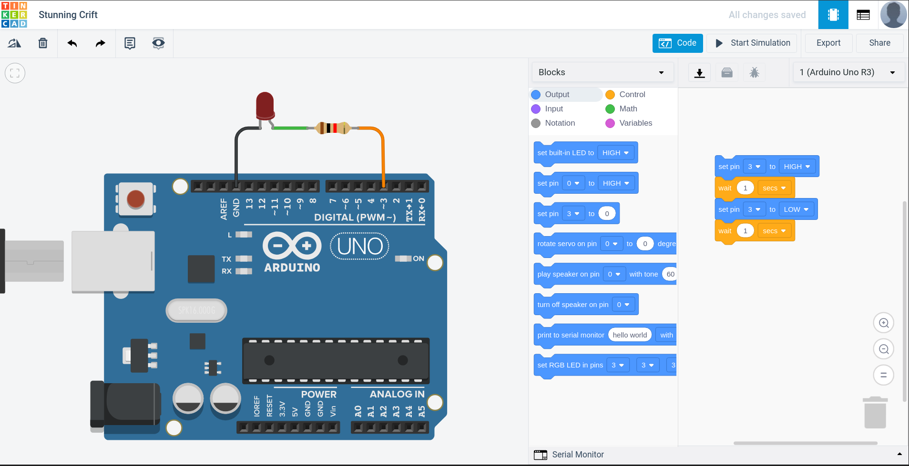{#fig:blink_tc}

## Questions:

1. How can you control the output voltage potential?
2. In which direction will electric current flow?
3. What voltage is present on the resistor?
  + How can we determine the voltage on the resistor (describe 2 possibilities)?
4. What voltage is present on the LED?

# SOFTWARE INSTALLATION

We will need softwate listed bellow:

1. [Arduino IDE](#arduino-ide) is basics "development environment"
2. [RobDuino](#RobDuino) library for easier programming
3. [Ardublockly](#ardublockly) is needed for introduction to programming
  + [Python](#python) is needed for running Ardublockly
4. [VSC in PlatformIO](#vsc-platformio) proper IDE include:
  + auto-completion,
  + error marking (e.g. forgotten \";\"),
  + auto-detect USB port, 
  + function information

## Arduino IDE

1. Go to Arduino web page Arduino->Software->[Download](https://www.arduino.cc/en/Main/Software).
2. Download [Arduino IDE 1.8.9](https://www.arduino.cc/en/Main/OldSoftwareReleases#previous) choose [Windows Install](https://www.arduino.cc/download_handler.php?f=/arduino-1.8.9-windows.exe)...
2. ... click `JUST DOWNLOAD`.
3. run `arduino-1.8.9.exe` and follow the instructions.
4. ... don't forget to install also 3rd party drivers (for Chinese version of Arduino UNO controller)... 
5. if you do forget... Try this [Russian drivers](https://www.5v.ru/zip/ch341ser(v34).zip) from [page](https://www.5v.ru/ch340g.htm).

### Getting started

1. Run `Arduino IDE`
2. Connect Arduino Uno controller to USB port.\
    `Arduino Uno`
3. Open simple basic program:\
    `files` -> `examples` -> `01.basics` -> `blink`

```c++
void setup() {
  pinMode(LED_BUILTIN, OUTPUT);
}

void loop() {
  digitalWrite(LED_BUILTIN, HIGH);   // turn the LED on (HIGH is the voltage level)
  delay(1000);                       // wait for a second
  digitalWrite(LED_BUILTIN, LOW);    // turn the LED off by making the voltage LOW
  delay(1000);                       // wait for a second
}
```
4. Make this settings in `Tools` menu ->
    1. `Board:` Arduino/Genuino Uno
    2. `Port:` COM3 *or similar*

7. Run :\
    `Upload` to transfere the program to Arduino UNO controller.

8. If everything is OK you will get this message:

```
Done uploading.
Sketch uses 970 bytes (3%) of program storage space. Maximum is 32256 bytes.
Global variables use 9 bytes (0%) of dynamic memory, leaving 2039 bytes for local variables. Maximum is 2048 bytes.
```
9. Optional this preferences are suggested:  
`File` -> `Preferences`:
    1. `Editor Language`: English
    2. `Editor font size`: 20
    3. `Show verbose output during`: [ ]compiling [x] upload
    4. `[x] Display linenumbers`
    5. `[x] Enable code folding`

## RobDuino

RobDuino is Arduino library which include some usefull functions for driving motors and on-board key usage...

### RobDuino Library Installation

1. Download zip file:
   * [RobDuino-master.zip](https://github.com/davidrihtarsic/RobDuino/archive/master.zip)
2. rename RobDuino-master.zip in:
   * **RobDuino.zip**
3. run Arduino IDE
4. choose:
   * `Sketch` --> `Include Library` --> `Add .ZIP Library...`
5. find
   * `.../Download/RobDuino.zip`
   * `[OK]`

## Ardublockly

[Ardublockly](https://ardublockly.embeddedlog.com/) is [graphical programming environment](https://en.wikipedia.org/wiki/Visual_programming_language) for programming Arduino controllers. A demo version of the program is also available [on-line](https://ardublockly.embeddedlog.com/demo/#).

>Note: For actual programming you will need Arduino IDE installed.

>Note: For running Ardublockly you will need to install Python program.

### Python Installation

1. You will have to install [Python 3.7](https://www.python.org/) or grater. First [Download](https://www.python.org/downloads/) the newest version of Python.

2. Run installation file and set this settings:
    1. `[x] Add Python to PATH` in
    2. choose `Clasic Instalation`

### Ardublockly Installation

3. From [github.com/.../ardublockly](https://github.com/carlosperate/ardublockly) download **zip** file by clicking **Clone or download** and choosen [Download ZIP file](https://github.com/carlosperate/ardublockly/archive/master.zip).

4. Extract `ardublockly-master.zip` to dirrectory of your choice e.g. `C:\\Program Files(x86)`

5. That is it! Installation is complete.

#### Running Ardublockly

6. Find this file `C:\\Program Files(x86)\\ardublockly-master` and double-click on `start.py`. Python program should run and you should see:
    1. terminal window with some code running...
    2. and a new window should apear in your Internet Browser.
If this is will not happend try to run `start.py` with right mouse button and `Start program with` then choose `Python 3.7`.

### Settings

7. Click `menu` and choose `Settings`:
    1. `Compiler Location:` C:\\Program Files (x86)\\Arduino\\arduino_debug.exe
    2. `Arduino Board:` Uno
    3. `Com port:` COM3 *or appropriate one*
    4. Click `[RETURN]`.

## VSC in PlatformIO

>Note: For programming Arduino controllers you will need Arduino IDE installed.

[Download](https://code.visualstudio.com/download) installation file:

1. run `VSCodeUserSetup-ia32-1.49.3.exe` installation file.
2. run VSC program and click `Extensions`
3. search for `PlatformIO IDE` and 
4. run `Install`.
5. restart VSC or click `Reload now`.

### Getting Started

Write basic program `Blink`:

1. plug in Arduino Uno.
2. open `PlatformIO - Home Page`:
  - in left icon bar find `PlatformIO`
    + `QUICK ACCESS` -> `PIO Home` -> `Open`
3. choose `+ New Project`
4. Setup:
  - `Name:` ime_projekta
  - `Board:` Arduino UNO
  - `Framework:` Arduino Framework
5. click `Finish` 
6. Find directory `src` (e.g. `source code`), where you can find main program code in file `main.cpp`
7. Copy-Paste this example:
```cpp
#include <Arduino.h>
void setup() {
  pinMode(13, OUTPUT);
}

void loop() {
  digitalWrite(13,HIGH);
  delay(500);
  digitalWrite(13,LOW);
  delay(500);
}
```
8. Run `Build` and `Upload`.

# EQUIPMENT TESTING

## Basic testing in Arduino IDE

1. Connect the Arduino Uno to PC with proper USB cable.  
    `[Arduino Uno]` 
2. Open Arduino IDE program and open program with:  
    `Files -  Examples - 01. Basics - Blink.ino`
3. Make shure that you will set the proper settings (see [@fig:Arduino_basic_setup_IDE]). From the menu choose:  
    `Tools`-
    1.  `Board:` Arduino/Genuino Uno
    2.  `Port:` COM3

{#fig:Arduino_basic_setup_IDE}

-   To upload the code you can click the icon `Upload`.  
    If the uploading was successful you will be prompted with the text
    like:  

> ```
> Done uploading.  
> Sketch uses 970 bytes (3%) of program storage space. Maximum
> is 32256 bytes. Global variables use 9 bytes (0%) of dynamic
> memory, leaving 2039 bytes for local variables. Maximum is
> 2048 bytes.
> ```

> ## Issues
>
> ### LED_BUILTIN was not declared in this scope
>
> 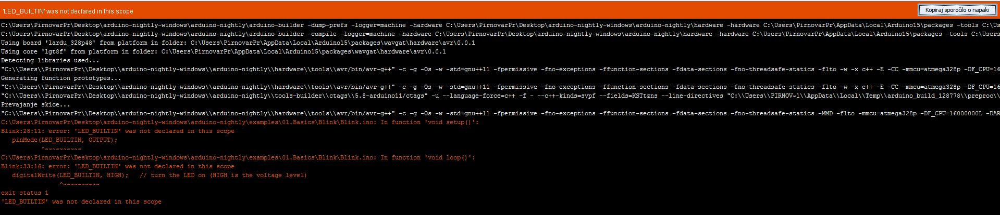{#fig:VAR_was_not_declared_IDE}
>
> Compiler ne ve kaj naj bi bilo "LED_BUILTIN" ... na tem mesu naj bi bila številka priključka, ki ga želimo krmiliti. V tem primeru je to številka 13. Rešitvi sta lahko 2:  
> 1. vse LED_BUILTIN zamenjaš s 13 ali  
> 2. v vrstico pred "void setup()" dodaj `const int LED_BUILTIN = 13;`
>
> Zadnja (druga) rešitev je boljša, ker pripomore k berljivosti programa... Spremenljivka LED_BUILTIN se imenuje "razlagalna spremenljivka" ker pomaga razlagati program. Tako postane tisti komentar "// turn the LED on (HIGH is the voltage level)" nepotreben, saj sama koda pove točno enako.

## Basic testing in Ardublockly

1. Connect the Arduino Uno to PC with proper USB cable.  
    `[Arduino Uno]` 
2. Run Ardublockly program. Which will be running as localhost and you will be using internet browser as IDE. The addres will be:  
    `http://localhost:8000/ardublockly/index.html`
3. In the left corner of the program you can find `[=] menu icon`. From where you can choose (Slide 2 and 3)  
    `[] Settings`:
    1.  `Compiler Location:` C:\\Program Files (x86)\\Arduino\\arduino\_debug.exe
    2.  `Arduino Board:` Uno
    3.  `Com port:` COM3
    4.  And press:`[ RETURN ]`
4. Finaly you can press button `PLAY` And if uploading was successful you will be prompted with the text (Slide 4):  


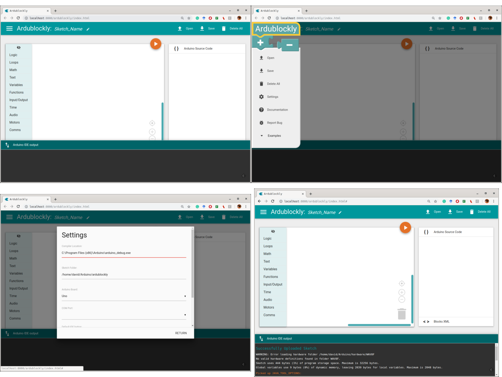{#fig:Ardublockly_basic_setup}

> ```
> Successfully Uploaded Sketch
> WARNING: Error loading hardware folder /home/david/Arduino/hardware/WAV8F.
> No valid hardware definitions found in folder WAV8F.
> Sketch uses 444 bytes (1%) of program storage space. Maximum is
> 32256 bytes. Global variables use 9 bytes (0%) of dynamic memory,
> leaving 2039 bytes for local variables. Maximum is 2048 bytes.
> ```

> ## Summary
> Before uploading the programming code always check that the right board and serial port are set.
>
> ## Issues
> **Ardublockly returns the Error id 55: Serial port Serial Port unavailable.**  
> Try to re-connect the Arduino board. Wait a moment, check the settings and choose the COM port again then try again.


## RobDuino module

1. Na krmilnik Arduino Uno priključite modul `RobDuino` in naložite naslednji program:

```cpp
void setup() {
  for (int i = 0; i < 8; i++){
    pinMode(i, OUTPUT);
  }
  pinMode(A4, INPUT_PULLUP);
  pinMode(A5, INPUT_PULLUP);
  PORTD=1;
}

int l=1;
void loop() {
  char tipka_a4_is_pressed = !digitalRead(A4); 
  char tipka_a5_is_pressed = !digitalRead(A5); 
  if (tipka_a4_is_pressed) l = l << 1;
  if (tipka_a5_is_pressed) l = l >> 1;
  if (l < 1) l = 128;
  if (l > 255) l = 1;
  PORTD = l;
  delay(100);
}
```

2. Nato preverite delovanje obeh tipk (A4 in A5) na modulu in vrednosti izhodnih priključkov D0 .. D7.

## Napajalni modul

Napajalni modul uporablja 2x Li-ion akumulatorja tipa 18650. Spodnje tiskano vezje je prikazano [@fig:napajalni_modul].

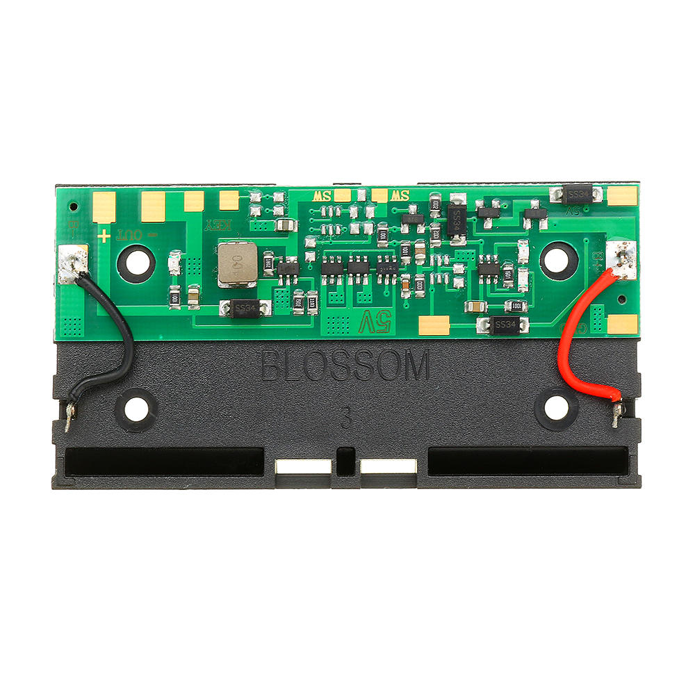{#fig:napajalni_modul}

Dodatno smo ga opremili z:
1. 2.5mm jack priključkom za napajanje,
2. 3-pinskim priključkom za napajanje,
3. preklopnim stikalom za izbiranje načina delovanja:
    1. ON - izhod za 9V je kaktiviran
    2. OFF - izključen izhod 9V napajanja in omogočeno je polnenje akumulatorjev preko 3-pinskega priključka (5V).

Pred prvo uporabo moramo ročno aktivirati napajalni modul tako, da povežemo GND na 3-pinskem priključku in NEGATIVNI terminal akumulatorjev.

## Tipka

1. Priključite stikalo po shemi na [@fig:tipka_test].

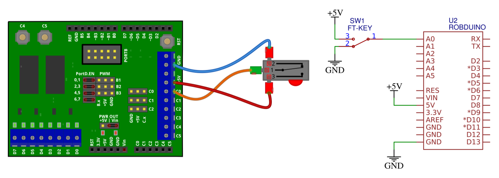{#fig:tipka_test}

2. Nato naložite naslednji program.

```cpp
void setup() {
    pinMode(A0, INPUT);
    pinMode(7, OUTPUT);
}

void loop() {
    char key_a0_is_pressed = digitalRead(A0);
    if (key_a0_is_pressed){
        digitalWrite(7, HIGH);
    } else{
        digitalWrite(7, LOW);
    }
    delay(100);
}
```

## Svetlobni senzor

1. Priključite foto-tranzistor v delilnik napetosti z uporom, kot prikazuje [@fig:foto_senzor_test].

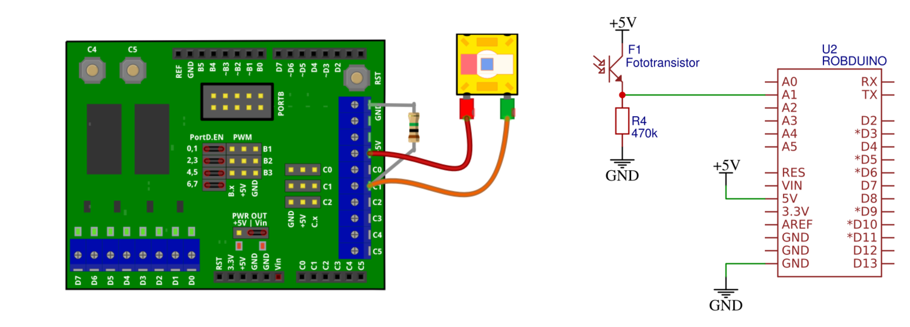{#fig:foto_senzor_test}

2. Nato naložite naslednji program in preverite odziv svetlobnega senzorja.

```cpp
 void setup() {
  pinMode(A1, INPUT);
  Serial.begin(9600);
}

void loop() {
  int light_senzor_value = analogRead(A1);
  Serial.println(light_senzor_value);
  delay(100);
}
```

3. Odziv senzorja spremljajte v oknu serijske komunikacije.

## IR senzor razdalje

1. IR senzor razdalje priključite na tri-pinski priključek kot je prikazano na [@fig:test_IR].

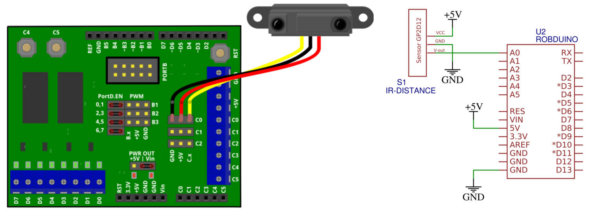{#fig:test_IR}

2. Delovanje senzorja preskusite z naslednjim programom, njegov odziv pa spremljajte v oknu za serijsko komunikacijo.

```cpp
void setup() {
  pinMode(A0, INPUT);
  Serial.begin(9600);
}

void loop() {
  int distance_senzor_value = analogRead(A0);
  Serial.println(distance_senzor_value);
  delay(100);
}
```

## LCD (I2C)

1. Priključite LCD na I2C vodilo kot prikazuje 

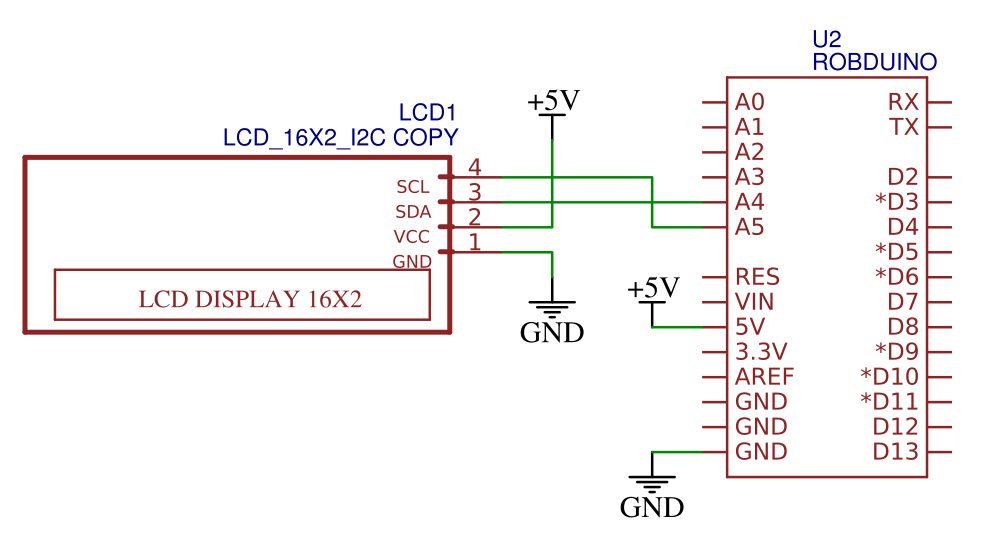{#fig:test_I2C_LCD_2}

2. Priskrbite si knjižnico `LiquidCristal-I2C` iz naslova:  
https://www.arduino.cc/reference/en/libraries/liquidcrystal-i2c/ 
3. Knjižnico dodajte v Arduino IDE okolje tako, da dodate `ZIP` datoteko v :  
`Sketch >> Include Library >> Add .ZIP Library`
3. V VSC in PlatformIO vtičniku si lahko knjižnico naložite tako, da v terminalno okno vpišete ukaz  
`pio lib install "marcoschwartz/LiquidCrystal_I2C@^1.1.4"`

4. Nato preskusite naslednji program:

```cpp
#include <Wire.h> 
#include <LiquidCrystal_I2C.h>
LiquidCrystal_I2C Lcd(0x27, 16, 2);

void setup() {   
    Lcd.init();
    
    Lcd.clear();
    Lcd.backlight();
    
    Lcd.setCursor(3,0);
    Lcd.print("Hello");
    Lcd.setCursor(6,1);
    Lcd.print("World");   
}

void loop() {
}
```

Če niste prepričani kateri i2c naslov uporablja naprava na LCD-ju le tega lahko preverite s programom `I2C scanner` (https://playground.arduino.cc/Main/I2cScanner/). Običajno I2C LCD-ji, ki jih naredijo kitajski proizvajalci uporabljajo I2C naslov `0x27` , `0x3F` ali manj pogosto `0x38`.


# HELLO WORLD IN ARDUBLOCKLY

## Task: MAKE 1ST ARDUBLOCKLY PROGRAM

1. Make a very simple program like setting the digital output bit D3 to logical state 1 or **HIGH**.
2. Send the program to Arduino controller.

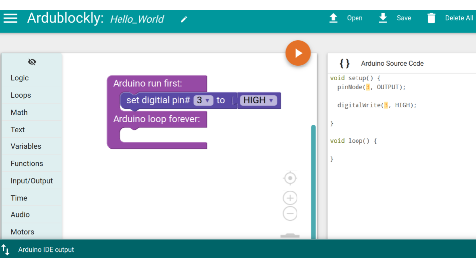{#fig:ardublockly_first}

## Questions:

1.  What is the voltage of the digital output pin D3?
2.  Try to compare and understand the C++ programming code in aside
    window.

> ## Summary
> Programming with programming blocks is a good starting point for beginners since humans are not good in handling to many informations at the same time.
>
> Having programming blocks aside with C code is nice and soft introduction of the code programming.
>
> ## Issues
> ...to do...

# HOW THE DC MOTOR WORKS

## Task: MAKE DC MORTOT RUN

1. Connect the DC motor to the battery and make it run.
2. You can try different combinations to connect the terminals of the motor like:
    - \+ and -
    - \- and +
    - \- and -
    - \+ and +.

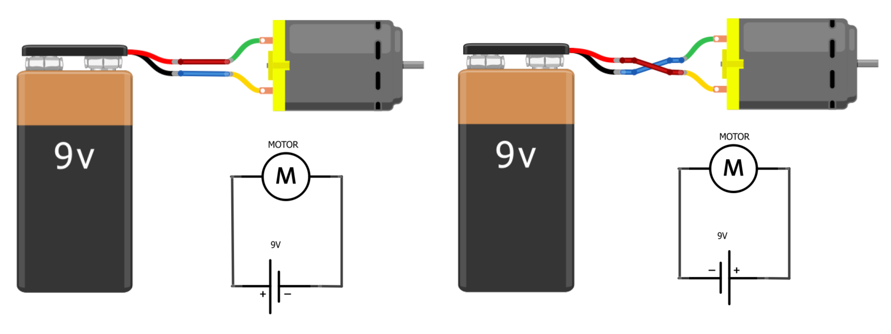

## Questions:

1.  In which direction the motor\'s shaft spins in different situations?
2.  In which direction the electric current flow?
3.  Why does motor is not spinning when both connectors are connected to +
    terminal of the battery?

> ## Summary
> The rotation of the DC motor depends on the direction of electric
> current.
> 
> ## Issues
> ### *When I connect the DC motor to + and - terminals of the battery the motor\'s shaft does not spin.*
> 
> Check the voltage of the battery... battery may be discharged.  
> Check the connectors of the motor... may be bad.  

# DC MOTOR CONTROL WITH DIGITAL OUTPUTS

## Task:

1. Connect the DC motor to Digital Output D7 and D6.
2. Write the program and check all the combinations of digital outputs;
    00, 01, 10 and 11.

3.  For each combination of digital outputs mark the state of the motor (fulfill the [@tbl:motor_combo_ARB ]).R

| D7 | D6 | Motor rotation |
|:--:|:--:|----------------|
|  0 |  0 |                |
|  0 |  1 |                |
|  1 |  0 |                |
|  1 |  1 |                |
Table: All combinations of the states of motor's connectors. {#tbl:motor_combo_ARB}

## Questions:

2.  Try to stop the shaft of the DC motor for a short time and try to remember how difficult it is?
3.  Why does motors' shaft not spinning if the digital output state are  `1` and `1`.

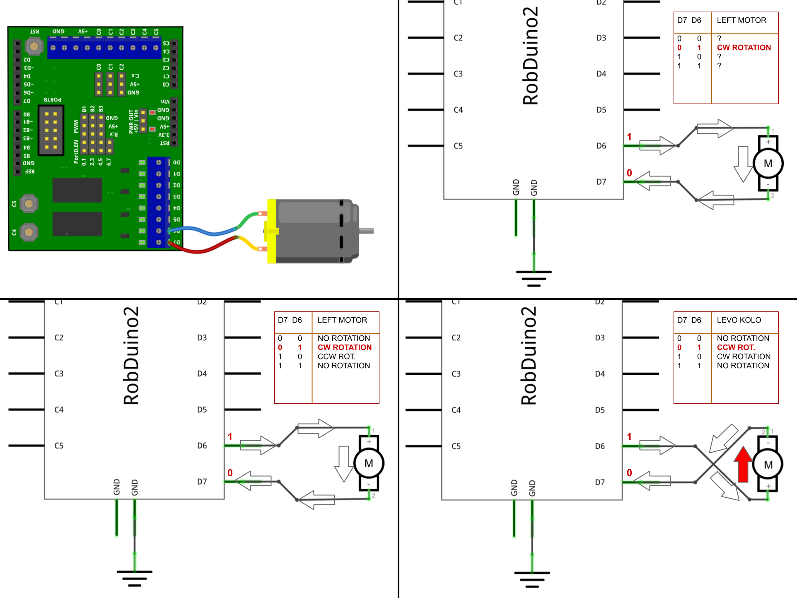

> ## Summary
> 
> The motor\'s shaft is spinning according to the direction of the
> electric current trough the motor.  
> The torque is weak.
> 
> ## Issues  

# GEAR REDUCER

## Task:

1. Add geared reductor to DC motor.
2. Try to stop the shaft of the geared reductor and compare your fillings with the stopping the motor shaft.

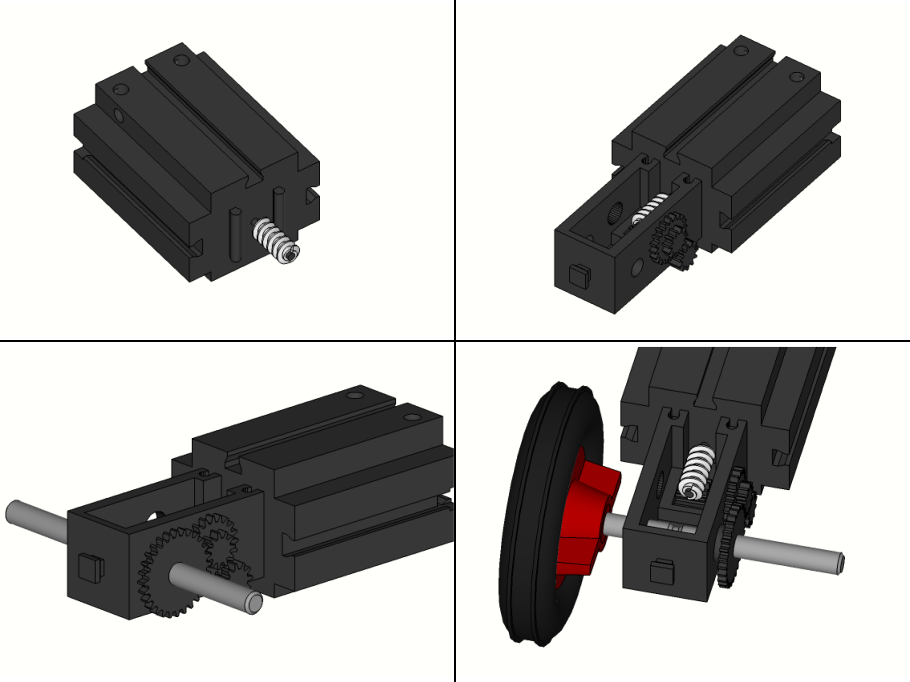

## Questions:

1.  How difficult is to stop the shaft of the reductor in comparison to motor shaft?
2.  How fast the shaft of the reductor is spinning in comparison to the shaft of the motor?
3.  Are you able to freely rotate the shaft of the reductor by hand?
4.  What happened with the produced mechanical power?
5.  Try to calculate the geared ratio of the reductor.

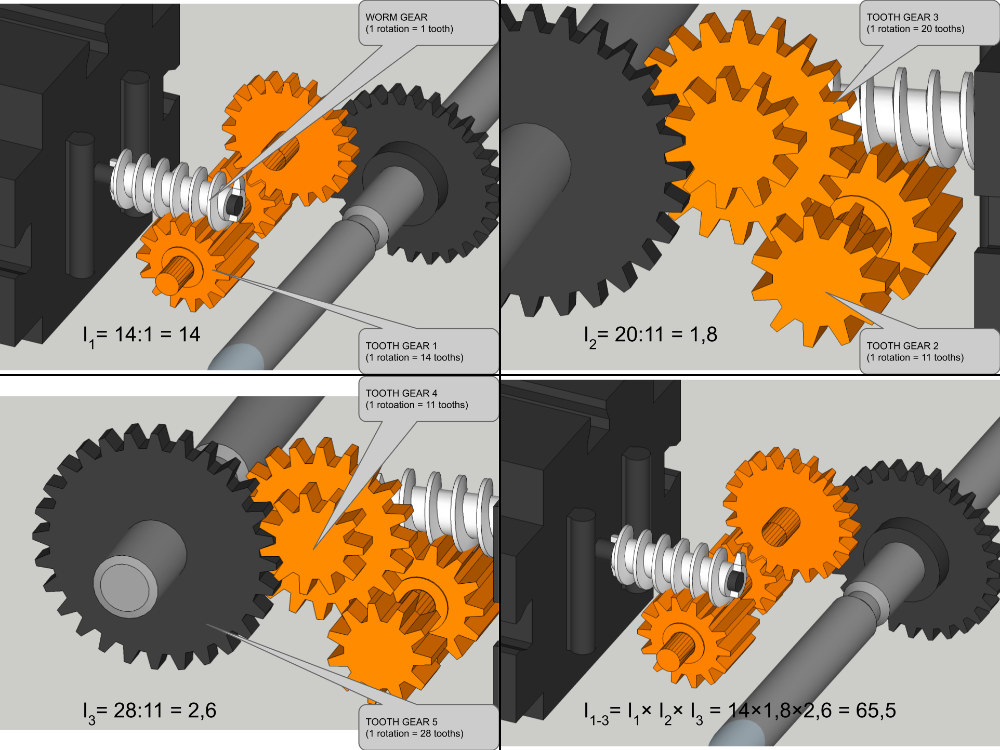

> ## Summary
> 
> ### Gear ratio
> 
> The gear ratio describing the ratio between the angular velocity of
> input gear G1 and angular velocity of output gear G2.  
> $$ { i=\frac{\omega_1}{\omega_2} } $$  
> Because each gear moves tooth per tooth and if two touching gears have different numbers of teeths their\'s angular velocity will be different.
> In fact the anguar velocity will be inversely proportional.  
> $$ {\frac{\omega_1}{\omega_2}=\frac{N_2}{N_1}=i} $$
> 
> ## Issues
> 
> ### *The reductor\'s shaft is not spinning although the DC motor is working properly.*
> 
> Check if the reductor is attached all the way to the motor. 
> Check if the worm gear of the motor is in contact with first gear of the
> roductor.

# ROBOT CONSTRUCTION

## Tasks:

1. Construct the mobile robot according to this sequences on the [@fig:construction].

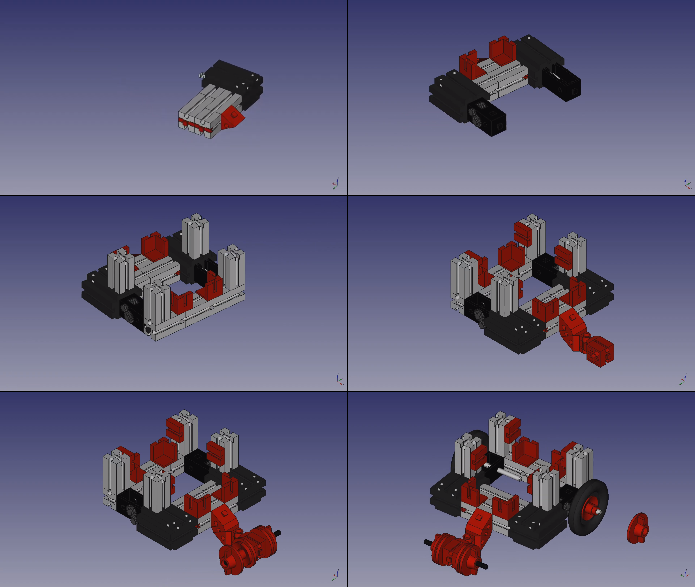

Or you can follow the video [instructions](https://youtu.be/bybqvos4xYk)

2. Add the battery between the red cornered bricks. The connector shuld
    be pointing to the back of the robot.
3. Add also the RobDuino controller. Clip the controller between the grey upstanding bricks.

## Questions:

1.  Where do you think is th front side of the robot?
2.  Are you able to rotate the wheels freely by hand?

<!--
slika iz YouTuba
<iframe width="410" height="230" frameborder="0" src="https://www.youtube.com/embed/bybqvos4xYk"></iframe>
{#fig:fff}
-->

> ## Summary:
> <++>
> 
> ## Issues:
> 
> <++>

# BASIC ROBOT CONTROL

## Task: CONTROLLING THE MOTORS

1. Connect LEFT MOTOR to digital outputs:
    -   D7 and D6
2. Connect RIGHT MOTOR to digital outputs:
    -   D5 and D4

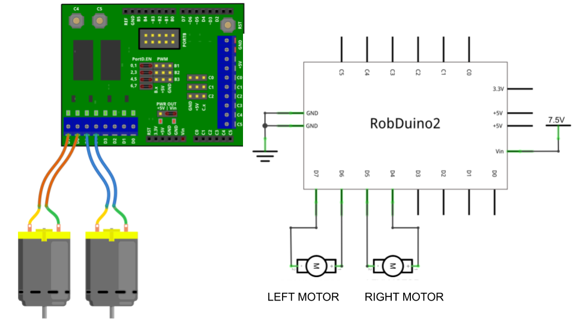{#fig:DC_motor_connect}

3. Now you can write the program to control both motors in order to move the robot FORWARD for 3 second and STOP.
4. Next you can write the program which will move the robot in several different directions:
    - forward
    - backward
    - turn left
    - turn right

## Questions:

1.  How many digital outputs you have to set in order to control the
    robot for specific move?
2.  How many different moves your robot can make?

> ## Summary:
> 
> ### Controlling the robot in two degrees of freedom
> 
> To controlling the robot in two degrees of freedom we need to control
> two motors. Since we have to set two digital outputs for each motor we
> have to set four digital outputs for each individual move.
> 
> ## Issues:
> 
> ### *When I change the direction of the robot the robot does not move as expected.*
> 
> Probably you did not set all of the outputs correctly. Remember that
> some outputs may have remained set in previous output state from taken
> action in previous task.  

# PROGRAMMING FUNCTIONS

## Task: WRITE A FUNCTION

1. Write a programming functions which includes the certain programming steps in order to move the robot in specific direction. Some examples are presented in [@fig:functions_ardublockly].

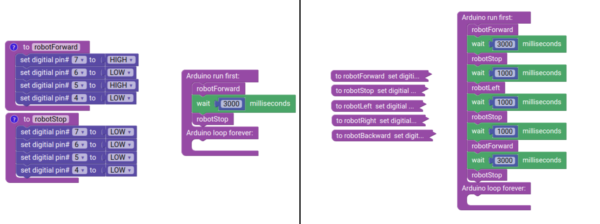{#fig:functions_ardublockly}

2. Write also other functions like:
    -   `robotForward()`
    -   `robotStop()`
    -   `robotLeft()`
    -   `robotRight()`
    -   `robotBackward()`
3. Write longer program to move the robot allover the classroom.

## Questions:

1.  What would happened if several robots would have the same program?
2.  Can you change the program in a way that robot would repeat the program?
3.  What happens if the mobile robot run into an obstacle?

> ## Summary:
> 
> ### <++>
> 
> ### Issues:
> 
> ### *<++>*

# PROGRAMMING LOOPs: FOR-NEXT & WHILE

## Task: REPEAT SOME INSTRUCTIONS

1. If we want to repeat some programming instructions for several times we can use For-Next Loop.
2. For example the next program repeats functions `robotLeft()` and `robotRight()` for `10 times` and robot will do a funny \"dancing\" move.

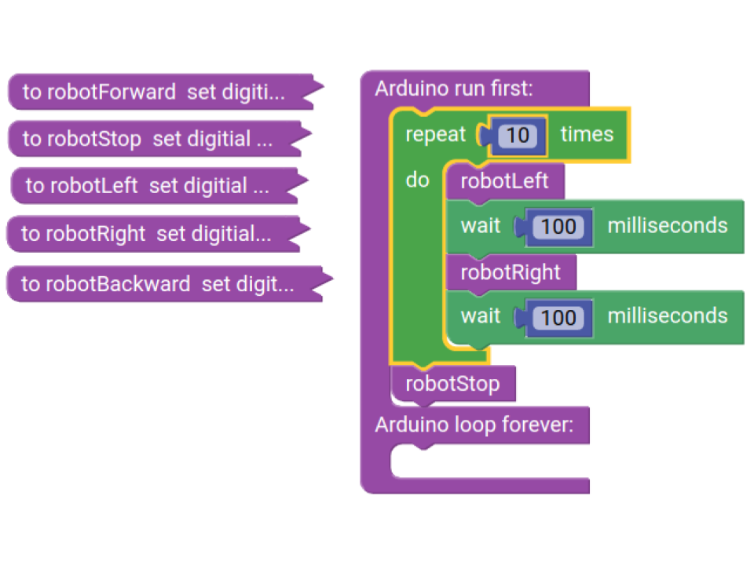{#fig:for_next_loop}

3. Experiment a bit more with such programming techniques.

## Questions:

1.  What is a programming loop?
2.  Name a situation where programming pool is used.

> ## Summary:
> 
> ### Repeating Code in Functions
> Using functions may not seem to be very convenient. But it is a huge deal, and helps to make a clean code. It is advised to use functions ether if the code is used only once.
>
> Where the code is repeated several times in different occasions in the program the use of the functions is trivial.
> 
> ## Issues:
> 
> ### *<++>*
> 
> <++>  

# DIGITAL INPUT

-   In sake to detect the obstacles we have to equip robot with the
    \"touch sensor\". This sensor is basically a switch or key, which
    toggles it\'s output between GND and +5 V voltage potentials.
-   Follow [video instructions](https://www.youtube.com/embed/eWldNxh-q2c)
    to construct bumper in front of the robot.

## Questions:

1.  Do you hear \"clicking\" sound when you push the bumper?
2.  Name the mechanical mechanism where smaller force on one end can
    cause greater force on the other end of the mechanism.

<iframe width="410" height="337" frameborder="0" src="https://www.youtube.com/embed/eWldNxh-q2c"></iframe>

## Tasks: CONNECT THE SWITCH

The key has three connecting terminals. Each of one is marked with the
number 1, 2 or 3. Connect them in right order. Connect the key terminals
in order that are specified in presentation and listed as:

1. connect to RobDuino C0 terminal.
2. connect to RobDuino voltage terminal GND.
3. connect to RobDuino voltage terminal +5V.

## Questions:

1. What is the output voltage of the sensor when the robot is (or is NOT) touching the obstacle?
2. How many different states are presented at the output of the sensor?
3. Name several more examples where digital sensor can take place.

<iframe src="https://docs.google.com/presentation/d/1Sw-3ovX36DYt9zcj6z9gESie3ZJwWLExb9KPddrw9JM/embed?authuser=0&hl=en&size=s" width="410" height="337" title="Connecting the key" frameborder="0" allowfullscreen="true" mozallowfullscreen="true" webkitallowfullscreen="true"></iframe>

<!--

-->
> ## Summary:
> 
> ### Digital sensors
> 
> The output of a digital sensor can be just in two states:
> 
> -   logical \"0\" - presented in voltage as 0 V.
> -   logical \"1\" - presented in voltage as +5V.
> 
> ## Issues:
> 
> ### *Robot has no power since I connected the key as a sensor.*
> 
> Probably the key or switch is connected wrong and there is short connection between the GND and +5V voltage terminals. Unconnect the key or switch and verify if the power is back.

## Tasks: READING DIGITAL INPUT

1. Write the program shown in the presentation to test the readings of the digital sensor.
1. Then ... complete the program to turn OFF the LED when the bumper is not touching anything.
1. Next ... Change IF statements into single one IF-THEN-ELSE statement.
1. Advanced ... Solve the problem without IF statement.

## Questions:

1.  Check if the LED on the output terminal D3 is turend ON when the
    bummper is pressed.

<iframe src="https://docs.google.com/presentation/d/1NVtol-a0tmlgl00VwCACQIcAOOty3KYEMSgUFkf8-Aw/embed?authuser=0&hl=en&size=s" width="410" height="337" title="Testing Digital Input" frameborder="0" allowfullscreen="true" mozallowfullscreen="true" webkitallowfullscreen="true"></iframe>

> ## Summary:
> 
> ### <++>
> 
> <++>
> 
> ## Issues:
> 
> ### *<++>*
> 
> <++>  

# S-R-A LOOP

## Tasks:

1. Write the program to drive the robot around the class and avoid the
    obstacles.
1. Using the S-R-A loop technique you should write the program in
    particular order:
    1.  Check the sensor. IF the bummper  ...
    2.   ... is pressed the robot has to stop/go back/turn.
    3.   ... is not pressed the robot can drive forward.

## Questions:

1.  Would this routine also work in Arduino run first function (check
    the program in Slide 2)?
2.  <++>

<iframe src="https://docs.google.com/presentation/d/13B5ynixnR7ZRl4__jpnLk7gP8_S3yF2U2zaUpZtax1o/embed?authuser=0&hl=en&size=s" width="410" height="337" title="S-R-A Loop" frameborder="0" allowfullscreen="true" mozallowfullscreen="true" webkitallowfullscreen="true"></iframe>

> ## Summary:
> 
> ### Senzoning-Reasoning-Acting Loop
> 
> S-R-A loop is the most important thing in robotics.
> 
> ## Issues:
> 
> ### *It seems that the program is not working right \... like it would be ignoring the value of the sensor.*
> 
> Probably the S-R-A loop is not actually a loop. Check the program if the input is read just onces or is read continuously.  

# FROM ARDUBLOCKLY TO ARDUINOIDE

## Tasks:

1. Make a really basic program with easy task like it is shown on [@fig:Ardublockly_to_Arduino_IDE].

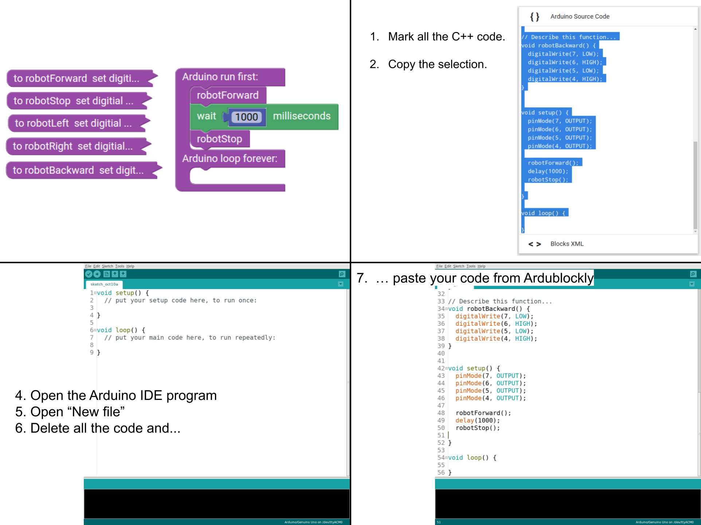{#fig:Ardublockly_to_Arduino_IDE}

2. Open the Arduino IDE program.
3. Copy-Paste all the c++ code from Ardublockly into Arduino IDE.
4. Experiment with the c++ code.

## Questions:

1.  Why we need to compile the programming code?
2.  If in the code are some errors, where they can be noted?

> ## Summary:
> 
> ### *Compiling the code*  
> A compiler is just a program that converts your program written in terms you understand into a form your computer understands (e.g. from English to ones and zeros). The compiler must convert your source code to machine code.
>
> ### *Programming the microcontroller*  
> Each time we change the programming code and want to run it on a microcontroler we need to send the machine code to the microcontroller first. This process is called programming.
> 
> ## Issues:
> 
> ### *Programming the microcontroller failed: can't open device "/dev/ttyUSB0"*  
> Check the USB connection with the Arduino controller.  
> Check the settings if the Board, Processor and Port are set wright.

# HELLO WORLD IN ARDUINO IDE

## Tasks:

1. Make a very simple program like setting the digital output bit D3 to logical state 1 or **HIGH**.

```cpp
void setup() {
  // put your setup code here, to run once:
  pinMode(3, OUTPUT);
  digitalWrite(3, HIGH);
}

void loop() {
  // put your main code here, to run repeatedly:

}
```
: Hello World in ArduinoIDE. {#lst:170_Hello_World_in_ArduinoIDE}

2. Send the program to controller Arduino UNO .

## Questions:

1.  Explain the purpose of next programming characters in presented example:
    1. `;`
    2. `{  }`
    3.  `pinMode(3, OUTPUT);`
    4.  `digitalWrite(3, HIGH);`
    3.  `// put your ...`
    5.  `void setup()`
    6.  `void loop()`

> ## Summary:
> 
> ### Using curly braces - \{ and \}
> 
> Using curly braces in C++ is important part of riting the programming code. Imagine that you want to merge several members of programing code to a single pile. As we would separate pencils into one pile and markers to another - to be more organized. In real life we would do by elastic bundle or rope. If you have to choose single character from the keyboard to indicate that several members are combined to the same pile - which character would you choose? Probably curly braces {} are the best choice.
> 
> ### Function Definition
```cpp
   void loop() {

   }
```
> ### Function Call
```cpp
    digitalWrite(3, HIGH);
```
> ### Function Name
> 
> Function name should be stacked together from 2 - 5 short words that uniquely describing the functionality of the function. The first word should start with lower case and all the others words following should start with upper case. Some examples should be:
```cpp
   badname(); 
   goodFunctionName(); 
```
> ## Issues:
> 
> ### *Error: expected ';' before 'something'*
> 
> Probably you forgot to put ; (semicolon) at the end of the command. Find the row starting with \"**something**\" and look the row above\...  probably missing \"**;**\".  
>
> ### *Light at the digital output D3 is not ON.*
>
> Check if the enable switch fot the digital outputs is at the right position (ENABLE).

# HOW THE DC MOTOR WORKS

## Task: MAKE DC MORTOT RUN

1. Connect the DC motor to the battery and make it run.
2. You can try different combinations to connect the terminals of the motor like:
    - \+ and -
    - \- and +
    - \- and -
    - \+ and +.


## Questions:

1.  In which direction the motor\'s shaft spins in different situations?
2.  In which direction the electric current flow?
3.  Why does motor is not spinning when both connectors are connected to +
    terminal of the battery?

> ## Summary
> The rotation of the DC motor depends on the direction of electric
> current.
> 
> ## Issues
> ### *When I connect the DC motor to + and - terminals of the battery the motor\'s shaft does not spin.*
> 
> Check the voltage of the battery... battery may be discharged.  
> Check the connectors of the motor... may be bad.  

# DC MOTOR CONTROL WITH DIGITAL OUTPUTS

## Task:

1. Connect the DC motor to Digital Output D7 and D6.
2. Write the program and check all the combinations of digital outputs;
    00, 01, 10 and 11. First combination is shown in [@lst:190_DC_Motor_Control_with_Digital_Outputs]

```cpp
void setup()
{
  pinMode(7, OUTPUT);
  pinMode(6, OUTPUT);
  // D7=0, D6=0
  digitalWrite(7, LOW);
  digitalWrite(0, LOW);
  delay(3000);
  // Write other combinations here...

}
void loop()
{

}
```
: DC Motor Control with Digital Outputs. {#lst:190_DC_Motor_Control_with_Digital_Outputs}

3.  For each combination of digital outputs mark the state of the motor (fulfill the [@tbl:motor_combo ]).

| D7 | D6 | Motor rotation |
|:--:|:--:|----------------|
|  0 |  0 |                |
|  0 |  1 |                |
|  1 |  0 |                |
|  1 |  1 |                |
Table: All combinations of the states of motor's connectors. {#tbl:motor_combo}

## Questions:

2.  Try to stop the shaft of the DC motor for a short time and try to remember how difficult it is?
3.  Why does motors' shaft not spinning if the digital output state are  `1` and `1`.


> ## Summary
> 
> The motor\'s shaft is spinning according to the direction of the
> electric current trough the motor.  
> The torque is weak.
> 
> ## Issues  

# GEAR REDUCER

## Task:

1. Add geared reductor to DC motor.
2. Try to stop the shaft of the geared reductor and compare your fillings with the stopping the motor shaft.


## Questions:

1.  How difficult is to stop the shaft of the reductor in comparison to motor shaft?
2.  How fast the shaft of the reductor is spinning in comparison to the shaft of the motor?
3.  Are you able to freely rotate the shaft of the reductor by hand?
4.  What happened with the produced mechanical power?
5.  Try to calculate the geared ratio of the reductor.


> ## Summary
> 
> ### Gear ratio
> 
> The gear ratio describing the ratio between the angular velocity of
> input gear G1 and angular velocity of output gear G2.  
> $$ { i=\frac{\omega_1}{\omega_2} } $$  
> Because each gear moves tooth per tooth and if two touching gears have different numbers of teeths their\'s angular velocity will be different.
> In fact the anguar velocity will be inversely proportional.  
> $$ {\frac{\omega_1}{\omega_2}=\frac{N_2}{N_1}=i} $$
> 
> ## Issues
> 
> ### *The reductor\'s shaft is not spinning although the DC motor is working properly.*
> 
> Check if the reductor is attached all the way to the motor. 
> Check if the worm gear of the motor is in contact with first gear of the
> roductor.

# ROBOT CONSTRUCTION

## Tasks:

1. Construct the mobile robot according to this sequences on the [@fig:construction].


Or you can follow the video [instructions](https://youtu.be/bybqvos4xYk)

2. Add the battery between the red cornered bricks. The connector shuld
    be pointing to the back of the robot.
3. Add also the RobDuino controller. Clip the controller between the grey upstanding bricks.

## Questions:

1.  Where do you think is th front side of the robot?
2.  Are you able to rotate the wheels freely by hand?

<!--
slika iz YouTuba
<iframe width="410" height="230" frameborder="0" src="https://www.youtube.com/embed/bybqvos4xYk"></iframe>
{#fig:fff}
-->

> ## Summary:
> <++>
> 
> ## Issues:
> 
> <++>

# INTRODUCTION TO PROGRAMMING

text for some intro to new lecture unit

## Tasks: Make robot move

1. Connest both DC motors to RobDuino controller according to [@tbl:motors_to_RobDuino]:

|          MOTOR          | RobDuino Output pins |
|:-----------------------:|:--------------------:|
|  Left DC Motor - con. A |          D7          |
|  Left DC Motor - con. B |          D6          |
| Right DC Motor - con. A |          D5          |
| Right DC Motor - con. B |          D4          |
Table: Motors connections to RobDuino Output pins. {#tbl:motors_to_RobDuino}

2. Write simple programming instructions to move the robot forward. Make right sequence of programming instructions (e.g. `digitalWrite()` and `delay(time_in_ms)` functions) to achive:
    1. move the robot forward,
    2. do it for 3000 ms and
    3. stop the robot.

## Questions:

You probably ended up with something like [@lst:220_Introduction_to_Programming]:

```cpp
void setup()
{
  pinMode(4, OUTPUT);
  pinMode(5, OUTPUT);
  pinMode(6, OUTPUT);
  pinMode(7, OUTPUT);

  digitalWrite(7, HIGH);
  digitalWrite(6, LOW);
  digitalWrite(5, HIGH);
  digitalWrite(4, LOW);

  delay(3000);

  digitalWrite(7, LOW);
  digitalWrite(6, LOW);
  digitalWrite(5, LOW);
  digitalWrite(4, LOW);
}

void loop()
{

}
```
: Introduction to Programming. {#lst:220_Introduction_to_Programming}

1. Is this code "easy readable"?
2. Why is readable code important?

## PROGRAMMING CODE EXPLAINED

1. Zaporedje
2. Izbira
3. Ponavljanje

### Kako pisati pregledno kodo programa?

- [Clean CODE](https://www.youtube.com/watch?v=7EmboKQH8lM)

Proces pisanja kode je izredno NE-linearen, naše misli skačejo na različne težave in različne potrebe, ki se utegnejo pripetiti med programiranjem. Zato ni čudno, da bo prva delujoča koda zapletena in raztresena. Zato jo moramo po končnem testiranju NUJNO urediti.

    Ko napišete delujočo kodo in ste jo stestirali, ste na pol-poti. Potrebno jo je še urediti in narediti berljivo! (Uncle Bob)

Organizacija programa naj bo podobna pisanju članka v časopisu:  
1. Začnemo z naslovom, nato
2. napišete povzetek
3. nato sledijo odstavki, ki razkrivajo zgodbo v podrobnosti in 
4. na koncu je zaključek z rezultati.

Taka ureditev omogoča bralcu, da besedilo lahko zapusti takoj, ko vsaj približno razume namen vsebine. Zamislite si, da berete časopis z novicami, a preberete le tiste, ki vas zanimajo, ostale pa le preletite.

### Manj je več

Krajše koščke programa je lažje razumeti. Zato se moramo potruditi, da vsako zaključeno celoto strnimo v podprogram ali funkcijo.

### Funkcije

Pri funkcijah naj bi se držali nekaj previl:

#### Koda v funkcijah naj bo kratka

Funkcija naj naredi le eno stvar. To pomeni, da iz kode, ki je v funkciji ne moremo izvleči programske stavke in jih logično ločiti v svojo funkcijo. Seveda pa, moramo vse te majhne funkcije primerno poimenovati.

    Imena funkcije naj bodo GLAGOLI in ne samostalniki, ker funkcije OPRAVLJAJO neko nalogo. (Uncle BOB)

#### Oblikovanje funkcij v razrede

Pri oblikovanju funkcij lahko opazimo, da funkcije operirajo s podatki. Če se ti podatki ponavljajo ali pa so podobni moramo razmisliti o uporabi RAZREDA (callses). Naprimer krmiljenje DC motorja je tak primer. Lahko imamo več motorjev in za vsakega posebej želimo nastavljati smer in hitrost. V ta namen bi bilo smiselno pripraviti class:

```cpp
class Motor
{
  public:
    int smer;
    int hitrost;
};
```

### Da je koda pregledana je verjetno bolj pomembno kot, da deluje... zakaj?

Če imamo delujočo kodo in je ta nepregledna, se lahko zgodi, da ko se bodo zahteve spremenile (posodobili bomo program) bomo skušali kodo popraviti in je ne bomo mogli. Da o možnosti, da bi nam jo popravil nekdo tretji sploh ne razmišljamo.
Če pa je koda pregledna, pa ne deluje nam jo lahko pomaga rešiti bolj izkušenj programer.

Pregledno kodo lahko uporabi nekdo drug in je prenosljiva.

### Koda naj gre iz višjega nivoja v nižji

Med posameznimi vrsticami naj ne bo velikih prehodov med nivoji programiranja. Naprimer ne mešajmo deklaracij objektov z deklaracijami konstant.

### Razlagalna spremenljivka

Te spremenljivke določimo zato, da bodo if-stavki bolj berljivi. Samo spremenljivko določimo predhodno in ji damo tako ime, ki nakazuje na neko logično stanje. Izogibamo se negaciji.

```cpp
stikaloJeSklenjeno = digitalRead(3);
if (stikaloJeSklenjeno) {
  digitalWtire(3, HIGH);
}
```

### Kakšna so naša pričakovanja glede programske kode?

#### Vmesne različice naj bodo delujoče

Postaviti si moramo kratke roke ob katerih bomo izdali delujočo kodo. Koda je lahko še podhranjena z uporabnimi funkcijami, a vse funkcije morajo delovati. Izdajanje vmesne različice naj vsebuje:
- vse delujoče elemente kode,
- njihovo dokumentacijo in
- koda naj bo urejena ter
- vsak njen del stestiran.

#### Dodajanje novih funkcij v program ne sme upočasniti dela

Dodajanje novih funkcij v program ne sme upočasniti dela, če se to zgodi, je verjetno zaradi tega, ker smo pred tem naredili zmedo v programski kodi. Še en razlog več zakaj **mora** biti koda urejena.

### Spremembe programske kode morajo biti enostavne

Že iz besedne zveze SOFT-WARE je razvidno, da je to MEHAK - IZDELEK in ga je zato enostavno spremeniti. Zato vsaj majhne spremembe ne smejo biti težava in morajo biti hitro implementirane. K temu koraku pripomore zopet:
- pregledna koda in
- dobro napisan testni program

### Program naj bo s časom vedno boljši

### Popravljanje kode brez strahu

Kadar imamo občutek, da bi morali kodo izboljšati, jo dokumentirati ali narediti preglednejšo - imamo verjetno prav. Vendar se tega dela lahko ustrašimo, češ, da bomo kodo morda uničili. Tega se ne smemo nikoli ustrašiti! V veliko pomoč nam je lahko dober testni algoritem kode. Tako brez težav počasi spreminjamo kodo in jo sproti testiramo. Tak proces je zanesljiv in enostaven.

### Seznanjanje svojega sodelavca s kodo

Pametno je seznanjanje svojih sodelavcev z vašim delom (programiranjem) zato, da vas lahko nadomestijo, če ste vi odsotni z dela. Poleg tega pa je to dobra praksa pregleda kode in tako pogosto kodo izboljšamo z idejami sodelavcev.

### Testiranje kode

1. Ne napiši kode dokler nisi napisal testa zanjo in je le-ta spodletel, ker koda ne obstaja
2. Ne napiši daljšega testa kode, le toliko, da je dovolj, da spodleti.
3. Na napiši daljše kode, le toliko, da popraviš spodleteli test.

### Arhitektura kode

Iz arhutekture kode mora biti jasno za kakšen projekt gre. Podobno kot lahko iz tlorisa stavbe lahko povemo za kater namen je zgrajena. Enako je, če pogledamo kako je urejena arhitektura računalniške matične plošče.

Ker gre pri robotiki v najosnovnejšem primeru za S-R-A loop bi verjetno bilo primerno, da je tudi arhitektura kode taka.

> ## Summary:
> ### <++>
>
> ## Issues:
> ### <++>
>

# WRITING CLEAN CODE

In order to make your code readable you have to clean your code regularly. This step is very important to not to slow down the programming process in the future programming.
You will probably spent the same amount of time cleaning the code that you needed for writing a working version.

In general you can follow some rules:

1. Use FUNCTIONS for every single action,
2. COMMENT the code only where is necessary,
3. Use EXPLANATORY CONSTANTS and VARIABLES

to make your code clean.

Our aim is to write more readable code like in [@lst:230_Writing_Clean_Code]:

```cpp
#include "RobotMovingFunctions.h"
void setup()
{
  setIOpins();
  moveForward();
  delay(3000);
  stopTheRobot();
}

void loop()
{

}
```
: Writing Clean Code. {#lst:230_Writing_Clean_Code}
... we will do it in several steps.

## Tasks:

1. Write programming functions for moving the robot in several dirrections:
    1. `moveForward()`,
    2. `moveLeft()`,
    3. `moveRight()`,
    4. `moveBackward()`,
    5. `stopTheRobot()`.

2. Save all the functions into header file:
  `RobotMovingFunctions.h`. An example of header file is shown in [@lst:Header_file_example_of_Robot_moving_functions]

```cpp
/****************************
 * IO pins of the Robot
 ***************************/
const int LEFT_MOTOR_PIN_1  = 7;
const int LEFT_MOTOR_PIN_2  = 6;
const int RIGHT_MOTOR_PIN_2 = 5;
const int RIGHT_MOTOR_PIN_1 = 4;
/****************************
 * Function declarations
 ***************************/
void setIOpins();
void moveForward();
/****************************
 * Function definitions
 ***************************/
void setIOpins(){
  pinMode( LEFT_MOTOR_PIN_1, OUTPUT);
  pinMode( LEFT_MOTOR_PIN_2, OUTPUT);
  pinMode(RIGHT_MOTOR_PIN_1, OUTPUT);
  pinMode(RIGHT_MOTOR_PIN_2, OUTPUT);
}
void moveForward(){
  digitalWrite( LEFT_MOTOR_PIN_1, LOW);
  digitalWrite( LEFT_MOTOR_PIN_2, HIGH);
  digitalWrite(RIGHT_MOTOR_PIN_1, LOW);
  digitalWrite(RIGHT_MOTOR_PIN_2, HIGH);
}
```
: Header file example of Robot moving functions. {#lst:Header_file_example_of_Robot_moving_functions}

## Questions:

1. <++>
2. <++>
3. <++>

## CLEAN CODE EXPLAINED

### Comments - YES and NO

Comments are very helpful and necessary. Keep them short and meaningful whenever is needed. May also help during thinking process while beginning designing the code.

```cpp
// robot will go forward
digitalWrite(7,HIGH);
digitalWrite(6,LOW);
digitalWrite(5,HIGH);
digitalWrite(4,LOW);
```

Don't use comments where the code is self-explanatory, for example:

```cpp
  delay(3000); //wait for 3000ms
```

### Functions

Concatenate programming code into meaningful functions is a must! Previous example of code for `driving a robot forward` is very difficult to understand at first sight. We can make cleaner code as is shown in nex example where is easier to understand what-is-what:

```cpp
void robotForward()
{
  digitalWrite(LEFT_MOTOR_PIN_1,HIGH);
  digitalWrite(LEFT_MOTOR_PIN_2,LOW);
  digitalWrite(RIGHT_MOTOR_PIN_1,HIGH);
  digitalWrite(RIGHT_MOTOR_PIN_2,LOW);
}
```
Compact code is more understandable than large one, see next example:

```cpp
void setup()
{
  setIOpins();
  robotForeward();
  delay(3000);
  robotStop();
}
```

#### Function declaration

Function declaration is highly advisable since allow you a quick overview of available functions in a current file. It is like a table of functions with it's return type and parameters. All declarations are tipically found at the beginig of the file.

```cpp
void moveForward();
void moveLeft();
void moveLeft_PWM(int pwm_value);
```

#### Function Definition

A function definition provides the actual body of the function.

```cpp
void robotForward()
{
  digitalWrite(LEFT_MOTOR_PIN_1,HIGH);
  digitalWrite(LEFT_MOTOR_PIN_2,LOW);
  digitalWrite(RIGHT_MOTOR_PIN_1,HIGH);
  digitalWrite(RIGHT_MOTOR_PIN_2,LOW);
}
```

### Constants

Use explanatory constants to more clearly represent unintuitive numbers or other abstract values. Use these constants instead of comments since these numbers will appear several times during programming code.

```cpp
const int LEFT_MOTOR_PIN_1 = 7;
const int LEFT_MOTOR_PIN_2 = 6;
```

Now you can easily see why the pins are set as OUTPUT. Because there is `Left motor` attached.

```cpp
void setIOpins()
{
  pinMode(LEFT_MOTOR_PIN_1, OUTPUT);
  pinMode(LEFT_MOTOR_PIN_2, OUTPUT);
}
```

### Variables

Use explanatory variables to make if-statements easily readable and thus understandable. Make `boolean` variables as short statements with no inverting logic.

For example we will use the case where the robot should stop as soon it hits the obstacle with front bumper. The worst case scenario of the program could look like this (we have all done it at some point):

```cpp
void loop()
{
  if (digitalRead(A0) == FALSE){
    digitalWrite(7, HIGH);
    digitalWrite(6, LOW);
    digitalWrite(5, HIGH);
    digitalWrite(4, LOW);
  }else{
    digitalWrite(7, LOW);
    digitalWrite(6, LOW);
    digitalWrite(5, LOW);
    digitalWrite(4, LOW);
  }
}
```

And more clean representation of same functionality is shown in next example of the code. Line 3 is easy readable, simple, clear and easy understandable.

```cpp
void loop()
{
    int front_bumper_is_pressed = digitalRead(BUMPER_INPUT);
    if (front_bumper_is_pressed) robotStop(); else robotForward();
}
```

### Header files

To keep our main program file short and transparent as possible we can put supporting code (e.g. functions, settings, ...) into separate file and include it at the beginning of the main program. These files are called header files. We can write a function and save it into header file called "calculate.h"

```cpp
int sumTwoNumbers(int A, int B)
{
  return A+B;
}
```

In our main program we can include the header file and use the function:

```cpp
#include "calculate.h"

int main()
{
  int a = 5, b = 3;
  int sum = sumTwoNumbers(a, b);
}
```

In this way our main code is clean and transparent.

### Pre-process

The preprocessors are the directives, which give instructions to the compiler to pre-process the information before actual compilation starts (e.g. `#include` is one of them). You can easily use as such text substitutions for more clear code reading.

```cpp
#define LEFT_MOTOR_PIN_1 7
#define LEFT_MOTOR_PIN_2 6
```

Remember! `#define` is really a simple text substitution and is not type-safe. Furthermore, we have to be certain that our definition will not interfere with other code used outside of our scope e.g. `libraries`. The last example is not the best representation of `#define` usage. In these case the `const int` is more proper way to go (allowed type checking, debugging). But `#define` has other benefits where `const` can not be used.

#### Translations

The substitutions can be used as a translation and simplification of code. Such code can be introduced to very young children to get involved in programming.

```cpp
#define vkljuci_led digitalWrite(13,HIGH)
#define izkljuci_led digitalWrite(13, LOW)
#define pocakaj(time) delay(time)
void loop(){
  vkljuci_led;
  pocakaj(1000);
  izkljuci_led;
  pocakaj(1000);
}
```

#### Debugging

You can even substitute function names e.g. `debug(txt)` with `Serial.println(txt)` and easily separate debugging code lines from necessary serial print of data. 

```cpp
#define debug(txt) Serial.porintln(txt)
void setup()
{
  Serial.begin(9600);
  debug("Running...")
}
void loop()
{
  unsigned long myTime = millis();
  Serial.println(myTime);
  delay(1000);
}
```

When we are done with programming and debugging is not needed anymore we can simply change `#define` line to nothing:

```cpp
#define debug(txt) 
```

And these programming sentences will not be used. More sophisticated example is shown where programmer can switch between debugging mode (with `#define DBG 1`) and normal operation (with `#define DBG 0`) where code statement `debug("Running...")` will not even compile into program.

```cpp
#define DBG 1
#if DBG == 1
#define debug(txt) Serial.porintln(txt)
#else
#define debug(txt)  
#endif
void setup()
{
  Serial.begin(9600);
  debug("Running...")
}
```

> ## Summary:
>
> ## Issues:
> ### What is the difference between `const int` and #define?
> `#define` is textual replacement, so it is as fast as it can get. Also it can save some RAM. The downside is that it's not type-safe.
>
> `const` variables may or may not be replaced inline in the code. It is guaranteed to be type-safe though since it carries its own type with it.
>

# PROGRAMMING LOOPs: FOR-NEXT & DO-WHILE

It is very often needed, that we want to repeat some part of code several times. In that case we can use programming loops where we can specify which code should be repeated. In general there are two very often situation where we are using the programming loops:

1. We know `how many times` some code should repeat and
2. The code is `repeated while the condition` is met.

## For-Next Loop

So called `For-Next` loop is used whenever the repetition of the code can be controlled by a `counter`. Counter is a number with some **starting value** and gets incremented by each repetition of the code. When `counter` reaches the given **ending value** repetition will stop. Typical examples where `For-Next` loop is used are:

- filling an array of data,
- summarising of all the costs in the bill
- robot should turn for **8 times** with 45 degree step to complete full rotation.

## Do-While Loop

`Do-While` loop is used in situations where we can not predict the numbers of repetitions in advanced. In this case we must state the `condition` that must be met to repeat the code. The repetition of the code will be terminated when the `condition` will not hold anymore. Typical examples are:

- read the content to end of file,
- divide some number by 2 while we can,
- while no obstacle is in front of the robot it should drive forward

## Task: FOR-NEXT LOOP

1. For example the next [@lst:240_Programming_Loops] repeats the functions **robotLeft()** and **robotRight()** for **10 times** and robot will do a funny \"dancing\" move.

```cpp
#include "RobotMovingFunctions.h"

void setup()
{
  setIOpins();
  // Repeating Left and Right movement
  // for 10 times to make a danging move
  for (int i = 0; i < 10; i++)
  {
    robotLeft();
    delay(100);
    robotRight();
    delay(100);
  }
  stopTheRobot();
}

void loop()
{

}
```
: Programming Loops. {#lst:240_Programming_Loops}

2. Experiment a bit more with such programming techniques and change some code:
    - value of `i`,
    - duration of `delay()` function,
    - add some other functions to the `for-next` loop...

## Task: DO-WHILE LOOP

3. Change the `for-next` loop with this `do-while` loop. Can you predict the result?

```cpp
while ( 1 == 1 ){
    robotLeft();
    delay(100);
    robotRight();
    delay(100);
}
```

Presented `do-while` loop is not an useful example as the condition `( 1 == 1 )` will never change and will be always `true`. So, we created an infinite loop. `Do-While` loop is far more usable if in the condition is some sensor's value, as we will see in next sections.

## Questions:

1. Name the situation  where `for-next` loop can be used.
2. What is the purpose of a `counter` in `for-next` loop?
3. What is the difference between `for-next` and `do-while` loops?

> ## Summary:
> 
> ### For-loop
> 
> <++>
> 
> ## Issues:
> 
> ### *Can I measure the execution time of the loop?*
> 
> Yes, you can. You must save the time before the loop and save the time after the loop is executed. The difference in these two values is the spent in the execution of the loop. A minimal working example counld look like this:
```cpp
unsigned long start_time = millis();
for (int i = 0; i<100; i++)
{
  //some code in this loop
}
unsigned long stop_time = millis();
unsigned long loop_duration = stop_time - start_time;
```


# VARIABLES AND DATA TYPES

In earlier examples we have stored some values into `variables` (e.g counting `for-nex loop` repetition). Variables are the containers for storing data values usually located in RAM (also in EPROM, FLASH ...). In order to store different data (e.g. numbers, words ...) we have to use different type of variables. The declaration of the variable ( =creation ) has next syntax:

```cpp
type varialble_name = value;
```

With next example we will solve the problem how to make light blinking while the robot is driving in reverse.

## Task: USING VARIABLES

1. Start with this example of driving the robot for 3s forward and then for 3s backward. Test program example in [@lst:250_Variables_and_Data_Types]. Then try to add some code to blink the light while the robot is driving backward.

```cpp
#include "RobotMovingFunctions.h"
void setup()
{
  setIOpins();

  moveForward();
  delay(3000);
  moveBack();
  deay(3000);
  stopTheRobot();
}
void loop()
{
}
```
: Variables and Data Types. {#lst:250_Variables_and_Data_Types}

2. As you probably find out you have to divide the duration of 3000 ms into smaller durations and meanwhile controlling the light output. This can be done with`for-next` loop which repeats 10 times.

    Change the $9^{th}$ line `delay(3000)` in previous example into `for-next` loop with 10 repetition, but with the same overall duration of 3000 ms.

```cpp
...
moveBack();
for (int i = 0; i < 10; i++)
{
  delay(150);
  delay(150);
}
stopTheRobot();
...
```

3. Add some code for blinking the LED in the `for-next loop` during the robot is driving backward.

    > Don't forget to set the REVERSE_LIGHT_PIN value and its `pinMode(...)`.

```cpp
...
moveBack();
for (int i = 0; i < 10; i++)
{
  digitalWrite(REVERSE_LIGHT_PIN, HIGH);
  delay(150);
  digitalWrite(REVERSE_LIGHT_PIN, LOW);
  delay(150);
}
stopTheRobot();
...
```

4. More advanced way to do a time conditioned loop is shown in next example:

```cpp
...
robotBack();
unsigned long start_time = millis();
int time_diff = 0;
while (time_diff < 3000)
{
  digitalWrite(REVERSE_LIGHT_PIN,HIGH);
  delay(150);
  digitalWrite(REVERSE_LIGHT_PIN,LOW);
  delay(150);
  unsigned long now = millis();
  time_diff = now - start_time;
}
stopTheRobot();
```

## Questions:

1. Show some examples of programming assignment statement!
2. What is the operator for assign the value to the variable?

> ## Summary:
> 
> ### What is variable?
> 
> A variable in a program is a specific piece of memory that consists of one or more contiguous bytes, typically 1, 2, 4, 8, or 16 bytes. Every variable in a program has a name, which will correspond to the memory address for the variable. You use the variable name to store a data value in memory or retrieve the data that the memory contains.
>
> Variables are used in C++ where you will need to store any type of values within a program and whose value can be changed during the program execution. These variables can be declared in various ways each having different memory requirements and storing capability. Variables are the name of memory locations that are allocated by compilers, and the allocation is done based on the data type used for declaring the variable.
> 
> ### Variable definition and initialization in C++
> 
> A variable definition means that the programmer writes some instructions to tell the compiler to create the storage in a memory location. The syntax for defining variables is:

```cpp
data_type variable_name;
```

> Here `data_type` means the valid C++ data type which includes int, float, double, char, wchar\_t, bool and variable list is the lists of variable names to be declared which is separated by commas.  Variables are declared in the above example, but none of them has been assigned any value. Variables can be initialized, and the initial value can be assigned along with their declaration.

```cpp
data_type variable_name = value;
```

> Examples:

```cpp
int value = 1234;       // whole numbers from -32768 .. 32767
char smalVal = 123;     // whole numbers from 0 .. 255
char letterA = 'A';     // character value like !"#0123..ABC..xyz
bool logicVal = true;   // 0 and 1 or false and true
float pi_value = 3.14;  // from -3.4E+38 .. +3.4E+38
char text[32] = "Some text.";
```

<!--
void setup() {
  Serial.begin(9600);
}

void loop() {
  Serial.println("VAR.NAME\tMEM.ADDR.\tVALUE");
  Serial.print("   value\t0x0");Serial.print((int)&value,HEX);Serial.print("\t");Serial.println(value);
  Serial.print(" smalVal\t0x0");Serial.print((int)&smalVal,HEX);Serial.print("\t");Serial.println(smalVal,DEC);
  Serial.print(" letterA\t0x0");Serial.print((int)&letterA,HEX);Serial.print("\t");Serial.println(letterA);
  Serial.print("logicVal\t0x0");Serial.print((int)&logicVal,HEX);Serial.print("\t");Serial.println(logicVal);
  Serial.print("pi_value\t0x0");Serial.print((int)&pi_value,HEX);Serial.print("\t");Serial.println(pi_value);
  Serial.print("    text\t0x0");Serial.print((int)&text,HEX);Serial.print("\t");Serial.println(text);
  delay(3000);
}
-->

> In next [@fig:mem_addr] we can find previous variables stored in controllers' RAM memory (upper window of [@fig:mem_addr]). In the lover left corner of the [@fig:mem_addr] we can find printed memory addresses of these variables. In the memory table we can first notice `text` variable from the address `0x0100` within next 32 bytes (2 rows of the memory table). Next 4 bytes are occupied by `pi_value` variable, at the memory address `0x0124` `logicVal` is stored (1 byte), following with character letter A stored in variable named `letterA` at the address `0x0125` with the HEX value of `0x41`. At the memory address `0x0126` we can find `smalVal` variable which storing the value 123 (DEC) or `0x7B` in HEX. The last 2 bytes are occupied by the integer variable named `value` where the nuber 1234 is stored or in HEX 0x04 0xD2.
>

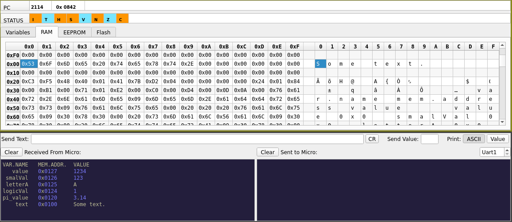{#fig:mem_addr}

> ### Measuring Time with programming loops
> The easiest way to measure time is to simply count the number of loop\'s
> executions. And if we know how long is one execution of the loop - we
> can easily determine the time lapsed for the whole process.
>
> Example:

```cpp
int t = 0;
while (t<10){
  t++;
  delay(100);
}
```

> In the previous example the `while` loop is executed 10 times (t = \[0
> .. 9\]), since each execution of the loop last 100 ms (determined by
> `delay(100);`) the whole `while` loop last 1 s.
> 
> ### Time measuring with Timers
> 
> More proper way of measuring the time is by using the timer\'s values.
> More on that can be read
> [here](https://www.arduino.cc/reference/en/language/functions/time/millis/).  
>   
> Example:  
> 

```cpp
unsigned long start_time;
unsigned long stop_time;
start_time = millis();
// time measured process goes here
// ...
stop_time = millis();
unsigned long duration = stop_time - start_time;
```

> Where the `duration` is time measured in milliseconds.
> 
> ## Issues:
> 
> ### *<++>*
> 
> <++\>

# CONDITIONAL STATEMENTS

Before we dive into S-R-A Loop lets take a first look to IF-statemen. `IF-statement` allows us to execute some code when the condition is `true`. Such navigation of execution of the code is essential in programming and as such one of the fundamental structures of the field. Lets test test the bumper push-button-switch if it is working properly...

## Tasks:

1. Construct the bumper of the robot with push-button-switch as is shown in [this video instructions](https://www.youtube.com/watch?v=eWldNxh-q2c&t=11s).

2. And connect the push-button-switch (PBSW) terminals with module RobDuino according to [@tbl:SW-RobDuino]:

| PBSW con. | RobDuino connectors |
|:---------:|:-------------------:|
|   No. 1   |          A0         |
|   No. 2   |         GND         |
|   No. 3   |         +5V         |

Table: Connection of push-button-switch to the Robduino module. {#tbl:SW-RobDuino}

<iframe src="https://docs.google.com/presentation/d/19d-8UN3UQ1HTpq4a4PhSgt14YnIC8EE5Y1nDjwUab2Y/embed?authuser=0&hl=en&size=s" width="410" height="337" title="Conection of distance sensor" frameborder="0" allowfullscreen="true" mozallowfullscreen="true" webkitallowfullscreen="true"></iframe>

3. Test the push-button-switch in the bumper with next [@lst:260_Conditional_Statements]:

```cpp
const int BUMPER_PIN          = A0;
const int TEST_BUMPER_LED_PIN = 3;
void setup()
{
  pinMode(BUMPER_PIN, INPUT);
  pinMode(TEST_BUMPER_LED_PIN, OUTPUT);
}

void loop()
{
  bool bumperIsPressed = digitalRead(BUMPER_PIN);
  if ( bumperIsPressed ) digitalWrite(TEST_BUMPER_LED_PIN, HIGH);
}
```
: Conditional Statements. {#lst:260_Conditional_Statements}

<!--
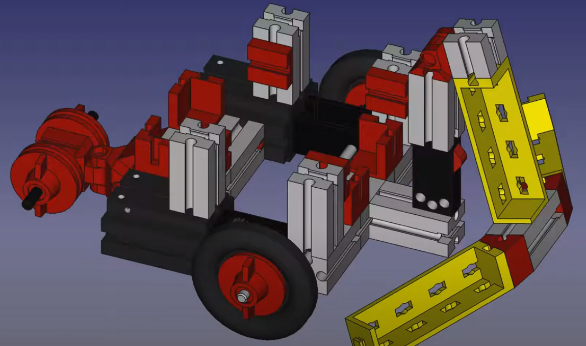{#fig:bumper_construction}
-->

2. Then\... complete the program to turn OFF the LED when the bumper is not touching anything.
3. Next\... Change IF statements into single one IF-THEN-ELSE statement.

## Questions:

1. Check if the LED on the output terminal D3 is ON when the bumper is pressed.
2. Measure the voltage potencial at the terminal A0 when the bumper is pressed.
3. Explain when the curly braces `{}` are necessary in the if-statement.

> ## Summary:
> ### IF Statement
> If statement can be written in several forms. The easiest one is:
```cpp
if (value_one) statement1;
```
> In this case the variable named `value_one` can hold some numerical number. If `value_one` is `true` or greater than `0` the program will execute `statement1`.
> But this simple example is not used so often due its simplicity. We rather use it in
> this form:
```cpp
if ( value_one == value_two ){
  statement1;
  statement2;
}
```
> In this case `value_one` can be any number and the `statement1` and `statement2` will be executed if the `value_one` will be equal to `value_two`. These command can be expanded into IF-ELSE form:
```cpp
if ( value_one == value_two ){
  statement1;
  statement2;
}else{
  statement3;
}
```
> ### Condition operators
> Also other logical condition operators can be used:
>
> - Less than: `a < b`
> - Less than or equal to: `a <= b`
> - Greater than: `a > b`
> - Greater than or equal to: `a >= b`
> - Equal to `a == b`
> - Not Equal to: `a != b`
>
> And some more conditional statements are available in C++:
>
>- `if` - to specify a block of code to be executed, if a specified condition is true
>- `else` - to specify a block of code to be executed, if the same condition is false
>- `else` - if to specify a new condition to test, if the first condition is false
>- `switch` - to specify many alternative blocks of code to be executed
>
> ## Issues:
> ### *<++>*
> <++>

# S-R-A LOOP

S-R-A loop is repeating process where:

1. Seasoning,
2. Reasoning and
3. Acting

is involved during the procedure of controlling the robot. This is the most important part of software in robotics. Remember the `autonomous` control is `ability to perform intended tasks based on current state and sensing, without human intervention`.

## Tasks:

1. Using the S-R-A loop technique you should write the program in particular order:
    1.  Check the sensor. IF the bumper \...
    2.  \... Is pressed the robot has to stop/go back/turn.
    3.  \... Is not pressed the robot can drive forward.

    Test the [@lst:270_SRA_Loop] and **find out why the robot does not stop.** (Such mistake is quite often - can you fix it):

```cpp
#include "RobotMovingFunctions.h"
const int BUMPER_PIN = A0;
void setup()
{
  setIOpins();
  pinMode(BUMPER_PIN, INPUT);

  bool bumperIsPressed = digitalRead(BUMPER_PIN);
  if ( bumperIsPressed )
  {
    stopTheRobot();
  }
  else
  {
    moveForward();
  }
}
void loop()
{
}
```
: SRA Loop. {#lst:270_SRA_Loop}

2. Hint for fixing the [@lst:270_SRA_Loop]: _S-R-A must be a loop function!_

3. Write a program to drive the robot around the class and avoid the obstacles.

## Questions:

1. What for `S-A-R loop` stands for?
2. Mark all three basic S-A-R processes in previous code example.
3. Can the `line 7` of the [@lst:270_SRA_Loop] be written outside of `loop()` function? What would happened if so?

> ## Summary:
> 
> ### <++>
> 
> <++>
> 
> ## Issues:
> 
> ### *<++>*
> 
> <++>  

# DIGITAL INPUT

Digital inputs can only measure 2 different values. As such they are binary inputs and it's values are represented as logical `0` and `1` or in other words `false` and `true` or `LOW` and `HIGH`. However from electrical point of view those values are basically different voltage potencials. Usually potencial `0 V` is presented as logical `0` and potencial `+5 V` is indicated as logical `1`. Digital inputs are often used for detecting state of switches, board keys and push buttons...

Lets go back to fundamentals of digital inputs and explore some options we have to connect a push-button-switch.

{#fig:PBSw_All}

## Tasks:

1. Connect the push-button-switch according to first diagram on [@fig:PBSw_All] and test the program [@lst:280_Digital_Input]

```cpp
const int BUMPER_PIN = A0;
void setup()
{
  pinMode(BUMPER_PIN, INPUT);
}

void loop()
{
  bool bumperIsPressed = digitalRead(BUMPER_PIN);
  if ( bumperIsPressed ) digitalWrite(3, HIGH);else digitalWrite(3, LOW);
}
```
: Digital Input. {#lst:280_Digital_Input}

2. Try to connect the bush-button-switch according to second diagran on [@fig:PBSw_All]

| PBSW con. | RobDuino connectors |
|:---------:|:-------------------:|
|   No. 1   |          A0         |
|   No. 2   |    not connected    |
|   No. 3   |         +5V         |

Table: Connection of push-button-switch with only 2 terminals. {#tbl:sw_two_pins}

Try to understand why this setup is not working. And test all other options in [@fig:PBSw_All]

3. Solve the problem by constructing a `voltage divider` with `pull-down` resistor (third diagran on [@fig:PBSw_All]).
4. Try to understand how the voltage potencial is spread among the components in electrical loop and how we can calculate this by using 2nd Kirchhoff's Rule.
5. Change the setup of PBSW and resistor to a `pull-up` setup (fourth diagran on [@fig:PBSw_All]). What is changed?
6. Enable internal `pull-up` resistor (and remove external one - fifth diagran on [@fig:PBSw_All]).

## Questions:

1. Measure the voltage potencial on pin A0 where the bumper is in ether position.
2. Why the setup is not working properly if we connect the PBSW only to +5V voltage potencial?
3. Draw a schematic circuit of the bush-button-switch connected to controller.
4. What is determined by 2nd Kirshhoff's Rule?
5. How can we wnable `pull-up` resistor?

> ## Summary:
> ### 2nd Kirshhoff's Rule
> Kirchhoffs Voltage Rule states that `in any closed loop network, the total voltage around the loop is equal to the sum of all the voltage drops within the same loop` which is also equal to zero. In other words the algebraic sum of all voltages within the loop must be equal to zero. This idea by Kirchhoff is known as the Conservation of Energy.
>
> ## Issues:
> ### *<++>*
> <++>

# PULL-UP RESISTORS ON DIGITAL INPUT

On the module RobDuino we can find two "on-board push button switches". Wiring of this switches is presented in [@fig:RobDuino_OnBoardPwshButtonSwitch_s1], where can we noticed that both switches are connected to ground voltage potential.

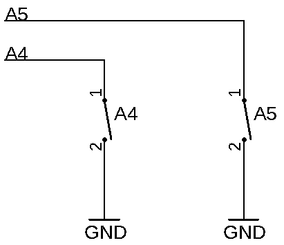{#fig:RobDuino_OnBoardPwshButtonSwitch_s1}

To properly use this on-board push-button switches we must enable the `pull-up` resistors of A4 and A5 input of microcontroller.

## Tasks:

1. Configure pins `A4` and `A5` as inputs with `pull-up` resistor.
2. At the end of the `setup()` function add the `while-loop` which will delay the execution of the program until we press the `A4` key - acting as a "START BUTTON".
3. Use the `A5` key to stop the robot and terminate the execution of the program.

```cpp
#include "RobotMovingFunctions.h"
const int KEY_A4 = A4;
const int KEY_A5 = A5;

void setup()
{
  setIOpins();
  pinMode(KEY_A4, INPUT_PULLUP);
  // KEY_A5 setup here...
}

void loop()
{
  moveForward();
  //to-do: the key reading
  bool stopTheRobotKey = 0;
  if (stopTheRobotKey == 1)
  {
    stopTheRobot();
    exit(0);        //terminate the program
  }
}
```
: Pull Up Resistors on Digital Input. {#lst:290_Pull_Up_Resistors_on_Digital_Input}

## Questions:

1. What is the programming instruction of reading the value form digital input?
2. Which values can be assigned to `bool` type variable?
3. Explain the programming instruction `exit(0)`.

> ## Summary:
> 
> ### <++>
> 
> <++>
> 
> ## Issues:
> 
> ### *<++>*
> 
> <++>


# PULSE WIDTH AS DIGITAL INPUT

Digital input can also be used to transferee other data. One way is to modulate the data into pulse duration e.g. longer the duration of the pulse, bigger the value. This modulation of data is called **Pulse-width modulatio** or **PWM**. Such an example is ultrasonic distance sensor. Where the distance is hidden in the time duration that sound needed of travel the distance from source to object and back as presented in [@fig:UltraSound_sen_50].

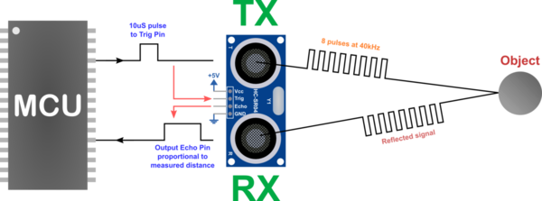{#fig:UltraSound_sen_50}

Since the speed of sound in air is constant ($v_s = 340 m/s$) we can easily calculate the distance according to [@eq:calc_dist].

$$ distance = \frac{1}{2} v_s t_{duration} $${#eq:calc_dist}

<!--
datasheet on ultrasonic sensor HC-SR04
https://cdn.sparkfun.com/datasheets/Sensors/Proximity/HCSR04.pdf
-->

## Tasks:

1. Connect the ultrasonic distance sensor to module Robduino according to [@tbl:con_ultrason]

| HC-SR04 pins | RobDuino pins |
|:------------:|:-------------:|
|      +5V     |      +5V      |
|    Trigg.    |       A0      |
|     Echo     |       A1      |
|      GND     |      GND      |

Table: Connestion of ultrasonic distance sensor. {#tbl:con_ultrason}

2. Test next program if you get reasonable data of time duration in `Serial` window.

```cpp
const char TRIGGER_PIN  = A0;
const char ECHO_PIN     = A1;

void setup()
{
  pinMode(TRIGGER_PIN, OUTPUT);
  pinMode(ECHO_PIN, INPUT);
  Serial.begin(9600);
}

int getPulseWidth_us()
{
  digitalWrite(TRIGGER_PIN,HIGH);
  delayMicroseconds(10); 
  digitalWrite(TRIGGER_PIN,LOW);
  return pulseIn(ECHO_PIN, HIGH);
}

float getDistance_cm()
{
  // do distance calculation here...
  return 0
}
void loop()
{
  float distance_cm = getDistance_cm();
  int duration_us = getPulseWidth_us();
  Serial.println(duration_us);
  delay(2000);
}
```
: PWM as Digital Input. {#lst:300_PWM_as_Digital_Input}

3. Add needed code in function `getDistance_cm()` to calculate the distance in cm. Also change the `Serial.println(duration_us)` program line to output `distance_cm` value.

## Questions:

1. What is PWM?
2. How are PWM data presented in digital signal?
3. What voltage is used to transmit PWM values?

> ## Summary:
> ### <++>
>
> ## Issues:
> ### <++>
>

# ANALOG INPUT

In general, controllers are equipped with `Analog to Digital Converters` or short `ADC`. This internal devices converts voltage potencial into numeric value which can be further used by written program. This is also the case in Arduino UNO converter by the function `analogRead(pin_number)`. In this case the voltage range $[0.0\ V .. +5.0\ V]$ is converted in to range of numbers $[0 .. 1024]$.

## Tasks:

1. Unmount robot's bumper and all connections to the switch.
2. Equip the robot with distance sensor according to [video](https://www.youtube.com/embed/ELYsyuhbQfY) and scheme (see [@fig:distance_sen]).

{#fig:distance_sen}

3. Try next [@lst:310_Analog_Input] and check the output of distance sensor in Serial monitor.

```cpp
const int DIST_SEN_PIN = A0;
void setup()
{
  pinMode(DIST_SEN_PIN, INPUT);
  Serial.begin(9600);
}

void loop()
{
  int adc_value = analogRead(DIST_SEN_PIN);
  Serial.println(adc_value);
  delay(1000);
}
```
: Analog Input. {#lst:310_Analog_Input}

4. Convert the `analog_sensor_value` into `input_voltage` and measure the input voltage potencial with volt-meter. The formula for conversion can be programmed as:

```cpp
float input_voltage = 5.0/1024 * adc_value;
```

5. From the [datasheet](https://www.farnell.com/datasheets/1657845.pdf) for the distance sensor try to code the function for measuring the distance in cm. According to documentation there is almost linear trend between output voltage and $distance^{-1}$. Thus we can get good result with [@eq:calc_disd].

    $$ distance^{-1}[cm] = 0.045 V_{out} $${#eq:calc_disd}

    Next example can be your guide to code the function.

```cpp
float getDistance_cm()
{
  int adc_value = analogRead(DIST_SEN_PIN);
  float input_voltage = 5.0/1024 * adc_value;
  float distance = 1/(0.045 * input_voltage);
  return distance;
}
```

## Questions:

1. What kind of values do you getting from the reading of the distance sensor with the function `analogRead(A0)`?
2. Find the reasonable value where you should stop the robot.
3. Measure the voltage potencial of the sensor's output.


<iframe width="410" height="337" frameborder="0" src="https://www.youtube.com/embed/ELYsyuhbQfY"></iframe>

<iframe src="https://docs.google.com/presentation/d/1j4yvBeTajgG9wFb5mw9SUPUTLXjPWNWjOnINUEmyAx8/embed?authuser=0&hl=en&size=s" width="410" height="337" title="Conection of distance sensor" frameborder="0" allowfullscreen="true" mozallowfullscreen="true" webkitallowfullscreen="true"></iframe>

> ## Summary:
> 
> ### Analog to digital converter - ADC
> 
> ADC is an electronic sistem that converts analog signal (voltage) to a
> digitalized values. In our particular case the range of an analog
> voltage from 0V to 5V is converted to range of numbers from 0 to 1024.
> 
> ## Issues:
> 
> ### *<++>*
> 
> <++>  

# AVOIDING OBSTACLES

## Tasks:

Write the program to drive the robot around the class and avoid the
obstacles.

1.  Check the value of distance sensor. If the distance is greater than ...
2.  \... the robot can drive forward.
3.  \...else \... the robot must to stop/go back/turn.

```cpp
#include "RobotMovingFunctions.h"
const int DIST_SEN_PIN   = A0;
const int DISTANCE_LIMIT = 20;
void setup()
{
  setIOpins();
  pinMode(DIST_SEN_PIN,INPUT);
}
float getDistance_cm()
{
  int adc_value  = analogRead(DIST_SEN_PIN);
  float distance = 1/(0.045 * 5.0/1024 * adc_value);
  return distance;
}
void loop()
{
  if ( getDistance_cm() > DISTANCE_LIMIT )
  {
    moveForward();
  }
  else
  {
    stopTheRobot();
  }
}
```
: Avoiding Obstacles. {#lst:320_Avoiding_Obstacles}

## Questions:

1. What are the values of the distance sensor (use `Serial.println(distance)` to verify)?
2. Robot stil hits the obstacles that are not in view angle of the distance sensor. Write and use new function for moving the robot forward more carefully.

> ## Summary:
> 
> ### Moving the robot and checking the sensor simultaneously
> The main important proces in robotics is S-R-A loop. This process is used in different situations and many times. One can be where we are moving the robot forward and at the same time observing the sensors value with the intention to stop it when the specific condition is met.

```cpp
void goForwardCarefully()
{
   for (int i = 0; i < 10; i++)
   {
      robotLeft();delay(50);
      if (getDistance_cm() < DISTANCE_LIMIT) brake;
   }
   
   for (int i = 0; i < 10; i++)
   {
      robotRight();delay(50);
      if (getDistance_cm() < DISTANCE_LIMIT) brake;
   }
}
```
> 
> <++>
> 
> ## Issues:
> 
> ### *<++>*
> 
> <++>

# LIGHT SENSOR

## Tasks:

1. Construct the light sensor according to [video](https://www.youtube.com/embed/wEN1e6m1FGY) and scheme. Add also the light bulb which will help to lightning the area beneath the robot.


1. To test the light sensor and light bulb test this example code and check the reported serial data.

```cpp
const int LIGHT_SENSOR_PIN = A0;

void setup()
{
  pinMode(LIGHT_SENSOR_PIN , INPUT);
  Serial.begin(9600);
}

void loop()
{
  int light_sensor_value = analogRead(LIGHT_SENSOR_PIN );
  Serial.println(light_sensor_value );
  delay(200);
}
```
: Ligth Sensor. {#lst:330_Ligth_Sensor}

2. Try different resistors (1k, 10k, 100k, 1M) and find out at which the sensitivity of the sensor is greatest.

| Resistance | (black) Sensor value | (whithe) Sensor value | Sensor difference |
|-----------:|:--------------------:|-----------------------|-------------------|
|     1 kOhm |                      |                       |                   |
|    10 kOhm |                      |                       |                   |
|   100 kOhm |                      |                       |                   |
|     1 MOhm |                      |                       |                   |

Table: Testing the sensitivity of the light sensor. {#tbl:sensor_sensitivity}

## Questions:

1.  What is the value of the sensor when the robot is over white/black area?
    - ADC value on white:
    - ADC value on black:
2.  Calculate the average between those two values.
    - Average is:

<iframe width="410" height="337" frameborder="0" src="https://www.youtube.com/embed/wEN1e6m1FGY"></iframe>

<iframe src="https://docs.google.com/presentation/d/1nVl7aVy0qCZ7b6E-bIywXlQZ7PH8LOBB2sb2VxsBKR0/embed?authuser=0&hl=en&size=s" width="410" height="337" title="Constructing the light sensor" frameborder="0" allowfullscreen="true" mozallowfullscreen="true" webkitallowfullscreen="true"></iframe>

> ## Summary:
> 
> ### Sensors
> 
> Sensors are electronic devices which convert physical quantity into
> electrical quantity (usually voltage). In simplest setup, sensor can be
> constructed as voltage divider with two resistors - $R_1$ and $R_2$. One of
> the resistors is resistor with fixed resistance value (eg. $R_1=10k\Omega$).
> The second one is a bit special and it\'s resistance depends on some
> physical quantity (e.g. light, temperature, humidity\...). When
> combining those two resistors into such voltage divider the output of
> the voltage divider can be calculated as: 
> 
> $$ U_{Out} = \frac{R_1}{R_1 + R_2} U_0 $$
> 
> ## Issues:
> 
> ### *Value of the sensor is very small*  
> If the value of the sensor is less than 100 the resistance of $R_2$ (connected to GND) is to low in comparismant to the resistance of R_1 (connected to +5V).
>
> ### *Value of the sensor is large*  
> If the value of the sensor is grater than 900 the resistance of $R_2$ (connected to GND) is to hi in comparismant to the resistance of R_1 (connected to +5V).
>

# LINE FOLLOWER

## Tasks:

1. Write the program to control the robot follow the line ( actually above the edge between black and white area ). Some programming hints you can find in [@lst:340_Line_Follower] :

```cpp
#include "RobotMovingFunctions.h"
const int LIGHT_SENSOR_PIN = A0;
const int SURFACE_BRIGHTNESS_REFERENCE = 400;

void setup()
{
  setIOpins();
  pinMode(LIGHT_SENSOR_PIN , INPUT);
}

void loop()
{
  int light_sensor_value = analogRead(LIGHT_SENSOR_PIN );
  if ( light_sensor_value < treshold_value )
  {
    // do this if robot is over the black line

  }
  else
  {
    // do this if robot is over white area
     
  }
}
```
: Line Follower. {#lst:340_Line_Follower}

## Questions:

1.  What is the program function to get the `light_sensor_value`?
2.  Determine the movements of the robot if the robot is over the black
    area and if the robot is over the white area.

> ## Summary:
> 
> ### <++>
> 
> <++>
> 
> ## Issues:
> 
> ### *<++>*
> 
> <++>

# PWM MOTOR CONTROL

There is often the situation where the power of the motors must be controlled.
One convenient way to do this is that we don't power the motor full time,
but we can turn off the motor for short period of time. For an example we can turn
the motor on for 1 ms and turn it off for 1 ms. In this case the motor will
not get 100% of power, but the motor's average power will be 50%.

Since we are changing the pulse width of logical 1 with the respect to width of
logical 0, this technique is called `pulse width modulation` or shorter `PWM`.

This modulated output is controlled by the `analogWrite(pin, pwm)` function. Modulatio
can be performed on pins: 3, 5 and 6 of the RobDuino modul. The value of `pwm` parameter
can be on a scale of 0 - 255., where 0 is 0% and 255 is 100% of electrical power served.

## Tasks:

1. Write new functions for driving the robot left and right with reduced power of the motors:
    - `moveLeftPWM();`
    - `moveRightPWM();`

    In one case you will might find yourself in trouble of controlling the power of the motor since
    both pins are not able to perform `PWM` output. In this case you can remember that the motor's
    power is 0 W also if both pins are in state of logical `1`.

    An example of reducing power of both motors in function `moveForwardPWM()` is here:

```cpp
void robotForwardPWM()
{
  digitalWrite( LEFT_MOTOR_PIN_1, LOW);
  analogWrite(  LEFT_MOTOR_PIN_2, 150);
  digitalWrite( RIGHT_MOTOR_PIN_1, LOW);
  analogWrite(  RIGHT_MOTOR_PIN_2, 150);
}
```

   Similar to this function you can write other functions to.

2. Change the functions `moveLeft()` and `moveRight()` in S-R-A loop with new ones with less power
    on motors.

```cpp
#include "RobotMovingFunctions.h"
const int LIGHT_SENSOR_PIN = A0;
const int SURFACE_BRIGHTNESS_REFERENCE = 400;

void setup()
{
  setIOpins();
  pinMode(LIGHT_SENSOR_PIN , INPUT);
}

void loop()
{
  int light_sensor_value = analogRead(LIGHT_SENSOR_PIN );
  if ( light_sensor_value < SURFACE_BRIGHTNESS_REFERENCE ){
      moveLeft();
  } else {
      moveRight();
  }
  delay(10);
}
```
: PWM motor control. {#lst:350_PWM_motor_control}

3. Also add `analogWrite(LEFT_MOTOR_PIN_A, 0);` to function `stopTheRobot()` to stop the `PWM` control
    of the motor. And do similar code for the `right motor`.

4. Add a parameter `PWM_value` to each function to set the `duty cicle` of the controlled output.
    - `moveLeftPWM(int PWM_value)`
    - `moveRightPWM(int PWM_value)`

5. Save `moveRightPWM(int PWM_value)` and `moveLeftPWM(int PWM_value)` functions into header file `RobotMovingFunctions.h`


## Questions:

1. How can we control the average power of the motor?
2. How can we control the average power of the motor in both directions
    if we are not able to control `PWM` both output pins of the motor?
3. Explain the purpose of programming function `analogWrite(pin, pwm)`.
4. Explain the meaning of the `pin` and `pwm` parameters in function `analogWrite`.

> ## Summary:
> 
> ### <++>
> 
> <++>
> 
> ## Issues:
> 
> ### *<++>*
> 
> <++>

# EDN OF LINE DETECTION

## Tasks:

1. Stop the robot when it reaches the end of line.
2. Detecting the end of line can be done by measuring the time that robot spend over the black and white area. E.g. if the robot is driving along the line - the time spent over black and time spent over white area will be quite the same. When line ends the robot will not detect the black area soon and the time spent over white area will increase significantly - and that is the trigger for detecting the end of line.
3. Advanced: Make a function to align (move) the robot back to the line.

## Questions:

1.  How can we store a data to the controller\'s memory?
2.  How can we measure time in programming loops?
3. What is the purpose of the prog. instr. exit(0); ?

```cpp
#include "RobotMovingFunctions.h"
const int LIGHT_SENSOR_PIN = A0;
const int SURFACE_BRIGHTNESS_REFERENCE = 400;
int time_on_black = 0;
int time_on_white = 0;

void setup()
{
  setIOpins();
  pinMode(LIGHT_SENSOR_PIN , INPUT);
}
void loop()
{
  int light_sensor_value = analogRead(LIGHT_SENSOR_PIN );
  if ( light_sensor_value < SURFACE_BRIGHTNESS_REFERENCE )
  {
    // BLACK area
    moveLeft();
    time_on_white = 0;  // reset time on white
    time_on_black++;    // meas. time on black
    delay(100);
  }
  else
  {
    // WHITE area
    moveRight();
    // Do similar meas.
    // of time on white
    delay(100); 
    // If time is signif. longer:
    //        robotStop();exit(0);
  }
}
```
: Edn of Line Detection. {#lst:360_Edn_of_Line_Detection}

> ## Summary:
> ### <++>
>
> ## Issues:
> ### <++>
>
# BARRIER GATE CONSTRUCTION

## Tasks:

1. Construct the barrier gate according to [video](https://www.youtube.com/embed/5_eh7ojNH68) instructions.

{#fig:gate_const}

2. Connect the motor to digital outputs D7 and D6,
   - declare meaningful constants for output pins,
   - write a function `setIOpins()` for settig output pins and
   - include it in setup() function.
3. Write 3 time controlled functions for essential control
    of the barrier gate :
    - `moveGateUp();`
    - `moveGateDown();`
    - `stopTheGate();`
    and test this actions in setup() function.
4. Put this action of lifting and lowering the gate in
    For-loop and repeat it several times (e.g. 15 times).

Some sample code can be found in next example:

```cpp
const int MOTOR_PIN_1 = 7;
const int MOTOR_PIN_2 = 6;

[-] void setup() {
        pinMode(MOTOR_PIN_1, OUTPUT); //declaration of I/O pins
        pinMode(MOTOR_PIN_2, OUTPUT);    

        moveGateUp();                 // Lift the barrier.
        delay(3000);                  // Wait a bit...
        moveGateDown();               // Lower the barrier.
    }
[+] void loop() {
[+] void stopTheGate(){
[-] void moveGateUp() {
        digitalWrite(MOTOR_PIN_1, HIGH);
        digitalWrite(MOTOR_PIN_2, LOW);
        delay(1000);
        stopTheGate(); 
    }
[+] void moveGateDown() {
```

## Questions:
1. What is the time for raising and lowering the barrier?
    Compare it to your colleague's value.
2. What is the disadvantage of time controlled loop?

<iframe width="410" height="337" frameborder="0" src="https://www.youtube.com/embed/5_eh7ojNH68"></iframe>

> ## Summary
> 
> ### <++>
> 
> <++>
> 
> ## Issues:
> 
> ### *<++>*
> 
> <++>

# REFERENCE POINT

## Tasks:

1. Add a switch to detect the reference point of the barrier gate. Let the reference point be the closed position of the barrier.

{#fig:barrier_reference_key}

2. Connect the switch to the controller according to schematics.
3. Change the program to lower the barrier gate to reference switch position.

## Questions:

1.  Why is detection of reference point important?
2.  <++>

<iframe width="410" height="337" frameborder="0" src="https://www.youtube.com/embed/bmgUlj_rP3U"></iframe>

------------------------------------------------------------------------

<iframe src="https://docs.google.com/presentation/d/1JTBdKVBY-znuZVyeCoOIMyx3Ds80OAD6DyzBDHL_dRk/embed?authuser=0&hl=en&size=s" width="410" height="337" title="switch connection" frameborder="0" allowfullscreen="true" mozallowfullscreen="true" webkitallowfullscreen="true"></iframe>

> ## Summary
> 
> ### <++>
> 
> <++>
> 
> ## Issues:
> 
> ### *<++>*
> 
> <++>  

# REED SWITCH IN NON-CONTACT DETECTION

## Tasks:

1. Add a reed switch to the front of the barrier gate to detect the car.
2. Connect the reed switch to the input pin A1 an GND.

{#fig:reed_sw}

3. Write program as such that the gate barrier will open if car is detected. Some hints are showv in nex example code:

```cpp
const int MOTOR_PIN_1 = 7;
const int MOTOR_PIN_2 = 6;
const int REED_SW_PIN = A1;

[-] void setup() {
        pinMode(MOTOR_PIN_1, OUTPUT); //declaration of I/O pins
        pinMode(MOTOR_PIN_2, OUTPUT);    
        pinMode(REED_SW_PIN, INPUT_PULLUP);
    }
[-] void loop() {
        bool car_is_detected = !digitalRead(REED_SW_PIN);
        if (car_is_detected){
            moveGateUp();
            delay(3000);
            moveGateDown();
        }
    }
[+] void stopTheGate(){
[+] void moveGateUp() {
[+] void moveGateDown() {
```

## Questions:

1.  What is pull-up resistor?
2.  How can we turn on the internal pull-up resistor of the microcontroller?

<iframe width="410" height="337" frameborder="0" src="https://www.youtube.com/embed/3hhu11bBFXc"></iframe>

> ## Summary:
>
> ### <++>
>
> <++>
>
>## Issues:
>
>### *<++>*
>
><++>  

# ON-MODULE BUTTONS WITH PULL-UP RESISTORS

## Tasks:

1. Module RobDuino includes two \"on-board\" buttons which are connected from pin A4 and A5 to GND. This two buttons can allso be used but internal pull-up resistors must be turned on.
1. Add manual functionality to the automated barrier gate. Add the possibility to manually lift (e.g. press A4 button) and lower (A5 button) the barrier gate.

## Questions:

1.  \<++\>
2.  \<++\>

```cpp
const int MOTOR_PIN_1 = 7;
const int MOTOR_PIN_2 = 6;
const int REED_SW_PIN = A1;
const int ROBDUINO_BT_A4_PIN = A4;
const int ROBDUINO_BT_A5_PIN = A5;

[+] void setup() {   
[-] void loop() {
        bool car_is_detected = !digitalRead(REED_SW_PIN);
        if (car_is_detected){
            moveGateUp();
            delay(3000);
            moveGateDown();
        }
        manualGateControll();
    }
[-] void manualControll(){
        bool button_A4_is_pressed = !digitalRead(ROBDUINO_BT_A4_PIN);
        if (button_A4_is_pressed){
            gateUp();
        }
        // add code for the case if button_A5_is_pressed ...
    }
[+] void stopTheGate(){
[+] void moveGateUp() {
[+] void moveGateDown() {
```

> ##  Summary
> 
> ### <++>
> 
> <++>
> 
> ##  Issues
> 
> ### *<++>*
> 
> <++>  

# POTENTIOMETER AS ANGLE SENSOR

## Tasks:

1. Add the potentiometer to the shaft of barrier gate. You can follow the instrucions in the [video](https://www.youtube.com/embed/kzLtVWtxVsQ).

{#fig:pot_sen}

<iframe width="410" height="337" frameborder="0" src="https://www.youtube.com/embed/kzLtVWtxVsQ"></iframe>

<iframe src="https://docs.google.com/presentation/d/1GgbUhsWBIflvZN1qMDrkh2tXRMLtYGoxHCdt5s_COVg/embed?authuser=0&hl=en&size=s" width="410" height="337" title="potenciometer" frameborder="0" allowfullscreen="true" mozallowfullscreen="true" webkitallowfullscreen="true"></iframe>

2. Test the potentiometer values with next program:

```cpp
void setup() {
  Serial.begin(9600);
}

void loop() {
  Serial.println(analogRead(A3));
  delay(100);
}
```

3. Change the functions for lifting and lowering the barrier gate to use potenciometer readings instead of switch and time controlled movement.

```cpp
[+] void setup() {   
[+] void loop() {
[+] void manualGateControll(){
[+] void stopTheGate(){
[-] void moveGateUp() {
        int gate_orientation = analogRead(POTENTIOMETER_PIN);
        while (gate_orientation < 750){
            digitalWrite(MOTOR_PIN_1, HIGH);
            digitalWrite(MOTOR_PIN_2, LOW);
            gate_orientation = analogRead(POTENTIOMETER_PIN);
        }
        stopTheGate(); 
    }
[+] void moveGateDown() {
```
4. Advanced: Calculate the angle of barrier gate from the analog readings of potenciometer.

## Questions:

1.  What is the value of the angle sensor when the barrier gate is in the upper orientation\...
2.  \... and in lower orientation.

> ## Summary:
> 
> ### <++>
> 
> <++>
> 
> ## Issues:
> 
> ### *<++>*
> 
> <++>  

# PID CONTROL

text for some intro to new lecture unit

## Tasks:

1. <++>
2. <++>
```cpp
void zapornicaDol_PID(){
  zapornicaDol();
  int orientacija = analogRead(A0);

  //PI regulacija
  int P = 0;
  float I = 0;

  while (orientacija > spodnja_meja){
    orientacija = analogRead(A0);
    P = orientacija - spodnja_meja;
    I += 0.001 * P;
    int moc_motorja = P+I;
    if (moc_motorja > 255) moc_motorja = 255;
    analogWrite(6, moc_motorja);
    Serial.print("0,1023,");Serial.print(orientacija);Serial.print(",");Serial.println(spodnja_meja);
  }
  zapornicaStop();
}
```


3. <++>

## Questions:

1. <++>
2. <++>
3. <++>

> ## Summary:
> ### <++>
>
> ## Issues:
> ### <++>
>
# LCD(I2C)

## Tasks:

1. Priključite LCD na I2C vodilo kot prikazuje 

{#fig:test_I2C_LCD}

2. Priskrbite si knjižnico `LiquidCristal-I2C` iz naslova:  
https://www.arduino.cc/reference/en/libraries/liquidcrystal-i2c/ 
3. Knjižnico dodajte v Arduino IDE okolje tako, da dodate `ZIP` datoteko v :  
`Sketch >> Include Library >> Add .ZIP Library`
3. V VSC in PlatformIO vtičniku si lahko knjižnico naložite tako, da v terminalno okno vpišete ukaz  
`pio lib install "marcoschwartz/LiquidCrystal_I2C@^1.1.4"`

4. Nato preskusite naslednji program:

```cpp
#include <Wire.h> 
#include <LiquidCrystal_I2C.h>
LiquidCrystal_I2C Lcd(0x27, 16, 2);

void setup() {   
    Lcd.init();
    
    Lcd.clear();
    Lcd.backlight();
    
    Lcd.setCursor(3,0);
    Lcd.print("Hello");
    Lcd.setCursor(6,1);
    Lcd.print("World");   
}

void loop() {
}
```

Če niste prepričani kateri i2c naslov uporablja naprava na LCD-ju le tega lahko preverite s programom `I2C scanner` (https://playground.arduino.cc/Main/I2cScanner/). Običajno I2C LCD-ji, ki jih naredijo kitajski proizvajalci uporabljajo I2C naslov `0x27` , `0x3F` ali manj pogosto `0x38`.

## Questions:

1.  \<++\>
2.  \<++\>

\[ Visual instructions. \]

> ## Summary:
> 
> ### \<++\>
> 
> \<++\>
> 
> ## Issues:
> 
> ### *\<++\>*
> 
> <++>

