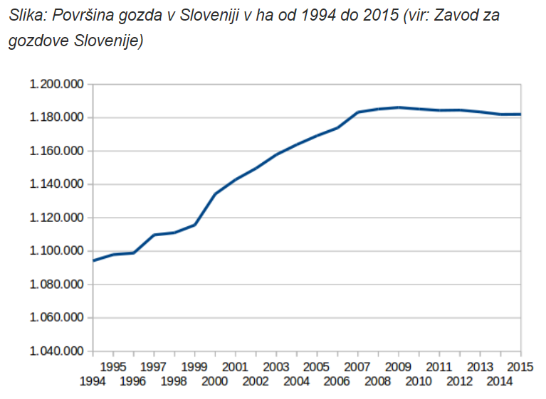
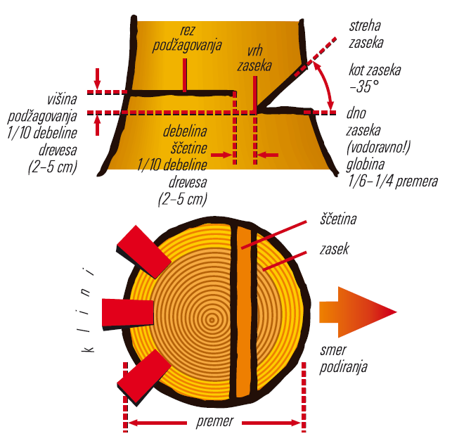

# LES KOT NARAVNI MATERIAL

Les je vsestranski naravni material, ki ima pomembno vlogo v okolju, gospodarstvu in tehniki. V okolju les kot sestavni del gozdnih ekosistemov prispeva k biotski raznovrstnosti, zadrževanju vode in zaščiti tal pred erozijo. Gozdovi delujejo kot pomembni skladi ogljika: med rastjo drevesa fiksirajo atmosferski $CO_2$ preko fotosinteze in del tega ogljika shranijo v lesni biomasi, v nekaterih primerih pa tudi dlje časa pri izdelkih iz lesa, kar zmanjšuje skupno $CO_2$-bilanco sistema [@pan2011; @fao2020]. V kontekstu podnebnih sprememb in ciljev zmanjševanja emisij je ohranjanje ter trajnostno upravljanje gozdov zato ključnega pomena [@ipcc2019].

Gospodarsko gledano ima les dvojno vlogo: kot vir energije in kot vir surovine v celotni lesnopredelovalni verigi. Lesnopredelovalna industrija vključuje sečnjo, predelavo in proizvodnjo končnih izdelkov (gradbeni elementi, pohištvo, papir, biomasne gorivne izdelke) ter ustvarja delovna mesta, zlasti v podeželskih območjih, kjer gozdnatost predstavlja konkurenčno prednost. V Sloveniji, kjer so gozdovi razširjeni in zasedajo pomemben delež površin, ima les tudi kulturološko in prostorsko vlogo, kar dodatno krepi pomen gospodarjenja z gozdovi za lokalno in nacionalno ekonomijo [@surs2021; @efi2016].

V tehniki je les cenjen zaradi kombinacije mehanskih lastnosti, nizke gostote, dobre razmerja med trdnostjo in maso, ter relativno enostavnosti obdelave. Masivni leseni elementi in lesene konstrukcije (npr. CLT — cross-laminated timber) omogočajo trajnostne in energetsko učinkovite gradnje, pri katerih lahko les nadomesti bolj ogljično intenzivne materiale, kot so beton in jeklo. Poleg tega les bolje shranjuje ogljik kot večina drugih gradbenih materialov, če je izdelek dolgoročen, kar prispeva k zmanjšanju emisij v gradbeništvu [@fao2020; @ec2018].

Načelo trajnostnega razvoja zahteva uravnotežen pristop: ohranjanje ekoloških funkcij gozdov, izpolnjevanje družbenih potreb in zagotavljanje gospodarskih koristi. Trajnostna raba lesa pomeni upravljanje gozdov tako, da se zagotavlja obnova virov, ohranja biotska raznovrstnost in zmanjšuje negativne vplive posegov (npr. prekomerne sečnje ali degradacije habitatov). Hkrati je nujno spodbujati vrednost lesnih proizvodov z višjo dodano vrednostjo in vpeljevanje krožnega gospodarstva, kjer se lesni materiali ponovno uporabljajo, reciklirajo ali energetsko izkoriščajo ob minimalni izgubi materialne vrednosti. Krožno gospodarstvo in bioekonomija povečujeta učinkovitost izrabe lesnih virov in podpirata prehod na nižjeogljično gospodarstvo [@ec2018; @efi2016].

Pri vrednotenju in spodbujanju lesnih verig je treba upoštevati tudi socialne in etične vidike: pravična delitev koristi med deležniki (država, lokalne skupnosti, lastniki gozdov, industrija), spoštovanje pravic lokalnih prebivalcev ter transparentnost v postopkih pridobivanja in sledenja izvora lesa. Te zahteve podpirajo tudi standardi in sheme trajnostnega gozdarstva, ki jih je smiselno upoštevati pri dobavnih verigah [@fao2020].

Če povzamemo ima les kot naravni material širok spekter okoljskih, ekonomskih in tehničnih koristi, vendar je za ohranjanje teh koristi nujno trajnostno upravljanje z gozdovi, spodbujanje visoko kakovostne predelave ter integracija načel krožnega gospodarstva in bioekonomije. Le tako lahko les dolgoročno prispeva k blaženju podnebnih sprememb, razvoju lokalnih gospodarstev in tehnološkemu napredku v gradbeništvu in industriji.

## Pomen lesa in gozdov

Gozdovi so kompleksni, dinamični ekosistemi, ki zagotavljajo biotsko raznovrstnost, regulacijo klime, vodo in tla ter pridelujejo les kot obnovljiv gradbeni in industrijski material. Les kot surovina ima nizki vgrajeni ogljični odtis v primerjavi z mineralnimi materiali (beton, jeklo) in je hkrati skladišče ogljika, če je upravljanje gozdov in raba lesa trajnostna [@FAO2018; @IPCC2019]. V Sloveniji pokrivajo gozdovi velik del površine države (okoli 60 %) in so zato ključni za lokalno okolje, podeželje in gospodarstvo [@ZGS2020].

### Okoljski pomen

**Fotosinteza in $CO_2$ bilanca**:  
Drevesa pretvarjajo sončno energijo, vodo in ogljikov dioksid v organsko snov (celulozo, lignin) ter sproščajo kisik — proces fotosinteze, ki poganja rast gozda in skladiščenje ogljika. Med rastjo drevesa akumulirajo ogljik v biomasi in tleh; leseni izdelki lahko shranjujejo ta ogljik skozi življenjsko dobo izdelka. Celotni ogljični učinek gozdov in lesenih izdelkov je odvisen od rasti, starosti dreves, trajanja skladiščenja v proizvodih, načina upravljanja in ravnanja z lesnimi ostanki [@IPCC2019; @Gustavsson2006]. Trajnostna sečnja in ponovno sajenje omogočata, da gozdovi delujejo kot neto ogljični ponor v daljšem časovnem obdobju.

**Biotska raznovrstnost in ekosistemske storitve**:  
Gozdovi nudijo habitat za številne rastlinske in živalske vrste, so osrednji element ohranjanja biotske raznovrstnosti in nudijo ekosistemske storitve kot so filtracija vode, izboljšanje talne strukture in mikroklimatska regulacija. Ohranjanje različnih starostnih faz in habitatov v gozdu povečuje odpornost ekosistema na motnje [@FAO2018].

**Varovalna vloga gozd**:  
Gozdovi zmanjšujejo erozijo tal (koreninski sistem zadržuje tla), vplivajo na hidrologijo — zmanjšujejo hitro odtekanje in s tem poplavno ogroženost — ter stabilizirajo pobočja in bregove rek. Na strmih terenih in ob vodotokih so gozdni ekosistemi ključni za preprečevanje usedlin in zagotavljanje kakovosti vode [@FAO2018; @ZGS2020].

### Gospodarski pomen

**Direktna gospodarska vrednost**
Les je surovina za gradbeništvo, pohištveno industrijo, papirno industrijo, energijo (lesna biomasa) in kemijske produkte (biopolimeri, lesne frakcije). Gozdarstvo vključuje pridelavo, predelavo in komercializacijo lesa ter ustvarja delovna mesta, zlasti v podeželskih regijah. Leseni izdelki z visoko dodano vrednostjo (masivni leseni elementi, prefabricirane lesene konstrukcije) prispevajo k lokalnemu gospodarstvu in izvozom [@ZGS2020; @FAO2018].

Les ima visoko razmerje trdnost/teža, dobro toplotno in zvočno izolativnost ter enostavnost obdelave. Inženirski leseni proizvodi, kot so križno lepljeni elementi (CLT) in lepljeni nosilci (glulam), omogočajo večnadstropne lesene konstrukcije in hitro montažo, pri čemer se zmanjša vgrajeni $CO_2$ v primerjavi z drugim gradbenim materialom [@Gustavsson2006]. Izzivi vključujejo požarno zaščito, odpornost proti vlagi, trajnost spojnih elementov in standardizacijo proizvodov.

**Specifika Slovenije**:  

- Gozdnatost Slovenije: približno 60 % površine države je pokrito z gozdom [@ZGS2020].
- Struktura vrst (približne vrednosti): bukev 32 %, smreka 31 %, jelka 7,5 %, hrast 7 % (podrobnejši statistični podatki so dostopni v nacionalnih poročilih) [@ZGS2020].
- Upravljanje slovenskih gozdov temelji na načelih trajnosti: ohranjanje biotske raznovrstnosti, dolgoročno planiranje sečnih obsegov in obnova z avtohtonimi vrstami.

**Povezava s krožnim gospodarstvom**:  
Les je primeren za krožno gospodarstvo: leseni izdelki se lahko ponovno uporabijo, reciklirajo ali končno energetsko izrabijo. Certificiranje in trajnostno gospodarjenje zagotavljata vzdržno oskrbo z lesom in s tem dolgoročno podporo vrednostnim verigam [@PEFC; @FSC].

Priporočene prakse so: izdelovati izdelke zasnovane za popravilo in demontažo, reciklirati lesene materiale, valorizirati lesne ostanke (visokokakovostna predelava ali nadzorovano energijsko izkoriščanje) ter spodbujati lokalne verige, ki zmanjšujejo emisije pri prevozih in povečujejo lokalno dodano vrednost.

**Trajnostna raba lesa in upravljanje gozdov**:  
Načela trajnostnega gospodarjenja vključujejo uravnoteženo jemanje in obnavljanje lesa, ohranjanje ekosistemskih storitev in upoštevanje dolgoročnih učinkov posekov na ogljično bilanco in tla. Sistem certifikacije (FSC, PEFC) povečuje transparentnost in spodbuja tržne prakse, ki ne ogrožajo dolgoročnih virov [@FSC; @PEFC].

**Neposredne in posredne koristi**:  
Poleg prodaje lesa prinašajo gozdovi prihodke tudi preko ekoturizma, nabiranja gozdnih sadežev in gob, ter z zagotavljanjem rekreacijskih storitev. Učinki so tako neposredni (prodaja lesa) kot posredni (zdravje prebivalcev, turistični prihodki).

### Socialna in kulturna vloga
Gozdovi nudijo prostore za rekreacijo, duševno počutje in izobraževanje. Tradicionalne rabe gozda, lokalne prakse in krajinska identiteta so del kulturne dediščine mnogih skupnosti. Dostop do gozdov izboljšuje kakovost življenja in ima pozitivne učinke na javno zdravje in družbeno kohezijo [@FAO2018].

### Tveganja in izzivi
- Podnebne spremembe povečujejo tveganje škodljivcev, bolezni in suše; to lahko vodi do povečane umrljivosti dreves in velikih emisij $CO_2$ ob propadanju gozdov [@IPCC2019].
- Pretirana ali slabo načrtovana sečnja zmanjšuje ekosistemske storitve.
- Napetosti med gospodarskimi interesi in varstvom narave ter potreba po inovacijah v tehnologijah predelave in zaščite lesa.
- Spodbujati trajnostno upravljanje gozda in certificiranje proizvodov.
- Povečevati uporabo lesa v gradbeništvu za zniževanje vgrajenega ogljičnega odtisa stavb.
- Razvijati lokalne verige in proizvode z višjo dodano vrednostjo.
- Investirati v raziskave za prilagoditev gozdov na podnebne spremembe, zgodnje opozarjanje in zaščito pred škodljivci.
- Izobraževati javnost o pomembnosti gozdov in pravilnem ravnanju z lesom.

## Les kot surovina

Les je obnovljiv biološki material, ki ga gozdovi proizvajajo kot del naravnih ekosistemov. Poleg gradbene in industrijske uporabe ima les pomembno vlogo kot surovina za lesno-predelovalno industrijo, kot vir surovin za kemično predelavo (celuloza, lignin, ekstrakti) ter kot energent (kurjava, biomasni peleti). Uporaba in vrednost posameznih kosov lesa sta odvisni od bioloških lastnosti drevesa, rastišča, načina sečnje, ter postopkov obdelave in sortiranja [@woodhandbook2010; @panshin1970].

### Tehnični les

Lesni material, namenjen za mehanske in konstrukcijske aplikacije (npr. lesene nosilne konstrukcije, tramovi, plošče). Pri tehničnem lesu sta ključna nosilnost in dimenzijska stabilnost; pogosto zahteva sušenje, razredčenje po kakovosti (grade) in obdelavo proti škodljivcem [@woodhandbook2010].  

**Okrogel les, sortimenti in razvrstitev**:  
Okrogel les (roundwood) je osnovni produkt sečnje: debla dreves od izravnanega mesta poseka do prevoznih točk. Okrogel les razvrščamo po sorti (sortimenti) glede na premer, dolžino, kakovost in namen uporabe. Glavne skupine sortimentov:

**Les za žaganje (sawlogs)**:  
debla primerna za proizvodnjo desk in letev, visoke dimenzije in kakovostna jedra.  

**Po*sebni sortimenti**:  
les* za furnir, posebne oblike (kuluze, cevi) [@unece2019].

**Razvrstitev po kakovosti**:  
vključuje ocene primernosti obdelave,  klasifikacija lesa (grče, razpoke), ravnosti in naravnih poškodb. Učinkovito sortiranje ob žaganju povečuje izkoristek surovine in zmanjšuje stroške [@woodhandbook2010].

### Kemični les

Les, ki se uporablja kot surovina za kemijsko predelavo, predvsem proizvodnjo celuloze in papirja, biokemikalij, bioplastike ali ekstraktov. Pri kemičnem lesu je pomembna vsebnost celuloze, hemiceluloz in lignina ter enostavnost razgradnje oziroma izvlečkov [@fao2020].  

- Les za celulozo (pulpwood): manjše dimenzije, nižja kakovost, namenjen kemični oziroma mehanski predelavi.  

### Energetski les

Les, namenjen za proizvodnjo toplote ali električne energije (npr. drvje, lesni ostanki, sekanci, peleti). Ključne lastnosti so energijska gostota, vlaga in vsebnost pepela; pogosto gre za sortimente nižje kakovosti ali ostanke iz proizvodnje [@unece2019].

- Energetski les (fuelwood): ostanki, manj primerni kosi in specializirani pridelki za kurjavo.  

### Vrednost surovine

- Vsebnost vlage: svež les ima visoko vlago; sušenje izboljšuje lastnosti in stabilnost, a povzroča tudi stroške in lahko privede do razpok, če ni pravilno upravljano [@woodhandbook2010].  
- Napake v lesu: grče, razpoke, krošnja in nagibi vlaken zmanjšajo uporabnost za tehnične aplikacije, a so lahko sprejemljivi pri energijskih sortimentih.  
- Dimenzije in geometrija: večja debla pogosto dajejo več vrednih sortimentov za žaganje.  
- Sledi poškodbe med sečnjo in transportom: dolžina debla, mehanske poškodbe zmanjšujejo donos uporabnih desek ter povečujejo odpad.  
- Genetski in rastni pogoji: vrsta drevesa, starost, gostota rasti in gojitveni postopki vplivajo na strukturo in kakovost lesa [@panshin1970].

---

Les kot surovina je raznolika in večplastna: ista surovina (okroglo deblo) lahko privede do tehničnih polizdelkov visoke vrednosti, kemičnih surovin ali energijskih sortimentov. Razumevanje verige od poseka do polizdelka, pravilnega sortiranja in postopkov obdelave je ključno za učinkovit izkoristek, zmanjševanje odpadkov in trajnostno gospodarjenje z lesnimi viri.

## Pridobivanje lesne surovine

1. Načrtovanje in selektivna sečnja: Predhodna ocena gozdnih virov, izbira dreves za posek in upoštevanje trajnostnih praks (sanitarna sečnja, obnova). Cilj je optimizirati kakovost okroglega lesa in zagotoviti dolgoročno trajnost [@fao2020].  
2. Obiranje in transport na zbirne točke: Po poseku se debla pripravi (obrobljanje, obrezovanje korenin) in prepelje do zbirnih skladišč ali žag. Transport zahteva učinkovito manipulacijo in minimalno poškodbo skorje, da se ohrani kakovost sortimentov. Uporabljajo se traktorji, gozdarski žerjavi in specializirani priključki [@unece2019].  
3. Sortiranje v skladišču: Na zbirnih točkah se debla razvrsti po dimenzijah in namenu (žaganje, celuloza, energija). To omogoča optimizacijo proizvodnega procesa v žagi in stabilnejši izkoristek [@woodhandbook2010].  
4. Predobdelava (rezanje na dolžine): Debla se razreže na primerno dolžino in oblike za specifične izdelke; pri furnirju se uporabljajo posebni postopki ljuščenja. Pravilna izbira dolžine in rezilnih parametrov zmanjša odpad in poveča produktivnost [@woodhandbook2010].  
5. Žaganje in nastajanje polizdelkov: V žagah se okrogel les pretvori v plošče, deske, tramove in druge polizdelke. Tehnike vključujejo tračno žaganje, krožno žaganje, rezanje v sloje (bloki, lepljeni elementi). Pri tem je pomembno upravljanje z vlažnostjo in napakami v lesu. Sušenje (naravno ali komorno) je pogosto nujen korak pred nadaljnjo obdelavo [@woodhandbook2010].  
6. Sortiranje polizdelkov, nadaljnja predelava in skladiščenje: Po žaganju sledi razvrstitev po dimenzijah in kvaliteti, obdelava površin, lepljenje in priprava za transport k proizvajalcem končnih izdelkov. Učinkovita logistika in pravilno skladiščenje ohranjata dimenzijsko stabilnost in zmanjšujejo izgube [@unece2019].  
7. Uporaba ali nadaljnja predelava v končne izdelke: Polizdelki se uporabljajo v gradbeništvu, pohištveni industriji, paketni industriji ali gredo v kemično predelavo. Ostanki in odrezki lahko postanejo energenti ali surovina za MDF, iverne plošče in druge izdelke.

### Varnost pri obdelavi in manipulaciji

- Uporaba osebne zaščitne opreme (očala, zaščita sluha, rokavice) pri žaganju in manipulaciji.  
- Ustrezno skladiščenje in zlaganje, da se prepreči gnitje ali zrušitev skladiščnih kupov.  
- Upravljanje prahu in emisij pri obdelavi lesa, ker lesni prah lahko povzroča zdravju škodljive učinke.  

### Sečnja

- smer podiranja
- čiščenje
- zasek

{#fig:secnja_varni_zasek}

- ureditev sečišča
  - veje, vrhove razžagamo in zložimo
  - nizki panji
  - ne odlašamo s spravilom lesa

**Motorna žaga**:  

1. Pogonski sklop
    1. Motor:
        * **Funkcija:** Pretvarja kemično energijo goriva v mehansko energijo, ki poganja verigo.
        * **Vzdrževanje:** Uporabljaj ustrezno mešanico goriva in olja po navodilih proizvajalca. Redno čisti hladilna rebra na valju motorja. Redno preverjaj kompresijo in tesnila; menjaj obloge valja in batne obročke, če pride do znakov obrabe.

    2. Bencinski rezervoar
        * **Funkcija:** Shrani gorivo (mešanica bencina in olja).
        * **Vzdrževanje:** Redno menjaj filter goriva (1 krat letno). Uporabljaj svežo mešanico goriva; po dolgotrajni neuporabi izprazni rezervoar, da preprečiš nabiranje usedlin in zamašitve.

    3. Rezervoar za olje
        * **Funkcija:** Dovaja mazalno olje za verigo in vodilno letev.
        * **Vzdrževanje:** Vedno uporabljaj primerno olje za verižne žage. Redno preverjaj pretok olja in očisti zamašene kanale.

    3. Vžigalna svečka
        * **Funkcija:** Ustvari iskro za vžig goriva v valju.
        * **Vzdrževanje:** Čisti elektrodo na vsake 25–50 ur delovanja, menjaj svečko ob znaku obrabe ali težav pri vžigu.

    3. Zračni filter
        * **Funkcija:** Preprečuje vstop prahu, opilkov in drobirja v motor.
        * **Vzdrževanje:** Redno čistiti (po potrebi celo vsakodnevno pri intenzivni uporabi); zamenjati, če je filter poškodovan ali močno zamašen.

    3. Uplinjač
        * **Funkcija:** Meša gorivo in zrak v pravem razmerju za zgorevanje.
        * **Vzdrževanje:** Občasno nastavi vijake za prosti tek in glavno šobo; očisti notranje kanale in membrane. Uporabljaj čisto gorivo in filter za gorivo.

    3. Dovod zraka
        * **Funkcija:** Dovaja čist zrak v uplinjač za zgorevanje.
        * **Vzdrževanje:** Redno odstranjuj prah in smeti z zračnih kanalov.

    3. Izpušni sistem (dušilec)
        * **Funkcija:** Odvaja in duši izpušne pline, zmanjšuje hrup.
        * **Vzdrževanje:** Preverjaj morebitne zamašitve zaradi saj in očisti mrežico proti iskrám (spark arrestor).

    3. Zaganjalnik
        * **Funkcija:** Ročni povratni zaganjalnik z vrvico omogoča zagon motorja.
        * **Vzdrževanje:** Preverjaj vrvico in povratno vzmet, po potrebi namaži in zamenjaj obrabljene dele.

2. Prenosni in rezalni sklop

    3. Sklopka
        * **Funkcija:** Centrifugalna sklopka poveže motor z verigo pri višjih vrtljajih in prepreči vrtenje verige v prostem teku.
        * **Vzdrževanje:** Preverjaj obrabo čeljusti in vzmeti; čistiti ostanke smole in žagovine.

    3. Pogonski zobnik (verižnik)
        * **Funkcija:** Prenese moč motorja na rezalno verigo.
        * **Vzdrževanje:** Preverjaj obrabo zobnika in ga zamenjaj, ko se zobje začnejo koničiti ali nastanejo utori.

    3. Vodila verige
        * **Funkcija:** Vodijo verigo po pravilni poti okrog meča.
        * **Vzdrževanje:** Redno čistiti, mazati z oljem in preverjati, da ni zarez ali poškodb.

    3. Vodilna letev (meč)
        * **Funkcija:** Usmerja rezalno verigo pri rezanju.
        * **Vzdrževanje:** Redno obračaj letev (zgornjo in spodnjo stran), čistiti utor in odprtine za mazanje. Menjaj ob izraziti obrabi utora ali konice.

    3. Napenjalec verige
        * **Funkcija:** Omogoča prilagajanje napetosti verige za učinkovito in varno delovanje.
        * **Vzdrževanje:** Preverjaj delovanje vijaka in vzmeti; vedno napni verigo, da ne visi, a se še prosto giblje z roko.

    3. Rezalna veriga
        * **Funkcija:** Glavni rezalni element za prežagovanje lesa.
        * **Vzdrževanje:** Redno ostri rezalne zobe z ustrezno pilo (pod pravim kotom in enakomerno). Očisti in zamenjaj poškodovane člene. Preverjaj dolžino in stanje verige.
{#fig:Oblika_žaginega_zoba}

    3. Oljna črpalka
        * **Funkcija:** Dovaja mazalno olje na verigo in meč.
        * **Vzdrževanje:** Preverjaj pretok olja in očisti kanale ter šobe. Ne uporabljaj brez olja, da preprečiš pregrevanje verige.

3. Ohišje in varnostni sklopi

    3. Ohišje motorja
        * **Funkcija:** Nosilna konstrukcija, ki združuje vse sklope žage.
        * **Vzdrževanje:** Čisti ohišje, preveri, da ni razpok ali zlomov.

    3. Ročaji (sprednji in zadnji)
        * **Funkcija:** Omogočajo varen in stabilen prijem žage.
        * **Vzdrževanje:** Preverjaj pritrjenost in nepoškodovanost. Čisti, da niso mastni ali spolzki.

    3. Plinska ročica
        * **Funkcija:** Uravnava dovod goriva v motor in s tem hitrost vrtenja verige.
        * **Vzdrževanje:** Preveri gladko gibanje in vračanje v prosti tek. Po potrebi namaži.

    3. Varnostni sprožilec plina
        * **Funkcija:** Preprečuje nenamerno dodajanje plina.
        * **Vzdrževanje:** Preverjaj redno delovanje in odzivnost.

    3. Zavora verige
        * **Funkcija:** S hitrim zaviranjem ustavi verigo pri povratnem udarcu (kickback) ali ko ročico potisneš naprej.
        * **Vzdrževanje:** Redno preverjaj delovanje, čistiti zavorni trak in mehanizem.

    3. Zaščitni lok ročaja
        * **Funkcija:** Ščiti roko in služi za sprožitev zavore verige.
        * **Vzdrževanje:** Preveri celovitost in gibljivost, odstrani smolo in opilke.

    3. Drsni ščitnik verige
        * **Funkcija:** Prekriva zgornji del verige in zmanjšuje nevarnost stika z njo.
        * **Vzdrževanje:** Čisti in preveri pritrjenost.

    3. Pokrov sklopke in verige
        * **Funkcija:** Ščiti sklopko in verižnik ter omogoča dostop za servisiranje.
        * **Vzdrževanje:** Očisti notranjost pokrova od olja in žagovine.

4. Dodatni deli in pripomočki

    3. Napenjalni vijak
        * **Funkcija:** Natančno nastavlja napetost verige.
        * **Vzdrževanje:** Občasno namaži navoj in očisti umazanijo.

    3. Dušilni gumbi (čok in stop-switch)
        * **Funkcija:** Olajšata zagon hladnega motorja in zaustavitev motorja.
        * **Vzdrževanje:** Preverjaj delovanje in čistost gibljivih delov.

    3. Vodilni zob (odbijač)
        * **Funkcija:** Oprijema se lesa in stabilizira rez med delom.
        * **Vzdrževanje:** Preverjaj ostrino in integriteto; po potrebi nabrusi.

    3. Amortizerji vibracij
        * **Funkcija:** Zmanjšujejo vibracije, ki se prenašajo na uporabnika.
        * **Vzdrževanje:** Redno preverjaj celovitost gumijastih oziroma vzmetnih elementov in jih zamenjaj ob znakih obrabe.

    3. Pokrov zračnega filtra
        * **Funkcija:** Omogoča hiter dostop do filtra.
        * **Vzdrževanje:** Redno čistiti, da se filter lahko prosto zamenja.

    3. Pokrov verižnika in meča (transportni pokrov)
        * **Funkcija:** Varuje verigo in uporabnika pri transportu in shranjevanju.
        * **Vzdrževanje:** Čisti in preveri, da ni poškodovan.

**Nevarnosti**:  

1. Dno in vrh zaseka se sekata - ni ščetine!
2. Dno in vrh zaseka se ne stikata v ravni liniji
    - ni ustrezne ščetine
    - smer padanja ni določena
3. Preglobok zasek
    - ne moremo popravljati smeri
    - ni prostora za kline
    - oslabljena ščetina zaradi % olesenelih vlaken
4. Navidezna ščetina pri nizkem zaseku
    - pri močno razraščenem koreninovci (poševna vlakna)
    - možnost prereza ščetine
5. Premajhen kot zaseka
    - ščetina se prehitro pretrga
    - ni kontrole nad padanjem drevesa
6. Pregloboko podžagovanje
7. Prenizko podžagovanje
    - potrebno močnejše klinjenje
    - mogoč zdrs v smer sekača

