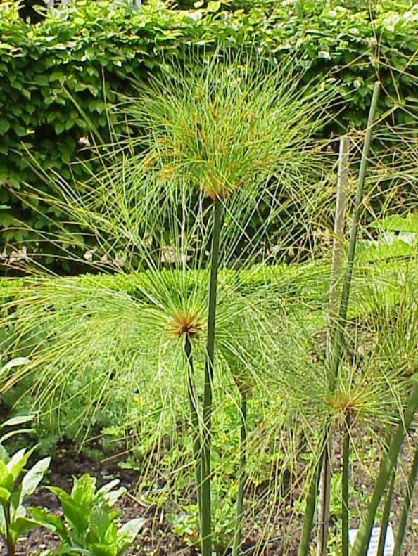
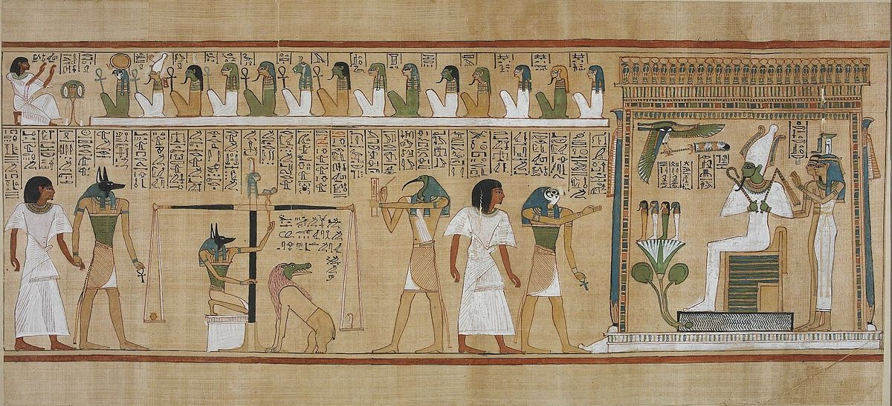
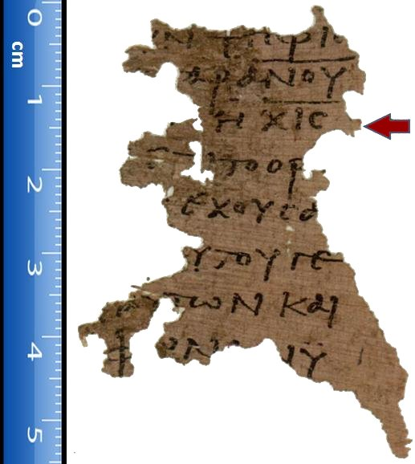
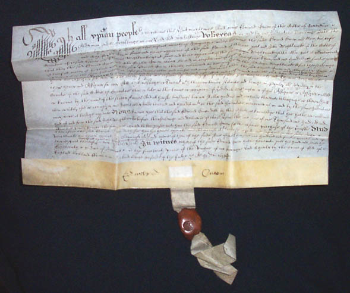
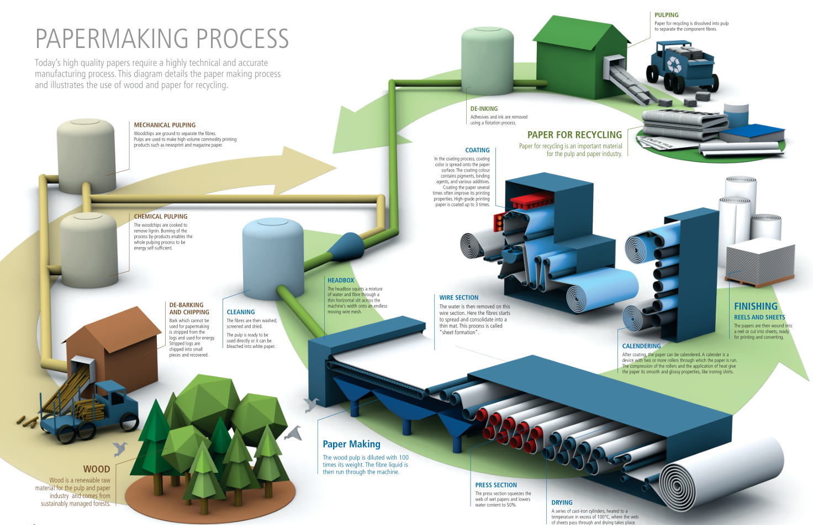
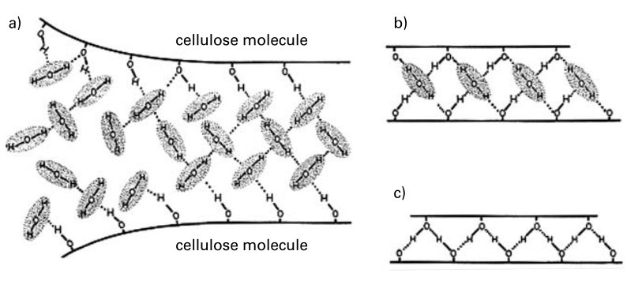
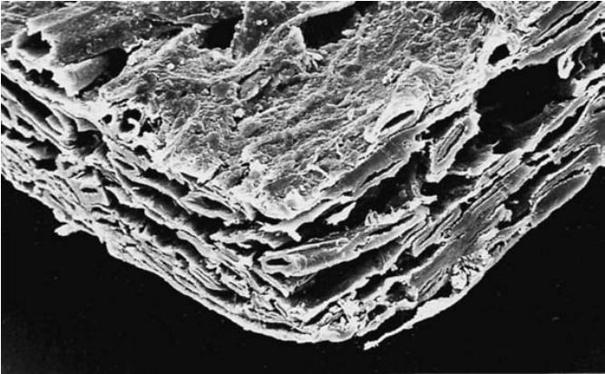
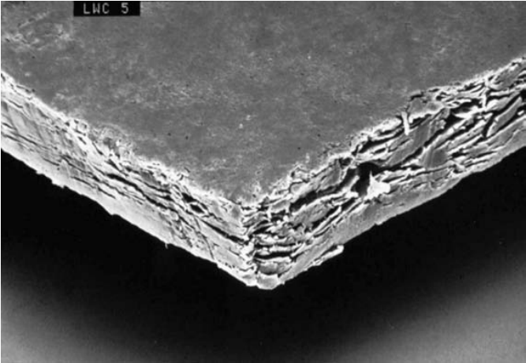
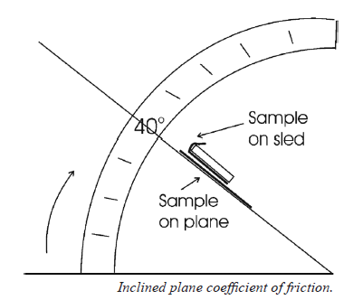
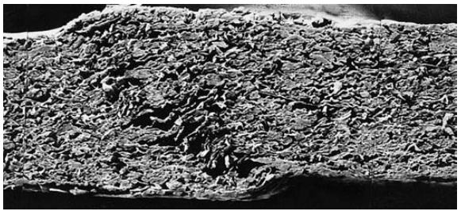

# Papirna gradiva

## Papirus:

- 3500 p.n.š. - 1000 n.š.
- je vrsta papirju podobnega materiala, narejen iz papirusnega trsa Cyperus papyrus, ki se prav tako imenuje papirus.
- Iz stržena trstike so narezali trakove, jih preložili pravokotno, z ozirom na smer rasti vlaken. Preložene plasti so tolkli s tolkači, da so povečali iztok soka. Površino so gladili s kamnitimi likali in nato papiruse sušili v senci.

{#fig:papir_papyrus height=500px}

{#fig:papir_knjiga_mrtvih}

{#fig:papir_knjiga_razsvetljenstva height=400px}

## Pergament:

- 270 p.n.š. - 15st n.š.
- je nebarvana oguljena živalska koža, obdelana tako, da je primerna za pisanje
- draga, zamudna izdelava
- kakovostnejši pergament -> VELUM
- Velum je najpogosteje pripravljen iz telečje kože

{#fig:papir_pergament height=400px}

## Papir: 

- pričetek Kitajska l.: 105 našega štetja,
- razširi se počasi v preostali del sveta
- izdelovanje Sicilija, Španiji cca 10. stoletju
- izdelovanje v Nemčiji l.: 1400 ...

## Pomen papirnih gradiv

- dostopen material za shranjevanje zapisov
- zapisi pomembnih zakonitosti, načel...
- kronološki vpogled v vzorce podatkov (enostavno beleženje podatkov)
- razvoj, širjenje znanosti
- pojav knjižnice
- splošno izobraževanje ljudi
- razvoj človeške skupnosti

## Surovine in sredstva za pridobivanje papirja

### Osnovne surovine

- celuloza
- lesovina
- papirna vlakna
- stare krpe
- tekstilni odpadki

Celulozo pridobivamo iz surovin kot so:

- Les:
    - smreka, jelka, bor do 50-60 % celuloze,
        - iglavci imajo daljša vlakna (traheide)
    - bukev 30-40 % celuloze,
    - topol 40-50 % celuloze
- Stebelna vlakna:
    - lan, konoplja: 80 % celuloze
- Trava:
    - slama: 30 % celuloze
- Semenska vlakna:
    - bombaž: 90 % celuloze

### Polnila:

  - do 25% (več jih je v tiskarskem papirju, manj pisarniški)
  - zmanjšana prosojnost (kalcijev-karbonat, glina),
  - povečana vpojnost barvila za tisk,

### Lepila:
  - zmanjšamo vpojnost barvil (lahko tudi vode)
  - povečajo trdnost papirja (embalaža)
  - včasih škrob, danes sintetična lepila

### Barvila:
  - zmanjševanje rumenega tona (recikliran papir)

### Posebni dodatki:
  - mehčanje
  - za večjo upojnost
  - večje izolacijske sposobnosti
  - proti vlagi, plesnobi, insektom

### Pomožna sredstva:
  - luženje
  - belila

### Voda
  - potrebna pri vezavi vlaken

## Izdelava papirja

{#fig:papir_proizvodnja}

Največkrat v ločenih obratih potekajo trije ključni procesi pri izdelavi papirja:

1. Izdelovanje papirne kaše
2. Izdelava papirja
3. Končna obdelava papirja

### Izdelava papirne kaše

- hlodovino očistijo lubja
- hlodovino predelajo v sekance
    - (odrezki, odpadki pri lesni industriji)
- sekance zmeljejo
- kemijsko s kislinami odstranijo lignin
    - s tem ločijo lesna vlakna - traheide
    - zmes (brez lignina) ni več les -> papirna kaša
- odstranjevanje kisline
    - vlaknena mehka kaša
- z beljenjem odstranimo morda preostali lignin
    - preprečimo porumenjevanje papirja na UV svetlobni
- kašo osušijo in pripravijo polizdelek za nadaljnjo izdelavo papirja

- Oglej si [video](https://www.youtube.com/watch?v=2Uh3XIadm1A) proizvodnje.
- Oglej si [animacijo](https://www.youtube.com/watch?v=GyRjIZKc3P4) proizvodnje.

### Izdelava papirja

- zmeljejo papirno kašo
- dodajanje kaše iz recikliranega papirja
    - s kemijskim postopkom odstranijo barvila
- [molekule celuloze](https://www.molinstincts.com/structure/Dextrin-cstr-CT1078679315) je potrebno povezati med seboj. V tej vlogi nastopi polarni značaj etrske vezi $-O-$, ki dobro privlači vodo.

![Molekula celuloze[^molekula_celuloze].](./slike/Cellulose-Ibeta-from-xtal-2002-3D-balls.png){#fig:Cellulose-Ibeta-from-xtal-2002-3D-balls}

[^molekula_celuloze]: Vir: https://en.wikipedia.org/wiki/Cellulose

- kašo razredčijo z vodo -> viskozna zmes celuloze
- z oblikovalnimi česali bolj ali manj uredijo in prepletejo vlakna
    - bolj prepletena vlakna -> bolj trden papir
- dodajo polnila, lepila, barvila in druge dodatke
- ustvarijo redko vodno zmes (voda pomaga molekulam celuloze, da se kemijsko povežejo)
    - cca 100 L vode za 1 kg papirja (nujen zaprt vodni sistem)

{#fig:papir_vezava_celuloze}

- vstop vodne zmesi v papirni stroj
- odcejevanje vode (head-box)
- iztisni valji
- pivnanje vode z valji in trakovi iz klobučevine
- iztisni valji (kovinski)
    - končna vsebnost vode po tem postopku je še vedno 50%

- sušilni valji (pri 100°C)

- stiskanje papirja na točno debelino
- nanos površinske obloge (z nanosnimi valji)
    - barvila

{#fig:papir_pisarniski_coating}

{#fig:papir_pisarniski_no_coating}

- sušenje obloge
- navijanje pairja na končne kolute
    - dimenzije 80km x 8.5m
    - masa 120 T

### Končna obdelava papirja

- na papir lahko dodajo še dodate površinske obloge...
- postopki so različni - odvisno od potrebe papirja

- formatni razrez
- transport

### Formati in vrste papirja

Formati:

- A (pisemski papir, tisk, risanje):
    - A0-841x1189
    - A1-594x841
    - A2-420x594
    - A3-297x420
    - A4-210x297
    - A5-148x210
    - A6-105x148
    - …A8-52x74

- B (tiskarski papir pri knjižnem tisku):
    - B0-1000-1414, B1, B2,…B10

- C (mape, ovojnice):
    - C0-917x1297, C1, C2,…C10

- K karton, lepenka:
    - K7-71x101, K8-81x101

- E (embalažni papir v listih in polah):
    - E0-90x126, E1-63x60

### Povezave

- [Izdelava papirne kaše in papirja - video 1](https://www.youtube.com/watch?v=E4C3X26dxbM)
- [Izdelava popirne kaše in papirja - video 2](https://www.youtube.com/watch?v=jmgMdDH14sE)
- [Ročna izdelava papirja - 1](https://www.youtube.com/watch?v=eT4tNINfzrY)
- [Ročna izdelava papirja - 2](https://www.youtube.com/watch?v=aVEOXE8IbIs)

## Lastnosti in preizkušanje papirnih gradiv

- MD-machine direction (v smeri potovanja sita)
- CD- cross direction (prečno na smer potovanja sita)

- Različne lastnosti: 
    - Togost, natezna trdnost, tlačna trdnost (ring crush) večje v MD
    - Žilavost  (pregibanje) in odpornost proti trganju boljša prečno na vlakna!
    - Svetlost/opaciteta in koef. trenja/lepenja se spreminja po smeri!
    - Pri sušenju se papir zvije v rolice, kjer je os vzporedna z MD.
    - Poves večji v CD smeri kot pa v MD (večja togost).
    - Natezna trdnost večja v MD, % raztezka večji v CD, papir bolj elastičen v CD.
    - Bolj zanesljivo merjenje sile kot raztezka! 

### Gramatura

| Kategorija papairja | gramatura [g/m^2] |
|--------------------:|:-----------------:|
|       Svileni papir |      10 - 40      |
|    Pisarniški papir |      50 - 200     |
|              Karton |     150 - 600     |
|             Lepenka |     225 - 1000    |
Table: Razdelitev papirja po gramaturi. {#tbl:gramatura}

### Debelina

- ena od bolj pomembnih lastnosti
- pomembno vpliva na `upogibno trdnost`
- pogosto nujna majhna toleranca v tehnoloških procesih (tiskarne)
- pogosto se merijo pole papirja ne le en sam list

### Gostota

- Na gostoto vpliva vrsta vlaken in kako so vlakna povezana med seboj.
- Od tega pa je odvisno več ostalih fizikalnih lastnosti:
    - stisljivost papirja (ni želena pri paketih)
    - sušenje in higroskopičnost
    - upogibna trdnost
    - trganje papirja (ločevanje vlaken)

### Zračna prepustnost

- pomembna pri zračnih filtrih (filter za klimo)
- prepustnost tekočine je pomembna pri filtrih za kavo

### Hrapavost

> #### NALOGA: Preskus hrapavosti
> Določi koeficient lepenja za MD in CD smer pisarniškega papirja
>
> - Večji papir na ravnini, ki jo nagibamo
> - Z manjšim ovijemo utež
> - Dimenzije uteži 90x100 mm, masa 1300g;
> - Ravnino počasi dviguje (1.5° (±0.5°)/sekundo 
> - Statični koeficient trenja (koeficient lepenja); 
> - Kinetični koeficient trenja: koeficient trenja ob enakomernem premikanju (drsenju) po klancu navzdol!

{#fig:papir_hrapavost}

$$ k_L = \frac{F_d}{F_x} = \frac{m\ g\ sin(\alpha)}{m\ g\ cos(\alpha)} = tg(\alpha) $${#eq:papir_kl}

### Natezna trdnost

- [Preskus natezne trdnosti.](https://www.youtube.com/watch?v=dcRrVv0x5NI)
- pomembna pri načrtovanju raztržnih linij

### Tlačna trdnost

- vzdolž vlaken

{#fig:papir_razplastitev}

- po debelini(manj pomembno)
- obročni test
- robni test
    - [Robni test kartona.](https://www.youtube.com/watch?v=HZWoaQ6Xa6E)
    - [Obročni preskus](https://www.youtube.com/watch?v=0xNelK7kPuM)

### Odpornost trganja

- zelo pomembna lastnost papirja (zelo dobro definiran preskus)
- [Odpornost trganja.](https://www.youtube.com/watch?v=it0vveB2VVE)
- [Elmendorf-ov preskus](https://www.youtube.com/watch?v=it0vveB2VVE)

## Delovni postopki ročne obdelave

- Rezanje:
  - Škarje,
  - Nož za papir, karton, lepenko
  - Sekanje

- Pregibanje:
  - Zgibanje papirja, glajenje
  - [Žlebni zgib](https://bioresources.cnr.ncsu.edu/wp-content/uploads/2019/01/2017.1.69.pdf)
  - Zarezni zgib (zarežemo na zunanji strani zgiba za 1/3 debeline)

- Lepljenje:
  - lepila na vodni osnovi (PVA)
  - na osnovi topil:
    - bencina, acetona (Cinaokol),
    - naravni kavčuk (Neostik),
  - brez topil (UHU stick)

- Vezanje v pole
  - nerazstavljivo
    - lepljenje
    - žebljanje
  - razstavljivo
    - šivanje
    - žičenje
    - oblikovni spoji (puzzle)

## Profiliranje

Preveri naslednje trditve:

+ Z zgibanjem papirja spremenimo odpornost profila
- Z zgibanjem papirja v profile utrdimo papirna vlakna.
+ Usmerjenost vlaken v papirju ni odločilna pri obremenitvi profila.
- Papir gramature 280 g/m2 je že dovolj trden za enostavne konstrukcije.
+ Barva papirja ne vpliva značilno na trdnost, sta pa okrogli in kvadratni profil ustrezno močnejša.
+ Oblika profila vpliva na funkcionalnost izdelka in s tem na uporabo.
- Za zaključek papirne vložne mape uporabimo U-profil, medtem ko pri gradnji papirnega mostu je bolj primeren L-profil.
- Z žlebnim zgibom navadno vlakna značilno oslabimo, da naredimo pravilen rob.
